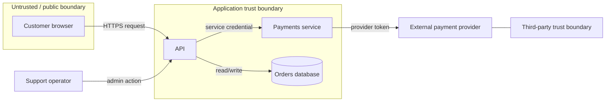
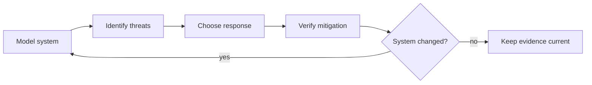
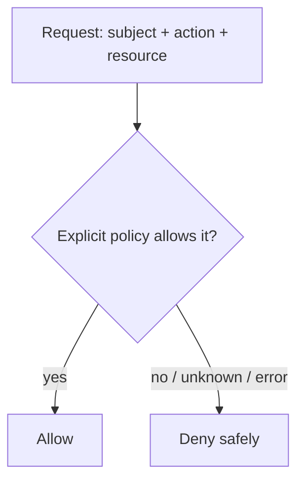
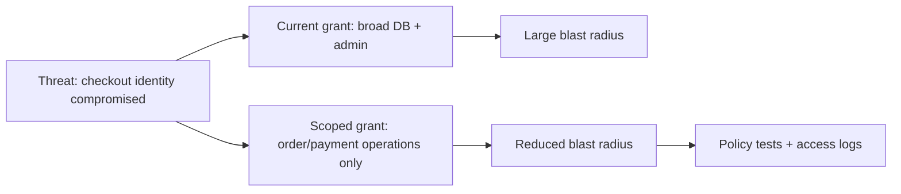

# Threat Modeling & Least Privilege: Thiết kế bảo mật trước khi sự cố xảy ra

## Tóm tắt

Một nhân viên hỗ trợ khách hàng vô tình bấm vào liên kết độc hại trong email lừa đảo, làm lộ token phiên làm việc nội bộ. Chỉ trong vòng hai mươi phút, kẻ tấn công đã tải về toàn bộ cơ sở dữ liệu 10 triệu khách hàng từ S3 và xóa sạch các bản sao lưu production. Nguyên nhân? Ứng dụng hỗ trợ nội bộ được cấp một IAM role toàn quyền với cấu hình wildcard `s3:*` và `rds:*`, cùng với giả định rằng bất kỳ ai truy cập từ mạng VPN nội bộ đều mặc định đáng tin cậy mà không cần kiểm tra quyền trên từng đối tượng.

> 💡 **Quy tắc bỏ túi:** **Authentication chứng thực bạn là ai; Authorization và Least Privilege quyết định bạn được phép chạm vào cái gì.** Bảo mật sẽ sụp đổ khi sự tin tưởng được trao quyền mù quáng. Luôn áp dụng deny-by-default (chặn theo mặc định), thẩm định quyền hạn trên mỗi request đối với từng tài nguyên cụ thể, và cô lập phạm vi thiệt hại (blast radius) để sự cố của một token đơn lẻ không kéo sập toàn bộ hạ tầng.

- **Vòng lặp mô hình hóa hiểm họa:** Trả lời có hệ thống bốn câu hỏi: Chúng ta đang xây gì, điều gì có thể sai, chúng ta sẽ phòng ngừa thế nào, và đã làm đủ tốt chưa?
- **Ranh giới tin cậy rõ ràng:** Vẽ rõ luồng dữ liệu xuyên qua các ranh giới mạng, ranh giới tiến trình và ranh giới tổ chức nơi mức độ tin cậy thay đổi; không bao giờ coi lưu lượng nội bộ là mặc định an toàn.
- **Chặn theo mặc định (Deny-by-default) & kiểm tra liên tục:** Không cấp quyền trừ khi có quy tắc cho phép rõ ràng, và kiểm tra authorization trên **mỗi request** thay vì chỉ kiểm tra một lần lúc đăng nhập.
- **Thu hẹp bán kính thiệt hại (Blast Radius):** Áp dụng quyền tối thiểu cho cả con người lẫn dịch vụ tự động (microservice, hàm serverless, CI runner) bằng cách giới hạn phạm vi IAM role và quyền database vào đúng công việc cần làm.
- **Cạm bẫy chết người:** Tin tưởng tuyệt đối vào tường rào ngoại vi (VPN/firewall) và gán quyền wildcard (`*` trong policy) để dev cho tiện—tạo điều kiện cho kẻ xâm nhập leo thang đặc quyền từ một lỗ hổng nhỏ nhất thành thảm họa đánh cắp toàn bộ hệ thống.

## Model hệ thống trước khi liệt kê threat

Bắt đầu từ hệ thống thật, không phải checklist vulnerability chung chung.



Ít nhất hãy ghi lại:

- external actors và workloads;
- processes/services;
- sensitive data stores;
- data flows và protocols;
- credentials hoặc identities đi qua từng boundary;
- trust assumptions sẽ nguy hiểm nếu hóa ra sai.

<TermBox term="Trust boundary">
**Trust boundary** là nơi data hoặc control đi qua giữa các context có trust assumption hoặc authority khác nhau.

**Tại sao quan trọng:** mỗi lần vượt boundary là một prompt để hỏi ai đã được authenticated, điều gì được authorized, input nào được chấp nhận, credential nào bị expose và chuyện gì xảy ra nếu phía bên kia bị compromise.
</TermBox>

## Dùng threat-model loop bốn câu hỏi

Một threat model có thể nhẹ nhưng vẫn nghiêm túc:

1. **Chúng ta đang làm gì?** Model system với flows, assets, identities và trust boundaries.
2. **Điều gì có thể sai?** Xác định abuse cases hoặc threats trên chính những flow đó. STRIDE có thể là prompt, nhưng không phải mục tiêu cuối.
3. **Chúng ta sẽ làm gì?** Chọn actionable mitigations có owner và outcome kiểm chứng được.
4. **Đã đủ tốt chưa?** Review model, verify mitigation và cập nhật model khi system thay đổi.



Threat model phải evolve khi thêm data store, identity provider, queue, admin path, third-party integration, privilege hoặc network boundary mới. “Review một lần trước launch” không phải security control bền vững.

## Biến threat thành mitigation kiểm chứng được

Xét flow `GET /accounts/:accountId`.

Một mitigation yếu là:

> User phải được authenticated.

Điều đó không trả lời Alice có được đọc account của Bob không.

Mitigation mạnh hơn là:

- authenticate caller;
- authorize action `read` trên **đúng account cụ thể**;
- deny nếu không có policy grant action đó;
- thực hiện check server-side trên mỗi request;
- log authorization failures mà không leak sensitive data;
- test cả allowed và denied object relationships.

Threat model chỉ thực sự hữu ích khi mitigation có thể implement và verify.

## Authentication không phải authorization

<TermBox term="Authorization">
**Authentication** xác lập một entity là ai hoặc là gì. **Authorization** kiểm tra entity đó có được thực hiện action yêu cầu trên resource cụ thể hay không.

**Tại sao quan trọng:** session, JWT, mTLS identity hay API key hợp lệ không đồng nghĩa với quyền đọc mọi record hoặc gọi mọi administrative operation.
</TermBox>

Một secure request path có dạng:

```text
authenticate(identity)
resource = load(request.resource_id)
if !authorize(identity, action, resource):
    deny
perform(action, resource)
```

Authorization decision phải nằm ở server-side boundary không thể bypass bằng cách sửa client. Ẩn button là UX, không phải access control.

### Kiểm tra permission trên mỗi request

Đừng giả định page load trước đó, gateway check hay authenticated session sẽ cấp quyền mãi mãi. Authorization-relevant attributes có thể đổi và alternate route có thể chạm cùng resource.

Kiểm tra cả hai chiều:

- **horizontal authorization**: một user thường có truy cập resource của user khác được không?
- **vertical authorization**: identity ít quyền hơn có gọi admin/elevated action được không?

Với API, authorize cả operation lẫn object. UUID khó đoán không thay thế ownership hoặc policy check.

## Deny-by-default đóng các policy gap

Với **deny-by-default**, request không match explicit allow rule sẽ bị deny.



Điều này quan trọng vì policy set thay đổi theo thời gian. Nếu route/resource mới xuất hiện nhưng chưa có matching policy, failure mode an toàn hơn là deny thay vì vô tình expose.

Đừng ngầm fallback thành allow khi:

- authorization dependency timeout;
- thiếu attribute;
- policy không parse được;
- action mới chưa có rule.

Availability có thể có đánh đổi riêng, nhưng authorization error không được vô tình trở thành privilege grant.

## Least privilege là bài toán scope và lifetime

NIST mô tả least privilege là giới hạn user hoặc process ở đúng minimum authorizations và resources cần để hoàn thành chức năng.

Áp dụng nguyên tắc đó không chỉ cho human role:

| Identity | Grant quá rộng | Scope tốt hơn |
| --- | --- | --- |
| checkout service | admin trên mọi database | chỉ read/write order/payment table hoặc API cần thiết |
| image worker | toàn quyền cloud storage | read input prefix, write output prefix |
| CI job | production owner token vĩnh viễn | short-lived deployment identity cho một environment |
| support user | global customer export | explicit support actions cho assigned cases |

Ba dimension hữu ích:

- **resource scope** — object, tenant, project, table, bucket hay namespace nào?
- **action scope** — read, write, delete, deploy, impersonate, rotate hay administer?
- **time scope** — permanent, session-bound, task-bound hay just-in-time?

<TermBox term="Blast radius">
**Blast radius** là lượng capability hoặc data của hệ thống có thể bị ảnh hưởng khi một identity, credential, component hoặc boundary bị compromise.

**Tại sao quan trọng:** least privilege không đảm bảo compromise sẽ không xảy ra. Nó giới hạn compromise có thể đi xa đến đâu sau đó.
</TermBox>

## Threat modeling và least privilege củng cố lẫn nhau

Threat model có thể chỉ ra: “Nếu checkout service bị compromise, database credential của nó có thể sửa customer profiles và IAM records.”

Mitigation không chỉ là “bảo vệ credential tốt hơn”. Hãy hỏi checkout có thực sự cần các privilege đó không.



Security control mạnh hơn khi threat model giải thích **vì sao** privilege tồn tại và automated checks chứng minh scope đó chưa rộng ra ngoài ý muốn.

## Production scenario: support user đã authenticated nhưng đọc được mọi tenant

Support portal thêm `GET /customers/:customerId`. UI chỉ hiển thị customer được assign cho support agent đã sign in, và endpoint yêu cầu employee session hợp lệ.

**Hậu quả:** một agent đã authenticated đổi `customerId` trong URL và lấy được customer record của tenant khác. Service credential phía sau cũng có thể query billing tables không liên quan, khiến impact lớn hơn nếu service bị compromise.

**Nguyên nhân cốt lõi:** thiết kế coi authentication là đủ cho authorization. API không kiểm tra relationship của caller với customer cụ thể trên mỗi request. Threat model có ghi “employee access” nhưng không model customer-object boundary hay horizontal privilege escalation. Service identity cũng có database privileges rộng hơn feature cần.

**Cách khắc phục chuẩn:** model support-agent → API → customer-record data flow và trust boundaries; authorize mỗi request cho đúng customer/action; deny-by-default nếu không có relationship hay policy grant access; test cross-tenant denial; và giới hạn service identity ở đúng data/operation portal cần. Các control này vừa sửa access-control bug tức thời vừa giảm blast radius của compromise sau này.

## Tự kiểm tra

Một background export job dùng long-lived cloud credential có read access tới mọi production bucket vì “sau này có thể cần thêm dataset”. Hiện tại job chỉ đọc một reports prefix. Threat model có threat “credential bị đánh cắp” nhưng mitigation chỉ ghi “rotate secrets thường xuyên”.

Thiếu điều gì?

<details>
<summary>Xem giải thích chi tiết</summary>

Mitigation chưa xử lý blast radius. Áp dụng least privilege ngay: cấp task-appropriate identity chỉ đọc required reports scope, ưu tiên short-lived credentials. Sau đó biến boundary đó thành testable bằng IAM policy checks hoặc integration tests. Rotation có thể giảm credential lifetime, nhưng không biện minh cho resource/action permissions không cần thiết.

Threat model cũng phải được cập nhật khi job thực sự cần dataset khác thay vì pre-grant quyền cho nhu cầu giả định trong tương lai.

</details>

## Checklist production

- [ ] Model actors, services, data stores, data flows, identities và mọi trust boundary quan trọng.
- [ ] Xác định threats trên kiến trúc thật, không chỉ dựa vào generic vulnerability categories.
- [ ] Biến threat quan trọng thành actionable mitigation có owner và verification evidence.
- [ ] Giữ authentication và authorization là hai decision riêng.
- [ ] Enforce authorization server-side cho đúng action/resource trên mỗi request.
- [ ] Dùng deny-by-default khi không có explicit allow rule hoặc không thể đưa ra authorization decision an toàn.
- [ ] Test horizontal và vertical privilege boundaries, gồm cross-tenant/object access.
- [ ] Scope privilege của human, service, CI và automation theo resource, action và lifetime.
- [ ] Xóa unused privileges thay vì tích lũy chúng cho nhu cầu tương lai chưa chắc có.
- [ ] Review lại threat model khi trust boundaries, integrations, data flows hoặc privileges thay đổi.

## Agent rule

Khi thay đổi identity, route, data flow, integration hoặc privileged action, hãy xác định trust boundary và authorization decision bị ảnh hưởng trước khi code. Ưu tiên **deny-by-default**, verify permissions trên mỗi request cho đúng action/resource, giảm privilege scope và lifetime, và thêm machine-checkable evidence cho mitigation. Đừng coi authentication thành bằng chứng authorization.

## Tài liệu tham khảo

- OWASP Cheat Sheet Series, **Threat Modeling**: https://cheatsheetseries.owasp.org/cheatsheets/Threat_Modeling_Cheat_Sheet.html
- OWASP Cheat Sheet Series, **Authorization**: https://cheatsheetseries.owasp.org/cheatsheets/Authorization_Cheat_Sheet.html
- NIST CSRC Glossary, **Least Privilege**: https://csrc.nist.gov/glossary/term/least_privilege
- OWASP Top 10:2025, **A01 Broken Access Control**: https://owasp.org/Top10/2025/A01_2025-Broken_Access_Control/
