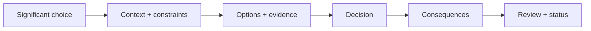
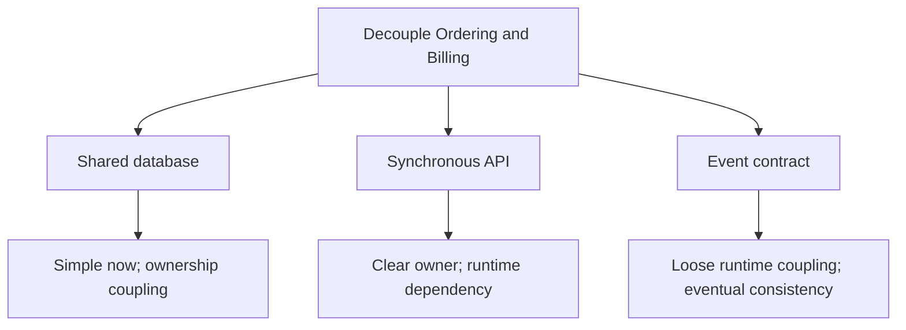
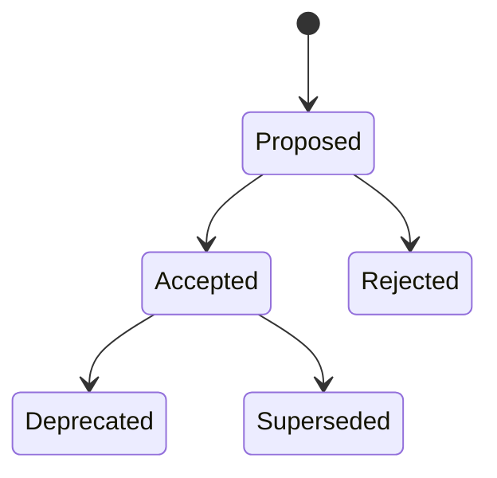
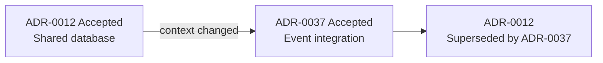

# Architecture Decision Records: Preserve the Why

A high-stakes architectural decision is casually hashed out in an informal Slack huddle or an ephemeral direct message thread. Six months later, the original engineers have moved on. A newly hired senior engineer looks at the codebase in bewilderment, unable to fathom why the system relies on a bizarre asynchronous reconciliation loop instead of a standard ACID transaction. Viewing it as pure legacy technical debt, the team launches an expensive multi-month crusade to rebuild the "proper" synchronous solution—only to re-encounter the exact same crippling database locks, third-party vendor timeouts, and edge-case deadlocks that prompted the original design.

Without recorded architectural memory, engineering organizations are condemned to endlessly replay their past failures at immense organizational cost.

> 💡 **Rule of thumb:** Code reflects *what* was built; commit messages record *what* changed; ADRs preserve *why* an architecturally significant decision was made and what trade-offs were accepted. If reversing a choice later would cost weeks of engineering or disrupt multiple teams, capture it in an immutable ADR before implementation cements it.

## TL;DR

- **Preserve architecturally significant decisions**: An **Architecture Decision Record (ADR)** is a lightweight, durable document capturing one significant architectural choice: its context, evaluated alternatives, chosen direction, and accepted consequences.
- **Context and constraints outweigh the final answer**: The primary value of an ADR is explaining why a decision was rational under specific conditions, preventing future teams from dismantling deliberate architecture under the delusion of "cleaning up legacy debt."
- **Explicit consequences over uncritical advocacy**: An authentic ADR must rigorously document negative consequences, maintenance costs, and operational trade-offs—not just sunny benefits.
- **Immutable history—supersede, never rewrite**: Historical decisions explain existing code, infrastructure, and past incidents. When context evolves, write a new ADR and mark the old one superseded rather than rewriting history.
- **Fatal pitfall:** **The Ephemeral Consensus Trap**—Making monumental architectural decisions through chat threads, meeting whiteboards, or PR comments without codifying them in a durable repository record. When staff turns over, the rationale evaporates and past architectural mistakes are inevitably rebuilt.



Its value is preserving **why this choice made sense under these constraints**, so future engineers can distinguish intentional architecture from accidental legacy.

<TermBox term="Architecture Decision Record">
An **ADR** captures one significant architectural decision and its rationale. A collection of ADRs forms a decision log.
</TermBox>

## Know when an ADR is worth writing

Do not write one for every code edit. Write one when reversing the choice later would be expensive, risky, cross-cutting, or coordination-heavy.

Typical triggers include deployment topology, data ownership, integration contracts, consistency models, security or availability strategy, and frameworks that constrain many future components.

That is what **architecturally significant** means: the decision shapes future choices.

## Capture context before the answer

Useful context includes the business goal, scope, current architecture, constraints, quality attributes, operational limits, assumptions, and evidence such as incidents, metrics, benchmarks, or experiments.

<TermBox term="Decision Context">
**Decision context** is the set of forces, constraints, evidence, and assumptions that make an architectural choice reasonable at a specific time.
</TermBox>

If context only says “we need a better architecture,” the ADR cannot explain why the decision was rational.

## Compare real alternatives

Record options that were seriously considered, not fake alternatives added after the fact.



For each viable option, capture meaningful trade-offs. Link evidence when it matters: benchmark results, incident reports, cost estimates, proof-of-concept findings, or capacity data.

## State the decision plainly

Prefer an explicit statement:

> We will publish `OrderConfirmed` from Ordering to Billing. Billing owns its projection and will not read Ordering tables directly.

Avoid vague language such as “we should probably move toward events.”

A useful ADR identifies the decision owner or decision-makers, date, affected scope, and relevant stakeholders.

## Record consequences, not only benefits

Every decision creates a new operating context. Record positive, negative, and neutral consequences.

For the event-contract example, independent private schemas improve, while at-least-once delivery, eventual consistency, schema compatibility, consumer lag, and recovery become explicit responsibilities.

<TermBox term="Decision Consequence">
A **consequence** is a condition the team accepts because of the decision, including costs and new responsibilities.
</TermBox>

An ADR that lists only advantages is advocacy, not a decision record.

## Use a lifecycle



Common statuses are **Proposed**, **Accepted**, **Rejected**, **Deprecated**, and **Superseded**. The vocabulary may vary; readers must still be able to tell whether an ADR is current truth.

## Preserve history: supersede, do not rewrite

Once an ADR is accepted, preserve the historical decision. If context changes, create a new ADR that references the old one and mark the old ADR superseded.



The old ADR may explain years of code, schema, infrastructure, and incidents. Rewriting it to match today's architecture destroys that explanation. Keep it in the **decision log**.

## Keep the template lightweight

A practical template can stay small:

```text
# ADR-0042: Publish order events to Billing
Status: Proposed
Date: 2026-09-12
Decision owner: Checkout Platform
Scope: Ordering ↔ Billing

## Context
Problem, constraints, evidence, assumptions.

## Options considered
Viable alternatives and trade-offs.

## Decision
What we will do.

## Consequences
Benefits, costs, risks, responsibilities.

## Links
Experiments, incidents, diagrams, tickets, related ADRs.
```

Add fields only when they improve decisions. A template that takes hours to complete will be bypassed.

## Use a practical review workflow

1. **Trigger:** identify a significant choice.
2. **Draft:** an owner records context, options, evidence, and a proposed decision.
3. **Review:** engineers and stakeholders challenge assumptions and consequences.
4. **Decide:** accept, reject, or keep proposed for more work.
5. **Link implementation:** connect PRs, migrations, diagrams, or runbooks.
6. **Enforce:** use design and code review to catch violations of accepted ADRs.
7. **Revisit:** when context materially changes, create a new ADR and supersede the old one.

Review scope should match decision blast radius; not every ADR needs a large governance meeting.

## Production scenario

A commerce platform once let Billing read Ordering's shared tables. After incidents and ownership conflicts, the teams moved to an event contract, but nobody recorded the rationale or constraints.

Two years later, a new team sees event lag and proposes “simplifying” Billing by reading Ordering tables again. The old design looks cheaper because the incidents, ownership conflicts, and accepted consistency trade-offs are invisible.

**Impact:** the team repeats an old debate, spends weeks rediscovering constraints, and risks reintroducing cross-team data coupling.

**Root cause:** implementation changed without a durable decision record. Commits show what changed, but not the context, rejected alternatives, evidence, or consequences that justified it.

**Correct pattern:** create an ADR around the architectural change; record context, options, evidence, decision, consequences, owner, date, and scope; review it with affected stakeholders; link implementation artifacts; and when later evidence changes the answer, create a new ADR that supersedes the old one instead of rewriting history.

<details>
<summary>Self-check: should you edit an accepted ADR when the team changes its mind?</summary>

Usually no. Preserve the accepted ADR as historical evidence. Write a new ADR with the new context and decision, link the two, and mark the old one superseded.

</details>

## Production checklist

- [ ] The choice is architecturally significant enough to deserve an ADR.
- [ ] Context states problem, scope, constraints, assumptions, and evidence.
- [ ] Real alternatives are listed with meaningful trade-offs.
- [ ] The decision is explicit rather than aspirational.
- [ ] Consequences include costs and operational responsibilities.
- [ ] Status shows whether the ADR is proposed, accepted, rejected, deprecated, or superseded.
- [ ] Owner or decision-makers, date, scope, and stakeholders are identifiable.
- [ ] Important evidence and implementation artifacts are linked.
- [ ] Accepted ADRs are referenced during review when relevant.
- [ ] Superseded ADRs remain in the decision log and point to replacements.
- [ ] The template remains lightweight enough to use consistently.
- [ ] Changed context triggers a new decision instead of silent drift.

## Agent rule

When a change makes an architecturally significant choice, capture the forces and alternatives before implementation hardens the answer; record one explicit decision with its consequences, then preserve that history and supersede it only through a new ADR when context changes.

## Sources

- Michael Nygard — [Documenting Architecture Decisions](https://cognitect.com/blog/2011/11/15/documenting-architecture-decisions)
- ADR GitHub organization — [Architectural Decision Records](https://adr.github.io/)
- ADR GitHub organization — [MADR template](https://adr.github.io/madr/)
- AWS Prescriptive Guidance — [ADR process](https://docs.aws.amazon.com/prescriptive-guidance/latest/architectural-decision-records/adr-process.html)
- AWS Prescriptive Guidance — [ADR best practices](https://docs.aws.amazon.com/prescriptive-guidance/latest/architectural-decision-records/best-practices.html)
