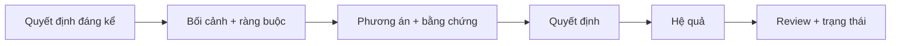
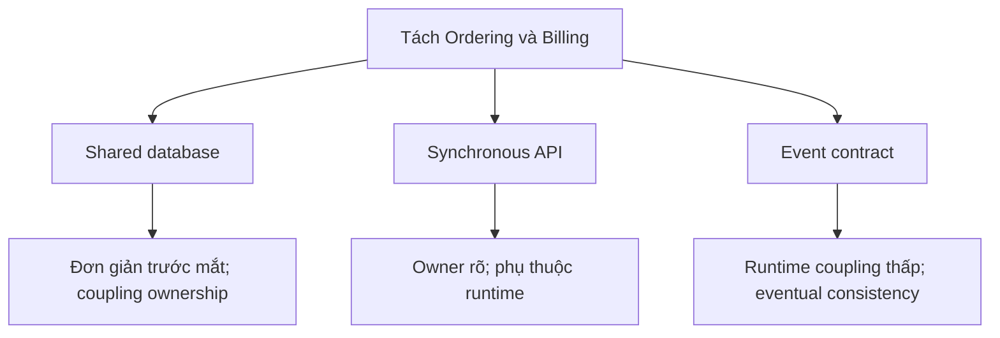
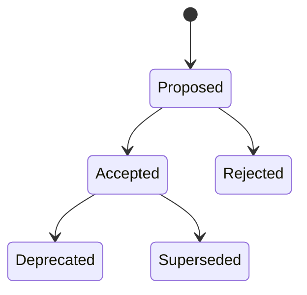
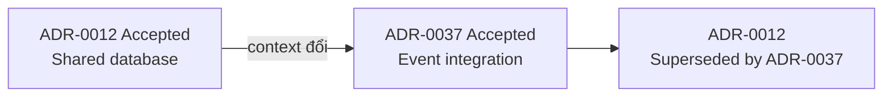

# Architecture Decision Records: Giữ lại lý do

## Tóm tắt nhanh

Một **Architecture Decision Record (ADR)** là bản ghi nhỏ nhưng bền vững cho một quyết định kiến trúc đáng kể: bối cảnh, các phương án, hướng đã chọn và những hệ quả đi kèm.



Giá trị của ADR không nằm ở tài liệu tự thân mà ở việc giữ lại **vì sao lựa chọn này hợp lý dưới các ràng buộc lúc đó**, để kỹ sư sau này phân biệt kiến trúc có chủ ý với legacy ngẫu nhiên.

<TermBox term="Architecture Decision Record">
Một **ADR** ghi lại một quyết định kiến trúc quan trọng và rationale của nó. Tập ADR tạo thành **nhật ký quyết định** của hệ thống.
</TermBox>

## Biết khi nào đáng viết ADR

Không cần ADR cho mọi thay đổi code. Hãy viết khi đảo ngược lựa chọn sau này sẽ tốn kém, rủi ro, cross-cutting hoặc cần nhiều đội phối hợp.

Trigger điển hình gồm deployment topology, data ownership, integration contract, consistency model, chiến lược security/availability và framework làm nhiều component tương lai bị ràng buộc.

Đó là ý nghĩa của một quyết định **đáng kể về kiến trúc**: nó định hình các lựa chọn tiếp theo.

## Ghi bối cảnh trước khi tuyên bố đáp án

Bối cảnh hữu ích gồm business goal, phạm vi, kiến trúc hiện tại, ràng buộc, quality attribute, giới hạn vận hành, assumption và bằng chứng như incident, metric, benchmark hoặc experiment.

<TermBox term="Decision Context">
**Decision context** là tập hợp lực tác động, ràng buộc, bằng chứng và giả định khiến một lựa chọn kiến trúc hợp lý tại một thời điểm cụ thể.
</TermBox>

Nếu phần context chỉ nói “cần kiến trúc tốt hơn,” ADR không thể giải thích vì sao quyết định từng hợp lý.

## So sánh phương án thật

Ghi các lựa chọn đã được cân nhắc nghiêm túc, không thêm các phương án giả sau khi đã biết đáp án.



Với mỗi phương án khả thi, ghi trade-off quan trọng. Khi cần, liên kết bằng chứng: benchmark, incident report, cost estimate, proof-of-concept hoặc capacity data.

## Nêu quyết định rõ ràng

Ưu tiên câu quyết định cụ thể:

> Chúng ta sẽ phát `OrderConfirmed` từ Ordering sang Billing. Billing sở hữu projection của mình và không đọc trực tiếp bảng của Ordering.

Tránh câu mơ hồ như “nên dần chuyển sang event khi có thể.”

Một ADR hữu ích cho biết **người sở hữu quyết định hoặc người ra quyết định**, ngày, phạm vi ảnh hưởng và các bên liên quan cần hiểu kết quả.

## Ghi hệ quả, không chỉ lợi ích

Mỗi quyết định tạo ra một operating context mới. Hãy ghi hệ quả tích cực, tiêu cực và trung tính.

Với event contract, private schema độc lập hơn, nhưng at-least-once delivery, eventual consistency, schema compatibility, consumer lag và recovery trở thành trách nhiệm rõ ràng.

<TermBox term="Decision Consequence">
Một **hệ quả** là điều đội chấp nhận vì quyết định đã chọn, bao gồm cả chi phí và trách nhiệm mới.
</TermBox>

ADR chỉ liệt kê ưu điểm là tài liệu thuyết phục, không phải decision record.

## Dùng lifecycle rõ ràng



Các trạng thái thường gặp là **Proposed**, **Accepted**, **Rejected**, **Deprecated** và **Superseded**. Từ vựng có thể khác, nhưng người đọc phải biết ADR còn là current truth hay không.

## Giữ lịch sử: supersede, đừng viết lại

Sau khi ADR đã được accepted, hãy giữ nguyên quyết định lịch sử. Khi context thay đổi, tạo ADR mới tham chiếu ADR cũ rồi đánh dấu ADR cũ là superseded.



ADR cũ có thể giải thích nhiều năm code, schema, infrastructure và incident. Viết lại nó theo kiến trúc hôm nay sẽ phá mất lời giải thích đó. Giữ ADR cũ trong **nhật ký quyết định**.

## Giữ template gọn nhẹ

Một mẫu thực tế có thể rất ngắn:

```text
# ADR-0042: Publish order events to Billing
Status: Proposed
Date: 2026-09-12
Decision owner: Checkout Platform
Scope: Ordering ↔ Billing

## Context
Vấn đề, ràng buộc, bằng chứng, giả định.

## Options considered
Các phương án khả thi và trade-off.

## Decision
Chúng ta sẽ làm gì.

## Consequences
Lợi ích, chi phí, rủi ro, trách nhiệm.

## Links
Experiment, incident, diagram, ticket, ADR liên quan.
```

Chỉ thêm field khi nó giúp quyết định tốt hơn. Template mất hàng giờ để điền sẽ bị bỏ qua.

## Dùng workflow review thực tế

1. **Trigger:** nhận diện một lựa chọn kiến trúc đáng kể.
2. **Draft:** owner ghi context, phương án, bằng chứng và quyết định đề xuất.
3. **Review:** kỹ sư và stakeholder phản biện assumption và hệ quả.
4. **Decide:** accepted, rejected hoặc giữ proposed để làm thêm.
5. **Link implementation:** nối PR, migration, diagram hoặc runbook.
6. **Enforce:** dùng design/code review để phát hiện thay đổi vi phạm ADR đã accepted.
7. **Revisit:** khi context đổi đáng kể, tạo ADR mới và supersede ADR cũ.

Phạm vi review nên tương xứng blast radius của quyết định; không phải ADR nào cũng cần cuộc họp governance lớn.

## Tình huống production

Một commerce platform từng cho Billing đọc bảng dùng chung của Ordering. Sau nhiều incident và xung đột ownership, các đội chuyển sang event contract nhưng không ai ghi rationale hay constraint của thay đổi đó.

Hai năm sau, một đội mới thấy event lag và đề xuất “đơn giản hóa” bằng cách cho Billing đọc lại bảng Ordering. Thiết kế cũ trông rẻ hơn vì incident, ownership conflict và consistency trade-off đã chấp nhận đều không còn nhìn thấy.

**Hậu quả:** đội lặp lại tranh luận cũ, mất nhiều tuần tìm lại ràng buộc và có nguy cơ tái tạo cross-team data coupling.

**Nguyên nhân cốt lõi:** implementation đã đổi mà không có decision record bền vững. Commit cho biết cái gì đổi, nhưng không giữ bối cảnh, phương án bị loại, bằng chứng hay hệ quả đã dẫn tới quyết định.

**Cách khắc phục chuẩn:** tạo ADR quanh thay đổi kiến trúc; ghi context, option, evidence, decision, consequence, owner, date và scope; review với stakeholder bị ảnh hưởng; liên kết artifact triển khai; và khi bằng chứng sau này thay đổi đáp án, tạo ADR mới supersede ADR cũ thay vì viết lại lịch sử.

<details>
<summary>Self-check: có nên sửa ADR đã accepted khi đội đổi ý?</summary>

Thông thường là không. Hãy giữ ADR accepted như bằng chứng lịch sử. Viết ADR mới với context và decision mới, liên kết hai bản ghi và đánh dấu ADR cũ là superseded.

</details>

## Checklist production

- [ ] Quyết định đủ đáng kể về kiến trúc để cần ADR.
- [ ] Context nêu vấn đề, phạm vi, constraint, assumption và evidence.
- [ ] Có các phương án thật cùng trade-off có ý nghĩa.
- [ ] Decision cụ thể, không chỉ là định hướng mơ hồ.
- [ ] Consequence gồm cả chi phí và trách nhiệm vận hành.
- [ ] Status cho biết ADR là proposed, accepted, rejected, deprecated hay superseded.
- [ ] Owner hoặc decision-maker, ngày, scope và stakeholder được xác định.
- [ ] Evidence và artifact triển khai quan trọng được liên kết.
- [ ] ADR accepted được tham chiếu trong review khi phù hợp.
- [ ] ADR superseded vẫn nằm trong decision log và trỏ tới bản thay thế.
- [ ] Template đủ lightweight để đội dùng nhất quán.
- [ ] Context thay đổi dẫn tới quyết định mới thay vì drift âm thầm.

## Agent rule

Khi một thay đổi tạo ra lựa chọn kiến trúc đáng kể, hãy ghi forces và alternatives trước khi implementation đóng cứng đáp án; tạo một quyết định rõ cùng consequences, giữ lịch sử đó và chỉ supersede bằng ADR mới khi context thay đổi.

## Nguồn

- Michael Nygard — [Documenting Architecture Decisions](https://cognitect.com/blog/2011/11/15/documenting-architecture-decisions)
- ADR GitHub organization — [Architectural Decision Records](https://adr.github.io/)
- ADR GitHub organization — [MADR template](https://adr.github.io/madr/)
- AWS Prescriptive Guidance — [ADR process](https://docs.aws.amazon.com/prescriptive-guidance/latest/architectural-decision-records/adr-process.html)
- AWS Prescriptive Guidance — [ADR best practices](https://docs.aws.amazon.com/prescriptive-guidance/latest/architectural-decision-records/best-practices.html)
