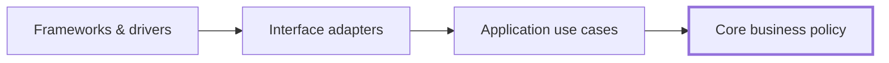
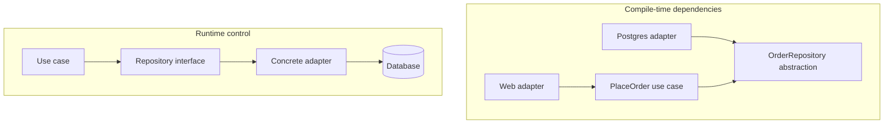
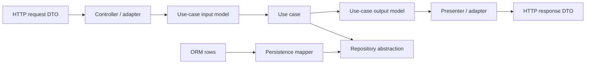
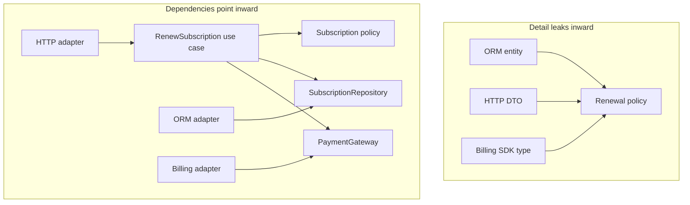

# Clean Architecture: Make Policy Independent of Details

## TL;DR

Clean Architecture organizes source-code dependencies so that **important policy does not depend on volatile detail**.

The central rule is simple:

```text
source-code dependencies point inward

frameworks / drivers
        -> interface adapters
        -> application use cases
        -> core business policy
```

Runtime control can move outward when a use case calls a database, presenter, queue, or payment provider. But source code in an inner policy layer should depend on an abstraction it owns, while the outer detail implements that abstraction.



The circles in common diagrams are **schematic**. Clean Architecture does not require exactly four projects, exactly four folders, or an enterprise-style class hierarchy. The architectural value comes from the **Dependency Rule**, not from copying a diagram.

## 1. The Dependency Rule is the governing constraint

<TermBox term="Dependency Rule">
The **Dependency Rule** says that source-code dependencies may point only inward, toward more general and higher-level policy.

Code in an inner boundary should not name types, functions, data formats, frameworks, or implementation details that belong to an outer boundary.

**Why it matters:** changes to web frameworks, databases, SDKs, transports, and delivery mechanisms should not force corresponding changes to core business policy unless the business behavior itself changes.
</TermBox>

This is primarily a statement about **source-code or compile-time dependency**.

Suppose a use case needs to save an order.

Bad compile-time dependency:

```text
PlaceOrderUseCase -> PrismaOrderRepository
```

Better dependency direction:

```text
PlaceOrderUseCase -> OrderRepository abstraction
PostgresOrderRepository -> OrderRepository abstraction
```

At runtime, the call still reaches PostgreSQL:

```text
PlaceOrderUseCase
  -> OrderRepository interface
  -> PostgresOrderRepository
  -> PostgreSQL
```

So runtime flow and source-code dependency direction are not the same thing.



## 2. Inner means policy; outer means mechanism

Clean Architecture often uses concentric rings because the rings communicate a gradient:

- outer areas contain **mechanisms and details**;
- inner areas contain **policies and business meaning**;
- moving inward should generally increase abstraction and stability.

Typical labels are:

1. Entities or core business rules;
2. Use Cases or application-specific policy;
3. Interface Adapters;
4. Frameworks and Drivers.

Those names are useful, but the exact count is not sacred.

The stronger question is:

> If a detail changes, how far inward does that change propagate?

If upgrading an ORM changes your order-discount rule, the dependency boundary is weak no matter how beautiful the folder tree looks.

## 3. “Entities” means high-level business policy, not ORM rows

A major naming trap is assuming Clean Architecture's **Entity** means “database entity.”

That is not the architectural idea.

In the Clean Architecture model, the innermost policy represents the most general, high-level business rules available in the system. In a large enterprise, some rules may be shared across applications. In a single application, they may simply be the application's most durable business objects and policies.

Examples:

```text
Order cannot be paid twice.
Refund cannot exceed captured amount.
Subscription cannot renew after cancellation becomes effective.
Inventory reservation cannot become negative.
```

An ORM annotation, SQL row, HTTP request, or JSON schema should not define those rules merely because it is convenient.

Bad boundary:

```ts
class OrderPolicy {
  canCancel(order: Prisma.OrderGetPayload<...>): boolean
}
```

Now a persistence representation has entered core policy.

Prefer a core model or input shape whose meaning belongs to the policy itself.

## 4. Use cases contain application-specific policy

<TermBox term="Use case">
A **use case** encapsulates application-specific business rules and orchestrates the work needed to achieve one user or system goal.

It coordinates core policy, inputs, outputs, and required external capabilities without depending directly on web, database, or vendor implementation details.

**Why it matters:** operational changes to one application flow can evolve without contaminating the most general business rules, while technology changes remain farther outside.
</TermBox>

Examples:

- Place Order;
- Cancel Subscription;
- Approve Refund;
- Publish Article;
- Reconcile Payment;
- Generate Monthly Statement.

A use case can decide:

```text
load order
  -> verify cancellation policy
  -> record cancellation
  -> save order
  -> publish outcome
```

But it should not need to know:

```text
Express Request
Prisma TransactionClient
Stripe SDK response type
Kafka producer config
React component state
```

Those are mechanisms around the use case.

## 5. Interface adapters translate representations

<TermBox term="Interface adapter">
An **interface adapter** converts between representations convenient for an external mechanism and representations convenient for use cases or core policy.

Controllers, presenters, repository implementations, message consumers, ORM mappers, and external-service clients commonly live in this kind of boundary.

**Why it matters:** external data formats can change without forcing the inner policy to speak framework, database, or vendor language.
</TermBox>

An HTTP adapter may translate:

```text
HTTP JSON request
  -> PlaceOrderRequestModel
  -> PlaceOrder use case
```

A presenter may translate:

```text
PlaceOrderResult
  -> HTTP response model
  -> JSON + status code
```

A persistence adapter may translate:

```text
Order aggregate
  -> ORM persistence model
  -> database rows
```



The goal is not to create a duplicate DTO for every single function call. Map data when the representations have **different owners or reasons to change**.

## 6. Frameworks and drivers are details from the core's perspective

The outermost boundary commonly contains things such as:

- web frameworks;
- database engines and ORM configuration;
- message brokers;
- UI frameworks;
- vendor SDKs;
- schedulers;
- device drivers;
- cloud service clients.

Calling them “details” does **not** mean they are trivial or operationally unimportant.

PostgreSQL transaction semantics still matter. Payment-provider idempotency still matters. Kafka ordering still matters.

“Detail” means the inner business policy should not be structurally owned by those implementation choices.

You still need infrastructure expertise, production observability, integration tests, migrations, retry policies, and operational runbooks.

## 7. Dependency inversion crosses boundaries without reversing runtime behavior

Suppose a use case must notify a presenter when checkout succeeds.

A direct source dependency would be:

```text
CheckoutUseCase -> HttpCheckoutPresenter
```

That points outward and violates the Dependency Rule.

Instead, the use-case boundary can own an output abstraction:

```text
CheckoutUseCase -> CheckoutOutput
HttpCheckoutPresenter -> CheckoutOutput
```

Runtime control can still be:

```text
CheckoutUseCase
  -> CheckoutOutput method
  -> HttpCheckoutPresenter implementation
```

This is dependency inversion: source dependency points toward the inner-owned abstraction even though runtime execution eventually reaches the outer implementation.

The same technique applies to:

- repositories;
- gateways;
- presenters;
- message publishers;
- clocks;
- object stores;
- external APIs.

## 8. Dependency Injection is not Clean Architecture

Dependency Injection can help wire implementations to abstractions, but it is not the architecture by itself.

This code uses DI:

```ts
new OrderService(prisma, stripe, expressResponseFactory)
```

Yet `OrderService` still depends directly on infrastructure concepts.

This is closer to the dependency rule:

```ts
new PlaceOrderUseCase(orderRepository, paymentGateway, outputBoundary)
```

where those contracts are owned by the application boundary and implemented outside it.

A DI container can wire a poor architecture. Constructor injection can wire a poor architecture. The important question is **who owns the abstraction and which way source dependencies point**.

## 9. The composition root is intentionally impure

At startup, some outer code must know concrete classes so the application can run.

For example:

```ts
const orderRepository = new PostgresOrderRepository(prisma);
const paymentGateway = new StripePaymentGateway(stripe);
const presenter = new HttpCheckoutPresenter();

const placeOrder = new PlaceOrderUseCase({
  orderRepository,
  paymentGateway,
  presenter,
});
```

That startup location is the **composition root**.

It is acceptable for this outer edge to know concrete infrastructure because its job is to assemble the graph.

What should be avoided is letting inner use cases reach into a global container or import concrete infrastructure themselves.

## 10. Boundary data should not smuggle outer dependencies inward

Robert Martin's original article emphasizes simple data structures crossing boundaries.

The practical rule is:

> inner code should not be forced to depend on an outer representation merely because that representation is convenient.

Avoid passing these inward when they leak outer ownership:

```text
Express Request
ORM RowStructure
Framework ModelState
Vendor SDK Response
Database cursor
HTTP-specific status enum
```

Instead, translate to data shaped for the inner use case:

```ts
type ApproveRefundInput = {
  paymentId: PaymentId;
  amount: Money;
  requestedBy: ActorId;
};
```

Likewise, a use case can produce an output model that a presenter converts to HTTP, CLI, or another delivery representation.

Do not turn this into mapper theater. If two layers genuinely share the same stable value object and doing so does not reverse dependency ownership, duplication may be unnecessary.

## 11. Clean Architecture and Hexagonal Architecture overlap

They are not competing religions.

Both aim to protect application policy from external technology and invert dependencies at meaningful boundaries.

Useful difference in emphasis:

```text
Hexagonal Architecture
  -> ports/adapters
  -> inside vs outside
  -> driving vs driven interactions

Clean Architecture
  -> policy vs detail
  -> concentric levels of abstraction
  -> Dependency Rule: source dependencies inward
```

A system may be both.

For example:

```text
HTTP adapter
  -> use-case input boundary
  -> application use case
  -> core policy
  -> repository/payment output boundary
  -> infrastructure adapters
```

The diagram vocabulary matters less than whether dependency ownership is correct.

## 12. Clean Architecture does not require DDD

Domain-Driven Design can complement Clean Architecture, but it is not a prerequisite.

You can have:

- Clean Architecture without aggregates or bounded contexts;
- DDD concepts in a layered architecture;
- a modular monolith using Clean-style dependency inversion;
- a microservice with terrible dependency direction inside the service.

Choose boundaries because they protect real policy and volatility, not because a methodology checklist demands more artifacts.

## 13. Testing follows the dependency boundaries

A clean dependency structure creates useful test seams.

Typical balance:

```text
Core policy tests
  -> pure / fast / infrastructure-free

Use-case tests
  -> fake or controlled output dependencies

Adapter integration tests
  -> real DB / broker / provider contract where practical

Composition / end-to-end tests
  -> verify selected assembled flows
```

Clean Architecture does not remove the need for integration testing.

A fake repository cannot prove:

- database constraints;
- isolation behavior;
- SQL mapping correctness;
- provider timeout behavior;
- broker delivery semantics.

Keep policy tests fast, and test details where their real semantics live.

## 14. Avoid architecture ceremony without volatility

A tiny CRUD application may not benefit from:

```text
Controller
  -> InputBoundary
  -> Interactor
  -> OutputBoundary
  -> Presenter
  -> Gateway
  -> Mapper
```

for every trivial operation.

The Dependency Rule is valuable, but the number of abstractions should match the cost of change.

Introduce stronger boundaries when:

- core policy is valuable and long-lived;
- infrastructure is volatile;
- multiple delivery mechanisms exist;
- testing core policy currently requires heavy infrastructure;
- framework/vendor types leak widely;
- changes to details repeatedly ripple into business behavior.

Architecture is an economic decision, not a contest for maximum interfaces.

## 15. Production failure: the ORM becomes the business model

A subscription system starts with framework-generated ORM models.

The team uses the ORM entity everywhere:

```text
HTTP controller
  -> Subscription ORM entity
  -> renewal service
  -> billing service
  -> notification service
  -> API serializer
```

Soon the entity includes persistence annotations, lazy-loaded relations, request-validation decorators, billing-provider IDs, and presentation flags.

A migration changes persistence representation for subscription status. The change propagates into renewal policy, API serialization, tests, and billing logic even though the business meaning of “active,” “past due,” and “canceled” has not changed.

**Impact:** database migrations trigger broad application rewrites, unit tests require ORM fixtures, delivery and persistence concerns shape core policy, and replacing one adapter becomes a business-logic change.

**Root cause:** an outer persistence representation became the shared business contract. Source-code dependencies point from policy toward ORM detail, violating the Dependency Rule.

**Correct pattern:** move stable subscription rules into core policy, express application operations as use cases, define inner-owned repository/gateway abstractions where external capabilities are required, translate ORM rows and HTTP DTOs in interface adapters, keep framework/vendor types outside the policy boundary, and wire concrete details only at the composition root.



## 16. Self-check

<details>
<summary>If runtime control goes from a use case to a database adapter, does that violate the Dependency Rule?</summary>

Not necessarily. The rule concerns source-code dependencies. The use case can depend on an inner-owned repository abstraction while the outer database adapter implements it. Runtime control reaches the adapter, but compile-time dependency still points inward toward the abstraction.
</details>

<details>
<summary>Does Clean Architecture require exactly four projects named Entities, UseCases, Adapters, and Frameworks?</summary>

No. The four circles are schematic. You may use more or fewer boundaries, packages, or projects. What must remain true is that source-code dependencies do not point from inner policy toward outer details.
</details>

<details>
<summary>Is a class called `CustomerEntity` automatically part of the Clean Architecture entity layer?</summary>

No. An ORM “entity” may be an outer persistence representation. The architectural question is whether the type represents durable high-level business policy or whether it carries database/framework concerns.
</details>

## 17. Production checklist

- [ ] Source-code dependencies point toward more stable policy rather than outward toward frameworks or infrastructure.
- [ ] Core business rules do not import ORM, web framework, vendor SDK, or transport types.
- [ ] Use cases express application operations independently of delivery and persistence mechanisms.
- [ ] External capabilities cross boundaries through abstractions whose semantics are useful to the application.
- [ ] Interface adapters translate representations at boundaries with different owners or reasons to change.
- [ ] Boundary data does not smuggle outer framework/database structures inward.
- [ ] Dependency Injection is used as wiring, not treated as proof that dependencies point correctly.
- [ ] Concrete infrastructure is assembled at an explicit composition root.
- [ ] Core/use-case tests run without final infrastructure where isolation is valuable.
- [ ] Real adapter semantics still receive integration coverage.
- [ ] The team can explain why each abstraction protects a meaningful policy/detail boundary.
- [ ] The design does not cargo-cult the four-circle diagram into mandatory projects or classes.

## Agent rule

When recommending Clean Architecture, identify the **policy that deserves protection**, the **outer detail likely to vary**, the **boundary abstraction owned by the inner side**, and the **source-code dependency direction**. Do not recommend extra rings, DTOs, repositories, or interfaces without a concrete change-isolation benefit.

## Sources

- Robert C. Martin, [The Clean Architecture](https://blog.cleancoder.com/uncle-bob/2012/08/13/the-clean-architecture.html)
- Microsoft Learn, [Common web application architectures](https://learn.microsoft.com/en-us/dotnet/architecture/modern-web-apps-azure/common-web-application-architectures)
- Microsoft Learn, [Architectural principles](https://learn.microsoft.com/en-us/dotnet/architecture/modern-web-apps-azure/architectural-principles)
