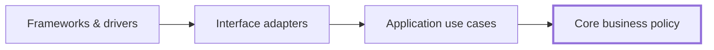
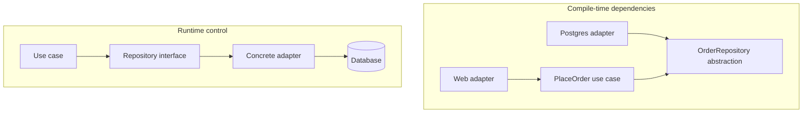
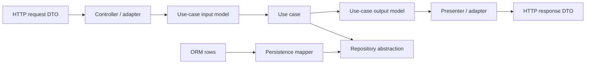
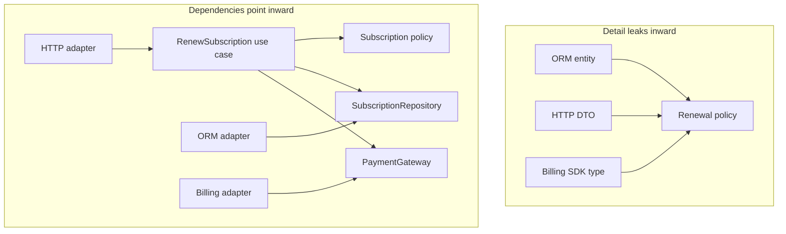

# Clean Architecture: Make Policy Independent of Details

A development team inherits a straightforward user management and onboarding service. Eager to follow "industry best practices," the previous engineers cargo-culted the classic four concentric circles of Clean Architecture down to the letter. Every routine database query was forced through 24 layers of boilerplate: `UserController`, `UserPresenter`, `CreateUserUseCaseInputPort`, `CreateUserUseCaseOutputPort`, `CreateUserInteractor`, `UserRepositoryInterface`, `PostgresUserRepository`, five distinct DTOs, and tedious bidirectional object mappers. Adding a single nullable column like `phone_number` required modifying 14 files across 6 directory tiers. Codebase volume tripled, deployment velocity ground to a halt, and time-to-market collapsed—all while integration tests mocked the database away, offering zero real testability or safety against production runtime failures.

This architectural paralysis stems from confusing structural ceremony with architectural intent. Clean Architecture is neither a mandatory folder layout nor a quota of interfaces. Its foundational essence is the **Dependency Rule**: source-code dependencies must point strictly inward toward high-level business policy, keeping domain rules completely decoupled from databases, web frameworks, external SDKs, and UI mechanisms.

> 💡 **Rule of thumb:** Protect stable business policy from volatile mechanisms; source-code dependencies must point strictly inward toward domain rules, crossing boundaries solely through abstractions owned by the inner layer.

## TL;DR

- **The Dependency Rule is absolute:** Source-code dependencies must point strictly **inward** toward higher-level policies. Inner layers (`Entities` and `Use Cases`) must never know, import, or name concrete types from outer mechanisms (`Interface Adapters`, `Frameworks and Drivers`).
- **Concentric rings represent stability gradients:** Outermost rings house volatile mechanisms and delivery details (HTTP frameworks, ORMs, message brokers); innermost rings house durable business policies (`Entities` representing enterprise rules and `Use Cases` orchestrating application workflows).
- **Boundary data crossing without leakage:** Data crosses boundaries using plain, intent-focused structures (`boundary data`, request/response models, or pure DTOs). Never smuggle framework requests, database cursors, or ORM entities across the boundary into core business logic.
- **Inversion of Control and the Composition Root:** Outer adapters implement abstractions owned by inner layers via **Dependency Inversion**. All concrete implementations and third-party drivers are wired together in an intentionally impure, single location at startup: the **composition root**.
- **Fatal pitfall:** **Architecture ceremony without volatility (Cargo-culting the circles).** Mechanically creating input ports, output ports, interactor classes, repository interfaces, presenters, and mappers for trivial CRUD workflows that have no independent business policy or varying infrastructure. This bloats code by 300% and slows delivery without delivering real testability or decoupling benefits.

The governing relationship between layers is:

```text
source-code dependencies point inward

Frameworks and Drivers
        -> Interface Adapters
        -> Use Cases (Application-specific policy)
        -> Entities (Core business policy)
```

Runtime control can move outward when a use case calls a database, presenter, queue, or payment provider. But source code in an inner policy layer should depend on an abstraction it owns, while the outer detail implements that abstraction.



The circles in common diagrams are **schematic**. Clean Architecture does not require exactly four projects, exactly four folders, or an enterprise-style class hierarchy. The architectural value comes from the **Dependency Rule**, not from copying a diagram.

## 1. The Dependency Rule is the governing constraint

<TermBox term="Dependency Rule">
The **Dependency Rule** says that source-code dependencies may point only inward, toward more general and higher-level policy.

Code in an inner boundary should not name types, functions, data formats, frameworks, or implementation details that belong to an outer boundary.

**Why it matters:** changes to web frameworks, databases, SDKs, transports, and delivery mechanisms should not force corresponding changes to core business policy unless the business behavior itself changes.
</TermBox>

This is primarily a statement about **source-code or compile-time dependency**.

Suppose a use case needs to save an order.

Bad compile-time dependency:

```text
PlaceOrderUseCase -> PrismaOrderRepository
```

Better dependency direction:

```text
PlaceOrderUseCase -> OrderRepository abstraction
PostgresOrderRepository -> OrderRepository abstraction
```

At runtime, the call still reaches PostgreSQL:

```text
PlaceOrderUseCase
  -> OrderRepository interface
  -> PostgresOrderRepository
  -> PostgreSQL
```

So runtime flow and source-code dependency direction are not the same thing.



## 2. Inner means policy; outer means mechanism

Clean Architecture often uses concentric rings because the rings communicate a gradient:

- outer areas contain **mechanisms and details**;
- inner areas contain **policies and business meaning**;
- moving inward should generally increase abstraction and stability.

Typical labels are:

1. **Entities**: core enterprise business rules;
2. **Use Cases**: application-specific business policy;
3. **Interface Adapters**: data translators and boundary bridges;
4. **Frameworks and Drivers**: peripheral tools, databases, and delivery mechanisms.

Those names are useful, but the exact count is not sacred.

The stronger question is:

> If a detail changes, how far inward does that change propagate?

If upgrading an ORM changes your order-discount rule, the dependency boundary is weak no matter how beautiful the folder tree looks.

## 3. “Entities” means high-level business policy, not ORM rows

A major naming trap is assuming Clean Architecture's **Entities** means "database entities."

That is not the architectural idea.

In the Clean Architecture model, the innermost policy represents the most general, high-level business rules available in the system. In a large enterprise, some rules may be shared across applications. In a single application, they may simply be the application's most durable business objects and policies.

Examples:

```text
Order cannot be paid twice.
Refund cannot exceed captured amount.
Subscription cannot renew after cancellation becomes effective.
Inventory reservation cannot become negative.
```

An ORM annotation, SQL row, HTTP request, or JSON schema should not define those rules merely because it is convenient.

Bad boundary:

```ts
class OrderPolicy {
  canCancel(order: Prisma.OrderGetPayload<...>): boolean
}
```

Now a persistence representation has entered core policy.

Prefer a core model or input shape whose meaning belongs to the policy itself.

## 4. Use cases contain application-specific policy

<TermBox term="Use case">
A **use case** encapsulates application-specific business rules and orchestrates the work needed to achieve one user or system goal.

It coordinates core policy, inputs, outputs, and required external capabilities without depending directly on web, database, or vendor implementation details.

**Why it matters:** operational changes to one application flow can evolve without contaminating the most general business rules, while technology changes remain farther outside.
</TermBox>

Examples:

- Place Order;
- Cancel Subscription;
- Approve Refund;
- Publish Article;
- Reconcile Payment;
- Generate Monthly Statement.

A use case can decide:

```text
load order
  -> verify cancellation policy
  -> record cancellation
  -> save order
  -> publish outcome
```

But it should not need to know:

```text
Express Request
Prisma TransactionClient
Stripe SDK response type
Kafka producer config
React component state
```

Those are mechanisms around the use case.

## 5. Interface adapters translate representations

<TermBox term="Interface adapter">
An **interface adapter** converts between representations convenient for an external mechanism and representations convenient for use cases or core policy.

Controllers, presenters, repository implementations, message consumers, ORM mappers, and external-service clients commonly live in this kind of boundary.

**Why it matters:** external data formats can change without forcing the inner policy to speak framework, database, or vendor language.
</TermBox>

An HTTP adapter may translate:

```text
HTTP JSON request
  -> PlaceOrderRequestModel
  -> PlaceOrder use case
```

A presenter may translate:

```text
PlaceOrderResult
  -> HTTP response model
  -> JSON + status code
```

A persistence adapter may translate:

```text
Order aggregate
  -> ORM persistence model
  -> database rows
```



The goal is not to create a duplicate DTO for every single function call. Map data when the representations have **different owners or reasons to change**.

## 6. Frameworks and drivers are details from the core's perspective

The outermost boundary commonly contains things such as:

- web frameworks;
- database engines and ORM configuration;
- message brokers;
- UI frameworks;
- vendor SDKs;
- schedulers;
- device drivers;
- cloud service clients.

Calling them "details" does **not** mean they are trivial or operationally unimportant.

PostgreSQL transaction semantics still matter. Payment-provider idempotency still matters. Kafka ordering still matters.

"Detail" means the inner business policy should not be structurally owned by those implementation choices.

You still need infrastructure expertise, production observability, integration tests, migrations, retry policies, and operational runbooks.

## 7. Dependency inversion crosses boundaries without reversing runtime behavior

Suppose a use case must notify a presenter when checkout succeeds.

A direct source dependency would be:

```text
CheckoutUseCase -> HttpCheckoutPresenter
```

That points outward and violates the Dependency Rule.

Instead, the use-case boundary can own an output abstraction:

```text
CheckoutUseCase -> CheckoutOutput
HttpCheckoutPresenter -> CheckoutOutput
```

Runtime control can still be:

```text
CheckoutUseCase
  -> CheckoutOutput method
  -> HttpCheckoutPresenter implementation
```

This is dependency inversion: source dependency points toward the inner-owned abstraction even though runtime execution eventually reaches the outer implementation.

The same technique applies to:

- repositories;
- gateways;
- presenters;
- message publishers;
- clocks;
- object stores;
- external APIs.

## 8. Dependency Injection is not Clean Architecture

Dependency Injection can help wire implementations to abstractions, but it is not the architecture by itself.

This code uses DI:

```ts
new OrderService(prisma, stripe, expressResponseFactory)
```

Yet `OrderService` still depends directly on infrastructure concepts.

This is closer to the dependency rule:

```ts
new PlaceOrderUseCase(orderRepository, paymentGateway, outputBoundary)
```

where those contracts are owned by the application boundary and implemented outside it.

A DI container can wire a poor architecture. Constructor injection can wire a poor architecture. The important question is **who owns the abstraction and which way source dependencies point**.

## 9. The composition root is intentionally impure

At startup, some outer code must know concrete classes so the application can run.

For example:

```ts
const orderRepository = new PostgresOrderRepository(prisma);
const paymentGateway = new StripePaymentGateway(stripe);
const presenter = new HttpCheckoutPresenter();

const placeOrder = new PlaceOrderUseCase({
  orderRepository,
  paymentGateway,
  presenter,
});
```

That startup location is the **composition root**.

It is acceptable for this outer edge to know concrete infrastructure because its job is to assemble the graph.

What should be avoided is letting inner use cases reach into a global container or import concrete infrastructure themselves.

## 10. Boundary data should not smuggle outer dependencies inward

Robert Martin's original article emphasizes simple data structures crossing boundaries.

The practical rule is:

> inner code should not be forced to depend on an outer representation merely because that representation is convenient.

Avoid passing these inward when they leak outer ownership:

```text
Express Request
ORM RowStructure
Framework ModelState
Vendor SDK Response
Database cursor
HTTP-specific status enum
```

Instead, translate to plain **boundary data** shaped for the inner use case:

```ts
type ApproveRefundInput = {
  paymentId: PaymentId;
  amount: Money;
  requestedBy: ActorId;
};
```

Likewise, a use case can produce an output model that a presenter converts to HTTP, CLI, or another delivery representation.

Do not turn this into mapper theater. If two layers genuinely share the same stable value object and doing so does not reverse dependency ownership, duplication may be unnecessary.

## 11. Clean Architecture and Hexagonal Architecture overlap

They are not competing religions.

Both aim to protect application policy from external technology and invert dependencies at meaningful boundaries.

Useful difference in emphasis:

```text
Hexagonal Architecture
  -> ports/adapters
  -> inside vs outside
  -> driving vs driven interactions

Clean Architecture
  -> policy vs detail
  -> concentric levels of abstraction
  -> Dependency Rule: source dependencies inward
```

A system may be both.

For example:

```text
HTTP adapter
  -> use-case input boundary
  -> application use case
  -> core policy
  -> repository/payment output boundary
  -> infrastructure adapters
```

The diagram vocabulary matters less than whether dependency ownership is correct.

## 12. Clean Architecture does not require DDD

Domain-Driven Design can complement Clean Architecture, but it is not a prerequisite.

You can have:

- Clean Architecture without aggregates or bounded contexts;
- DDD concepts in a layered architecture;
- a modular monolith using Clean-style dependency inversion;
- a microservice with terrible dependency direction inside the service.

Choose boundaries because they protect real policy and volatility, not because a methodology checklist demands more artifacts.

## 13. Testing follows the dependency boundaries

A clean dependency structure creates useful test seams.

Typical balance:

```text
Core policy tests
  -> pure / fast / infrastructure-free

Use-case tests
  -> fake or controlled output dependencies

Adapter integration tests
  -> real DB / broker / provider contract where practical

Composition / end-to-end tests
  -> verify selected assembled flows
```

Clean Architecture does not remove the need for integration testing.

A fake repository cannot prove:

- database constraints;
- isolation behavior;
- SQL mapping correctness;
- provider timeout behavior;
- broker delivery semantics.

Keep unit test suites for policy fast and isolated, and test details with integration tests where their real semantics live.

## 14. Avoid architecture ceremony without volatility

A tiny CRUD application may not benefit from:

```text
Controller
  -> InputBoundary
  -> Interactor
  -> OutputBoundary
  -> Presenter
  -> Gateway
  -> Mapper
```

for every trivial operation.

The Dependency Rule is valuable, but the number of abstractions should match the cost of change.

Introduce stronger boundaries when:

- core policy is valuable and long-lived;
- infrastructure is volatile;
- multiple delivery mechanisms exist;
- testing core policy currently requires heavy infrastructure;
- framework/vendor types leak widely;
- changes to details repeatedly ripple into business behavior.

Architecture is an economic decision, not a contest for maximum interfaces.

## 15. Production failure: the ORM becomes the business model

A high-growth SaaS subscription platform started with framework-generated ORM models for rapid prototyping. Eager to ship features quickly, the engineering team passed the ORM `Subscription` entity directly across all layers:

```text
HTTP controller
  -> Subscription ORM entity
  -> RenewalService
  -> BillingService
  -> NotificationService
  -> API response serializer
```

Over eighteen months, the entity accumulated dozens of database annotations, lazy-loaded relations, validation decorators, Stripe customer IDs, and UI formatting getters.

When a major billing redesign required migrating subscription states from simple database enums to an event-sourced ledger, the change triggered a catastrophic ripple effect. Changing column definitions broke the renewal business rules, caused serialization errors in mobile API endpoints, invalidated billing audit logic, and caused hundreds of unit tests to fail because they could not initialize without a running PostgreSQL container.

**Impact:** Database schema migrations triggered cascading rewrites across the entire application. Unit tests became impossible to run without heavy database fixtures, delivery and persistence concerns shaped core policy, and replacing one adapter became a business-logic change.

**Root cause:** An outer persistence representation (the ORM model) was treated as the shared business contract. Source-code dependencies pointed outward from policy toward database mechanisms, directly violating the Dependency Rule.

**Correct pattern:** Move durable subscription invariants into innermost Entities, express application operations as Use Cases, define repository and payment gateway abstractions owned by the application layer, translate database rows and HTTP DTOs in Interface Adapters, keep Frameworks and Drivers strictly outside the policy boundary, and wire concrete details only at the composition root.



## 16. Self-check

### 1. Does runtime control flowing to a database adapter violate the Dependency Rule?

When a use case calls a repository method that ultimately executes queries inside a PostgreSQL adapter, does that outward execution flow violate the Dependency Rule?

<details>
<summary>Show the reasoning</summary>

Not necessarily. The Dependency Rule governs **source-code and compile-time dependencies**, not runtime call stack execution. The use case depends on an abstraction (an interface or port) that it owns within its boundary. The database adapter in the outer layer implements that abstraction. At runtime, execution flows outward from the use case into the adapter, but at compile time, the source code dependency points inward toward the abstraction.
</details>

### 2. Does Clean Architecture require exactly four concentric layers?

Must every application build four separate projects or folders named Entities, UseCases, Adapters, and Frameworks?

<details>
<summary>Show the reasoning</summary>

No. The four concentric circles in Uncle Bob's famous diagram are purely **schematic**. Depending on domain complexity and operational requirements, an application might need three layers, five layers, or simply clear module boundaries within a single package. What must remain invariant is the **Dependency Rule**: source-code dependencies must always point inward toward high-level business policy, regardless of the number of intermediate rings.
</details>

### 3. Is a database class named `CustomerEntity` an Entity in Clean Architecture?

If your ORM or persistence framework defines a data model called `CustomerEntity`, does that automatically place it in the innermost layer of Clean Architecture?

<details>
<summary>Show the reasoning</summary>

No. This is a classic terminology collision. In ORMs (such as TypeORM, Hibernate, or Prisma), an "entity" is a database persistence representation tied to table schemas and column types. In Clean Architecture, an **Entity** represents durable enterprise-wide business rules and invariants that are completely decoupled from persistence details. An ORM model belongs in the outer Interface Adapters or Frameworks layer, not in the core domain.
</details>

## 17. Production checklist

- [ ] **Dependency direction:** Source-code dependencies point strictly inward toward stable business policy rather than outward toward frameworks or infrastructure.
- [ ] **Core isolation:** Core business rules (Entities and Use Cases) do not import ORM packages, web frameworks, vendor SDKs, or transport types.
- [ ] **Use case focus:** Use cases express application operations independently of delivery channels (HTTP, CLI, queues) and persistence mechanisms.
- [ ] **Boundary ownership:** External capabilities cross boundaries through abstractions whose signatures and semantics are owned by the inner layer.
- [ ] **Interface adapters:** Adapters handle translation between external formats and internal domain structures at boundaries with different reasons to change.
- [ ] **Boundary data discipline:** Plain data structures (boundary data, DTOs, request/response models) cross boundaries without leaking database rows, cursors, or framework request objects.
- [ ] **Wiring discipline:** Dependency Injection is used purely as an assembly mechanism, not treated as proof that architectural dependencies are inverted correctly.
- [ ] **Composition root:** All concrete infrastructure dependencies, adapters, and use cases are assembled in an explicit, centralized composition root at startup.
- [ ] **Fast unit tests:** Core business rules and use cases execute in fast, in-memory unit test suites without requiring live databases, web servers, or third-party emulators.
- [ ] **Adapter integration tests:** Real database queries, broker contracts, and third-party integrations are verified with targeted integration tests rather than mocked away entirely.
- [ ] **Architectural economy:** The team can justify every abstraction and boundary by real volatility and change cost, avoiding cargo-cult ceremony for simple CRUD operations.

## Agent rule

When recommending Clean Architecture, identify the **policy that deserves protection**, the **outer detail likely to vary**, the **boundary abstraction owned by the inner side**, and the **source-code dependency direction**. Do not recommend extra rings, DTOs, repositories, or interfaces without a concrete change-isolation benefit.

## Sources

- Robert C. Martin, [The Clean Architecture](https://blog.cleancoder.com/uncle-bob/2012/08/13/the-clean-architecture.html)
- Microsoft Learn, [Common web application architectures](https://learn.microsoft.com/en-us/dotnet/architecture/modern-web-apps-azure/common-web-application-architectures)
- Microsoft Learn, [Architectural principles](https://learn.microsoft.com/en-us/dotnet/architecture/modern-web-apps-azure/architectural-principles)
