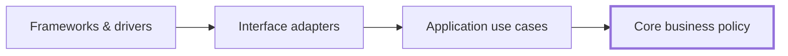
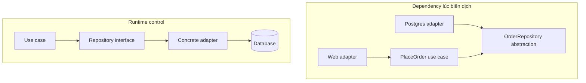
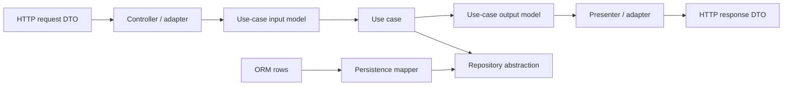
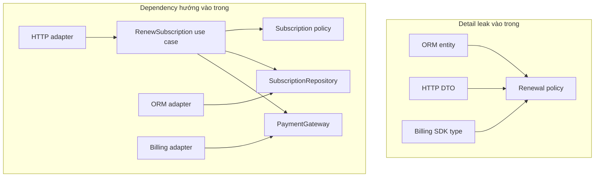

# Clean Architecture: Giữ Policy Độc lập với Detail

## Tóm tắt nhanh

Clean Architecture tổ chức dependency trong mã nguồn để **policy quan trọng không phụ thuộc vào detail dễ thay đổi**.

Quy tắc trung tâm:

```text
source-code dependency hướng vào trong

framework / driver
        -> interface adapter
        -> application use case
        -> core business policy
```

Runtime control có thể đi ra ngoài khi use case gọi database, presenter, queue hay payment provider. Nhưng source code ở policy bên trong nên phụ thuộc vào abstraction do phía trong sở hữu, còn detail bên ngoài implement abstraction đó.



Các vòng tròn trong diagram phổ biến chỉ là **schematic**. Clean Architecture không yêu cầu chính xác bốn project, bốn folder hay một class hierarchy kiểu enterprise. Giá trị kiến trúc nằm ở **Dependency Rule**, không nằm ở việc sao chép hình vẽ.

## 1. Dependency Rule là constraint chi phối thiết kế

<TermBox term="Dependency Rule">
**Quy tắc phụ thuộc** nói rằng source-code dependency chỉ được hướng vào trong, về phía policy tổng quát và cấp cao hơn.

Code ở boundary bên trong không nên biết tên type, function, data format, framework hay implementation detail thuộc boundary bên ngoài.

**Vì sao quan trọng:** thay web framework, database, SDK, transport hay delivery mechanism không nên buộc core business policy đổi theo trừ khi chính business behavior thay đổi.
</TermBox>

Đây chủ yếu là quy tắc về **phụ thuộc mã nguồn hoặc phụ thuộc lúc biên dịch**.

Giả sử use case cần lưu order.

Dependency lúc biên dịch yếu:

```text
PlaceOrderUseCase -> PrismaOrderRepository
```

Hướng dependency tốt hơn:

```text
PlaceOrderUseCase -> OrderRepository abstraction
PostgresOrderRepository -> OrderRepository abstraction
```

Ở runtime, call vẫn tới PostgreSQL:

```text
PlaceOrderUseCase
  -> OrderRepository interface
  -> PostgresOrderRepository
  -> PostgreSQL
```

Vì vậy runtime flow và source-code dependency direction không phải cùng một thứ.



## 2. Bên trong là policy; bên ngoài là mechanism

Clean Architecture thường dùng các vòng đồng tâm vì chúng thể hiện một gradient:

- vùng ngoài chứa **mechanism và detail**;
- vùng trong chứa **policy và business meaning**;
- càng đi vào trong, abstraction và stability thường càng cao.

Các nhãn điển hình:

1. Entities hoặc core business rule;
2. Use Cases hoặc application-specific policy;
3. Interface Adapters;
4. Frameworks and Drivers.

Tên gọi hữu ích, nhưng số lượng chính xác không phải điều thiêng liêng.

Câu hỏi mạnh hơn là:

> Khi một detail đổi, thay đổi đó lan vào trong bao xa?

Nếu nâng cấp ORM làm order-discount rule phải đổi, dependency boundary đang yếu dù folder tree trông rất đẹp.

## 3. “Entities” là business policy cấp cao, không phải ORM row

Một bẫy thuật ngữ lớn là nghĩ **Entity** trong Clean Architecture đồng nghĩa với “database entity”.

Đó không phải ý nghĩa kiến trúc.

Trong mô hình Clean Architecture, policy trong cùng đại diện cho những business rule tổng quát, cấp cao và bền vững nhất của hệ thống. Ở enterprise lớn, một số rule có thể dùng chung giữa nhiều application. Với một application đơn lẻ, đó có thể chỉ là business object và policy bền vững nhất của chính application.

Ví dụ:

```text
Order không được thanh toán hai lần.
Refund không được vượt captured amount.
Subscription không renew sau khi cancellation có hiệu lực.
Inventory reservation không được âm.
```

ORM annotation, SQL row, HTTP request hay JSON schema không nên trở thành nơi định nghĩa những rule này chỉ vì tiện.

Boundary yếu:

```ts
class OrderPolicy {
  canCancel(order: Prisma.OrderGetPayload<...>): boolean
}
```

Persistence representation đã đi vào core policy.

Tốt hơn là core model hoặc input shape mà meaning thuộc về chính policy.

## 4. Use case chứa application-specific policy

<TermBox term="Use case">
**Use case** đóng gói application-specific business rule và điều phối công việc cần thiết để đạt một mục tiêu của user hoặc system.

Nó phối hợp core policy, input, output và external capability cần thiết mà không phụ thuộc trực tiếp vào web, database hay vendor implementation detail.

**Vì sao quan trọng:** thay đổi vận hành của một application flow có thể tiến hóa mà không làm bẩn business rule tổng quát nhất, còn technology change vẫn nằm xa hơn ở ngoài.
</TermBox>

Ví dụ:

- Place Order;
- Cancel Subscription;
- Approve Refund;
- Publish Article;
- Reconcile Payment;
- Generate Monthly Statement.

Use case có thể quyết định:

```text
load order
  -> kiểm tra cancellation policy
  -> ghi cancellation
  -> save order
  -> publish outcome
```

Nhưng không nên cần biết:

```text
Express Request
Prisma TransactionClient
Stripe SDK response type
Kafka producer config
React component state
```

Đó là mechanism quanh use case.

## 5. Interface adapter chuyển đổi representation

<TermBox term="Interface adapter">
**Bộ chuyển đổi giao diện** chuyển đổi giữa representation tiện cho external mechanism và representation tiện cho use case hoặc core policy.

Controller, presenter, repository implementation, message consumer, ORM mapper và external-service client thường nằm ở loại boundary này.

**Vì sao quan trọng:** external data format có thể đổi mà không buộc inner policy phải nói ngôn ngữ framework, database hay vendor.
</TermBox>

HTTP adapter có thể dịch:

```text
HTTP JSON request
  -> PlaceOrderRequestModel
  -> PlaceOrder use case
```

Presenter có thể dịch:

```text
PlaceOrderResult
  -> HTTP response model
  -> JSON + status code
```

Persistence adapter có thể dịch:

```text
Order aggregate
  -> ORM persistence model
  -> database rows
```



Mục tiêu không phải tạo duplicate DTO cho mọi function call. Chỉ nên map khi các representation có **owner hoặc reason-to-change khác nhau**.

## 6. Framework và driver là detail từ góc nhìn của core

Boundary ngoài cùng thường chứa:

- web framework;
- database engine và ORM config;
- message broker;
- UI framework;
- vendor SDK;
- scheduler;
- device driver;
- cloud service client.

Gọi chúng là “detail” **không** có nghĩa chúng tầm thường hay không quan trọng trong vận hành.

PostgreSQL transaction semantics vẫn quan trọng. Payment-provider idempotency vẫn quan trọng. Kafka ordering vẫn quan trọng.

“Detail” nghĩa là inner business policy không nên bị ownership cấu trúc bởi các lựa chọn implementation đó.

Vẫn cần infrastructure expertise, production observability, integration test, migration, retry policy và runbook vận hành.

## 7. Dependency inversion giúp vượt boundary mà không đảo runtime behavior

Giả sử use case cần báo cho presenter khi checkout thành công.

Source dependency trực tiếp:

```text
CheckoutUseCase -> HttpCheckoutPresenter
```

Nó hướng ra ngoài và vi phạm Dependency Rule.

Thay vào đó, use-case boundary có thể sở hữu output abstraction:

```text
CheckoutUseCase -> CheckoutOutput
HttpCheckoutPresenter -> CheckoutOutput
```

Runtime control vẫn có thể là:

```text
CheckoutUseCase
  -> CheckoutOutput method
  -> HttpCheckoutPresenter implementation
```

Đây là đảo ngược phụ thuộc: source dependency hướng vào abstraction do phía trong sở hữu dù runtime execution cuối cùng vẫn tới implementation bên ngoài.

Cùng kỹ thuật áp dụng cho:

- repository;
- gateway;
- presenter;
- message publisher;
- clock;
- object store;
- external API.

## 8. Dependency Injection không đồng nghĩa Clean Architecture

Dependency Injection có thể giúp wire implementation với abstraction, nhưng bản thân nó không phải architecture.

Đoạn này có DI:

```ts
new OrderService(prisma, stripe, expressResponseFactory)
```

nhưng `OrderService` vẫn phụ thuộc trực tiếp vào infrastructure concept.

Đoạn này gần Dependency Rule hơn:

```ts
new PlaceOrderUseCase(orderRepository, paymentGateway, outputBoundary)
```

khi các contract đó do application boundary sở hữu và implementation ở bên ngoài.

DI container có thể wire một kiến trúc tệ. Constructor injection cũng có thể wire một kiến trúc tệ. Câu hỏi quan trọng là **ai sở hữu abstraction và source dependency hướng về đâu**.

## 9. Composition root được phép biết concrete detail

Khi startup, một đoạn code bên ngoài phải biết concrete class để application chạy được.

Ví dụ:

```ts
const orderRepository = new PostgresOrderRepository(prisma);
const paymentGateway = new StripePaymentGateway(stripe);
const presenter = new HttpCheckoutPresenter();

const placeOrder = new PlaceOrderUseCase({
  orderRepository,
  paymentGateway,
  presenter,
});
```

Đó là **composition root**.

Outer edge này được phép biết infrastructure concrete vì nhiệm vụ của nó là lắp ghép object graph.

Điều nên tránh là để use case bên trong tự truy cập global container hoặc import concrete infrastructure.

## 10. Dữ liệu qua ranh giới không nên lén kéo outer dependency vào trong

Bài gốc của Robert Martin nhấn mạnh các data structure đơn giản khi crossing boundary.

Quy tắc thực dụng:

> inner code không nên bị ép phụ thuộc vào outer representation chỉ vì representation đó tiện.

Tránh truyền các loại này vào trong khi chúng leak outer ownership:

```text
Express Request
ORM RowStructure
Framework ModelState
Vendor SDK Response
Database cursor
HTTP-specific status enum
```

Thay vào đó, chuyển sang dữ liệu phù hợp với use case bên trong:

```ts
type ApproveRefundInput = {
  paymentId: PaymentId;
  amount: Money;
  requestedBy: ActorId;
};
```

Tương tự, use case có thể tạo output model để presenter chuyển sang HTTP, CLI hay delivery representation khác.

Đừng biến việc này thành mapper theater. Nếu hai layer thật sự chia sẻ cùng một stable value object và việc chia sẻ không đảo dependency ownership, duplication có thể không cần thiết.

## 11. Clean Architecture và Hexagonal Architecture chồng lấp mạnh

Chúng không phải hai “trường phái” phải chọn một.

Cả hai đều bảo vệ application policy khỏi external technology và đảo dependency tại boundary có ý nghĩa.

Khác biệt về trọng tâm:

```text
Hexagonal Architecture
  -> ports/adapters
  -> inside vs outside
  -> driving vs driven interaction

Clean Architecture
  -> policy vs detail
  -> các mức abstraction đồng tâm
  -> Dependency Rule: source dependency hướng vào trong
```

Một hệ thống có thể thỏa cả hai.

Ví dụ:

```text
HTTP adapter
  -> use-case input boundary
  -> application use case
  -> core policy
  -> repository/payment output boundary
  -> infrastructure adapters
```

Vocabulary của diagram ít quan trọng hơn việc dependency ownership có đúng hay không.

## 12. Clean Architecture không yêu cầu DDD

Domain-Driven Design có thể bổ trợ Clean Architecture, nhưng không phải prerequisite.

Có thể có:

- Clean Architecture không dùng aggregate hay bounded context;
- DDD concept trong layered architecture;
- modular monolith dùng Clean-style dependency inversion;
- microservice có dependency direction rất tệ bên trong service.

Chọn boundary vì nó bảo vệ policy và volatility thật, không phải vì checklist methodology đòi thêm artifact.

## 13. Kiểm thử đi theo dependency boundary

Dependency structure sạch tạo ra những test seam hữu ích.

Một cân bằng thường gặp:

```text
Core policy test
  -> pure / nhanh / không cần infrastructure

Use-case test
  -> fake hoặc controlled output dependency

Adapter integration test
  -> DB / broker / provider contract thật khi hợp lý

Composition / end-to-end test
  -> kiểm một số flow đã lắp ghép
```

Clean Architecture không loại bỏ nhu cầu integration test.

Fake repository không chứng minh được:

- database constraint;
- isolation behavior;
- SQL mapping correctness;
- provider timeout behavior;
- broker delivery semantics.

Giữ policy test nhanh, và test detail tại nơi semantics thật của chúng tồn tại.

## 14. Tránh architecture ceremony khi không có volatility thật

Một CRUD app rất nhỏ có thể không hưởng lợi từ:

```text
Controller
  -> InputBoundary
  -> Interactor
  -> OutputBoundary
  -> Presenter
  -> Gateway
  -> Mapper
```

cho mọi operation đơn giản.

Dependency Rule có giá trị, nhưng số abstraction phải tương xứng với chi phí thay đổi.

Boundary mạnh hơn đáng cân nhắc khi:

- core policy có giá trị và sống lâu;
- infrastructure biến động;
- có nhiều delivery mechanism;
- test core policy hiện cần infrastructure nặng;
- framework/vendor type leak rộng;
- thay detail thường xuyên lan vào business behavior.

Architecture là quyết định kinh tế, không phải cuộc thi tối đa hóa interface.

## 15. Production failure: ORM trở thành business model

Một subscription system bắt đầu bằng framework-generated ORM model.

Team dùng ORM entity ở mọi nơi:

```text
HTTP controller
  -> Subscription ORM entity
  -> renewal service
  -> billing service
  -> notification service
  -> API serializer
```

Dần dần entity chứa persistence annotation, lazy-loaded relation, request-validation decorator, billing-provider ID và presentation flag.

Một migration thay persistence representation của subscription status. Thay đổi lan vào renewal policy, API serialization, test và billing logic dù business meaning của “active,” “past due,” và “canceled” không đổi.

**Hậu quả:** database migration kéo theo application rewrite rộng, unit test cần ORM fixture, delivery/persistence concern định hình core policy, và thay một adapter biến thành business-logic change.

**Nguyên nhân cốt lõi:** outer persistence representation trở thành shared business contract. Source-code dependency từ policy hướng ra ORM detail, vi phạm Dependency Rule.

**Cách khắc phục chuẩn:** đưa subscription rule ổn định vào core policy, biểu diễn operation thành application use case, định nghĩa repository/gateway abstraction do phía trong sở hữu khi cần external capability, chuyển ORM row và HTTP DTO tại interface adapter, giữ framework/vendor type ngoài policy boundary, và chỉ lắp concrete detail tại composition root.



## 16. Tự kiểm tra

<details>
<summary>Nếu runtime control đi từ use case đến database adapter thì có vi phạm Dependency Rule không?</summary>

Không nhất thiết. Rule nói về source-code dependency. Use case có thể phụ thuộc vào repository abstraction do phía trong sở hữu, còn database adapter bên ngoài implement abstraction đó. Runtime control tới adapter nhưng compile-time dependency vẫn hướng vào abstraction.
</details>

<details>
<summary>Clean Architecture có bắt buộc chính xác bốn project tên Entities, UseCases, Adapters và Frameworks không?</summary>

Không. Bốn vòng tròn chỉ là schematic. Có thể dùng nhiều hoặc ít boundary, package hay project hơn. Điều phải giữ là source-code dependency không hướng từ inner policy ra outer detail.
</details>

<details>
<summary>Một class tên `CustomerEntity` có tự động thuộc entity layer của Clean Architecture không?</summary>

Không. “Entity” của ORM có thể chỉ là outer persistence representation. Câu hỏi kiến trúc là type đó đại diện high-level business policy bền vững hay đang mang database/framework concern.
</details>

## 17. Checklist production

- [ ] Source-code dependency hướng về policy ổn định hơn thay vì hướng ra framework hoặc infrastructure.
- [ ] Core business rule không import ORM, web framework, vendor SDK hay transport type.
- [ ] Use case biểu diễn application operation độc lập với delivery và persistence mechanism.
- [ ] External capability đi qua abstraction có semantics hữu ích cho application và do phía trong sở hữu.
- [ ] Interface adapter chuyển representation tại boundary có owner hoặc reason-to-change khác nhau.
- [ ] Dữ liệu qua ranh giới không lén kéo framework/database structure vào inner code.
- [ ] Dependency Injection chỉ được xem là wiring, không phải bằng chứng dependency direction đã đúng.
- [ ] Concrete infrastructure được lắp ghép tại composition root tường minh.
- [ ] Core/use-case test chạy không cần final infrastructure khi isolation có giá trị.
- [ ] Semantics thật của adapter vẫn được integration test.
- [ ] Team giải thích được mỗi abstraction đang bảo vệ policy/detail boundary nào.
- [ ] Thiết kế không cargo-cult diagram bốn vòng tròn thành project hay class bắt buộc.

## Agent rule

Khi đề xuất Clean Architecture, hãy nêu **policy cần bảo vệ**, **outer detail có khả năng thay đổi**, **boundary abstraction do phía trong sở hữu**, và **hướng source-code dependency**. Không đề xuất thêm vòng, DTO, repository hay interface nếu không có lợi ích cô lập thay đổi cụ thể.

## Nguồn

- Robert C. Martin, [The Clean Architecture](https://blog.cleancoder.com/uncle-bob/2012/08/13/the-clean-architecture.html)
- Microsoft Learn, [Common web application architectures](https://learn.microsoft.com/en-us/dotnet/architecture/modern-web-apps-azure/common-web-application-architectures)
- Microsoft Learn, [Architectural principles](https://learn.microsoft.com/en-us/dotnet/architecture/modern-web-apps-azure/architectural-principles)
