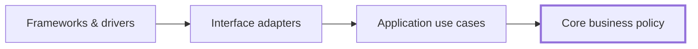
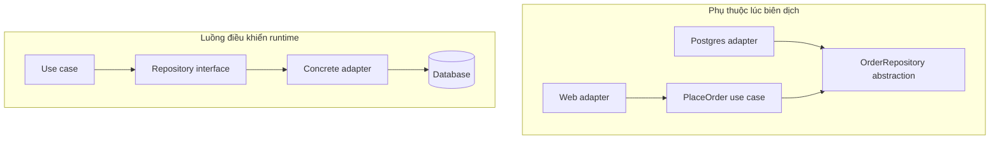
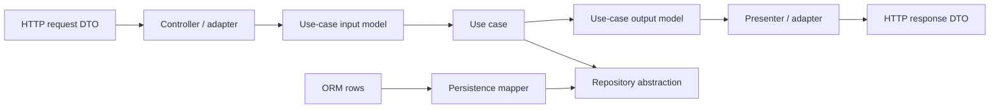
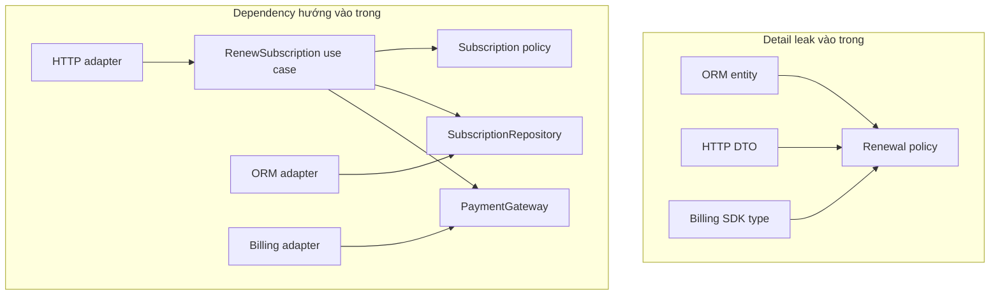

# Clean Architecture: Giữ logic nghiệp vụ độc lập với chi tiết triển khai

Tưởng tượng một nhóm phát triển tiếp nhận một hệ thống quản lý người dùng và đăng ký tài khoản (onboarding) cơ bản. Vì mong muốn tuân thủ "chuẩn mực kiến trúc tốt nhất", nhóm kỹ sư tiền nhiệm đã sùng bái thái quá (cargo-cult) sơ đồ 4 vòng tròn đồng tâm kinh điển của Clean Architecture. Mọi thao tác đọc ghi dữ liệu đơn giản nhất đều bị ép phải đi qua 24 lớp trung gian: `UserController`, `UserPresenter`, `CreateUserUseCaseInputPort`, `CreateUserUseCaseOutputPort`, `CreateUserInteractor`, `UserRepositoryInterface`, `PostgresUserRepository`, 5 loại DTO khác nhau cùng hàng tá mapper chuyển đổi qua lại. Khi sản phẩm cần bổ sung một trường dữ liệu đơn giản như `phone_number`, kỹ sư buộc phải sửa đổi tới 14 file rải rác ở 6 tầng thư mục. Dung lượng codebase phình to gấp 3 lần, tốc độ giao hàng (time-to-market) sụt giảm thảm hại, trong khi các bài kiểm thử chỉ toàn mock dữ liệu ảo mà không đem lại chút năng lực testability thực tế nào trước các lỗi runtime của cơ sở dữ liệu.

Sai lầm nghiêm trọng ở đây là nhầm lẫn giữa sự rườm rà hình thức với bản chất kiến trúc. Clean Architecture không phải là cuộc đua nhân bản interface hay chia thư mục máy móc; giá trị cốt lõi nhất của nó nằm ở **Quy tắc phụ thuộc (Dependency Rule)**: mã nguồn luôn luôn trỏ vào trong hướng về các quy tắc nghiệp vụ cốt lõi, giữ cho nghiệp vụ độc lập hoàn toàn với database, web framework, SDK bên thứ ba và giao diện người dùng.

> 💡 **Quy tắc bỏ túi:** Bảo vệ quy tắc nghiệp vụ ổn định khỏi chi tiết kỹ thuật dễ biến động; mọi phụ thuộc mã nguồn phải luôn hướng vào trong về phía domain, và chỉ vượt qua ranh giới bằng các abstraction do chính phía trong sở hữu.

## Tóm tắt nhanh

- **Quy tắc phụ thuộc (Dependency Rule) là bất biến:** Chiều phụ thuộc mã nguồn (source-code dependency) chỉ được phép trỏ **hướng vào trong** về phía policy cấp cao. Các tầng bên trong (`Entities` và `Use Cases`) tuyệt đối không bao giờ được import hay phụ thuộc trực tiếp vào các chi tiết cơ chế bên ngoài (`Interface Adapters`, `Frameworks and Drivers`).
- **Các vòng tròn thể hiện gradient độ ổn định:** Vòng ngoài cùng chứa chi tiết kỹ thuật và cơ chế vận hành dễ biến động (web framework, ORM, cơ sở dữ liệu, message broker); vòng trong cùng lưu giữ giá trị nghiệp vụ bền vững (`Entities` chứa quy tắc nghiệp vụ cốt lõi và `Use Cases` điều phối luồng xử lý ứng dụng).
- **Dữ liệu qua ranh giới (boundary data) không được rò rỉ:** Dữ liệu vượt qua các tầng chỉ dùng cấu trúc dữ liệu thuần túy (DTO, request model, response model). Tuyệt đối không tuồn HTTP request, con trỏ database hay entity ORM vào bên trong lõi nghiệp vụ.
- **Đảo ngược phụ thuộc và Composition Root:** Tầng ngoài hiện thực hóa (implement) các abstraction do tầng trong sở hữu thông qua **đảo ngược phụ thuộc (dependency inversion)**. Toàn bộ việc khởi tạo và lắp ghép các phụ thuộc cụ thể chỉ diễn ra tại một nơi duy nhất lúc khởi động: **composition root**.
- **Cạm bẫy chết người:** **Nghi thức kiến trúc thái quá khi không có biến động thực tế (Cargo-cult).** Ép buộc mọi thao tác CRUD tầm thường phải đi qua đầy đủ interface, interactor, presenter và mapper khi không có logic nghiệp vụ phức tạp hay sự thay đổi hạ tầng. Điều này làm code phình to gấp 3 lần, làm chậm thời gian giao hàng mà không đem lại giá trị kiểm thử hay bảo trì thực tế.

Mối quan hệ chi phối giữa các tầng được thể hiện như sau:

```text
phụ thuộc mã nguồn luôn hướng vào trong

Frameworks and Drivers (Công cụ & Chi tiết kỹ thuật)
        -> Interface Adapters (Bộ chuyển đổi giao diện)
        -> Use Cases (Quy tắc ứng dụng)
        -> Entities (Quy tắc nghiệp vụ cốt lõi)
```

Luồng điều khiển tại thời điểm chạy (runtime control) có thể đi ra ngoài khi use case gọi database, presenter, hàng đợi tin nhắn hay cổng thanh toán. Nhưng mã nguồn ở tầng policy bên trong chỉ phụ thuộc vào abstraction do chính nó sở hữu, còn chi tiết kỹ thuật bên ngoài sẽ implement abstraction đó.



Các vòng tròn trong sơ đồ kinh điển chỉ mang tính **minh họa cấu trúc (schematic)**. Clean Architecture không bắt buộc bạn phải tách đúng bốn project, tạo đúng bốn folder hay xây dựng một cây thừa kế class phức tạp kiểu enterprise. Giá trị kiến trúc nằm ở **Quy tắc phụ thuộc (Dependency Rule)**, chứ không nằm ở việc vẽ lại một hình tròn.

## 1. Dependency Rule là quy tắc chi phối thiết kế

<TermBox term="Dependency Rule">
**Quy tắc phụ thuộc (Dependency Rule)** quy định rằng chiều phụ thuộc mã nguồn chỉ được phép trỏ hướng vào trong, về phía các quy tắc nghiệp vụ tổng quát và có cấp độ trừu tượng cao hơn.

Mã nguồn ở tầng bên trong tuyệt đối không được gọi tên kiểu dữ liệu, hàm, định dạng dữ liệu, framework hay chi tiết triển khai thuộc về tầng bên ngoài.

**Vì sao quan trọng:** Việc thay đổi web framework, database, SDK, giao thức mạng hay cách thức hiển thị giao diện không được phép làm thay đổi logic nghiệp vụ cốt lõi, trừ khi chính yêu cầu kinh doanh thay đổi.
</TermBox>

Đây là quy tắc cốt tử về **phụ thuộc mã nguồn hoặc phụ thuộc lúc biên dịch (compile-time dependency)**.

Giả sử một use case cần lưu đơn hàng vào hệ thống.

Phụ thuộc trực tiếp lúc biên dịch (thiết kế sai):

```text
PlaceOrderUseCase -> PrismaOrderRepository
```

Chiều phụ thuộc chuẩn mực (thiết kế đúng):

```text
PlaceOrderUseCase -> Abstraction OrderRepository
PostgresOrderRepository -> Abstraction OrderRepository
```

Khi chạy thực tế (runtime), lời gọi hàm vẫn đến đúng cơ sở dữ liệu PostgreSQL:

```text
PlaceOrderUseCase
  -> Interface OrderRepository
  -> PostgresOrderRepository
  -> PostgreSQL
```

Vì vậy, chiều đi của luồng chạy runtime và chiều phụ thuộc mã nguồn lúc biên dịch là hai khái niệm hoàn toàn tách biệt.



## 2. Bên trong là policy; bên ngoài là cơ chế kỹ thuật

Clean Architecture sử dụng các vòng tròn đồng tâm nhằm thể hiện một gradient độ ổn định:

- Vùng bên ngoài chứa **cơ chế thực thi và chi tiết kỹ thuật**;
- Vùng bên trong chứa **chính sách (policy) và ý nghĩa nghiệp vụ**;
- Càng đi sâu vào trong, tính trừu tượng và độ bền vững của mã nguồn càng cao.

Bốn tầng phân loại điển hình:

1. **Entities**: quy tắc nghiệp vụ cốt lõi cấp doanh nghiệp (core business policy);
2. **Use Cases**: quy tắc ứng dụng chuyên biệt (application-specific policy);
3. **Interface Adapters**: bộ chuyển đổi giao diện và cầu nối dữ liệu;
4. **Frameworks and Drivers**: công cụ ngoại vi, cơ sở dữ liệu và framework giao tiếp.

Tên gọi các tầng giúp định hình tư duy, nhưng số lượng tầng không phải là điều bất di bất dịch.

Câu hỏi quan trọng nhất mà kiến trúc sư phải tự vấn là:

> Khi một chi tiết kỹ thuật thay đổi, tác động lan truyền sẽ đi sâu vào bên trong đến đâu?

Nếu việc nâng cấp phiên bản ORM buộc bạn phải sửa lại công thức tính chiết khấu đơn hàng, thì ranh giới kiến trúc của bạn đang quá yếu, bất kể cấu trúc thư mục trông có vẻ ngăn nắp đến mức nào.

## 3. “Entities” là quy tắc nghiệp vụ cấp cao, không phải bảng ORM

Một hiểu lầm tai hại kinh điển là đồng nhất khái niệm **Entities** trong Clean Architecture với các entity của database hay ORM.

Đó hoàn toàn không phải là ý đồ kiến trúc.

Trong mô hình Clean Architecture, tầng trong cùng chứa các quy tắc nghiệp vụ tổng quát, cao cấp và bền vững nhất của hệ thống. Trong một tập đoàn lớn, các quy tắc này có thể dùng chung giữa nhiều ứng dụng khác nhau. Trong một ứng dụng đơn lẻ, đây chính là các đối tượng nghiệp vụ và điều kiện bất biến lâu bền nhất.

Ví dụ về các điều kiện bất biến (invariants):

```text
Đơn hàng không thể thanh toán hai lần.
Số tiền hoàn lại không được vượt quá số tiền đã ghi nhận.
Gói đăng ký không thể tự động gia hạn sau khi yêu cầu hủy đã có hiệu lực.
Số lượng hàng giữ chỗ trong kho không được phép mang giá trị âm.
```

Annotation của ORM, dòng dữ liệu SQL, HTTP request hay schema JSON không bao giờ được phép làm nơi định nghĩa những quy tắc sống còn này.

Ranh giới bị phá vỡ:

```ts
class OrderPolicy {
  canCancel(order: Prisma.OrderGetPayload<...>): boolean
}
```

Cấu trúc biểu diễn của tầng lưu trữ (ORM) đã xâm nhập trực tiếp vào lõi nghiệp vụ.

Mô hình chuẩn phải là một entity thuần túy mang ý nghĩa nghiệp vụ độc lập:

```ts
class OrderPolicy {
  canCancel(order: OrderSnapshot): boolean
}
```

## 4. Use Cases chứa quy tắc điều phối của ứng dụng

<TermBox term="Use case">
**Use case** đóng gói các quy tắc nghiệp vụ chuyên biệt của ứng dụng và điều phối các bước cần thiết để hoàn thành một mục tiêu cụ thể của người dùng hoặc hệ thống.

Nó phối hợp các chính sách nghiệp vụ cốt lõi, dữ liệu đầu vào, dữ liệu đầu ra và các năng lực ngoại vi cần thiết mà không phụ thuộc trực tiếp vào chi tiết của web framework, database hay SDK bên ngoài.

**Vì sao quan trọng:** Quy trình vận hành của một ứng dụng có thể thay đổi linh hoạt mà không làm ô nhiễm các quy tắc nghiệp vụ nền tảng, trong khi các biến động công nghệ vẫn được cách ly ở phía ngoài.
</TermBox>

Ví dụ điển hình:

- Đặt hàng (Place Order);
- Hủy gói đăng ký (Cancel Subscription);
- Phê duyệt hoàn tiền (Approve Refund);
- Xuất bản bài viết (Publish Article);
- Đối soát thanh toán (Reconcile Payment);
- Xuất báo cáo tài chính tháng (Generate Monthly Statement).

Một use case sẽ điều phối:

```text
tải thông tin đơn hàng
  -> kiểm tra điều kiện hủy (cancellation policy)
  -> ghi nhận trạng thái hủy
  -> lưu đơn hàng cập nhật
  -> phát thông báo sự kiện
```

Nhưng use case hoàn toàn không cần biết đến:

```text
Express Request / Response
Prisma TransactionClient
Kiểu dữ liệu từ Stripe SDK
Cấu hình Kafka producer
Trạng thái component React
```

Tất cả những thứ đó chỉ là cơ chế kỹ thuật bao quanh use case.

## 5. Interface Adapters đảm nhiệm chuyển đổi biểu diễn dữ liệu

<TermBox term="Interface adapter">
**Bộ chuyển đổi giao diện (Interface adapter)** có nhiệm vụ dịch qua lại giữa biểu diễn thuận tiện cho cơ chế ngoại vi và biểu diễn thuận tiện cho use case hoặc quy tắc nghiệp vụ cốt lõi.

Controller, presenter, repository implementation, message consumer, ORM mapper và client tích hợp dịch vụ bên thứ ba đều thuộc về ranh giới này.

**Vì sao quan trọng:** Định dạng dữ liệu bên ngoài có thể thay đổi liên tục mà không bắt buộc tầng logic bên trong phải nói ngôn ngữ của framework, database hay nhà cung cấp dịch vụ.
</TermBox>

Một HTTP adapter sẽ chuyển đổi:

```text
HTTP JSON request
  -> PlaceOrderRequestModel
  -> PlaceOrder use case
```

Một presenter sẽ chuyển đổi:

```text
PlaceOrderResult
  -> HTTP response model
  -> JSON payload kèm HTTP status code
```

Một persistence adapter sẽ chuyển đổi:

```text
Order aggregate
  -> ORM persistence model
  -> Các dòng dữ liệu SQL
```



Mục tiêu ở đây không phải là máy móc tạo ra hàng chục DTO cho mọi hàm đơn giản. Hãy chỉ chuyển đổi dữ liệu khi các biểu diễn đó có **chủ thể sở hữu khác nhau hoặc có lý do thay đổi độc lập**.

## 6. Frameworks and Drivers là chi tiết kỹ thuật dưới góc nhìn của vùng lõi

Tầng ngoài cùng của kiến trúc thường tập hợp:

- Web frameworks (Express, Fastify, Next.js, Spring Boot);
- Database engines và cấu hình ORM (PostgreSQL, MongoDB, Prisma, Hibernate);
- Message brokers (Kafka, RabbitMQ, SQS);
- Thư viện UI (React, Vue, Flutter);
- SDK của các nhà cung cấp bên ngoài (Stripe, Twilio, AWS SDK);
- Bộ lập lịch cron và background worker;
- Driver phần cứng và client dịch vụ đám mây.

Gọi chúng là "chi tiết kỹ thuật" **không** có nghĩa chúng tầm thường hay thiếu quan trọng trong vận hành.

Ngược lại, ngữ nghĩa transaction của PostgreSQL cực kỳ quan trọng. Tính lũy quyền (idempotency) của cổng thanh toán cực kỳ quan trọng. Thứ tự tin nhắn trong Kafka cực kỳ quan trọng.

"Chi tiết" ở đây mang nghĩa: các quy tắc nghiệp vụ cốt lõi không được phép để các công nghệ này áp đặt cấu trúc mã nguồn lên mình.

Hệ thống vẫn đòi hỏi chuyên môn sâu về hạ tầng, năng lực giám sát production (observability), kiểm thử tích hợp, migration dữ liệu, chính sách retry và tài liệu vận hành chi tiết.

## 7. Đảo ngược phụ thuộc vượt qua ranh giới mà không làm đảo lộn luồng chạy

Giả sử sau khi thanh toán thành công, use case cần thông báo kết quả cho một presenter hiển thị giao diện.

Nếu tham chiếu mã nguồn trực tiếp:

```text
CheckoutUseCase -> HttpCheckoutPresenter
```

Mũi tên này trỏ ra ngoài và vi phạm trắng trợn Quy tắc phụ thuộc (Dependency Rule).

Giải pháp chuẩn mực: ranh giới use case sẽ tự sở hữu một abstraction đầu ra:

```text
CheckoutUseCase -> Abstraction CheckoutOutput
HttpCheckoutPresenter -> Abstraction CheckoutOutput
```

Tại thời điểm thực thi runtime, luồng gọi hàm vẫn diễn ra bình thường:

```text
CheckoutUseCase
  -> Gọi method của CheckoutOutput
  -> HttpCheckoutPresenter thực thi cụ thể
```

Đây chính là **đảo ngược phụ thuộc (dependency inversion)**: phụ thuộc mã nguồn trỏ hướng vào trong về phía abstraction do tầng nghiệp vụ sở hữu, dù luồng chạy runtime cuối cùng vẫn chạm tới implementation ở tầng ngoài cùng.

Nguyên lý này áp dụng nhất quán cho:

- Repository;
- Gateway thanh toán;
- Presenter giao diện;
- Message publisher;
- Đồng hồ hệ thống (System clock);
- Bộ lưu trữ file (Object store);
- API bên thứ ba.

## 8. Dependency Injection không đồng nghĩa với Clean Architecture

Dependency Injection (DI) là một kỹ thuật hữu ích giúp gắn kết implementation cụ thể với abstraction, nhưng bản thân nó không tạo nên kiến trúc sạch.

Đoạn code sau đây sử dụng DI hoàn hảo:

```ts
new OrderService(prisma, stripe, expressResponseFactory)
```

Thế nhưng `OrderService` vẫn trực tiếp phụ thuộc vào các khái niệm công nghệ hạ tầng.

Đoạn code sau đây mới thực sự tuân thủ Dependency Rule:

```ts
new PlaceOrderUseCase(orderRepository, paymentGateway, outputBoundary)
```

Ở đây, các hợp đồng interface hoàn toàn do tầng ứng dụng làm chủ và định nghĩa, còn các class hiện thực cụ thể được đẩy ra bên ngoài.

Một DI container vẫn có thể lắp ghép một kiến trúc tồi tệ. Constructor injection cũng có thể tạo ra một hệ thống thắt nút phụ thuộc. Vấn đề then chốt luôn là: **ai sở hữu abstraction và mã nguồn đang trỏ về hướng nào**.

## 9. Composition Root là nơi chấp nhận biết rõ các chi tiết cụ thể

Khi ứng dụng khởi động, bắt buộc phải có một nơi tập trung biết rõ các class cụ thể để kết nối hệ thống thành một đồ thị đối tượng hoàn chỉnh (object graph).

Ví dụ:

```ts
const orderRepository = new PostgresOrderRepository(prisma);
const paymentGateway = new StripePaymentGateway(stripe);
const presenter = new HttpCheckoutPresenter();

const placeOrder = new PlaceOrderUseCase({
  orderRepository,
  paymentGateway,
  presenter,
});
```

Vị trí khởi tạo tập trung đó chính là **composition root**.

Tầng rìa ngoài cùng này được phép biết chi tiết hạ tầng kỹ thuật vì nhiệm vụ duy nhất của nó là lắp ghép các khối linh kiện lại với nhau.

Điều tối kỵ là không bao giờ được để các use case bên trong tự ý gọi vào một service locator toàn cục hoặc tự import các class hạ tầng cụ thể.

## 10. Dữ liệu qua ranh giới không được lén kéo outer dependency vào trong

Bài viết kinh điển của Robert C. Martin nhấn mạnh việc chỉ sử dụng các cấu trúc dữ liệu đơn giản khi truyền qua ranh giới.

Quy tắc thực tế là:

> Mã nguồn bên trong không bao giờ bị buộc phải phụ thuộc vào cấu trúc dữ liệu bên ngoài chỉ vì cấu trúc đó tiện lợi.

Tuyệt đối tránh truyền những đối tượng sau vào bên trong lõi nghiệp vụ:

```text
Express Request / Response
ORM RowStructure
Framework ModelState
Vendor SDK Response object
Database cursor
HTTP status code enum
```

Thay vào đó, hãy chuyển đổi sang dạng **dữ liệu qua ranh giới (boundary data)** thuần túy phù hợp với ngôn ngữ nghiệp vụ:

```ts
type ApproveRefundInput = {
  paymentId: PaymentId;
  amount: Money;
  requestedBy: ActorId;
};
```

Tương tự, use case sẽ trả về một output model thuần túy để presenter tùy ý chuyển đổi thành định dạng HTTP JSON, CLI hay GraphQL.

Tuy nhiên, đừng biến điều này thành trò hề mapper (mapper theater). Nếu hai tầng cùng chia sẻ một value object ổn định và việc chia sẻ đó không làm đảo ngược chiều sở hữu phụ thuộc, thì việc nhân bản dữ liệu là không cần thiết.

## 11. Clean Architecture và Hexagonal Architecture chồng lấp mạnh

Hai phong cách kiến trúc này không phải là hai tôn giáo đối đầu nhau.

Cả hai đều cùng chung một sứ mệnh cao nhất: bảo vệ logic nghiệp vụ khỏi biến động công nghệ và đảo ngược phụ thuộc tại các ranh giới có ý nghĩa.

Sự khác biệt chủ yếu nằm ở góc nhìn và thuật ngữ:

```text
Hexagonal Architecture (Ports and Adapters)
  -> ports và adapters
  -> bên trong (inside) đối lập bên ngoài (outside)
  -> tương tác chủ động (driving) và bị động (driven)

Clean Architecture
  -> chính sách nghiệp vụ (policy) đối lập cơ chế kỹ thuật (detail)
  -> các mức độ trừu tượng đồng tâm
  -> Dependency Rule: chiều phụ thuộc mã nguồn luôn hướng vào trong
```

Một hệ thống hoàn toàn có thể kết hợp cả hai góc nhìn:

```text
HTTP adapter
  -> Cổng vào của use case (driving port)
  -> Application use case
  -> Entities (Quy tắc nghiệp vụ cốt lõi)
  -> Cổng ra repository / payment (driven port)
  -> Infrastructure adapters
```

Thuật ngữ trên sơ đồ không quan trọng bằng việc chiều sở hữu phụ thuộc có chuẩn xác hay không.

## 12. Clean Architecture không bắt buộc phải áp dụng DDD

Domain-Driven Design (DDD) bổ trợ rất tốt cho Clean Architecture, nhưng nó không phải là điều kiện tiên quyết.

Trong thực tế, bạn hoàn toàn có thể có:

- Một Clean Architecture tinh gọn không dùng aggregate hay bounded context phức tạp;
- Các khái niệm DDD nằm trong một kiến trúc phân tầng (layered architecture) truyền thống;
- Một modular monolith áp dụng đảo ngược phụ thuộc chuẩn mực theo phong cách Clean Architecture;
- Một microservice có chiều phụ thuộc cực kỳ hỗn loạn bên trong chính service đó.

Hãy thiết lập ranh giới vì chúng bảo vệ logic nghiệp vụ thật và cách ly sự biến động thật, chứ không phải vì muốn đánh dấu cho đủ checklist của một trường phái lý thuyết.

## 13. Chiến lược kiểm thử đi theo ranh giới phụ thuộc

Một cấu trúc phụ thuộc trong sạch sẽ tự nhiên mở ra các đường nối kiểm thử (test seams) vô cùng lợi hại:

```text
Kiểm thử quy tắc nghiệp vụ cốt lõi (Entities)
  -> Hàm thuần túy (pure) / siêu tốc / không cần hạ tầng

Kiểm thử Use Cases
  -> Dùng fake hoặc mock có kiểm soát cho các dependency đầu ra

Kiểm thử tích hợp cho Adapters
  -> Kết nối database thật / message broker / provider contract

Kiểm thử hệ thống (End-to-End)
  -> Xác thực một số luồng nghiệp vụ quan trọng đã lắp ghép hoàn chỉnh
```

Clean Architecture giúp viết unit test nhanh hơn, nhưng nó không bao giờ thay thế được kiểm thử tích hợp (integration test).

Một mock repository trong bộ nhớ không bao giờ chứng minh được:

- Ràng buộc khóa ngoại và unique index của cơ sở dữ liệu;
- Mức độ cô lập transaction (isolation level);
- Tính chính xác của câu lệnh SQL phức tạp;
- Xử lý timeout và retry của dịch vụ bên thứ ba;
- Ngữ nghĩa phân phối tin nhắn của message broker.

Hãy giữ cho các bài kiểm thử đơn vị của tầng policy chạy siêu tốc mà không cần môi trường ngoài, và kiểm thử chi tiết kỹ thuật ở đúng nơi mà ngữ nghĩa thực tế của chúng vận hành.

## 14. Tránh nghi thức kiến trúc rườm rà khi không có biến động thực tế

Một ứng dụng CRUD đơn giản sẽ phải chịu gánh nặng vô ích nếu bạn cố tình nhồi nhét:

```text
Controller
  -> InputBoundary
  -> Interactor
  -> OutputBoundary
  -> Presenter
  -> Gateway
  -> Mapper
```

cho mọi thao tác tầm thường.

Quy tắc phụ thuộc là vô giá, nhưng số lượng lớp trừu tượng phải tương xứng với chi phí chịu đựng sự thay đổi.

Chỉ nên dựng ranh giới kiên cố khi:

- Logic nghiệp vụ phức tạp, có giá trị cao và tồn tại lâu dài;
- Công nghệ hạ tầng có nguy cơ biến động hoặc cần thay thế;
- Hệ thống hỗ trợ nhiều kênh giao tiếp (Web API, CLI, Message Queue);
- Việc kiểm thử nghiệp vụ đang bị kìm hãm nặng nề bởi hạ tầng cồng kềnh;
- Kiểu dữ liệu của framework bên ngoài đang rò rỉ khắp nơi trong mã nguồn;
- Mỗi lần sửa đổi chi tiết kỹ thuật thường xuyên gây lỗi dây chuyền sang logic nghiệp vụ.

Kiến trúc phần mềm là một quyết định kinh tế, không phải là cuộc đua xem ai tạo được nhiều interface hơn.

## 15. Sự cố production: ORM biến thành mô hình nghiệp vụ

Một nền tảng SaaS quản lý gói đăng ký (subscription) tăng trưởng nhanh bắt đầu bằng các model ORM tự sinh để làm bản thử nghiệm (prototype). Với áp lực phải bàn giao tính năng thần tốc, nhóm kỹ sư đã truyền entity ORM `Subscription` đi khắp nơi trong hệ thống:

```text
HTTP controller
  -> Subscription ORM entity
  -> RenewalService
  -> BillingService
  -> NotificationService
  -> API response serializer
```

Sau mười tám tháng phát triển, entity này tích tụ hàng chục annotation cơ sở dữ liệu, quan hệ lazy loading, decorator validate request, Stripe customer ID và các cờ phục vụ giao diện (UI).

Khi một đợt tái thiết kế quy trình thanh toán yêu cầu chuyển trạng thái subscription từ enum đơn giản sang sổ cái lưu sự kiện (event-sourced ledger), thay đổi này tạo ra làn sóng sụp đổ dây chuyền. Việc đổi định nghĩa cột cơ sở dữ liệu làm hỏng toàn bộ quy tắc gia hạn, gây lỗi tuần tự hóa (serialization) trên các endpoint mobile app, phá vỡ logic kiểm toán thanh toán, và khiến hàng trăm bài kiểm thử đơn vị (unit test) thất bại vì không thể khởi tạo dữ liệu mẫu nếu thiếu container PostgreSQL đang chạy.

**Hậu quả:** Các đợt migration cơ sở dữ liệu kéo theo việc phải viết lại mã nguồn trên diện rộng. Kiểm thử đơn vị không thể chạy độc lập nếu thiếu fixture cơ sở dữ liệu nặng nề, tốc độ release suy giảm nghiêm trọng, và việc thay thế một nhà cung cấp thanh toán bên ngoài vô tình biến thành một đợt sửa đổi logic nghiệp vụ cốt lõi.

**Nguyên nhân cốt lõi:** Một biểu diễn lưu trữ bên ngoài (ORM entity) đã bị nhầm lẫn và biến thành hợp đồng nghiệp vụ dùng chung. Chiều phụ thuộc mã nguồn trỏ từ quy tắc nghiệp vụ ra chi tiết ORM, vi phạm trực tiếp Quy tắc phụ thuộc (Dependency Rule).

**Cách khắc phục chuẩn:** Di chuyển các quy tắc nghiệp vụ bất biến vào Entities trong cùng, biểu diễn các thao tác ứng dụng thành Use Cases, định nghĩa các abstraction cho repository và payment gateway do tầng ứng dụng làm chủ, chuyển đổi các dòng dữ liệu ORM và HTTP DTO tại Interface Adapters, giữ Frameworks and Drivers hoàn toàn ở ngoài rìa, và chỉ kết nối các chi tiết kỹ thuật cụ thể tại composition root.



## 16. Tự kiểm tra

### 1. Luồng điều khiển runtime đi từ use case đến database adapter có vi phạm Dependency Rule không?

Khi một use case gọi một phương thức repository và phương thức đó thực thi các câu lệnh SQL trong adapter PostgreSQL, luồng thực thi hướng ra ngoài đó có vi phạm Quy tắc phụ thuộc (Dependency Rule) không?

<details>
<summary>Xem giải thích chi tiết</summary>

Không nhất thiết. Quy tắc phụ thuộc chi phối **chiều phụ thuộc mã nguồn (source-code dependency) lúc biên dịch**, chứ không chi phối hướng đi của call stack tại thời điểm chạy (runtime). Use case phụ thuộc vào một abstraction (interface) do chính tầng nghiệp vụ sở hữu. Database adapter ở tầng bên ngoài implement abstraction đó. Ở runtime, luồng điều khiển đi từ use case ra adapter bên ngoài, nhưng lúc biên dịch, mã nguồn của adapter mới là phía phụ thuộc vào abstraction bên trong.
</details>

### 2. Clean Architecture có bắt buộc phải chia đúng 4 project hoặc 4 thư mục không?

Có phải mọi dự án đều bắt buộc phải tạo 4 module hoặc thư mục riêng biệt đặt tên là Entities, UseCases, Adapters và Frameworks không?

<details>
<summary>Xem giải thích chi tiết</summary>

Không. Bốn vòng tròn đồng tâm trong sơ đồ kinh điển của Uncle Bob chỉ là **sơ đồ mang tính minh họa (schematic)**. Tùy thuộc vào độ phức tạp của miền nghiệp vụ và quy mô hệ thống, bạn có thể tổ chức thành 3 lớp, 5 lớp hoặc chỉ cần phân tách các boundary rõ ràng trong một package duy nhất. Điều bắt buộc duy nhất là bảo toàn **Quy tắc phụ thuộc (Dependency Rule)**: mã nguồn luôn hướng vào trong về phía quy tắc nghiệp vụ cấp cao, bất kể số lượng vòng tròn trung gian là bao nhiêu.
</details>

### 3. Một class mang tên `CustomerEntity` trong database có phải là Entity của Clean Architecture không?

Nếu ORM hoặc thư viện cơ sở dữ liệu định nghĩa một bảng là `CustomerEntity`, class đó có tự động trở thành một phần của tầng Entity trong Clean Architecture không?

<details>
<summary>Xem giải thích chi tiết</summary>

Không. Đây là sự trùng lặp tên gọi gây hiểu lầm phổ biến nhất. Trong các ORM (như TypeORM, Hibernate hay Prisma), một "entity" chỉ là cấu trúc biểu diễn bảng dữ liệu (persistence model) gắn chặt với schema cơ sở dữ liệu. Trong Clean Architecture, **Entities** đại diện cho các quy tắc nghiệp vụ và điều kiện bất biến bền vững cấp doanh nghiệp, hoàn toàn độc lập với việc dữ liệu được lưu vào SQL hay NoSQL. Class ORM thuộc về tầng Interface Adapters hoặc Frameworks and Drivers ở phía ngoài, không thuộc về lõi domain.
</details>

## 17. Checklist production

- [ ] **Chiều phụ thuộc:** Chiều phụ thuộc mã nguồn (source-code dependency) luôn trỏ hướng vào trong về phía business policy ổn định thay vì trỏ ra framework hay hạ tầng.
- [ ] **Cách ly vùng lõi:** Quy tắc nghiệp vụ cốt lõi (Entities và Use Cases) tuyệt đối không import các package ORM, web framework, SDK bên thứ ba hay định dạng truyền tải mạng.
- [ ] **Tập trung vào use case:** Use Cases biểu diễn các luồng thao tác của ứng dụng hoàn toàn độc lập với phương thức giao tiếp (HTTP, CLI, hàng đợi) và cơ chế lưu trữ.
- [ ] **Sở hữu ranh giới:** Mọi khả năng ngoại vi giao tiếp qua ranh giới đều thông qua các abstraction do chính tầng bên trong định nghĩa ngữ nghĩa và sở hữu.
- [ ] **Interface adapters:** Bộ chuyển đổi giao diện đảm nhiệm dịch dữ liệu giữa các định dạng bên ngoài và cấu trúc nội bộ tại các ranh giới có lý do thay đổi khác nhau.
- [ ] **Kỷ luật dữ liệu qua ranh giới (boundary data):** Sử dụng các cấu trúc dữ liệu thuần túy (DTO, request model, response model) để truyền qua ranh giới, không tuồn entity ORM, con trỏ database hay request framework vào trong.
- [ ] **Kỷ luật lắp ghép:** Dependency Injection chỉ được xem là cơ chế đấu dây (wiring), không đồng nghĩa với việc kiến trúc đã tự động đảo ngược phụ thuộc chuẩn xác.
- [ ] **Composition root:** Toàn bộ việc khởi tạo hạ tầng kỹ thuật, adapter và use case được gom cụm lắp ghép tại một composition root tường minh duy nhất lúc khởi động.
- [ ] **Kiểm thử đơn vị tốc độ cao:** Quy tắc nghiệp vụ và use case có thể chạy qua bộ unit test siêu tốc trong bộ nhớ mà không cần khởi động database, web server hay giả lập bên thứ ba.
- [ ] **Kiểm thử tích hợp cho adapter:** Các truy vấn SQL thật, hợp đồng message broker và dịch vụ bên thứ ba được kiểm thử tích hợp chuyên biệt thay vì mock toàn bộ.
- [ ] **Tính kinh tế của kiến trúc:** Đội ngũ kỹ sư chứng minh được giá trị bảo vệ thay đổi thực tế của từng abstraction, loại bỏ nghi thức hình thức (cargo-cult) rườm rà đối với các tác vụ CRUD đơn giản.

## Agent rule

Khi đề xuất Clean Architecture, hãy nêu **policy cần bảo vệ**, **outer detail có khả năng thay đổi**, **boundary abstraction do phía trong sở hữu**, và **hướng source-code dependency**. Không đề xuất thêm vòng, DTO, repository hay interface nếu không có lợi ích cô lập thay đổi cụ thể.

## Nguồn tham khảo

- Robert C. Martin, [The Clean Architecture](https://blog.cleancoder.com/uncle-bob/2012/08/13/the-clean-architecture.html)
- Microsoft Learn, [Common web application architectures](https://learn.microsoft.com/en-us/dotnet/architecture/modern-web-apps-azure/common-web-application-architectures)
- Microsoft Learn, [Architectural principles](https://learn.microsoft.com/en-us/dotnet/architecture/modern-web-apps-azure/architectural-principles)
