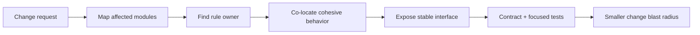
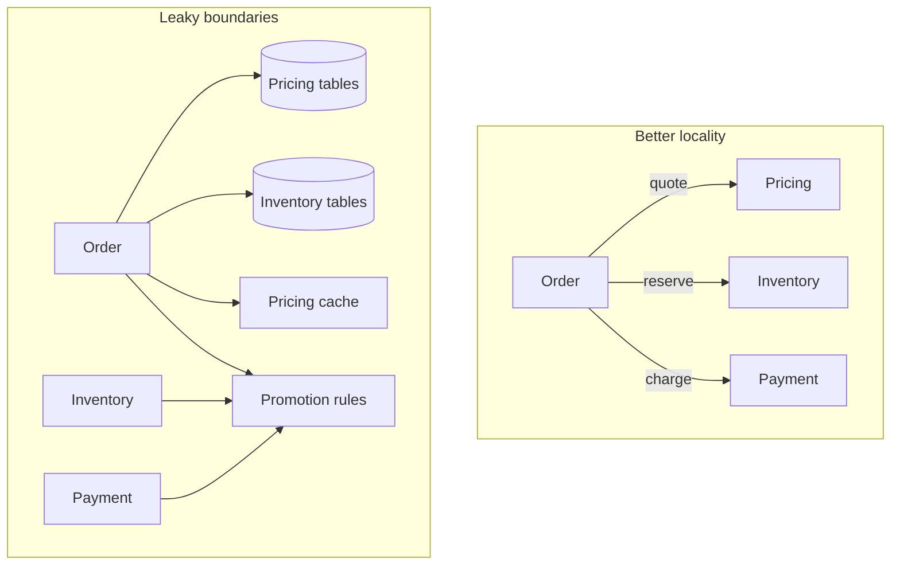

# Coupling & Cohesion: Keep Change Local

## TL;DR

Architecture becomes easier to change when two things are true at the same time:

- code that serves the **same reason to change** is close together;
- code that serves **different reasons to change** knows as little as practical about each other's internals.

Those are the operational goals behind **high cohesion** and **low unnecessary coupling**.

Use this mental model:

```text
change request
  -> identify business rule / invariant owner
  -> inspect which modules must change together
  -> move related behavior toward one owner
  -> expose the smallest stable contract
  -> remove leaked data / ordering / implementation knowledge
  -> verify fewer modules need coordinated edits
```



The target is not “zero dependencies.” Useful software has dependencies. The target is to make dependencies **intentional, visible, stable, and aligned with ownership**.

## 1. Coupling is knowledge that crosses a boundary

<TermBox term="Coupling">
**Coupling** is the degree to which one module depends on knowledge, behavior, data, timing, or change in another module.

A dependency can be explicit, such as calling an API, or hidden, such as two modules duplicating the same pricing rule and therefore needing synchronized edits.

**Why it matters:** coupling determines how far a change can propagate. Strong or hidden coupling increases the amount of software that must be understood, tested, coordinated, and released together.
</TermBox>

A dependency edge is not automatically bad.

This is reasonable coupling:

```text
Checkout -> Pricing.calculateQuote(cart)
```

Checkout needs a price. What matters is whether Checkout depends on the **public outcome** or on Pricing's internal tables, formulas, caches, and call sequence.

This is much more coupled:

```text
Checkout
  -> reads pricing_rule table directly
  -> knows discount precedence
  -> reproduces tax rounding
  -> clears Pricing cache after writes
  -> calls recalculate() before getFinalPrice()
```

The number of arrows is only part of the problem. The amount of **knowledge crossing the boundary** is the deeper issue.

## 2. Cohesion is how strongly a module belongs together

<TermBox term="Cohesion">
**Cohesion** describes how strongly the responsibilities inside a module contribute to one coherent purpose or reason to change.

A cohesive module owns behavior and data that naturally evolve together. A low-cohesion module collects unrelated responsibilities merely because they are convenient to place in one folder, service, class, or package.

**Why it matters:** high cohesion makes local reasoning possible. A developer can change one capability without understanding a grab bag of unrelated concerns.
</TermBox>

Compare:

```text
Pricing
  quote cart
  apply promotion policy
  round money consistently
  explain applied discounts
```

with:

```text
CommonUtils
  calculateDiscount
  sendEmail
  parseCsv
  checkInventory
  retryHttp
  formatAddress
```

The first group shares one business purpose. The second is grouped by “things that did not have a better home.”

A useful cohesion question is:

> If this business rule changes, are most of the necessary edits inside one owner?

If the answer is repeatedly “no,” your current boundaries are giving weak locality.

## 3. High cohesion and low coupling work together

You can improve one while making the other worse.

For example, putting every checkout-related file in one giant `checkout` package might improve physical locality, but if that package also owns inventory stock, tax policy, payment settlement, email templates, and shipping rules, it becomes a highly cohesive-looking folder with many unrelated reasons to change.

Likewise, extracting every function into a separate package can reduce file size while increasing coordination overhead and dependency edges.



Good boundaries concentrate one reason to change and expose only what neighbors need.

## 4. Measure coupling through change propagation

<TermBox term="Change coupling">
**Change coupling** is evidence that two pieces of software repeatedly need to change together.

Git history, pull-request diffs, incident fixes, and migration plans can reveal modules that co-change even when the source code does not show a direct import edge.

**Why it matters:** architecture is about change. Repeated co-change is a concrete signal that a boundary may hide shared knowledge, shared data, or an ownership mismatch.
</TermBox>

Take a real change request such as:

```text
“Introduce a first-purchase discount that cannot combine with partner coupons.”
```

List every place you expect to edit:

```text
Order service
Pricing module
Coupon worker
SQL migration
Shared constants package
Admin API
Checkout frontend
```

Then ask **why** each place changes.

If five modules all implement “discount precedence,” the system has duplicated business knowledge. If one module changes because its contract gains a new outcome, that may be legitimate coupling. If all modules must know the same internal enum or database column, the boundary is probably leaking.

Co-change is evidence, not proof that two modules must be merged.

## 5. Use a change map before refactoring

A practical change map takes 10–20 minutes and can prevent speculative architecture work.

Start with one concrete scenario:

| Module | Why would it change? | Knowledge it needs | Owner it depends on |
| --- | --- | --- | --- |
| Checkout | present quote | total + explanation | Pricing |
| Pricing | new precedence rule | pricing policy | Pricing |
| Inventory | none | reservation outcome | Inventory |
| Email | maybe text only | order summary | Notifications |

Then draw dependency edges and mark the suspicious ones:

```text
normal edge: needs an outcome
leaky edge: reads another module's table
semantic edge: duplicates another module's rule
temporal edge: must call B before C
release edge: incompatible unless two modules deploy together
```

This keeps the refactor attached to observable change cost rather than abstract purity.

## 6. Encapsulation reduces the amount of knowledge crossing the boundary

**Encapsulation** and **information hiding** mean a module protects the decisions that are likely to change internally.

Bad interface:

```text
getPromotionRules()
getTaxRateTable()
getRoundingMode()
```

The caller must assemble those pieces correctly. Internal policy leaks outward.

Stronger interface:

```text
quoteOrder({ customerId, lines, destination })
  -> { total, tax, discounts, explanation }
```

The second interface still couples Checkout to Pricing, but the dependency is on a stable business capability instead of on Pricing's implementation recipe.

A good public contract lets the owner change internal data structures without forcing every caller to change.

## 7. Shared tables create data and schema coupling

Two modules can have no import dependency and still be tightly coupled through a database.

Example:

```text
Pricing writes pricing_rules
Checkout reads pricing_rules directly
Admin edits pricing_rules
Reporting assumes undocumented columns
```

Now a Pricing schema migration is not local. It can break Checkout, Admin, and Reporting.

A safer modular-monolith boundary does **not** require a separate database per module. It can use logical ownership:

```text
Pricing owns pricing tables
other modules use Pricing's repository/module API
schema changes stay behind that boundary
```

Cross-module read models can still exist, but they should be explicit derived views or contracts, not accidental access to private tables.

Ask during review:

```text
Who may write this table?
Who may interpret these columns?
Who owns migrations?
Can another module bypass the invariant by writing directly?
```

If ownership is unclear, coupling is likely hidden in the schema.

## 8. Temporal coupling makes callers memorize order

**Temporal coupling** exists when operations must happen in a particular sequence for correctness.

Example:

```text
pricing.loadContext(orderId)
pricing.applyPromotions()
pricing.calculateTax()
pricing.finalize()
```

The caller has to know the owner's internal workflow. Missing or reordering one call can create invalid state.

When possible, prefer an intent-focused operation:

```text
pricing.quote(order)
```

If the workflow genuinely spans time—such as a payment authorization followed later by capture—make that state machine explicit in the contract. Temporal coupling cannot always be removed, but it should be named rather than hidden in call order folklore.

## 9. Cyclic dependencies destroy clear direction

Cycles such as:

```text
Orders -> Customers -> Promotions -> Orders
```

make local compilation, testing, ownership, and refactoring harder because no module sits “below” the others.


To break a cycle, identify the capability that each side actually needs.

Common moves include:

- move the shared business rule to its rightful owner;
- introduce a small contract at the boundary;
- invert a dependency so infrastructure depends on a domain-owned interface;
- publish a fact/event when asynchronous semantics are appropriate;
- duplicate a tiny stable representation rather than sharing a giant implementation package.

Do not create an interface only to make the diagram prettier. The interface should express a real stable capability.

## 10. Dependency direction should follow stability and ownership

A useful dependency rule is:

```text
volatile orchestration -> stable capability contract
implementation detail -> owner-defined abstraction
consumer -> public outcome, not private representation
```

For example, a payment adapter may depend on a domain-owned `PaymentGateway` port. The domain does not need to import a Stripe-specific SDK just because Stripe happens to be today's implementation.

But abstraction itself has a cost. If there is one stable implementation and no meaningful volatility boundary, adding three interfaces, factories, and service locators may increase indirection without reducing change propagation.

Use dependency inversion where it protects a real policy boundary.

## 11. Async messaging changes the form of coupling; it does not remove coupling

Replacing:

```text
Order -> synchronous Pricing API
```

with:

```text
Order publishes OrderCreated
Pricing consumes it
```

removes a direct request dependency, but new coupling appears:

```text
event schema
semantic meaning
ordering assumptions
retry/idempotency behavior
freshness expectations
failure handling
```

Event-driven architecture can reduce temporal availability coupling and enable independent processing, but consumers still depend on the event contract.

Do not say “services are decoupled” without naming **what kind of coupling decreased and what kind remains**.

## 12. Duplication can be coupling too

A common slogan says duplication is always safer than a dependency. That is incomplete.

Suppose Checkout and Billing both contain:

```text
if customer.country == 'VN' and invoice.total >= threshold:
  apply policy X
```

If this is the **same business policy**, two copies create knowledge coupling: whenever policy X changes, both copies must change together.

But two functions that happen to look similar today can represent different business rules. Extracting them into `shared-utils` can create accidental coupling between domains that should evolve independently.

Use this question:

```text
Do these copies have the same reason to change?
```

If yes, centralize the policy under one owner. If no, coincidental duplication may be healthier than a false abstraction.

## 13. Shared packages can become coupling multipliers

A `shared`, `common`, or `utils` package is not automatically wrong. The risk is that it becomes an ownership-free zone.

Good shared primitives tend to be stable and generic:

```text
Money value type
UTC clock interface
request ID parsing
safe retry primitive
```

Suspicious shared content contains domain policy:

```text
calculatePartnerDiscount
isOrderReadyToShip
canRefundInvoice
resolveInventoryPriority
```

Once many modules import such rules, a “small shared-package change” can become a synchronized release across the system.

Every shared abstraction should have an owner and a reason for being shared.

## 14. Interfaces should expose outcomes, not orchestration recipes

Compare two APIs.

Recipe-shaped:

```text
POST /pricing/load-rules
POST /pricing/apply-coupon
POST /pricing/apply-customer-tier
POST /pricing/calculate-tax
POST /pricing/finalize
```

Outcome-shaped:

```text
POST /quotes
{ customer, cart, destination, coupon }
```

The first makes the caller coordinate internal steps. The second keeps the business rule cohesive behind one capability boundary.

This does not mean every API should be coarse-grained. It means the contract should match a coherent business operation rather than leak a private algorithm.

## 15. Contract tests make internal change cheaper

If consumers depend only on a public contract, tests can verify that contract while allowing internals to evolve.

Useful layers are:

```text
owner unit tests
  prove internal business invariants

contract/interface tests
  prove input/output/error semantics visible to consumers

integration tests
  prove adapters and persistence honor the contract
```

Avoid consumer tests that reach into private tables or internal helper functions. Those tests create test coupling and make refactoring expensive even when public behavior stays correct.

The question is not “how many mocks do we have?” It is “which promises are consumers entitled to rely on?”

## 16. Change blast radius is an architecture metric

You can make coupling concrete with lightweight evidence:

```text
files/modules touched per feature
services requiring coordinated deployment
number of schemas/contracts changed
cross-team approvals per ordinary change
rollback coordination count
incident fixes requiring multi-module patches
```

These are not perfect metrics, but trends can reveal architecture friction.

A boundary is valuable when ordinary changes stay local more often—not when its diagram has the most boxes.

## 17. Operate: refactor one change path step by step

Use this procedure on a real feature or bug.

### Step 1: choose one concrete change

Prefer a change that recently caused coordination pain.

Example:

```text
“Partner coupons can no longer combine with first-purchase discounts.”
```

### Step 2: list everything that must change

Do not start by moving files. Record current blast radius:

```text
Order
Pricing
Coupon worker
shared constants
DB migration
admin endpoint
```

### Step 3: label each dependency edge

For each edge, write why it exists:

```text
API outcome
shared table
shared constant
call ordering
business-rule duplication
deployment/version compatibility
```

### Step 4: choose the business-rule owner

Ask which module should be able to answer the policy question without consulting its callers.

For discount precedence, that is usually Pricing—not Order, Email, or a generic shared package.

### Step 5: move cohesive behavior to the owner

Move rule evaluation, relevant state interpretation, and invariant checks together.

Do not simply move a helper while leaving every caller responsible for half the policy.

### Step 6: replace leaked internals with a contract

Expose the smallest business outcome consumers need.

```text
before:
  caller loads rule rows + applies precedence

after:
  Pricing.quote(input) -> priced result + explanation
```

### Step 7: remove bypass paths

Stop other modules from directly writing the owner's tables or importing private policy helpers.

### Step 8: break cycles deliberately

If moving ownership reveals a cycle, invert or narrow the dependency around a meaningful capability.

### Step 9: add tests at the owner and contract boundary

Prove the policy once under its owner and verify consumer-visible semantics.

### Step 10: replay the original change scenario

Ask:

```text
If the same rule changes again tomorrow, how many modules change now?
```

The refactor is useful if the answer is smaller and the remaining dependencies are easier to explain.

## 18. A practical dependency review template

For every module boundary, fill this in:

```text
Owner:
Public capability:
Data owned:
Business invariants owned:
Consumers:
What consumers may know:
What consumers must not know:
Sync dependencies:
Async contracts:
Shared schemas/packages:
Known ordering requirements:
Expected change triggers:
```

If “what consumers must not know” is hard to answer, the boundary may not be hiding meaningful decisions.

## 19. Production scenario: one discount change becomes a six-team release

An Order service reads Pricing's database tables directly to save an API call. A shared package contains coupon precedence and money-rounding helpers. A background Promotion worker imports the same package, while Checkout duplicates one branch of the discount rule for preview performance.

A new requirement says first-purchase discounts must no longer combine with partner coupons. The team changes the shared helper and Pricing schema, but Checkout's copied rule is missed. Order deploys before Pricing's migration reaches every environment. The worker still expects the old enum.

**Impact:** customers receive different totals between cart preview and checkout; a subset of orders fails during rollout; rollback requires coordinating several deployables because old and new schemas/contracts are not independently compatible.

**Root cause:** the pricing invariant had no single owner. Business knowledge leaked through shared code, duplicated rules, and direct table access, creating semantic, schema, and deployment coupling across boundaries.

**Correct pattern:** make Pricing own discount precedence and monetary rounding, expose an intent-focused quote contract, keep its storage private to the module, and let consumers depend on the priced outcome. Remove duplicated policy from Checkout and generic shared packages, add contract tests for quote semantics, and evolve the public contract compatibly when a coordinated migration is truly necessary.

## Self-check: if two modules always change together, should you merge them?

You inspect six months of pull requests and notice `Orders` and `Pricing` change together in most pricing-related features. Is the correct architecture action automatically “merge them into one module”?

<details>
<summary>Show the reasoning</summary>

No. Repeated co-change is evidence, not a verdict.

Investigate **why** they change together:

- If both implement parts of the same pricing invariant, the boundary may split one cohesive responsibility. Moving the rule under one owner could reduce coupling.
- If Orders legitimately needs a new Pricing outcome and the public contract must evolve, some co-change may be expected.
- If Orders reads Pricing tables or copies Pricing rules, the co-change likely comes from leaked internals and can often be reduced without merging the modules.
- If the two concepts have different long-term reasons to change, merging them may merely create a larger low-cohesion module.

Choose the boundary that localizes future changes around clear ownership, not the boundary that mechanically minimizes today's file count.
</details>

## Production checklist

- [ ] **Change map:** start with a real feature/incident and list which modules must change together.
- [ ] **Ownership:** assign each business rule and invariant to one clear owner.
- [ ] **Cohesion:** keep behavior and data that share a reason to change close together.
- [ ] **Public contract:** expose business outcomes, not private orchestration recipes.
- [ ] **Encapsulation:** prevent consumers from depending on internal tables, caches, helper functions, or storage representations.
- [ ] **Shared data:** identify shared tables/schemas and make write/interpretation ownership explicit.
- [ ] **Temporal coupling:** make ordering/state requirements explicit; collapse hidden call sequences when possible.
- [ ] **Cycles:** remove cyclic dependencies by moving ownership or introducing a meaningful narrow contract.
- [ ] **Async coupling:** document event schema, semantic meaning, ordering, retries, and freshness instead of calling messaging “decoupled.”
- [ ] **Duplication:** distinguish duplicated business knowledge from merely similar code.
- [ ] **Shared packages:** keep stable primitives separate from domain policy and assign ownership.
- [ ] **Contract tests:** test consumer-visible promises without reaching into owner internals.
- [ ] **Compatibility:** identify which contract/schema changes require coordinated rollout and design compatibility windows where practical.
- [ ] **Evidence:** track change blast radius and coordinated-release pain over time.
- [ ] **Recheck:** replay the original change scenario after refactoring and verify fewer boundaries need edits.

## Agent rule

When reviewing architecture, do not recommend “reduce coupling and increase cohesion” as a slogan. Name the concrete dependency: code, data/schema, temporal order, duplicated knowledge, event semantics, deployment compatibility, or cyclic direction. Identify the business-rule owner, propose the smallest stable contract, and explain how the change blast radius becomes smaller or more explicit.

## Sources

- [Martin Fowler — Reducing Coupling](https://martinfowler.com/ieeeSoftware/coupling.pdf)
- [Carnegie Mellon SEI — Modifiability Tactics](https://www.sei.cmu.edu/library/modifiability-tactics/)
- [Carnegie Mellon SEI — Open System Architectures](https://www.sei.cmu.edu/library/open-system-architectures/)
- [Carnegie Mellon SEI — Modularizing Your Software: The Good, the Bad, and the Ugly](https://www.sei.cmu.edu/blog/modularizing-your-software-the-good-the-bad-and-the-ugly/)
- [Microsoft Azure Architecture Center — Design for change](https://learn.microsoft.com/azure/well-architected/architect-role/design-change)

This lesson is classified as **evolving** with a 180-day review target because architectural practices, tooling, and organizational patterns evolve while the core goal—keeping change local through coherent ownership and intentional dependencies—remains durable.
