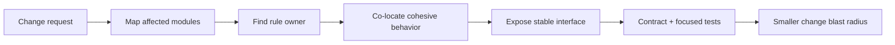
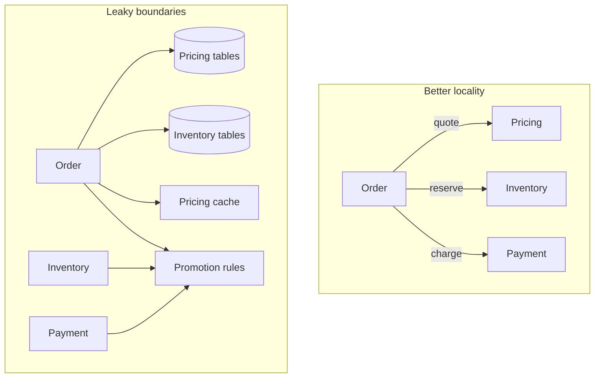
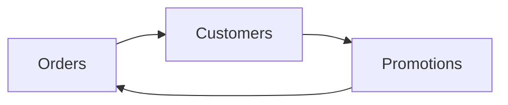

# Coupling & Cohesion: Giữ Thay đổi Cục bộ

## Tóm tắt

Architecture dễ thay đổi hơn khi hai điều cùng đúng:

- code phục vụ **cùng một lý do thay đổi** nằm gần nhau;
- code phục vụ **những lý do thay đổi khác nhau** biết ít nhất có thể về internals của nhau.

Đó là mục tiêu vận hành đằng sau **high cohesion** và **low unnecessary coupling**.

Mental model:

```text
change request
  -> xác định business rule / invariant owner
  -> xem module nào phải thay đổi cùng nhau
  -> đưa behavior liên quan về một owner
  -> expose contract ổn định nhỏ nhất
  -> loại leaked data / ordering / implementation knowledge
  -> kiểm tra ít module hơn cần coordinated edit
```



Mục tiêu không phải “zero dependency”. Phần mềm hữu ích luôn có dependency. Mục tiêu là làm dependency **có chủ đích, visible, stable và aligned với ownership**.

## 1. Coupling là knowledge đi qua một boundary

<TermBox term="Coupling">
**Coupling (mức liên kết phụ thuộc)** là mức độ một module phụ thuộc vào knowledge, behavior, data, timing hoặc thay đổi của module khác.

Dependency có thể explicit như gọi API, hoặc hidden như hai module duplicate cùng pricing rule nên buộc phải sửa đồng bộ.

**Vì sao quan trọng:** coupling quyết định change có thể propagate xa tới đâu. Strong/hidden coupling làm tăng lượng software phải hiểu, test, coordinate và release cùng nhau.
</TermBox>

Một dependency edge không tự động là xấu.

Coupling này hợp lý:

```text
Checkout -> Pricing.calculateQuote(cart)
```

Checkout cần một mức giá. Điều quan trọng là Checkout phụ thuộc vào **public outcome** hay vào internal table, formula, cache và call sequence của Pricing.

Coupling này nặng hơn nhiều:

```text
Checkout
  -> đọc pricing_rule table trực tiếp
  -> biết discount precedence
  -> tự lặp tax rounding
  -> clear Pricing cache sau write
  -> phải gọi recalculate() trước getFinalPrice()
```

Số lượng arrow chỉ là một phần. Lượng **knowledge đi qua boundary** mới là vấn đề sâu hơn.

## 2. Cohesion là mức độ một module thật sự thuộc về nhau

<TermBox term="Cohesion">
**Cohesion (tính gắn kết)** mô tả mức độ các responsibility bên trong một module cùng đóng góp cho một purpose hoặc reason-to-change nhất quán.

Module có cohesion tốt sở hữu behavior/data tự nhiên evolve cùng nhau. Module có cohesion thấp gom các responsibility không liên quan chỉ vì tiện để chung một folder, service, class hoặc package.

**Vì sao quan trọng:** high cohesion giúp local reasoning. Developer có thể đổi một capability mà không cần hiểu một tập concern lẫn lộn.
</TermBox>

So sánh:

```text
Pricing
  quote cart
  apply promotion policy
  round money consistently
  explain applied discounts
```

với:

```text
CommonUtils
  calculateDiscount
  sendEmail
  parseCsv
  checkInventory
  retryHttp
  formatAddress
```

Nhóm đầu chia sẻ một business purpose. Nhóm sau chỉ là “những thứ chưa có home tốt hơn”.

Câu hỏi cohesion hữu ích:

> Nếu business rule này đổi, phần lớn edit cần thiết có nằm trong một owner không?

Nếu câu trả lời thường xuyên là “không”, boundary hiện tại đang cho change locality yếu.

## 3. High cohesion và low coupling phải đi cùng nhau

Ta có thể cải thiện một mặt nhưng làm mặt kia tệ hơn.

Ví dụ, gom mọi file liên quan checkout vào một package khổng lồ có vẻ tăng locality vật lý. Nhưng nếu package đó đồng thời sở hữu inventory stock, tax policy, payment settlement, email template và shipping rule thì nó vẫn có quá nhiều reason-to-change.

Ngược lại, tách mọi function thành package riêng có thể giảm file size nhưng tăng coordination overhead và dependency edge.



Boundary tốt tập trung một reason-to-change và chỉ expose thứ neighbor cần.

## 4. Đo coupling qua change propagation

<TermBox term="Change coupling">
**Change coupling** là evidence cho thấy hai phần software thường xuyên phải thay đổi cùng nhau.

Git history, pull-request diff, incident fix và migration plan có thể lộ ra module co-change dù source code không có direct import edge.

**Vì sao quan trọng:** architecture xoay quanh change. Repeated co-change là signal cụ thể cho hidden shared knowledge, shared data hoặc ownership mismatch.
</TermBox>

Chọn một change request thật như:

```text
“Thêm first-purchase discount nhưng không được combine với partner coupon.”
```

Liệt kê mọi nơi dự kiến phải edit:

```text
Order service
Pricing module
Coupon worker
SQL migration
Shared constants package
Admin API
Checkout frontend
```

Sau đó hỏi **vì sao** từng nơi phải đổi.

Nếu năm module cùng implement “discount precedence”, system đang duplicate business knowledge. Nếu một module đổi vì public contract cần thêm outcome mới, đó có thể là coupling hợp lệ. Nếu tất cả module phải biết cùng internal enum/database column, boundary có thể đang leak.

Co-change là evidence, không phải proof rằng hai module luôn phải merge.

## 5. Dùng change map trước khi refactor

Một change map thực dụng mất khoảng 10–20 phút và giúp tránh speculative architecture work.

Bắt đầu từ một scenario cụ thể:

| Module | Vì sao đổi? | Knowledge cần | Owner phụ thuộc |
| --- | --- | --- | --- |
| Checkout | present quote | total + explanation | Pricing |
| Pricing | new precedence rule | pricing policy | Pricing |
| Inventory | không | reservation outcome | Inventory |
| Email | có thể chỉ text | order summary | Notifications |

Sau đó draw dependency edge và đánh dấu edge đáng ngờ:

```text
normal edge: cần một outcome
leaky edge: đọc table của module khác
semantic edge: duplicate rule của module khác
temporal edge: phải gọi B trước C
release edge: incompatible nếu không deploy cùng nhau
```

Cách này giữ refactor gắn với observable change cost thay vì abstract purity.

## 6. Encapsulation giảm lượng knowledge đi qua boundary

**Encapsulation (đóng gói)** và **information hiding (che giấu thông tin)** nghĩa là module bảo vệ các decision dễ thay đổi bên trong.

Interface yếu:

```text
getPromotionRules()
getTaxRateTable()
getRoundingMode()
```

Caller phải tự assemble các mảnh đúng cách. Internal policy leak ra ngoài.

Interface mạnh hơn:

```text
quoteOrder({ customerId, lines, destination })
  -> { total, tax, discounts, explanation }
```

Interface thứ hai vẫn coupling Checkout với Pricing, nhưng dependency nằm trên stable business capability thay vì recipe implementation của Pricing.

Public contract tốt cho phép owner đổi internal data structure mà không bắt mọi caller đổi theo.

## 7. Shared table tạo data và schema coupling

Hai module có thể không import nhau nhưng vẫn coupling chặt qua database.

Ví dụ:

```text
Pricing ghi pricing_rules
Checkout đọc pricing_rules trực tiếp
Admin sửa pricing_rules
Reporting assume undocumented columns
```

Giờ một Pricing schema migration không còn local. Nó có thể break Checkout, Admin và Reporting.

Boundary modular-monolith an toàn hơn **không bắt buộc** mỗi module có database riêng. Có thể dùng logical ownership:

```text
Pricing sở hữu pricing tables
module khác đi qua Pricing repository/module API
schema change ở sau boundary đó
```

Cross-module read model vẫn có thể tồn tại, nhưng nên là derived view/contract explicit, không phải accidental access tới private table.

Khi review hãy hỏi:

```text
Ai được write table này?
Ai được interpret các column?
Ai sở hữu migration?
Module khác có bypass invariant bằng direct write không?
```

Ownership không rõ thường đồng nghĩa coupling bị ẩn trong schema.

## 8. Temporal coupling bắt caller nhớ thứ tự

**Temporal coupling (phụ thuộc thời gian/thứ tự gọi)** tồn tại khi operation phải chạy theo một sequence cụ thể để correctness giữ được.

Ví dụ:

```text
pricing.loadContext(orderId)
pricing.applyPromotions()
pricing.calculateTax()
pricing.finalize()
```

Caller phải biết internal workflow của owner. Bỏ sót hoặc đổi thứ tự một call có thể tạo invalid state.

Khi phù hợp, ưu tiên intent-focused operation:

```text
pricing.quote(order)
```

Nếu workflow thật sự kéo dài theo thời gian—ví dụ payment authorization rồi capture sau—hãy làm state machine explicit trong contract. Temporal coupling không phải lúc nào cũng xóa được, nhưng nên được đặt tên thay vì ẩn trong call-order folklore.

## 9. Cyclic dependency phá dependency direction rõ ràng

Cycle kiểu:

```text
Orders -> Customers -> Promotions -> Orders
```

làm local compilation, testing, ownership và refactoring khó hơn vì không module nào thực sự nằm “bên dưới” các module khác.



Để phá vòng phụ thuộc, xác định capability mà mỗi bên thật sự cần.

Các move phổ biến:

- chuyển shared business rule về đúng owner;
- đưa vào một contract nhỏ ở boundary;
- invert dependency để infrastructure phụ thuộc domain-owned interface;
- publish fact/event khi asynchronous semantics phù hợp;
- duplicate một representation nhỏ/stable thay vì share giant implementation package.

Đừng tạo interface chỉ để diagram đẹp hơn. Interface phải diễn đạt một capability stable có thật.

## 10. Dependency direction nên đi theo stability và ownership

Rule hữu ích:

```text
volatile orchestration -> stable capability contract
implementation detail -> owner-defined abstraction
consumer -> public outcome, không phải private representation
```

Ví dụ, payment adapter có thể phụ thuộc domain-owned `PaymentGateway` port. Domain không cần import Stripe SDK chỉ vì Stripe đang là implementation hôm nay.

Nhưng abstraction cũng có cost. Nếu chỉ có một implementation ổn định và không có volatility boundary có ý nghĩa, thêm ba interface, factory và service locator có thể tăng indirection mà không giảm change propagation.

Dùng dependency inversion nơi nó bảo vệ một policy boundary thật.

## 11. Async messaging đổi loại coupling; nó không xóa coupling

Thay:

```text
Order -> synchronous Pricing API
```

bằng:

```text
Order publish OrderCreated
Pricing consume nó
```

loại direct request dependency, nhưng coupling mới xuất hiện:

```text
event schema
semantic meaning
ordering assumption
retry/idempotency behavior
freshness expectation
failure handling
```

Event-driven architecture có thể giảm temporal availability coupling và cho independent processing, nhưng consumer vẫn phụ thuộc event contract.

Đừng nói “service đã decoupled” nếu chưa nêu **loại coupling nào giảm và loại nào còn lại**.

## 12. Duplication cũng có thể là coupling

Slogan “duplicate luôn an toàn hơn dependency” là chưa đủ.

Giả sử Checkout và Billing đều chứa:

```text
if customer.country == 'VN' and invoice.total >= threshold:
  apply policy X
```

Nếu đây là **cùng business policy**, hai copy tạo knowledge coupling: mỗi lần policy X đổi, cả hai phải đổi cùng nhau.

Nhưng hai function trông giống nhau hôm nay có thể đại diện business rule khác nhau. Extract chúng vào `shared-utils` có thể tạo accidental coupling giữa domain vốn nên evolve độc lập.

Câu hỏi:

```text
Hai copy này có cùng reason-to-change không?
```

Nếu có, centralize policy dưới một owner. Nếu không, coincidental duplication có thể khỏe hơn false abstraction.

## 13. Shared package có thể trở thành coupling multiplier

Package `shared`, `common` hoặc `utils` không tự động sai. Risk là nó thành ownership-free zone.

Shared primitive tốt thường stable và generic:

```text
Money value type
UTC clock interface
request ID parsing
safe retry primitive
```

Shared content đáng ngờ chứa domain policy:

```text
calculatePartnerDiscount
isOrderReadyToShip
canRefundInvoice
resolveInventoryPriority
```

Khi nhiều module import những rule đó, “small shared-package change” có thể thành synchronized release toàn hệ thống.

Mọi shared abstraction nên có owner và reason rõ ràng để được share.

## 14. Interface nên expose outcome, không expose orchestration recipe

So sánh hai API.

Recipe-shaped:

```text
POST /pricing/load-rules
POST /pricing/apply-coupon
POST /pricing/apply-customer-tier
POST /pricing/calculate-tax
POST /pricing/finalize
```

Outcome-shaped:

```text
POST /quotes
{ customer, cart, destination, coupon }
```

API đầu bắt caller coordinate internal step. API sau giữ business rule cohesive sau một capability boundary.

Không có nghĩa mọi API phải coarse-grained. Contract nên match một coherent business operation thay vì leak private algorithm.

## 15. Contract test làm internal change rẻ hơn

Nếu consumer chỉ phụ thuộc public contract, test có thể verify contract đó trong khi internals được evolve.

Layer hữu ích:

```text
owner unit tests
  prove internal business invariants

contract/interface tests
  prove input/output/error semantics visible cho consumer

integration tests
  prove adapter và persistence honor contract
```

Tránh consumer test reach vào private table hoặc internal helper. Những test đó tạo test coupling và làm refactor đắt dù public behavior không đổi.

Câu hỏi không phải “có bao nhiêu mock?” mà là “consumer được phép rely vào promise nào?”.

## 16. Change blast radius là một architecture metric

Có thể làm coupling concrete bằng lightweight evidence:

```text
files/modules touched per feature
services cần coordinated deployment
number of schema/contract changed
cross-team approval per ordinary change
rollback coordination count
incident fix cần multi-module patch
```

Các metric này không hoàn hảo, nhưng trend có thể lộ architecture friction.

Boundary có giá trị khi ordinary change thường xuyên ở local hơn—không phải khi diagram có nhiều box nhất.

## 17. Thực hành: refactor một change path từng bước

Dùng procedure này trên một feature hoặc bug thật.

### Bước 1: chọn một change cụ thể

Ưu tiên change vừa gây coordination pain.

Ví dụ:

```text
“Partner coupon không còn được combine với first-purchase discount.”
```

### Bước 2: liệt kê mọi thứ phải đổi

Đừng bắt đầu bằng move file. Ghi current blast radius:

```text
Order
Pricing
Coupon worker
shared constants
DB migration
admin endpoint
```

### Bước 3: label từng dependency edge

Với mỗi edge, ghi vì sao nó tồn tại:

```text
API outcome
shared table
shared constant
call ordering
business-rule duplication
deployment/version compatibility
```

### Bước 4: chọn business-rule owner

Hỏi module nào nên trả lời policy question mà không phải consult caller.

Với discount precedence, thường là Pricing—not Order, Email hay generic shared package.

### Bước 5: đưa cohesive behavior về owner

Move rule evaluation, relevant state interpretation và invariant check cùng nhau.

Đừng chỉ move một helper trong khi caller vẫn phải chịu nửa policy còn lại.

### Bước 6: thay leaked internals bằng contract

Expose business outcome nhỏ nhất consumer cần.

```text
before:
  caller load rule rows + tự apply precedence

after:
  Pricing.quote(input) -> priced result + explanation
```

### Bước 7: xóa bypass path

Ngăn module khác direct-write table của owner hoặc import private policy helper.

### Bước 8: phá cycle có chủ đích

Nếu move ownership làm lộ cycle, invert hoặc narrow dependency quanh một capability meaningful.

### Bước 9: thêm test ở owner và contract boundary

Prove policy một lần dưới owner và verify consumer-visible semantics.

### Bước 10: replay original change scenario

Hỏi:

```text
Nếu cùng rule này đổi lại ngày mai, giờ bao nhiêu module phải đổi?
```

Refactor có giá trị nếu answer nhỏ hơn và dependency còn lại dễ giải thích hơn.

## 18. Template review dependency thực dụng

Với mỗi module boundary, điền:

```text
Owner:
Public capability:
Data owned:
Business invariants owned:
Consumers:
Consumer được phép biết gì:
Consumer không được biết gì:
Sync dependencies:
Async contracts:
Shared schemas/packages:
Known ordering requirements:
Expected change triggers:
```

Nếu khó trả lời “consumer không được biết gì”, boundary có thể chưa che giấu decision có ý nghĩa.

## 19. Tình huống production: một discount change thành release của sáu team

Order service đọc trực tiếp database table của Pricing để tiết kiệm một API call. Shared package chứa coupon precedence và money-rounding helper. Background Promotion worker import cùng package, trong khi Checkout duplicate một nhánh discount rule để preview nhanh hơn.

Requirement mới nói first-purchase discount không được combine với partner coupon. Team đổi shared helper và Pricing schema nhưng bỏ sót copied rule ở Checkout. Order deploy trước khi Pricing migration tới mọi environment. Worker vẫn expect old enum.

**Hậu quả:** customer thấy total khác nhau giữa cart preview và checkout; một phần order fail trong rollout; rollback đòi coordinate nhiều deployable vì old/new schema và contract không independently compatible.

**Nguyên nhân cốt lõi:** pricing invariant không có một owner duy nhất. Business knowledge leak qua shared code, duplicated rule và direct table access, tạo semantic, schema và deployment coupling qua nhiều boundary.

**Cách khắc phục chuẩn:** để Pricing sở hữu discount precedence và monetary rounding, expose intent-focused quote contract, giữ storage private cho module và để consumer phụ thuộc priced outcome. Xóa duplicated policy khỏi Checkout/generic shared package, thêm contract test cho quote semantics và evolve public contract compatible khi coordinated migration thực sự cần.

## Tự kiểm tra: nếu hai module luôn thay đổi cùng nhau thì có nên merge chúng không?

Bạn xem sáu tháng pull request và thấy `Orders` với `Pricing` thay đổi cùng nhau trong hầu hết feature liên quan pricing. Architecture action đúng có tự động là “merge chúng thành một module” không?

<details>
<summary>Xem giải thích chi tiết</summary>

Không. Repeated co-change là evidence, không phải verdict.

Hãy điều tra **vì sao** chúng thay đổi cùng nhau:

- Nếu cả hai implement các phần của cùng pricing invariant, boundary có thể đang split một cohesive responsibility. Move rule về một owner có thể giảm coupling.
- Nếu Orders hợp lệ cần một Pricing outcome mới và public contract phải evolve, một phần co-change có thể expected.
- Nếu Orders đọc Pricing table hoặc copy Pricing rule, co-change có thể đến từ leaked internals và thường giảm được mà không merge module.
- Nếu hai concept có long-term reason-to-change khác nhau, merge chúng chỉ có thể tạo một module lớn nhưng cohesion thấp.

Hãy chọn boundary localize future change quanh ownership rõ ràng, không phải boundary máy móc minimize file count hôm nay.
</details>

## Checklist production

- [ ] **Change map:** bắt đầu từ feature/incident thật và list module phải thay đổi cùng nhau.
- [ ] **Ownership:** assign mỗi business rule/invariant cho một owner rõ ràng.
- [ ] **Cohesion:** giữ behavior/data cùng reason-to-change gần nhau.
- [ ] **Public contract:** expose business outcome thay vì private orchestration recipe.
- [ ] **Encapsulation:** ngăn consumer phụ thuộc internal table, cache, helper hoặc storage representation.
- [ ] **Shared data:** tìm shared table/schema và làm write/interpretation ownership explicit.
- [ ] **Temporal coupling:** làm ordering/state requirement explicit; collapse hidden call sequence khi phù hợp.
- [ ] **Cycles:** loại cyclic dependency bằng cách move ownership hoặc đưa vào narrow contract có ý nghĩa.
- [ ] **Async coupling:** document event schema, semantic meaning, ordering, retry và freshness thay vì gọi messaging là “decoupled”.
- [ ] **Duplication:** phân biệt duplicated business knowledge với code chỉ tình cờ giống nhau.
- [ ] **Shared packages:** tách stable primitive khỏi domain policy và assign ownership.
- [ ] **Contract tests:** test consumer-visible promise mà không reach vào owner internals.
- [ ] **Compatibility:** xác định contract/schema change nào cần coordinated rollout và thiết kế compatibility window khi thực tế.
- [ ] **Evidence:** track change blast radius và coordinated-release pain theo thời gian.
- [ ] **Recheck:** replay original change scenario sau refactor và verify ít boundary cần edit hơn.

## Quy tắc cho agent

Khi review architecture, đừng recommend “giảm coupling và tăng cohesion” như slogan. Hãy nêu dependency cụ thể: code, data/schema, temporal order, duplicated knowledge, event semantics, deployment compatibility hoặc cyclic direction. Xác định business-rule owner, đề xuất stable contract nhỏ nhất và giải thích change blast radius giảm hoặc trở nên explicit thế nào.

## Nguồn tham khảo

- [Martin Fowler — Reducing Coupling](https://martinfowler.com/ieeeSoftware/coupling.pdf)
- [Carnegie Mellon SEI — Modifiability Tactics](https://www.sei.cmu.edu/library/modifiability-tactics/)
- [Carnegie Mellon SEI — Open System Architectures](https://www.sei.cmu.edu/library/open-system-architectures/)
- [Carnegie Mellon SEI — Modularizing Your Software: The Good, the Bad, and the Ugly](https://www.sei.cmu.edu/blog/modularizing-your-software-the-good-the-bad-and-the-ugly/)
- [Microsoft Azure Architecture Center — Design for change](https://learn.microsoft.com/azure/well-architected/architect-role/design-change)

Bài này được phân loại **evolving** với chu kỳ review 180 ngày vì architecture practice, tooling và organizational pattern tiếp tục evolve trong khi core goal—giữ change local bằng coherent ownership và intentional dependency—vẫn bền vững.
