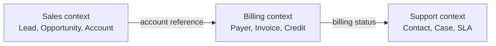
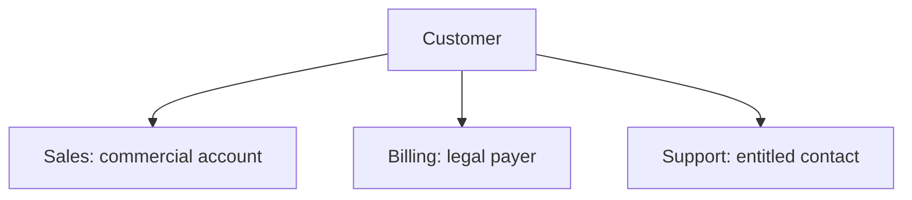
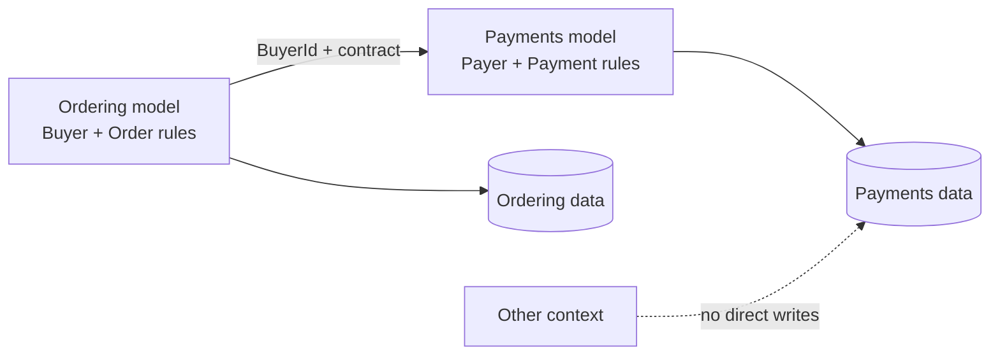
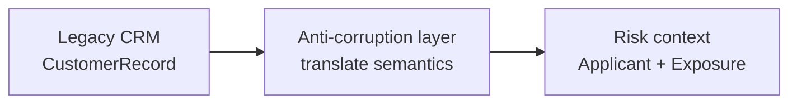

# Domain Boundaries: Keep Meaning and Change Local

## TL;DR

A **domain boundary** marks where one coherent business model, language, rules, and ownership apply. In Domain-Driven Design, that semantic boundary is a **bounded context**.

The same real-world person can legitimately be modeled as an Account, Payer, and Contact. Forcing every context into one global `Customer` model usually increases coupling rather than removing duplication.

<TermBox term="Bounded Context">
A **bounded context** is the boundary within which one domain model and its vocabulary are internally consistent. Outside that boundary, the same words or identities may have different models and meanings.
</TermBox>

A bounded context is primarily a **meaning and ownership boundary**. It is not automatically a process, repository, database, or microservice boundary. One context can live inside a modular monolith, and a large context can sometimes contain multiple deployable components.

## Start with language seams

A useful boundary often appears where domain experts stop using the same words in the same way.

In Sales, `Customer status` might mean prospect, active, or churn-risk. In Billing, `status` might mean current, delinquent, or suspended. In Support, it may not be a customer status at all; support cares about entitlement and SLA.

<TermBox term="Ubiquitous Language">
A **ubiquitous language** is the precise domain language shared by domain experts and developers inside a context. Code, conversations, examples, tests, and documentation should use the same terms and meanings.
</TermBox>

When the same term has different meaning across workflows, do not rush to create one canonical enum. Treat the disagreement as evidence that multiple models may exist.

Different model does not mean different identity. Contexts may share a stable external identifier while owning different attributes, rules, and lifecycle state.

## Discover boundaries from several signals

Do not split only from nouns on an org chart. Combine multiple signals.

### 1. Business capability

Group behavior around a coherent **business capability** or business responsibility: pricing an order, collecting payment, scheduling fulfillment, handling a support case.

A boundary is stronger when the group can explain what outcome it owns without depending on another context's internal rules.

### 2. Rules and invariants

Ask which rules must be true together. If several data changes must satisfy one invariant and usually commit in one local **transaction boundary**, that is evidence they belong near one model owner.

Do not stretch one transaction across every related concept just because the database can. Transactional consistency should protect real business invariants, not erase all boundaries.

### 3. Change coupling

Look at version history and planning data. Concepts that repeatedly **change together** may belong in one context. Concepts that only share a table name but evolve for different reasons may need separation.

Co-change is evidence, not proof. A migration project can temporarily make unrelated areas change together, while poor boundaries can also create artificial change coupling.

### 4. Team ownership

A boundary needs an accountable owner. If three teams can independently redefine the same rule or write the same tables, the semantic boundary is not enforceable.

Team ownership should follow the capability closely enough that the team can evolve its model, contracts, and operational behavior without constant cross-team permission.

## Assign model, rule, and data ownership

For each candidate context, write an ownership statement:

> Billing owns invoice state, payment terms, credit decisions, and mutations of billing records. Other contexts consume billing contracts; they do not write Billing's private tables.

That statement should identify **model ownership**, **rule ownership**, and **data ownership**.

Physical infrastructure can still be shared. Two contexts can use the same database server or repository while keeping logical ownership and access rules explicit.

## Draw a context map before drawing services

A **context map** records bounded contexts and the relationships between them: who is upstream, who depends on whom, where translation happens, and which integration contract crosses the boundary.

<TermBox term="Context Map">
A **context map** is the explicit map of bounded contexts and their integration relationships. It makes semantic dependencies visible before they become hidden code, schema, or release coupling.
</TermBox>

For each relationship, write down:

- authoritative owner of the information,
- contract exposed across the boundary,
- direction of dependency,
- freshness and consistency expectations,
- failure and compatibility behavior,
- who translates when the two models disagree.

The contract should expose what the downstream context needs, not leak the upstream context's entire internal entity graph.

## Translate models instead of sharing them accidentally

When contexts use different semantics, translate at the boundary.

An **anti-corruption layer** is a translation layer that converts another context's API, event, or legacy model into concepts that fit the receiving context. It protects local language and rules from being distorted by an external model.

The anti-corruption layer should translate protocol and meaning. Do not let it become a second business domain full of unrelated orchestration.

## Treat a shared kernel as an explicit coupling contract

A **shared kernel** is a deliberately shared, small part of a model used by multiple contexts. Examples might include a jointly governed money type, country-code vocabulary, or identity primitive.

A shared kernel is not a common folder for convenience. Every shared type creates coordinated change. Keep the surface small, name joint owners, require compatibility review, and remove items that no longer have truly shared meaning.

If contexts disagree about lifecycle, validation, or semantics, duplicate and translate rather than forcing the concept into the shared kernel.

## Enforce the boundary in code and data access

A diagram is not an architecture guardrail. Turn the context map into executable constraints where practical:

1. expose a small public package, module facade, API, or event contract;
2. keep context internals private from deep imports;
3. prevent cross-context writes to private tables or repositories;
4. add architecture tests or import rules for forbidden dependencies;
5. test integration contracts independently from internal models;
6. make ownership visible in code review and incident routing.

In a modular monolith, this may be package exports plus architecture tests. In microservices, deployment and network boundaries add enforcement, but shared databases and shared libraries can still bypass the intended domain boundary.

## Use a practical boundary-discovery workflow

When a system feels tangled, use this sequence:

1. **Map business workflows.** Write the decisions and outcomes, not just CRUD screens.
2. **Collect domain language.** Mark terms that change meaning between workflows or experts.
3. **Cluster rules and invariants.** Keep behavior that must remain consistent close to one owner.
4. **Inspect co-change.** Use commits, incidents, and roadmap work to see what changes together.
5. **Assign ownership.** Name the team and context authoritative for each rule and mutation.
6. **Draw candidate bounded contexts.** Prefer coherent models over equal-sized boxes.
7. **Create the context map.** Define upstream/downstream relationships and integration contracts.
8. **Choose translation or a tiny shared kernel.** Do not share a model by default.
9. **Add enforcement.** Block deep imports and cross-context writes.
10. **Measure and revisit.** Boundaries evolve as domain understanding and operating evidence improve.

A boundary is working when most changes stay local, language inside the context is coherent, ownership is obvious, and ordinary workflows do not require reaching into several private models.

## Production scenario

A commerce company creates one global `Customer` table and one shared `Customer` class for Sales, Billing, and Support. All three teams add fields and statuses to it, import the same model package, and write the same rows directly.

Sales adds `leadScore`, Billing adds `creditHold`, and Support changes `status` to reflect entitlement. A later rename and validation change require coordinated releases across all three applications. Nobody can say which team owns the meaning of `status`.

**Impact:** small domain changes trigger multi-team release coordination, validation rules conflict, schema migrations become risky, unrelated incidents share the same blast radius, and every team is afraid to simplify the model.

**Root cause:** the organization treated shared identity as proof of one shared domain model. Language seams, rule ownership, transaction invariants, and team ownership were ignored, so a global schema became the integration contract.

**Correct pattern:** define separate Sales, Billing, and Support bounded contexts; keep context-specific models and rules local; assign one authoritative owner for each mutation; share stable identity only where meaning is truly common; publish narrow integration contracts; translate semantic differences with an anti-corruption layer; and record the dependencies in a context map.

Self-check: should every bounded context become a microservice?

No. A bounded context defines where a domain model and language apply. A microservice adds an independently deployable runtime boundary. A modular monolith can contain several bounded contexts, and one bounded context can sometimes need more than one physical component. Choose deployment boundaries from operational needs after the semantic boundary is clear.

## Production checklist

- [ ] Each context has a coherent business capability or responsibility.
- [ ] The ubiquitous language is consistent inside the context and allowed to differ outside it.
- [ ] Model ownership, rule ownership, and data ownership are explicit.
- [ ] Transaction boundaries protect real invariants instead of spanning the whole system.
- [ ] Co-change and incident evidence support the proposed boundary.
- [ ] One team is accountable for each context's model and mutations.
- [ ] A context map records integration direction and contracts.
- [ ] Different semantics are translated instead of hidden in a shared global model.
- [ ] Shared kernels are tiny, jointly governed, and intentionally coupled.
- [ ] Cross-context deep imports and private-table writes are blocked.
- [ ] Contract compatibility and failure behavior are tested at boundaries.
- [ ] Boundary quality is revisited as language, workflows, and ownership evolve.

## Agent rule

Before moving code or splitting services, identify where business language, invariants, ownership, and change reasons are coherent; define that bounded context, map its integrations, then enforce the boundary without forcing neighboring contexts into one global model.

## Sources

- Microsoft Learn — [Identify domain-model boundaries for each microservice](https://learn.microsoft.com/en-us/dotnet/architecture/microservices/architect-microservice-container-applications/identify-microservice-domain-model-boundaries)
- Azure Architecture Center — [Use domain analysis to model microservices](https://learn.microsoft.com/en-us/azure/architecture/microservices/model/domain-analysis)
- Azure Architecture Center — [Anti-Corruption Layer pattern](https://learn.microsoft.com/en-us/azure/architecture/patterns/anti-corruption-layer)
- Martin Fowler — [Bounded Context](https://martinfowler.com/bliki/BoundedContext.html)
- Martin Fowler — [Ubiquitous Language](https://martinfowler.com/bliki/UbiquitousLanguage.html)
