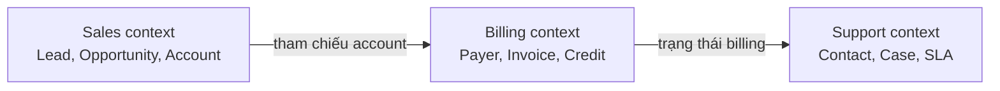
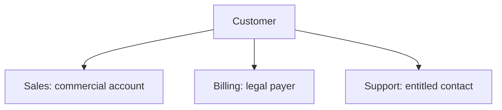
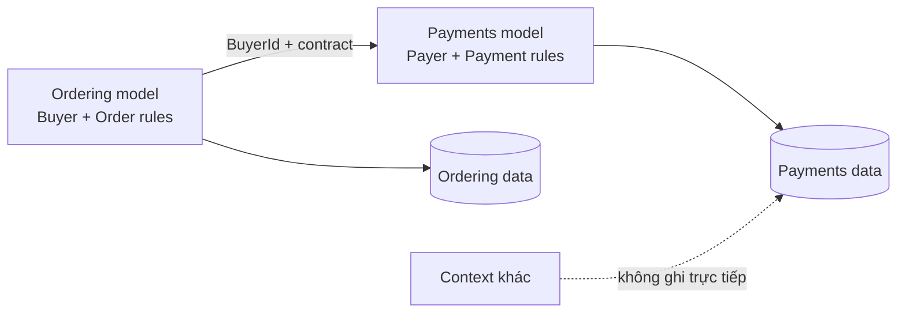
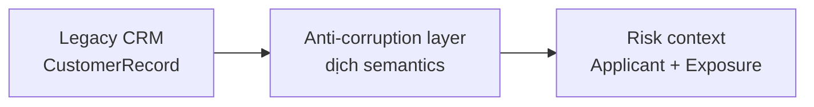

# Domain Boundaries: Giữ ý nghĩa và thay đổi cục bộ

## Tóm tắt nhanh

Một **ranh giới domain** đánh dấu nơi một mô hình nghiệp vụ, ngôn ngữ, quy tắc và ownership nhất quán có hiệu lực. Trong Domain-Driven Design, ranh giới semantics đó là một **bounded context**.

Cùng một con người ngoài đời có thể hợp lệ khi được mô hình thành Account, Payer và Contact. Ép mọi context vào một mô hình `Customer` toàn cục thường làm coupling tăng chứ không thật sự loại bỏ duplication.

<TermBox term="Bounded Context">
Một **bounded context** là ranh giới mà bên trong đó một domain model và vocabulary có nghĩa nhất quán. Bên ngoài ranh giới, cùng identity hoặc cùng thuật ngữ có thể mang mô hình và ý nghĩa khác.
</TermBox>

Bounded context trước hết là **ranh giới ý nghĩa và ownership**. Nó không tự động là process, repository, database hay microservice boundary. Một context có thể nằm trong modular monolith, và một context lớn đôi khi có thể gồm nhiều component deploy riêng.

## Bắt đầu từ language seam

Một ranh giới hữu ích thường xuất hiện nơi domain expert không còn dùng cùng từ theo cùng nghĩa.

Trong Sales, `Customer status` có thể là prospect, active hoặc churn-risk. Trong Billing, `status` có thể là current, delinquent hoặc suspended. Trong Support, vấn đề lại là entitlement và SLA chứ không phải cùng khái niệm status.

<TermBox term="Ubiquitous Language">
**Ubiquitous language** là ngôn ngữ domain chính xác mà domain expert và developer cùng dùng bên trong một context. Code, hội thoại, ví dụ, test và tài liệu nên dùng cùng thuật ngữ và cùng meaning.
</TermBox>

Khi **cùng thuật ngữ nhưng khác nghĩa** giữa các workflow, đừng vội tạo một enum chuẩn cho toàn hệ thống. Hãy xem bất đồng đó là evidence rằng có nhiều mô hình khác nhau.

Mô hình khác nhau không có nghĩa identity khác nhau. Các context có thể chia sẻ một external ID ổn định nhưng vẫn sở hữu attribute, rule và lifecycle state riêng.

## Khám phá ranh giới từ nhiều tín hiệu

Đừng chia chỉ dựa trên noun trong sơ đồ tổ chức. Hãy ghép nhiều signal.

### 1. Năng lực nghiệp vụ

Nhóm behavior quanh một **năng lực nghiệp vụ** hoặc trách nhiệm nghiệp vụ gắn kết: pricing order, thu payment, lên lịch fulfillment, xử lý support case.

Ranh giới mạnh hơn khi nhóm đó có thể nói rõ outcome mình sở hữu mà không cần biết internal rule của context khác.

### 2. Quy tắc và bất biến

Hỏi quy tắc nào phải đúng cùng nhau. Nếu nhiều thay đổi dữ liệu phải giữ một **bất biến** và thường commit trong cùng **ranh giới giao dịch**, đó là evidence chúng nên ở gần cùng một owner mô hình.

Đừng kéo một transaction phủ mọi concept liên quan chỉ vì database cho phép. Transactional consistency nên bảo vệ business invariant thật, không dùng để xóa mọi boundary.

### 3. Change coupling

Nhìn version history và planning data. Các concept thường xuyên **thay đổi cùng nhau** có thể thuộc cùng context. Các concept chỉ dùng chung table name nhưng thay đổi vì lý do khác nhau có thể cần tách.

Co-change là evidence, không phải proof. Một migration có thể tạm thời làm vùng không liên quan đổi cùng lúc; boundary kém cũng có thể tạo change coupling giả.

### 4. Team ownership

Một ranh giới cần owner chịu trách nhiệm rõ. Nếu ba team đều có thể tự đổi cùng rule hoặc ghi cùng table, semantic boundary đó chưa enforce được.

**Ranh giới đội** nên bám đủ gần capability để team có thể phát triển model, contract và behavior vận hành mà không liên tục xin phép team khác.

## Gán ownership cho mô hình, quy tắc và dữ liệu

Với mỗi candidate context, viết một ownership statement:

> Billing sở hữu invoice state, payment terms, credit decision và mọi mutation của billing record. Context khác consume contract của Billing; không ghi trực tiếp private table của Billing.

Statement đó nên chỉ rõ **sở hữu mô hình**, **sở hữu quy tắc** và **sở hữu dữ liệu**.

Hạ tầng vật lý vẫn có thể dùng chung. Hai context có thể dùng cùng database server hoặc repository nhưng ownership logic và access rule phải rõ.

## Vẽ context map trước khi vẽ service

Một **bản đồ ngữ cảnh (context map)** ghi các bounded context và quan hệ giữa chúng: ai upstream, ai phụ thuộc ai, chỗ nào dịch semantics, và **hợp đồng tích hợp** nào đi qua boundary.

<TermBox term="Context Map">
**Context map** là bản đồ tường minh của bounded context và quan hệ tích hợp giữa chúng. Nó làm semantic dependency lộ ra trước khi trở thành hidden code, schema hoặc release coupling.
</TermBox>

Với mỗi relation, ghi rõ:

- authoritative owner của thông tin,
- contract được expose qua boundary,
- hướng dependency,
- kỳ vọng freshness và consistency,
- failure và compatibility behavior,
- ai chịu trách nhiệm dịch khi hai model bất đồng.

Contract nên expose đúng thứ downstream cần, không leak toàn bộ entity graph nội bộ của upstream.

## Dịch model thay vì vô tình share model

Khi context dùng semantics khác nhau, hãy dịch tại boundary.

**Anti-corruption layer**, hay **lớp dịch chống tha hóa**, chuyển API, event hoặc legacy model của context khác thành concept phù hợp với context nhận. Nó bảo vệ language và rule cục bộ khỏi bị model bên ngoài làm méo.

Anti-corruption layer nên dịch protocol và meaning. Đừng để nó biến thành một business domain thứ hai chứa orchestration không liên quan.

## Xem shared kernel là coupling contract có chủ đích

Một **shared kernel**, hay **nhân dùng chung**, là phần nhỏ của model được nhiều context cố ý chia sẻ. Ví dụ có thể là money type được đồng quản trị, country-code vocabulary hoặc identity primitive.

Shared kernel không phải common folder cho tiện. Mỗi shared type tạo coordinated change. Giữ surface nhỏ, nêu rõ joint owner, yêu cầu compatibility review và loại bỏ item không còn shared meaning thật sự.

Nếu context bất đồng về lifecycle, validation hoặc semantics, nên duplicate rồi translate thay vì ép concept vào shared kernel.

## Enforce boundary trong code và data access

Diagram không phải architecture guardrail. Chuyển context map thành constraint có thể kiểm tra khi phù hợp:

1. expose public package, module facade, API hoặc event contract nhỏ;
2. giữ context internals private, không cho deep import;
3. chặn cross-context write vào private table hoặc repository;
4. thêm architecture test hoặc import rule cho dependency cấm;
5. test integration contract độc lập với internal model;
6. làm ownership hiện rõ trong code review và incident routing.

Trong modular monolith, cách này có thể là package export cộng architecture test. Trong microservices, deployment/network boundary thêm enforcement, nhưng shared database và shared library vẫn có thể bypass domain boundary dự kiến.

## Workflow thực hành để khám phá boundary

Khi hệ thống bị rối, dùng chuỗi sau:

1. **Map business workflow.** Ghi decision và outcome, không chỉ CRUD screen.
2. **Thu domain language.** Đánh dấu term đổi nghĩa giữa workflow hoặc expert.
3. **Cluster rule và invariant.** Giữ behavior phải nhất quán gần một owner.
4. **Inspect co-change.** Dùng commit, incident và roadmap để xem gì thay đổi cùng nhau.
5. **Assign ownership.** Nêu team và context authoritative cho từng rule và mutation.
6. **Vẽ candidate bounded context.** Ưu tiên model gắn kết hơn box có kích thước đều nhau.
7. **Tạo context map.** Định nghĩa upstream/downstream và integration contract.
8. **Chọn translation hoặc shared kernel thật nhỏ.** Không share model mặc định.
9. **Thêm enforcement.** Chặn deep import và cross-context write.
10. **Đo và xem lại.** Ranh giới phải tiến hóa khi hiểu domain và evidence vận hành thay đổi.

Một boundary đang hoạt động tốt khi phần lớn change ở lại cục bộ, language trong context nhất quán, ownership rõ và workflow bình thường không phải chọc vào nhiều private model.

## Tình huống production

Một công ty commerce tạo một table `Customer` toàn cục và một class `Customer` dùng chung cho Sales, Billing và Support. Cả ba team thêm field và status vào đó, import cùng model package và ghi trực tiếp cùng row.

Sales thêm `leadScore`, Billing thêm `creditHold`, còn Support đổi `status` để biểu diễn entitlement. Sau đó một lần rename và đổi validation buộc ba application phải release phối hợp. Không ai nói rõ team nào sở hữu meaning của `status`.

**Hậu quả:** thay đổi domain nhỏ kéo theo release coordination nhiều team, validation rule xung đột, schema migration rủi ro, incident không liên quan chia sẻ cùng blast radius và mọi team đều ngại đơn giản hóa model.

**Nguyên nhân cốt lõi:** tổ chức xem shared identity là bằng chứng của một shared domain model. Language seam, rule ownership, transaction invariant và team ownership bị bỏ qua, khiến global schema trở thành integration contract.

**Cách khắc phục chuẩn:** định nghĩa bounded context riêng cho Sales, Billing và Support; giữ model và rule riêng trong từng context; gán một authoritative owner cho mỗi mutation; chỉ share stable identity khi meaning thật sự chung; expose integration contract hẹp; dịch semantic difference bằng anti-corruption layer; và ghi dependency vào context map.

Tự kiểm tra: có nên biến mọi bounded context thành microservice?

Không. Bounded context xác định nơi domain model và language có hiệu lực. Microservice thêm runtime boundary có thể deploy độc lập. Modular monolith có thể chứa nhiều bounded context, và một bounded context đôi khi cần nhiều physical component. Chỉ chọn deployment boundary theo nhu cầu vận hành sau khi semantic boundary đã rõ.

## Checklist production

- [ ] Mỗi context có một năng lực nghiệp vụ hoặc trách nhiệm nghiệp vụ gắn kết.
- [ ] Ubiquitous language nhất quán trong context và được phép khác ở context khác.
- [ ] Sở hữu mô hình, sở hữu quy tắc và sở hữu dữ liệu đều rõ.
- [ ] Ranh giới giao dịch bảo vệ invariant thật thay vì phủ cả hệ thống.
- [ ] Co-change và incident evidence hỗ trợ candidate boundary.
- [ ] Một team chịu trách nhiệm cho model và mutation của mỗi context.
- [ ] Context map ghi hướng tích hợp và contract.
- [ ] Semantic khác nhau được dịch thay vì giấu trong global shared model.
- [ ] Shared kernel thật nhỏ, đồng quản trị và intentionally coupled.
- [ ] Cross-context deep import và private-table write bị chặn.
- [ ] Compatibility và failure behavior của contract được test tại boundary.
- [ ] Chất lượng boundary được xem lại khi language, workflow và ownership tiến hóa.

## Agent rule

Trước khi di chuyển code hay tách service, hãy xác định nơi business language, invariant, ownership và lý do thay đổi còn gắn kết; định nghĩa bounded context đó, map integration của nó, rồi enforce boundary mà không ép context lân cận vào một global model.

## Nguồn

- Microsoft Learn — [Identify domain-model boundaries for each microservice](https://learn.microsoft.com/en-us/dotnet/architecture/microservices/architect-microservice-container-applications/identify-microservice-domain-model-boundaries)
- Azure Architecture Center — [Use domain analysis to model microservices](https://learn.microsoft.com/en-us/azure/architecture/microservices/model/domain-analysis)
- Azure Architecture Center — [Anti-Corruption Layer pattern](https://learn.microsoft.com/en-us/azure/architecture/patterns/anti-corruption-layer)
- Martin Fowler — [Bounded Context](https://martinfowler.com/bliki/BoundedContext.html)
- Martin Fowler — [Ubiquitous Language](https://martinfowler.com/bliki/UbiquitousLanguage.html)
