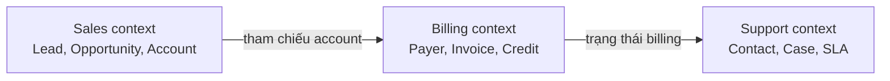
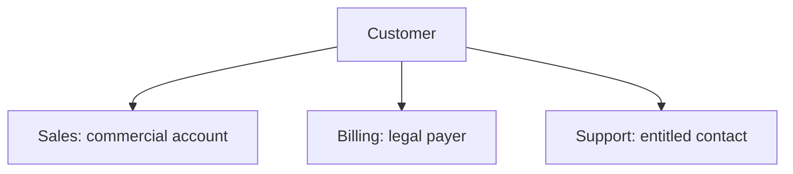
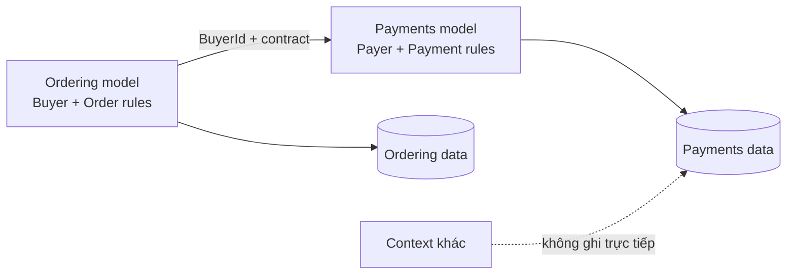
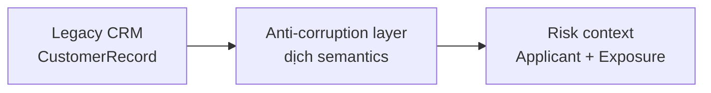

# Domain Boundaries: Giữ ý nghĩa và thay đổi cục bộ

Hãy hình dung một bảng `users` khổng lồ trong cơ sở dữ liệu production đã phình to hơn 120 cột. Đội Billing liên tục đòi nhồi thêm mã số thuế, kỳ hạn thanh toán và hạn mức tín dụng; đội Security chèn thêm mật khẩu băm, số lần đăng nhập sai và cờ trạng thái xác thực hai lớp (MFA); còn đội Marketing lại gắn vào sở thích mua sắm, hành vi click và phân khúc chiến dịch. Tất cả bị nhồi nhét vào một bảng `users` duy nhất dưới ảo tưởng ngây thơ rằng "người dùng thì ở đâu chẳng là một con người".

Hậu quả là: một đợt migration schema của đội Marketing khóa chặt bảng dữ liệu, kéo sập toàn bộ luồng thanh toán ngay trong giờ cao điểm; không một kỹ sư nào dám sửa một cột vì sợ làm gãy hệ thống của đội khác. Khi ranh giới domain bị xóa nhòa, một thực thể quá tải sẽ biến thành thảm họa thắt cổ chai kìm hãm toàn bộ tốc độ phát triển và độ ổn định của hệ thống.

> 💡 **Quy tắc bỏ túi:** Đừng bao giờ đồng nhất một danh tính ngoài đời thực với một mô hình phần mềm duy nhất. Cùng một con người nhưng đối với Sales họ là Account, đối với Billing họ là Payer (người thanh toán), còn đối với Support họ là Contact (người liên hệ). Hãy phân định ranh giới ngữ cảnh (Bounded Context) rõ ràng theo năng lực nghiệp vụ và dịch nghĩa tại ranh giới, tuyệt đối không nhồi chung vào một bảng dữ liệu toàn cục.

## Tóm tắt nhanh

- **Bounded context xác lập tính toàn vẹn ngữ nghĩa**: Ranh giới domain đánh dấu phạm vi mà trong đó một mô hình nghiệp vụ, ngôn ngữ chung (ubiquitous language) và các quy tắc bất biến có ý nghĩa nhất quán tuyệt đối. Ra khỏi ranh giới đó, cùng một từ ngữ sẽ mang ý nghĩa và mô hình hoàn toàn khác.
- **Quyền sở hữu mô hình, quy tắc và dữ liệu phải tường minh**: Mỗi thực thể, bảng dữ liệu và quy tắc nghiệp vụ phải có đúng một đội và một context chịu trách nhiệm sở hữu. Các context khác giao tiếp qua hợp đồng tích hợp (contract), không bao giờ được truy cập trực tiếp vào database nội bộ.
- **Trùng danh tính không đồng nghĩa với trùng mô hình**: Nhiều context có thể dùng chung một mã định danh ổn định (như `user_id`), nhưng thuộc tính, vòng đời và bảng lưu trữ dữ liệu của từng context phải hoàn toàn độc lập.
- **Dịch nghĩa tại biên giới**: Dùng lớp chống tha hóa (Anti-Corruption Layer - ACL) để chuyển đổi dữ liệu từ bên ngoài thành mô hình nội bộ, bảo vệ logic nghiệp vụ không bị méo mó bởi hệ thống đối tác hoặc cấu trúc dữ liệu cũ.
- **Cạm bẫy chết người:** **Bẫy đối tượng toàn năng (God-Object Trap)**—Cố xây dựng một mô hình hoặc bảng dữ liệu "Customer" dùng chung cho toàn bộ doanh nghiệp. Điều này biến schema thành nút thắt cổ chai, buộc các đội phải họp phối hợp phát hành và khiến một sự cố nhỏ cũng có thể làm tê liệt toàn hệ thống.

Cùng một con người ngoài đời có thể hợp lệ khi được mô hình thành Account, Payer và Contact. Ép mọi context vào một mô hình `Customer` toàn cục thường làm coupling tăng chứ không thật sự loại bỏ duplication.

<TermBox term="Bounded Context">
Một **bounded context** là ranh giới mà bên trong đó một domain model và vocabulary có nghĩa nhất quán. Bên ngoài ranh giới, cùng identity hoặc cùng thuật ngữ có thể mang mô hình và ý nghĩa khác.
</TermBox>

Bounded context trước hết là **ranh giới ý nghĩa và quyền sở hữu (ownership)**. Nó không tự động đồng nghĩa với một tiến trình (process), một repository, một database hay một microservice riêng biệt. Một context hoàn toàn có thể nằm gọn trong một modular monolith, và ngược lại, một context quy mô lớn đôi khi có thể bao gồm nhiều thành phần triển khai độc lập.

## Bắt đầu từ ranh giới ngôn ngữ (Language Seams)

Một ranh giới kiến trúc hữu ích thường lộ diện rõ nhất tại nơi mà các chuyên gia nghiệp vụ (domain experts) bắt đầu dùng cùng một từ ngữ nhưng với hai ý nghĩa hoàn toàn khác nhau.

Trong đội ngũ Sales, `Customer status` có thể là khách hàng tiềm năng (prospect), đang hoạt động (active) hoặc có nguy cơ rời bỏ (churn-risk). Trong đội ngũ Billing, `status` lại mang nghĩa là đúng hạn (current), nợ khó đòi (delinquent) hoặc bị tạm ngưng (suspended). Đối với đội ngũ Support, mối quan tâm hàng đầu lại là quyền lợi sử dụng (entitlement) và cam kết dịch vụ (SLA) chứ không phải cùng một trạng thái khách hàng.

<TermBox term="Ubiquitous Language">
**Ubiquitous language (ngôn ngữ chung)** là ngôn ngữ domain chính xác được các chuyên gia nghiệp vụ và kỹ sư phần mềm thống nhất sử dụng bên trong một context. Mã nguồn, hội thoại trao đổi, ví dụ kiểm thử, test cases và tài liệu kỹ thuật đều phải dùng chung các thuật ngữ và ngữ nghĩa này.
</TermBox>

Khi phát hiện **cùng thuật ngữ nhưng khác nghĩa** giữa các luồng nghiệp vụ khác nhau, đừng vội vàng tạo một enum dùng chung cho toàn bộ hệ thống. Hãy xem sự bất đồng đó là bằng chứng thực tế cho thấy đang tồn tại nhiều mô hình khác nhau.

Sự khác biệt về mô hình không đồng nghĩa với khác biệt về danh tính thực thể. Các context hoàn toàn có thể chia sẻ chung một mã định danh đối ngoại (external ID) ổn định nhưng vẫn sở hữu trọn vẹn các thuộc tính, quy tắc và trạng thái vòng đời riêng của mình.

## Khám phá ranh giới từ nhiều tín hiệu thực tế

Đừng phân chia ranh giới hệ thống chỉ dựa vào danh từ trên sơ đồ tổ chức công ty. Hãy kết hợp nhiều tín hiệu thực chiến:

### 1. Năng lực nghiệp vụ

Hãy nhóm các hành vi xoay quanh một **năng lực nghiệp vụ** hoặc trách nhiệm nghiệp vụ gắn kết: định giá đơn hàng, thu tiền thanh toán, lên lịch giao vận, hay xử lý phiếu hỗ trợ.

Ranh giới sẽ vững chắc hơn rất nhiều khi đội ngũ phụ trách có thể nêu rõ kết quả đầu ra mà mình sở hữu mà không cần phụ thuộc vào các quy tắc nội bộ của context khác.

### 2. Quy tắc và bất biến

Hãy đặt câu hỏi: những quy tắc nào bắt buộc phải đúng cùng nhau tại mọi thời điểm? Nếu nhiều thay đổi dữ liệu phải cùng bảo đảm một điều kiện **bất biến** và thường được commit trọn vẹn trong một **ranh giới giao dịch** cục bộ, đó là bằng chứng rõ ràng cho thấy chúng nên thuộc về cùng một chủ sở hữu mô hình.

Đừng cố kéo dài một transaction bao trùm mọi khái niệm chỉ vì cơ sở dữ liệu kỹ thuật cho phép làm điều đó. Tính nhất quán giao dịch sinh ra để bảo vệ các bất biến nghiệp vụ thực tế, không phải công cụ để xóa nhòa mọi ranh giới kiến trúc.

### 3. Coupling thay đổi (Change Coupling)

Hãy quan sát lịch sử commit trong Git và dữ liệu kế hoạch phát triển sản phẩm. Những khái niệm thường xuyên **thay đổi cùng nhau** trong các đợt phát hành có khả năng cao thuộc về cùng một context. Ngược lại, những khái niệm chỉ tình cờ dùng chung một tên bảng nhưng luôn biến đổi vì các lý do hoàn toàn khác biệt thì nhất thiết cần được tách rời.

Hiện tượng thay đổi đồng thời (co-change) là bằng chứng tham khảo có giá trị, nhưng không phải chân lý tuyệt đối. Một dự án di chuyển dữ liệu lớn có thể tạm thời khiến các vùng không liên quan bị sửa đổi cùng lúc; ngược lại, ranh giới thiết kế yếu kém cũng có thể tạo ra coupling thay đổi giả tạo.

### 4. Ranh giới đội (Team Ownership)

Một ranh giới chỉ thực sự tồn tại khi có một đội ngũ chịu trách nhiệm rõ ràng. Nếu ba đội khác nhau đều có thể tùy ý sửa đổi cùng một quy tắc hoặc ghi đè vào cùng một bảng dữ liệu, ranh giới ngữ nghĩa đó coi như vô hiệu trên thực tế.

**Ranh giới đội** (team boundary) cần bám sát năng lực nghiệp vụ để đội ngũ có thể chủ động tiến hóa mô hình, hợp đồng tích hợp và hành vi vận hành mà không phải liên tục xin phê duyệt hay chờ đợi sự đồng thuận từ các đội khác.

## Gán quyền sở hữu cho mô hình, quy tắc và dữ liệu

Với mỗi context tiềm năng, hãy viết một bản tuyên bố sở hữu ngắn gọn và dứt khoát:

> Billing sở hữu toàn bộ trạng thái hóa đơn, kỳ hạn thanh toán, quyết định hạn mức tín dụng và mọi thao tác thay đổi dữ liệu thanh toán. Các context khác tương tác thông qua hợp đồng do Billing công bố; tuyệt đối không ghi trực tiếp vào các bảng nội bộ của Billing.

Bản tuyên bố đó bắt buộc phải phân định rõ ràng ba yếu tố: **sở hữu mô hình**, **sở hữu quy tắc** và **sở hữu dữ liệu**.

Hạ tầng vật lý vẫn hoàn toàn có thể dùng chung. Hai context có thể dùng chung một cụm database server hoặc một repository, nhưng quyền sở hữu logic và quy tắc truy cập dữ liệu bắt buộc phải minh bạch.

## Vẽ bản đồ ngữ cảnh (Context Map) trước khi thiết kế dịch vụ

Một **bản đồ ngữ cảnh (context map)** ghi lại trực quan các bounded context và mối quan hệ giữa các context: bên nào là upstream (cung cấp), bên nào là downstream (tiêu thụ), vị trí nào cần dịch ngữ nghĩa, và **hợp đồng tích hợp** nào được phép đi qua ranh giới.

<TermBox term="Context Map">
**Context map** là bản đồ tường minh ghi lại các bounded context cùng các mối quan hệ tích hợp giữa chúng. Nó phơi bày các phụ thuộc ngữ nghĩa ra ánh sáng trước khi chúng biến thành những phụ thuộc ngầm trong mã nguồn, schema cơ sở dữ liệu hoặc lịch phát hành.
</TermBox>

Với mỗi mối quan hệ giữa các context, hãy xác định rõ:

- Đội ngũ hoặc context sở hữu có thẩm quyền đối với thông tin;
- Hợp đồng tích hợp được công bố qua ranh giới;
- Chiều hướng phụ thuộc trực tiếp;
- Kỳ vọng về độ tươi mới của dữ liệu và tính nhất quán;
- Hành vi xử lý lỗi và tính tương thích ngược;
- Đơn vị nào chịu trách nhiệm dịch đổi khi hai mô hình ngữ nghĩa bất đồng.

Hợp đồng tích hợp chỉ nên phơi bày đúng những gì mà context downstream thực sự cần, tuyệt đối không rò rỉ toàn bộ cấu trúc thực thể nội bộ của upstream ra bên ngoài.

## Dịch mô hình thay vì vô tình dùng chung mô hình

Khi các context sở hữu các tầng ngữ nghĩa khác nhau, hãy thực hiện chuyển dịch ngay tại ranh giới tiếp giáp.

**Lớp chống tha hóa (anti-corruption layer - ACL)** là lớp dịch chuyên trách chuyển đổi API, sự kiện hoặc mô hình dữ liệu cũ (legacy) từ context bên ngoài thành các khái niệm thuần khiết phù hợp với context tiếp nhận. Nó bảo vệ ngôn ngữ chung và quy tắc nghiệp vụ nội bộ không bị biến dạng bởi mô hình ngoại lai.

Lớp chống tha hóa chỉ nên tập trung làm nhiệm vụ dịch đổi giao thức và ngữ nghĩa dữ liệu. Tuyệt đối không biến nó thành một domain nghiệp vụ thứ hai chứa các logic điều phối rườm rà.

## Xem nhân dùng chung (Shared Kernel) là hợp đồng phụ thuộc có chủ đích

Một **nhân dùng chung (shared kernel)** là một phần mô hình rất nhỏ được nhiều context chủ động dùng chung. Ví dụ điển hình bao gồm: kiểu dữ liệu tiền tệ (Money type) được quản trị chung, bảng mã quốc gia chuẩn hóa, hoặc cấu trúc định danh người dùng cơ bản.

Nhân dùng chung không phải là một thư mục "common" hay "shared" được tạo ra vì sự tiện tay của lập trình viên. Mỗi kiểu dữ liệu đưa vào shared kernel đều tạo ra sự ràng buộc thay đổi đồng thời giữa các đội. Hãy giữ bề mặt của nó thật nhỏ, chỉ định rõ ràng các bên cùng đồng sở hữu, bắt buộc quy trình review tính tương thích và kiên quyết loại bỏ những thành phần không còn mang ý nghĩa dùng chung thực sự.

Nếu các context bắt đầu bất đồng về vòng đời, quy tắc kiểm tra dữ liệu (validation) hoặc ngữ nghĩa, hãy chủ động sao chép mã nguồn và thực hiện dịch nghĩa thay vì cố ép khái niệm đó vào shared kernel.

## Áp đặt ranh giới trong mã nguồn và truy cập dữ liệu

Sơ đồ vẽ trên bảng trắng không thể thay thế cho các rào chắn kỹ thuật. Hãy chuyển hóa bản đồ ngữ cảnh thành các ràng buộc có thể kiểm tra tự động:

1. Công bố một package public, module facade, API hoặc hợp đồng sự kiện nhỏ gọn;
2. Giữ các thành phần nội bộ của context ở trạng thái private, ngăn chặn hoàn toàn việc import sâu từ bên ngoài;
3. Chặn đứng các truy vấn ghi từ context khác vào các bảng dữ liệu hoặc repository nội bộ;
4. Thiết lập các bài kiểm tra kiến trúc (architecture tests) hoặc quy tắc linter để phát hiện và làm fail build khi xuất hiện import trái phép;
5. Kiểm thử hợp đồng tích hợp độc lập với các mô hình thực thể bên trong;
6. Thể hiện rõ ràng ranh giới sở hữu trong quy trình code review và điều phối sự cố production.

Trong một kiến trúc modular monolith, việc thực thi này có thể dựa vào cấu hình export package và các test kiến trúc tự động. Trong hệ thống microservices, ranh giới tiến trình và mạng bổ sung thêm khả năng cô lập vật lý, nhưng việc dùng chung cơ sở dữ liệu hoặc thư viện mã nguồn dùng chung thiếu kiểm soát vẫn có thể phá vỡ ranh giới domain dự kiến.

## Quy trình thực chiến để khám phá ranh giới

Khi bước vào một hệ thống phức tạp và rối rắm, hãy áp dụng quy trình khám phá bài bản sau:

1. **Vẽ sơ đồ luồng công việc nghiệp vụ:** Ghi lại các quyết định và kết quả nghiệp vụ, không chỉ dừng lại ở các màn hình CRUD thông thường.
2. **Thu thập ngôn ngữ domain:** Đánh dấu những thuật ngữ bị thay đổi ý nghĩa giữa các luồng công việc hoặc giữa các chuyên gia khác nhau.
3. **Gom cụm quy tắc và bất biến:** Giữ những hành vi bắt buộc phải nhất quán tuyệt đối về dữ liệu nằm cạnh cùng một chủ sở hữu.
4. **Phân tích hiện tượng co-change:** Soi xét lịch sử commit, các sự cố vận hành và roadmap tính năng để nhận diện những gì thường xuyên thay đổi cùng nhau.
5. **Phân định quyền sở hữu:** Nêu đích danh đội ngũ và context có toàn quyền quyết định đối với từng quy tắc và thay đổi dữ liệu.
6. **Phác thảo các candidate bounded context:** Ưu tiên các mô hình có tính gắn kết logic cao hơn là cố chia thành các khối hộp có kích thước bằng nhau.
7. **Xây dựng context map:** Định rõ mối quan hệ upstream/downstream và các hợp đồng tích hợp chính thức giữa các bên.
8. **Chọn phương án dịch nghĩa hoặc shared kernel thật nhỏ:** Không bao giờ cho phép chia sẻ mô hình dữ liệu theo mặc định.
9. **Thiết lập rào chắn kỹ thuật:** Ngăn chặn triệt để deep import và các truy vấn ghi chéo giữa các context.
10. **Đo lường và điều chỉnh liên tục:** Ranh giới kiến trúc phải tiến hóa linh hoạt khi hiểu biết về domain sâu sắc hơn và bằng chứng vận hành thực tế thay đổi.

Một ranh giới domain chỉ thực sự phát huy hiệu quả khi phần lớn các thay đổi mã nguồn nằm gọn trong nội bộ context, ngôn ngữ sử dụng bên trong đạt tính nhất quán cao, trách nhiệm sở hữu minh bạch và các luồng công việc hằng ngày không cần phải chọc sâu vào mô hình nội bộ của các context lân cận.

## Tình huống production

Một công ty commerce tạo một table `Customer` toàn cục và một class `Customer` dùng chung cho Sales, Billing và Support. Cả ba team thêm field và status vào đó, import cùng model package và ghi trực tiếp cùng row.

Sales thêm `leadScore`, Billing thêm `creditHold`, còn Support đổi `status` để biểu diễn entitlement. Sau đó một lần rename và đổi validation buộc ba application phải release phối hợp. Không ai nói rõ team nào sở hữu meaning của `status`.

**Hậu quả:** thay đổi domain nhỏ kéo theo release coordination nhiều team, validation rule xung đột, schema migration rủi ro, sự cố không liên quan chia sẻ cùng blast radius và mọi team đều ngại đơn giản hóa model.

**Nguyên nhân cốt lõi:** tổ chức xem shared identity là bằng chứng của một shared domain model. Language seam, rule ownership, transaction invariant và team ownership bị bỏ qua, khiến global schema trở thành integration contract.

**Cách khắc phục chuẩn:** định nghĩa bounded context riêng cho Sales, Billing và Support; giữ model và rule riêng trong từng context; gán một authoritative owner cho mỗi mutation; chỉ share stable identity khi meaning thật sự chung; expose integration contract hẹp; dịch semantic difference bằng anti-corruption layer; và ghi dependency vào context map.

Tự kiểm tra: có nên biến mọi bounded context thành microservice?

Không. Bounded context xác định nơi domain model và language có hiệu lực. Microservice thêm runtime boundary có thể deploy độc lập. Modular monolith có thể chứa nhiều bounded context, và một bounded context đôi khi cần nhiều physical component. Chỉ chọn deployment boundary theo nhu cầu vận hành sau khi semantic boundary đã rõ.

## Checklist production

- [ ] Mỗi context có một năng lực nghiệp vụ hoặc trách nhiệm nghiệp vụ gắn kết.
- [ ] Ubiquitous language nhất quán trong context và được phép khác ở context khác.
- [ ] Sở hữu mô hình, sở hữu quy tắc và sở hữu dữ liệu đều rõ.
- [ ] Ranh giới giao dịch bảo vệ invariant thật thay vì phủ cả hệ thống.
- [ ] Co-change và sự cố evidence hỗ trợ candidate boundary.
- [ ] Một team chịu trách nhiệm cho model và mutation của mỗi context.
- [ ] Context map ghi hướng tích hợp và contract.
- [ ] Semantic khác nhau được dịch thay vì giấu trong global shared model.
- [ ] Shared kernel thật nhỏ, đồng quản trị và intentionally coupled.
- [ ] Cross-context deep import và private-table write bị chặn.
- [ ] Compatibility và failure behavior của contract được test tại boundary.
- [ ] Chất lượng boundary được xem lại khi language, workflow và ownership tiến hóa.

## Agent rule

Trước khi di chuyển code hay tách service, hãy xác định nơi business language, invariant, ownership và lý do thay đổi còn gắn kết; định nghĩa bounded context đó, map integration của nó, rồi enforce boundary mà không ép context lân cận vào một global model.

## Nguồn

- Microsoft Learn — [Identify domain-model boundaries for each microservice](https://learn.microsoft.com/en-us/dotnet/architecture/microservices/architect-microservice-container-applications/identify-microservice-domain-model-boundaries)
- Azure Architecture Center — [Use domain analysis to model microservices](https://learn.microsoft.com/en-us/azure/architecture/microservices/model/domain-analysis)
- Azure Architecture Center — [Anti-Corruption Layer pattern](https://learn.microsoft.com/en-us/azure/architecture/patterns/anti-corruption-layer)
- Martin Fowler — [Bounded Context](https://martinfowler.com/bliki/BoundedContext.html)
- Martin Fowler — [Ubiquitous Language](https://martinfowler.com/bliki/UbiquitousLanguage.html)
