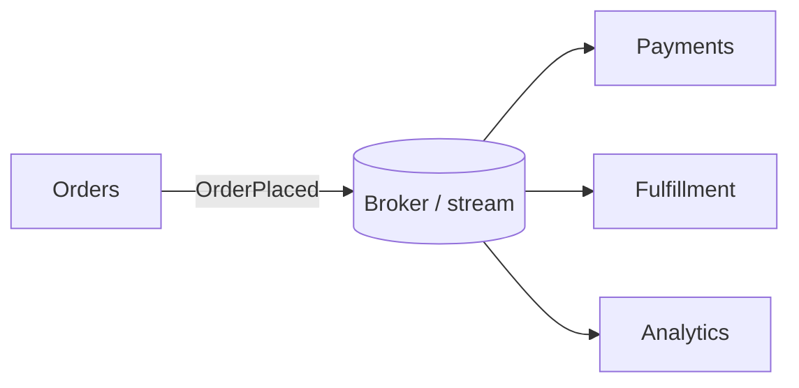
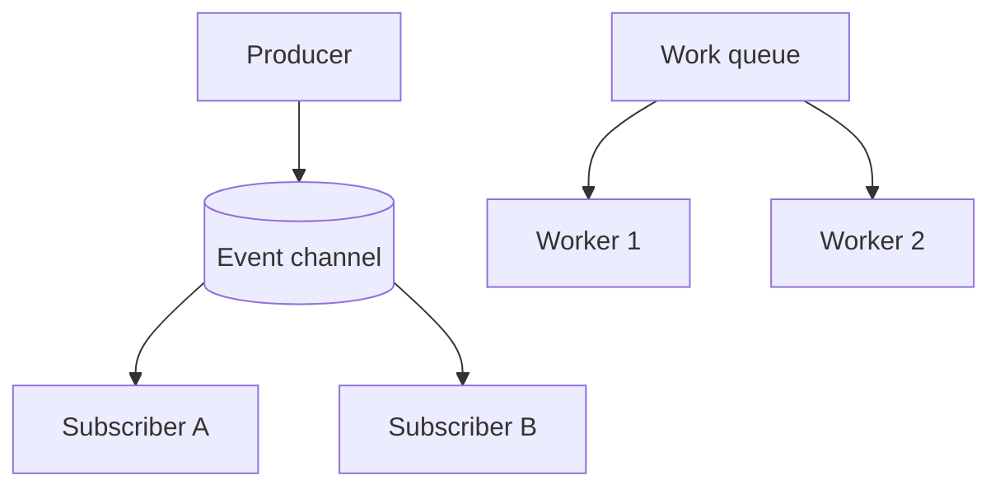
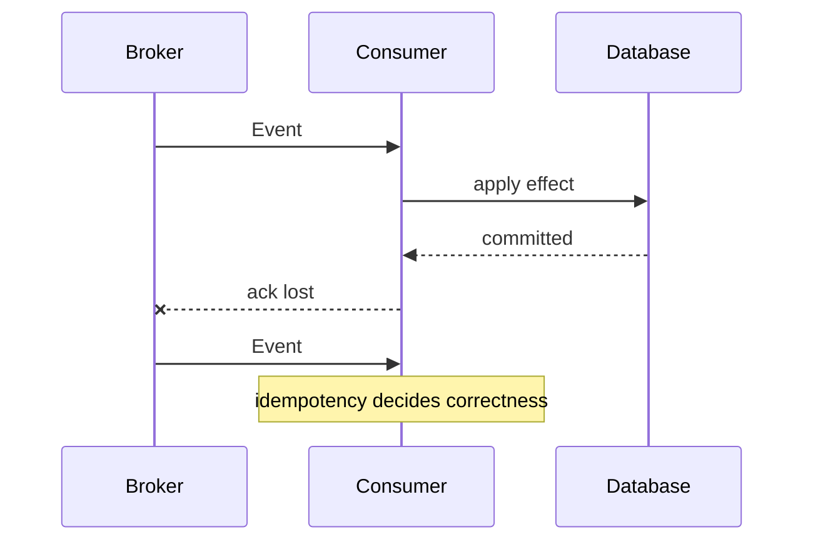
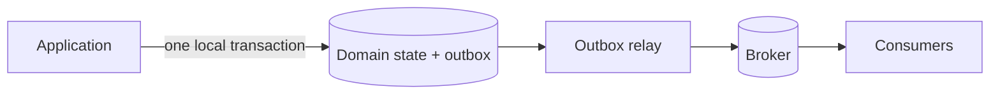

# Event-Driven Architecture: Facts Across Boundaries

## TL;DR

An **event is a fact that already happened**. In event-driven architecture, producers publish facts without needing to know every consumer, and consumers react independently through an event channel or durable stream.

This decouples producer and consumer topology, but it does not remove contracts, failures, duplicates, ordering constraints, stale views, or operational work.

<TermBox term="Event">
An **event** records a past fact such as `OrderPlaced`. It differs from a command such as `ChargeCard`, which asks a specific capability to perform work.
</TermBox>

## Events are facts, not remote commands in disguise

A useful event is named in past tense and carries enough identity and context for consumers to interpret the fact. The producer should not encode which downstream action must happen next.

If `OrderPlaced` really means "Billing, charge this card now," producer and consumer are still tightly coupled even if a broker sits between them.

## Pub/sub is not the same as a work queue

With **publish/subscribe**, each interested subscriber gets its own logical copy of an event. Adding a new subscriber should not require changing the producer.

With **competing consumers**, multiple workers consume from one work queue and one worker handles each message. That is load distribution, not fan-out.

Choose the topology from semantics: "who needs to observe this fact?" is different from "which worker should perform this job?"

## Event streams add history and replay

A durable **event stream** keeps ordered records, often in partitions. Consumers track a cursor or offset and can replay history after a bug fix or when a new projection is built.

<TermBox term="Replay">
**Replay** means reading retained events again from an earlier cursor. Replay is powerful only when consumers tolerate duplicates and historical schemas.
</TermBox>

Replay is not free rollback. External side effects such as email or payments need explicit replay protection.

## Delivery is usually not exactly once end to end

Many brokers use **at-least-once** delivery under failure, so a consumer can see a duplicate. A crash after applying the side effect but before acknowledging the event is a classic cause.

Consumers therefore need idempotency where duplicate processing would be harmful. Use a stable event identifier or domain operation key and persist deduplication with the state change when possible.

Retries need bounded backoff. Poison events need a dead-letter or quarantine path with an operator-visible recovery procedure; silently dropping them turns data loss into normal behavior.

## Ordering is scoped, not global by default

A high-throughput stream is commonly partitioned. Ordering can usually be guaranteed only within a partition, so the **partition key** becomes a correctness decision.

If events for one order must be observed in order, route that order's events through the same ordering scope. Global ordering often sacrifices throughput and availability and should not be assumed casually.

Consumers should still defend against late or stale events when retries, multiple producers, migrations, or replay can reorder observations.

## Event contracts must evolve independently

Producer and consumer versions overlap in production. Event **schema** changes therefore need compatibility rules: prefer additive evolution, preserve semantic meaning, version deliberately when necessary, and avoid removing fields before consumers migrate.

An event contract includes more than JSON shape. It also includes event meaning, identity, timestamp semantics, ordering assumptions, retention, duplicate behavior, and privacy classification.

## Eventual consistency is a product behavior

Asynchronous consumers update their own state later, so the system can be **eventually consistent**. A user may complete checkout before search, analytics, or fulfillment views catch up.

Expose that reality intentionally: define acceptable freshness, user-visible pending states, reconciliation, and what happens when a consumer is unavailable for minutes or hours.

## Avoid the database-plus-broker dual-write gap

A producer that commits business state and then separately publishes an event has a **dual write** problem: the database can succeed while publish fails, or publish can happen for work that later rolls back.

A transactional **outbox** stores the business update and an event-to-publish record in one local transaction, then a relay publishes the outbox asynchronously.

The outbox closes one consistency gap; it still does not eliminate duplicate delivery, relay retries, or consumer idempotency requirements.

## Choreography and orchestration solve different coordination problems

In **choreography**, services react to events without one central workflow owner. This keeps local autonomy high but can make a long business process difficult to see and debug.

In **orchestration**, one coordinator explicitly tracks steps and commands participants. It adds a central workflow dependency but can make deadlines, compensation, and state transitions easier to reason about.

Use events because the business interaction is asynchronous, not because choreography looks more decoupled on a diagram.

## Operate the event path, not only the applications

Observe **consumer lag**, broker backlog, publish failures, retry rates, dead-letter volume, processing latency, and handler errors. Correlation or trace identifiers should connect the originating request to published events and downstream effects.

Backpressure matters: if producers emit faster than consumers can process, lag grows even while every individual component is technically healthy.

<TermBox term="Consumer lag">
**Consumer lag** is the distance between newly available events and the consumer's processed position. Rising lag is an early signal that freshness and recovery objectives are at risk.
</TermBox>

## Production scenario

An order service publishes `OrderPlaced`. Payment, inventory, and email consumers assume every event arrives once and in order. The producer writes its database first and publishes separately. During a broker incident, some publishes fail; retries later deliver duplicates and old events after newer ones.

**Impact:** some paid orders never reach fulfillment, some customers are charged twice, stale inventory overwrites newer state, and operators cannot tell whether backlog or application logic caused the mismatch.

**Root cause:** the architecture treated the broker as guaranteed coordination instead of designing for dual-write failure, at-least-once delivery, scoped ordering, idempotency, lag, and recovery.

**Correct pattern:** publish durable facts through an outbox, assign stable event IDs and ordering keys, make harmful side effects idempotent, version contracts compatibly, bound retries, quarantine poison events, measure consumer lag, and reconcile business state from authoritative owners.

Self-check: does adding a broker make two services loosely coupled?

Not automatically. It removes direct endpoint knowledge, but consumers can still be coupled to producer schemas, timing, event meaning, ordering, replay behavior, and business choreography. Good EDA makes those contracts explicit instead of pretending they disappeared.

## Production checklist

- [ ] Events represent past facts rather than hidden commands.
- [ ] Pub/sub and competing-consumer semantics are chosen deliberately.
- [ ] Stream retention and replay behavior are documented where applicable.
- [ ] Duplicate delivery is expected and harmful side effects are idempotent.
- [ ] Ordering scope and partition keys match domain invariants.
- [ ] Event schema and semantic compatibility survive overlapping versions.
- [ ] Eventual-consistency freshness is explicit to product behavior.
- [ ] Database-to-broker publication avoids an unmanaged dual-write gap.
- [ ] Retry, dead-letter or quarantine, and replay recovery paths are operable.
- [ ] Consumer lag, backlog, publish errors, and traces are observable.
- [ ] Choreography or orchestration is chosen from workflow needs.

## Agent rule

Treat every event as a durable contract about a past fact; reason explicitly about delivery, duplicates, ordering, consistency, replay, and recovery before using asynchronous decoupling as an architectural benefit.

## Sources

- Microsoft Azure Architecture Center — [Event-driven architecture style](https://learn.microsoft.com/en-us/azure/architecture/guide/architecture-styles/event-driven)
- Microsoft Azure Architecture Center — [Publisher-Subscriber pattern](https://learn.microsoft.com/en-us/azure/architecture/patterns/publisher-subscriber)
- Microsoft Azure Architecture Center — [Asynchronous messaging options](https://learn.microsoft.com/en-us/azure/architecture/guide/technology-choices/messaging)
