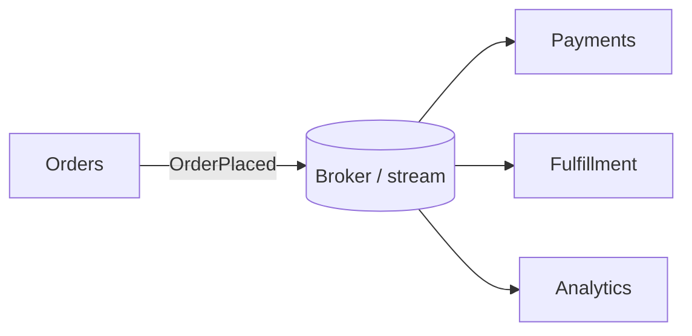
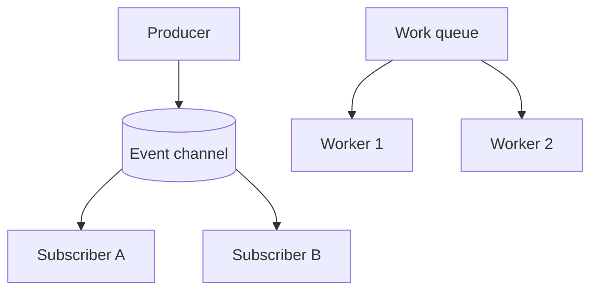
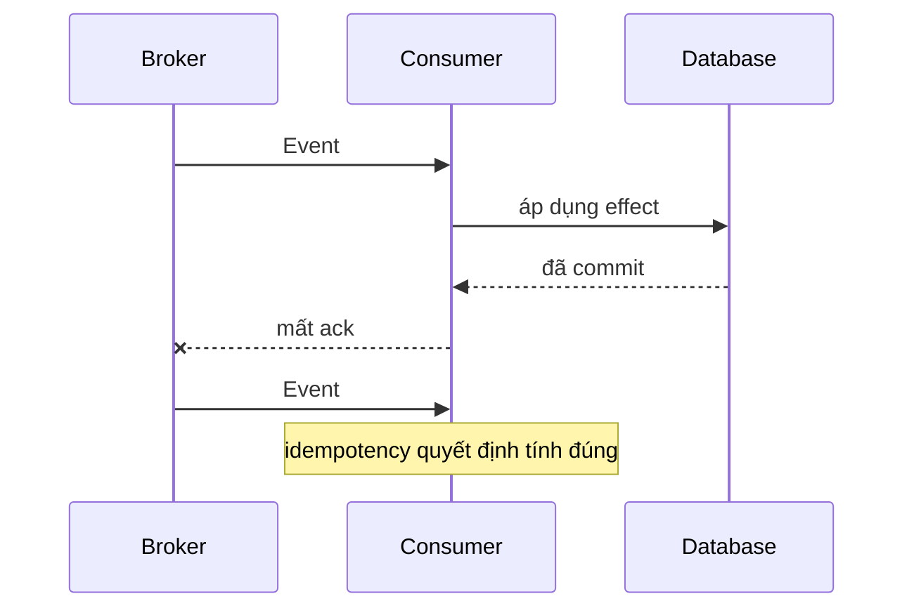
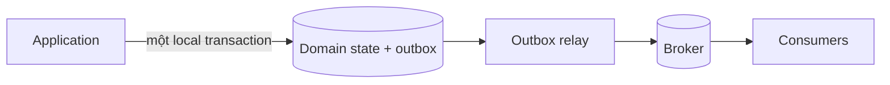

# Event-Driven Architecture: Sự kiện qua ranh giới

## Tóm tắt nhanh

Một **sự kiện là sự thật đã xảy ra**. Trong kiến trúc hướng sự kiện, bên phát công bố sự thật mà không cần biết mọi bên nhận, còn consumer phản ứng độc lập qua event channel hoặc stream bền vững.

Cách này giảm coupling về topology giữa producer và consumer, nhưng không làm contract, lỗi, duplicate, ordering, dữ liệu trễ hay công việc vận hành biến mất.

<TermBox term="Sự kiện">
Một **sự kiện** ghi nhận sự thật trong quá khứ như `OrderPlaced`. Nó khác command như `ChargeCard`, vốn yêu cầu một capability cụ thể thực hiện công việc.
</TermBox>

## Event là fact, không phải remote command cải trang

Một event tốt thường được đặt tên ở thì quá khứ và mang đủ identity, context để consumer hiểu sự thật đó. Producer không nên mã hóa sẵn hành động downstream bắt buộc phải làm tiếp theo.

Nếu `OrderPlaced` thực chất mang nghĩa "Billing phải charge card ngay," producer và consumer vẫn tightly coupled dù ở giữa có broker.

## Pub/sub khác work queue

Với **publish/subscribe**, mỗi subscriber quan tâm nhận logical copy riêng của event. Thêm subscriber mới không nên buộc producer phải đổi.

Với **competing consumers**, nhiều worker cùng đọc một work queue và một worker xử lý mỗi message. Đây là phân phối tải, không phải fan-out.

Chọn topology từ semantics: "ai cần quan sát sự thật này?" khác với "worker nào nên thực hiện job này?"

## Event stream bổ sung history và replay

Một **event stream** bền vững giữ các record đã sắp thứ tự, thường theo partition. Consumer theo dõi cursor hoặc offset và có thể replay lịch sử sau bug fix hoặc khi dựng projection mới.

<TermBox term="Replay">
**Replay** là đọc lại event đã lưu từ cursor cũ. Replay chỉ an toàn khi consumer chịu được duplicate và schema lịch sử.
</TermBox>

Replay không phải rollback miễn phí. Side effect bên ngoài như email hay payment cần replay protection rõ ràng.

## Delivery thường không exactly-once end to end

Nhiều broker dùng **at-least-once** khi có failure, nên consumer có thể thấy duplicate. Một nguyên nhân kinh điển là consumer đã commit side effect nhưng crash trước khi gửi acknowledgment.

Vì vậy consumer cần **idempotency** khi xử lý trùng có thể gây hại. Dùng event ID ổn định hoặc operation key của domain và lưu thông tin dedup cùng state change khi có thể.

Retry cần backoff có giới hạn. Poison event cần dead-letter hoặc hàng đợi lỗi/quarantine cùng quy trình recovery mà operator nhìn thấy; âm thầm drop event biến mất dữ liệu thành hành vi bình thường.

## Ordering có phạm vi, không mặc định toàn cục

Stream throughput cao thường được chia partition. Ordering thường chỉ được đảm bảo trong một partition, nên **partition key** là quyết định correctness.

Nếu các event của cùng một order phải được quan sát đúng thứ tự, hãy đưa chúng vào cùng ordering scope. Global ordering thường đánh đổi throughput và availability, không nên mặc định giả định.

Consumer vẫn phải phòng late hoặc stale event khi retry, nhiều producer, migration hay replay làm thứ tự quan sát thay đổi.

## Event contract phải tiến hóa độc lập

Version producer và consumer có thể chồng lấp trong production. Vì vậy thay đổi **schema** cần quy tắc compatibility: ưu tiên additive change, giữ nguyên semantic meaning, version có chủ đích khi cần, và không xóa field trước khi consumer migrate.

Event contract không chỉ là JSON shape. Nó còn gồm meaning, identity, semantics của timestamp, giả định ordering, retention, duplicate behavior và phân loại privacy.

## Eventual consistency là hành vi sản phẩm

Consumer bất đồng bộ cập nhật state riêng sau, nên hệ thống có thể **nhất quán cuối cùng**. Người dùng có thể checkout xong trước khi search, analytics hay fulfillment bắt kịp.

Hãy biểu lộ thực tế đó có chủ đích: định nghĩa freshness chấp nhận được, trạng thái pending người dùng nhìn thấy, reconciliation, và điều gì xảy ra khi consumer unavailable nhiều phút hoặc nhiều giờ.

## Tránh khoảng trống dual write giữa database và broker

Producer commit business state rồi mới publish event riêng biệt gặp bài toán **ghi kép**: database có thể thành công nhưng publish thất bại, hoặc event được publish cho transaction sau đó rollback.

Transactional **outbox** lưu business update và record event-cần-publish trong cùng local transaction; relay sau đó publish outbox bất đồng bộ.

Outbox đóng một consistency gap nhưng không xóa duplicate delivery, retry của relay hay yêu cầu consumer idempotency.

## Choreography và orchestration giải bài toán khác nhau

Trong **choreography**, service phản ứng với event mà không có workflow owner trung tâm. Local autonomy cao nhưng flow nghiệp vụ dài có thể khó nhìn và khó debug.

Trong **orchestration**, một coordinator theo dõi step và ra command cho participant. Nó thêm central workflow dependency nhưng thường làm deadline, compensation và state transition dễ suy luận hơn.

Dùng event vì interaction nghiệp vụ thật sự bất đồng bộ, không phải vì choreography trông ít coupling hơn trên sơ đồ.

## Vận hành cả event path, không chỉ application

Theo dõi **consumer lag**, broker backlog, publish failure, retry rate, dead-letter volume, processing latency và handler error. Correlation hoặc trace ID nên nối request gốc với event đã publish và downstream effect.

Backpressure rất quan trọng: nếu producer phát nhanh hơn consumer xử lý, tồn đọng tăng dù từng component riêng lẻ vẫn có vẻ healthy.

<TermBox term="Consumer lag">
**Consumer lag** là khoảng cách giữa event mới sẵn sàng và vị trí consumer đã xử lý. Lag tăng là tín hiệu sớm cho thấy freshness và recovery objective đang gặp rủi ro.
</TermBox>

## Tình huống production

Order service publish `OrderPlaced`. Consumer payment, inventory và email giả định mỗi event chỉ đến một lần và luôn đúng thứ tự. Producer ghi database trước rồi publish riêng. Khi broker gặp sự cố, một số publish thất bại; retry sau đó tạo duplicate và đưa event cũ đến sau event mới.

**Hậu quả:** một số order đã thanh toán không tới fulfillment, một số khách bị charge hai lần, inventory cũ ghi đè state mới và operator không biết mismatch đến từ backlog hay application logic.

**Nguyên nhân cốt lõi:** kiến trúc xem broker như cơ chế coordination được đảm bảo thay vì thiết kế cho dual-write failure, at-least-once delivery, ordering có phạm vi, idempotency, lag và recovery.

**Cách khắc phục chuẩn:** publish fact bền vững qua outbox, gán event ID và ordering key ổn định, làm side effect gây hại trở nên idempotent, tiến hóa contract tương thích, giới hạn retry, quarantine poison event, đo consumer lag và reconcile business state từ owner có thẩm quyền.

Tự kiểm tra: thêm broker có tự làm hai service loosely coupled không?

Không tự động. Broker loại bỏ kiến thức endpoint trực tiếp, nhưng consumer vẫn có thể coupled vào schema, timing, meaning, ordering, replay behavior và choreography của producer. EDA tốt làm những contract đó rõ ràng thay vì giả vờ chúng biến mất.

## Checklist production

- [ ] Event biểu diễn fact trong quá khứ thay vì command ẩn.
- [ ] Pub/sub và competing-consumer semantics được chọn có chủ đích.
- [ ] Retention và replay behavior của stream được ghi rõ khi áp dụng.
- [ ] Duplicate delivery được xem là bình thường và side effect gây hại có idempotency.
- [ ] Ordering scope và partition key khớp invariant của domain.
- [ ] Schema và semantic compatibility sống được qua nhiều version cùng tồn tại.
- [ ] Freshness của eventual consistency được phản ánh vào product behavior.
- [ ] Publication từ database sang broker tránh unmanaged dual-write gap.
- [ ] Retry, dead-letter/quarantine và replay recovery có thể vận hành.
- [ ] Consumer lag, backlog, publish error và trace quan sát được.
- [ ] Choreography hoặc orchestration được chọn từ nhu cầu workflow.

## Quy tắc cho agent

Hãy xem mỗi event là một contract bền vững về fact đã xảy ra; suy luận rõ delivery, duplicate, ordering, consistency, replay và recovery trước khi xem asynchronous decoupling là lợi ích kiến trúc.

## Nguồn

- Microsoft Azure Architecture Center — [Event-driven architecture style](https://learn.microsoft.com/en-us/azure/architecture/guide/architecture-styles/event-driven)
- Microsoft Azure Architecture Center — [Publisher-Subscriber pattern](https://learn.microsoft.com/en-us/azure/architecture/patterns/publisher-subscriber)
- Microsoft Azure Architecture Center — [Asynchronous messaging options](https://learn.microsoft.com/en-us/azure/architecture/guide/technology-choices/messaging)
