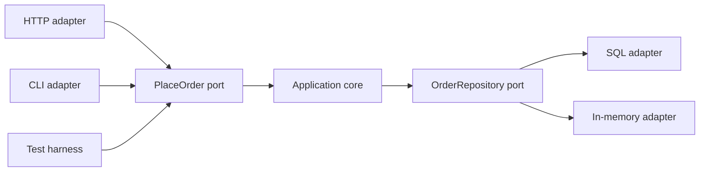
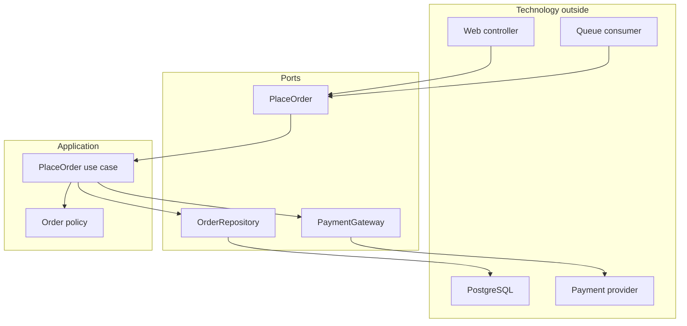
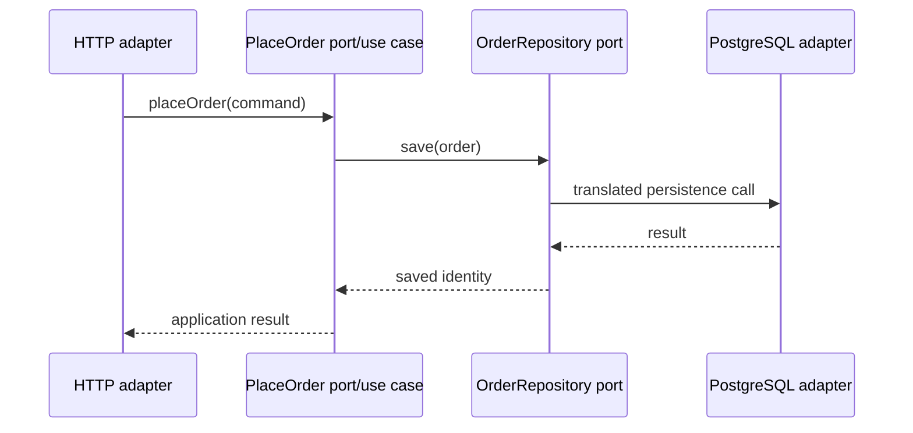
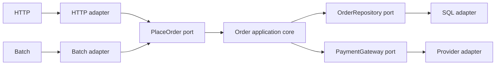

# Hexagonal Architecture: Put Technology Outside the Application

## TL;DR

Hexagonal Architecture, also called **Ports and Adapters**, separates the application's meaningful behavior from the technologies that drive it or that it drives.

The core idea is:

```text
external technology
  -> adapter
  -> port defined by purpose
  -> application behavior
  -> port defined by purpose
  -> adapter
  -> external technology
```

The application should be able to express a use case without knowing whether it was triggered by HTTP, a CLI, a batch job, a test harness, or another program. Likewise, business behavior should not need to know whether persistence is PostgreSQL, an in-memory fake, a file, or a remote service.



The hexagon is a drawing device. **Six sides are not a rule.** The useful asymmetry is **inside versus outside**, not top versus bottom or exactly six components.

## 1. A port is a purposeful conversation

<TermBox term="Port">
A **port** is an application-facing protocol for one purposeful conversation.

A port describes what the application can do or what it needs from the outside world without committing to a particular transport, framework, database, or vendor SDK.

**Why it matters:** a stable port lets multiple technologies connect to the same application capability without moving technology knowledge into the core.
</TermBox>

Examples of ports:

- `PlaceOrder` — a caller asks the application to place an order;
- `LoadCustomer` — the application needs customer data;
- `ChargePayment` — the application requests a payment attempt;
- `PublishOrderPlaced` — the application emits an outcome;
- `Clock` — the application needs current time through a controllable contract.

A port should normally be named after **purpose**, not mechanism.

Prefer:

```text
ChargePayment
```

over:

```text
CallStripeSdk
```

Prefer:

```text
LoadCustomer
```

over:

```text
RunCustomerSql
```

The first names preserve application meaning. The second names bake an implementation choice into the core contract.

## 2. An adapter translates between a port and a technology

<TermBox term="Adapter">
An **adapter** converts between the protocol of a port and the representation or behavior of a specific external technology.

Examples include an HTTP controller, CLI command, queue consumer, SQL repository, vendor SDK client, filesystem implementation, or in-memory fake.

**Why it matters:** adapters absorb technology-specific change so application behavior can remain stable.
</TermBox>

For one input port:

```text
PlaceOrder
```

possible driving adapters include:

```text
POST /orders
CLI: atlas order create
Batch import row
Automated acceptance test
```

For one output port:

```text
OrderRepository
```

possible driven adapters include:

```text
PostgreSQL repository
In-memory repository
Remote order-store client
Test fake
```



## 3. Driving and driven sides answer “who starts the conversation?”

Cockburn's original article describes primary and secondary actors; these are also commonly called **driving** and **driven** sides.

A **driving adapter** initiates an advertised application capability:

- HTTP controller;
- command-line command;
- scheduled job;
- message consumer;
- acceptance test harness.

A **driven adapter** is called by the application because the use case needs an external capability:

- repository;
- payment provider;
- email sender;
- object store;
- clock;
- message publisher.

The distinction is not “frontend versus backend.”

A queue consumer is driving if an incoming message triggers a use case. A queue publisher is driven if the application emits a message through it.



## 4. The application owns the port semantics

A common failure is to define ports by copying framework interfaces or vendor SDK shapes directly into the core.

Example of a weak output port:

```ts
interface DatabasePort {
  query(sql: string, params: unknown[]): Promise<Row[]>;
}
```

The application now knows SQL, row shapes, and persistence mechanics.

A more purposeful contract is:

```ts
interface OrderRepository {
  findById(id: OrderId): Promise<Order | null>;
  save(order: Order): Promise<void>;
}
```

This does not guarantee perfect abstraction. It simply moves the contract toward the application language rather than the infrastructure language.

The same rule applies to input ports. Do not pass raw Express/Fastify request objects through the core if the use case only needs:

```ts
type PlaceOrderCommand = {
  customerId: string;
  lines: OrderLineInput[];
};
```

## 5. Dependency inversion keeps technology pointing inward

<TermBox term="Dependency inversion">
**Dependency inversion** means high-level policy does not depend directly on low-level technology details. Both meet at an abstraction whose semantics are useful to the high-level policy.

In Hexagonal Architecture, the application defines the port and an outside adapter implements or invokes it.

**Why it matters:** compile-time dependencies can point toward application meaning even when runtime calls eventually reach databases, networks, or frameworks.
</TermBox>

Without inversion:

```text
OrderService -> PostgreSQL client
OrderService -> Stripe SDK
OrderService -> Express response
```

With ports:

```text
OrderService -> OrderRepository port <- PostgreSQL adapter
OrderService -> PaymentGateway port <- Stripe adapter
HTTP adapter -> PlaceOrder port <- OrderService
```

Runtime flow may still go from core to database. The important difference is that the core does not compile against the database implementation.

## 6. The composition root is where concrete adapters meet ports

Ports do not instantiate their own adapters.

A **composition root** or startup wiring location chooses concrete implementations:

```ts
const orderRepository = new PostgresOrderRepository(db);
const paymentGateway = new StripePaymentGateway(stripe);

const placeOrder = new PlaceOrderService({
  orderRepository,
  paymentGateway,
});

httpRouter.post('/orders', new PlaceOrderHttpAdapter(placeOrder));
```

This location is allowed to know both application interfaces and infrastructure implementations because its job is assembly.

Do not hide global service locators throughout business code and call that dependency inversion. Dependencies should stay explicit enough that tests and readers can see what the use case requires.

## 7. Hexagonal testing is about substitution at boundaries

One major benefit of Ports and Adapters is that the application can run without its final runtime devices.

A fast use-case test can wire:

```text
Test harness -> PlaceOrder port -> Application -> In-memory repository
```

while a production path wires:

```text
HTTP adapter -> PlaceOrder port -> Application -> PostgreSQL repository
```

The application behavior should not need a different implementation merely because the adapter changed.

This does **not** mean integration tests disappear.

You still need to verify:

- SQL adapters against the real database contract;
- HTTP adapters against routing/auth/serialization behavior;
- vendor adapters against provider semantics;
- composition wiring;
- end-to-end critical paths.

Hexagonal Architecture makes isolation possible. It does not make external systems irrelevant.

## 8. Fakes are useful when they preserve port semantics

An in-memory adapter is valuable when it behaves closely enough to the port contract for the test's purpose.

But a fake can lie.

An in-memory repository may not reproduce:

- transaction isolation;
- unique constraints;
- collation;
- query ordering;
- network timeouts;
- provider idempotency semantics.

So use different test levels deliberately:

```text
core test         -> fake adapters for application rules
adapter test      -> real dependency or faithful emulator
integration test  -> assembled ports + adapters
end-to-end        -> selected critical flows
```

## 9. Ports should not multiply mechanically

There is no rule that every method, entity, or database table needs a port.

Too many tiny interfaces create navigation cost without improving isolation.

Choose a port when there is a meaningful conversation across the application boundary, especially when:

- the external technology is volatile;
- the capability needs multiple adapters;
- the core needs isolation for testing;
- ownership or policy belongs inside while mechanism belongs outside;
- runtime behavior must be replaceable by environment.

A stable, simple library call inside the core does not automatically need an interface.

## 10. Ports do not erase distributed-system semantics

Replacing `StripeSdk` with `PaymentGateway` does not make payment atomic.

The port must still expose relevant semantics such as:

- timeout and ambiguous outcomes;
- idempotency requirements;
- retry safety;
- consistency/freshness;
- failure categories;
- cancellation or compensation limits.

Bad abstraction:

```ts
charge(): Promise<boolean>
```

if the real system can return success, decline, timeout-with-unknown-outcome, or retryable failure.

Architecture should hide unnecessary technology detail, not hide business-relevant failure semantics.

## 11. Hexagonal and Layered Architecture can coexist

Hexagonal Architecture is not simply “the opposite of layers.”

A module can use layers internally while also defining ports around its application boundary:

```text
HTTP adapter
   |
input port
   |
application/use-case layer
   |
domain policy
   |
output port
   |
SQL adapter
```

The difference in emphasis is useful:

- layering emphasizes responsibilities and permitted dependency paths;
- Hexagonal Architecture emphasizes inside/outside boundaries and substitutable adapters around purposeful ports.

Use whichever view makes the dependency problem easier to reason about.

## 12. Production failure: the core becomes an HTTP + ORM script

A checkout endpoint begins simple:

```text
HTTP controller
  -> validate request
  -> run ORM query
  -> calculate discount
  -> call payment SDK
  -> update ORM rows
  -> serialize response
```

Over time the discount policy, retry rules, provider error mapping, persistence sequence, and response formatting all live in the controller/service pair. Tests boot the web framework and database even to verify a pricing rule.

A batch-order importer is added later and must duplicate the same policy because the only reusable entry point expects an HTTP request and response object.

**Impact:** pricing changes require HTTP integration tests, batch and web paths drift, payment ambiguity handling differs between adapters, and replacing persistence requires touching business logic.

**Root cause:** external mechanisms became the application API. There was no stable application port for the use case and no output port expressing persistence/payment needs in application language.

**Correct pattern:** define a `PlaceOrder` input port around the use case, keep order policy inside, define purposeful output ports such as `OrderRepository` and `PaymentGateway`, translate HTTP/batch inputs in driving adapters, implement SQL/provider details in driven adapters, and wire concrete implementations only at the composition root.



## 13. Self-check

<details>
<summary>Does Hexagonal Architecture require six ports or six adapters?</summary>

No. The hexagon is a visual device that makes room for multiple ports and emphasizes the inside/outside boundary. The number six has no architectural significance.
</details>

<details>
<summary>If an HTTP controller calls a use-case interface, is the system automatically hexagonal?</summary>

No. The core must also avoid leaking framework/storage/vendor concerns through its contracts. A controller calling `execute(req, res, entityManager)` still carries external mechanisms into the application boundary.
</details>

<details>
<summary>Should every dependency be hidden behind a custom interface?</summary>

No. Introduce ports for meaningful application-boundary conversations and volatility/isolation needs. Wrapping every stable library adds ceremony and can obscure rather than clarify design.
</details>

## 14. Production checklist

- [ ] Input ports describe use cases or application capabilities rather than HTTP/framework mechanics.
- [ ] Output ports describe what the application needs rather than vendor/database command APIs.
- [ ] Driving adapters translate external triggers into application commands.
- [ ] Driven adapters translate application needs into external technology operations.
- [ ] Business policy can run without booting the final UI, database, or network provider.
- [ ] Adapter integration tests cover semantics that fakes cannot reproduce.
- [ ] Runtime failure semantics are not erased by overly simple ports.
- [ ] Concrete adapters are assembled in an explicit composition root.
- [ ] The team can explain why each port exists; interfaces are not created mechanically.
- [ ] The design treats “hexagonal” as inside/outside dependency control, not a six-component template.

## Agent rule

When proposing Hexagonal Architecture, name the **application capability**, its **driving adapter(s)**, its **driven dependency port(s)**, and the **runtime semantics that must remain visible**. Do not recommend ports merely to wrap every library or framework call.

## Sources

- Alistair Cockburn, [Hexagonal Architecture: the original 2005 article](https://alistair.cockburn.us/hexagonal-architecture/)
- Microsoft Learn, [Common web application architectures](https://learn.microsoft.com/en-us/dotnet/architecture/modern-web-apps-azure/common-web-application-architectures)
- Martin Fowler, [Badri on Hexagonal Rails](https://martinfowler.com/articles/badri-hexagonal/)
