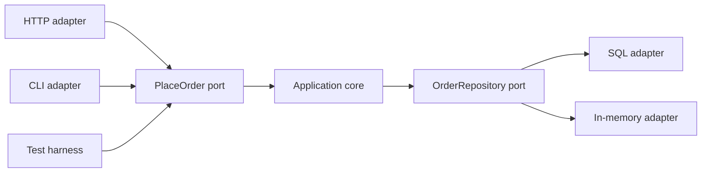
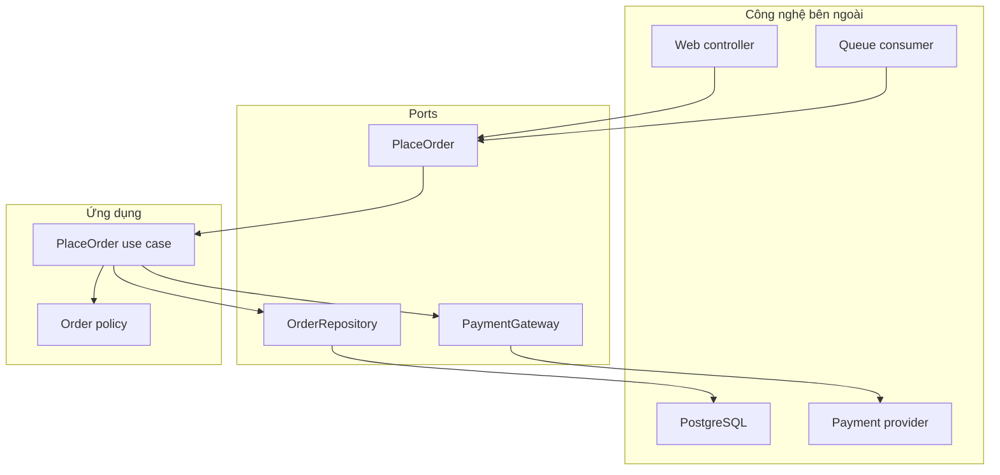
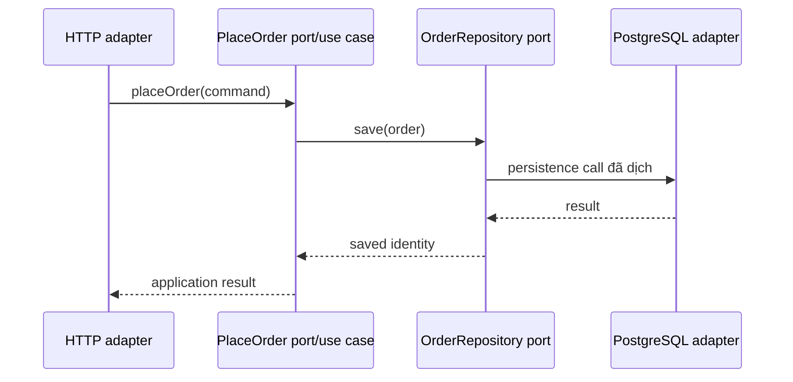
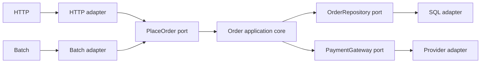

# Hexagonal Architecture: Đặt Công nghệ Ra Ngoài Ứng dụng

## Tóm tắt nhanh

Hexagonal Architecture, còn gọi là **Ports and Adapters**, tách hành vi có ý nghĩa của ứng dụng khỏi công nghệ dùng để kích hoạt nó hoặc được nó gọi tới.

Mental model:

```text
công nghệ bên ngoài
  -> adapter
  -> port theo mục đích
  -> hành vi ứng dụng
  -> port theo mục đích
  -> adapter
  -> công nghệ bên ngoài
```

Ứng dụng nên diễn đạt được một use case mà không cần biết nó được kích hoạt bởi HTTP, CLI, batch job, test harness hay chương trình khác. Tương tự, business behavior không nên cần biết persistence là PostgreSQL, fake trong bộ nhớ, file hay remote service.



Hình lục giác chỉ là cách vẽ. **Sáu cạnh không phải một quy tắc.** Bất đối xứng quan trọng là **bên trong và bên ngoài**, không phải trên/dưới hay chính xác sáu thành phần.

## 1. Port là một cuộc hội thoại có mục đích

<TermBox term="Port">
**Port** là protocol hướng về ứng dụng cho một cuộc hội thoại có mục đích rõ ràng.

Port mô tả ứng dụng có thể làm gì hoặc cần gì từ thế giới bên ngoài mà chưa cam kết transport, framework, database hay vendor SDK cụ thể.

**Vì sao quan trọng:** port ổn định cho phép nhiều công nghệ kết nối vào cùng một capability mà không kéo knowledge công nghệ vào core.
</TermBox>

Ví dụ:

- `PlaceOrder` — caller yêu cầu ứng dụng đặt đơn hàng;
- `LoadCustomer` — ứng dụng cần dữ liệu khách hàng;
- `ChargePayment` — ứng dụng cần thực hiện payment attempt;
- `PublishOrderPlaced` — ứng dụng phát ra outcome;
- `Clock` — ứng dụng cần current time qua contract kiểm soát được.

Port nên được đặt tên theo **mục đích**, không phải cơ chế.

Ưu tiên:

```text
ChargePayment
```

thay vì:

```text
CallStripeSdk
```

Ưu tiên:

```text
LoadCustomer
```

thay vì:

```text
RunCustomerSql
```

Cách đầu giữ ngôn ngữ ứng dụng. Cách sau đóng cứng implementation choice vào core contract.

## 2. Adapter dịch giữa port và công nghệ

<TermBox term="Adapter">
**Adapter** chuyển đổi giữa protocol của port và representation hoặc behavior của một công nghệ bên ngoài cụ thể.

Ví dụ gồm HTTP controller, CLI command, queue consumer, SQL repository, vendor SDK client, filesystem implementation hoặc in-memory fake.

**Vì sao quan trọng:** adapter hấp thụ thay đổi theo công nghệ để behavior ứng dụng có thể ổn định.
</TermBox>

Với một input port:

```text
PlaceOrder
```

các driving adapter có thể là:

```text
POST /orders
CLI: atlas order create
Batch import row
Automated acceptance test
```

Với một output port:

```text
OrderRepository
```

các driven adapter có thể là:

```text
PostgreSQL repository
In-memory repository
Remote order-store client
Test fake
```



## 3. Driving và driven trả lời câu hỏi “ai khởi phát cuộc hội thoại?”

Bài gốc của Cockburn dùng primary và secondary actor; chúng cũng thường được gọi là **driving** và **driven** side.

Một **driving adapter** chủ động kích hoạt capability của ứng dụng:

- HTTP controller;
- command-line command;
- scheduled job;
- message consumer;
- acceptance test harness.

Một **driven adapter** được ứng dụng gọi vì use case cần capability bên ngoài:

- repository;
- payment provider;
- email sender;
- object store;
- clock;
- message publisher.

Phân biệt này không phải “frontend với backend”.

Queue consumer là driving nếu incoming message kích hoạt use case. Queue publisher là driven nếu ứng dụng phát message qua nó.



## 4. Ứng dụng sở hữu semantics của port

Một lỗi phổ biến là copy framework interface hoặc vendor SDK shape thẳng vào core.

Output port yếu:

```ts
interface DatabasePort {
  query(sql: string, params: unknown[]): Promise<Row[]>;
}
```

Ứng dụng giờ biết SQL, row shape và persistence mechanics.

Contract có mục đích hơn:

```ts
interface OrderRepository {
  findById(id: OrderId): Promise<Order | null>;
  save(order: Order): Promise<void>;
}
```

Nó không bảo đảm abstraction hoàn hảo. Nó chỉ kéo contract về ngôn ngữ ứng dụng thay vì ngôn ngữ infrastructure.

Tương tự với input port. Không nên truyền raw Express/Fastify request object xuyên qua core nếu use case chỉ cần:

```ts
type PlaceOrderCommand = {
  customerId: string;
  lines: OrderLineInput[];
};
```

## 5. Dependency inversion làm dependency công nghệ hướng vào trong

<TermBox term="Dependency inversion">
**Đảo ngược phụ thuộc** nghĩa là high-level policy không phụ thuộc trực tiếp vào low-level technology detail. Hai bên gặp nhau tại abstraction có semantics hữu ích cho policy cấp cao.

Trong Hexagonal Architecture, ứng dụng định nghĩa port và adapter bên ngoài implement hoặc gọi port đó.

**Vì sao quan trọng:** compile-time dependency có thể hướng về application meaning dù runtime call cuối cùng vẫn đi tới database, network hay framework.
</TermBox>

Không có inversion:

```text
OrderService -> PostgreSQL client
OrderService -> Stripe SDK
OrderService -> Express response
```

Có ports:

```text
OrderService -> OrderRepository port <- PostgreSQL adapter
OrderService -> PaymentGateway port <- Stripe adapter
HTTP adapter -> PlaceOrder port <- OrderService
```

Runtime flow vẫn có thể đi từ core đến database. Khác biệt là core không compile dựa trên database implementation.

## 6. Composition root là nơi port gặp adapter cụ thể

Port không tự tạo adapter.

**Composition root** hoặc startup wiring location chọn implementation cụ thể:

```ts
const orderRepository = new PostgresOrderRepository(db);
const paymentGateway = new StripePaymentGateway(stripe);

const placeOrder = new PlaceOrderService({
  orderRepository,
  paymentGateway,
});

httpRouter.post('/orders', new PlaceOrderHttpAdapter(placeOrder));
```

Đây là nơi được phép biết cả application interface lẫn infrastructure implementation vì nhiệm vụ của nó là lắp ghép.

Không nên giấu global service locator khắp business code rồi gọi đó là dependency inversion. Dependency cần đủ tường minh để test và người đọc thấy use case thật sự cần gì.

## 7. Kiểm thử hexagonal là substitution tại boundary

Lợi ích lớn của Ports and Adapters là ứng dụng có thể chạy mà không cần final runtime device.

Use-case test nhanh có thể wire:

```text
Test harness -> PlaceOrder port -> Application -> In-memory repository
```

trong khi production path wire:

```text
HTTP adapter -> PlaceOrder port -> Application -> PostgreSQL repository
```

Application behavior không nên cần implementation khác chỉ vì adapter đổi.

Điều này **không** làm integration test biến mất.

Vẫn cần kiểm chứng:

- SQL adapter với database contract thật;
- HTTP adapter với routing/auth/serialization;
- vendor adapter với provider semantics;
- composition wiring;
- end-to-end critical path.

Hexagonal Architecture cho phép isolation. Nó không làm external system trở nên không quan trọng.

## 8. Fake hữu ích khi giữ đúng port semantics

In-memory adapter hữu ích khi behavior đủ gần port contract cho mục tiêu test.

Nhưng fake có thể nói dối.

In-memory repository có thể không tái hiện:

- transaction isolation;
- unique constraint;
- collation;
- query ordering;
- network timeout;
- provider idempotency semantics.

Vì vậy dùng nhiều tầng test có chủ đích:

```text
core test         -> fake adapter cho application rule
adapter test      -> dependency thật hoặc emulator đủ trung thực
integration test  -> ports + adapters đã lắp ghép
end-to-end        -> một số flow quan trọng
```

## 9. Không tạo port một cách máy móc

Không có quy tắc rằng mỗi method, entity hay database table đều cần một port.

Quá nhiều interface nhỏ tạo navigation cost mà không tăng isolation.

Nên cân nhắc port khi có conversation thật sự đi qua application boundary, đặc biệt khi:

- công nghệ bên ngoài dễ thay đổi;
- capability cần nhiều adapter;
- core cần isolation cho test;
- ownership/policy thuộc bên trong nhưng mechanism thuộc bên ngoài;
- runtime behavior cần thay thế theo environment.

Một library ổn định, đơn giản nằm trong core không tự động cần interface.

## 10. Port không xóa distributed-system semantics

Đổi `StripeSdk` thành `PaymentGateway` không làm payment trở thành atomic.

Port vẫn phải thể hiện semantics liên quan như:

- timeout và ambiguous outcome;
- idempotency requirement;
- retry safety;
- consistency/freshness;
- failure category;
- giới hạn cancellation/compensation.

Abstraction yếu:

```ts
charge(): Promise<boolean>
```

nếu hệ thật có thể trả success, decline, timeout với outcome chưa biết hoặc retryable failure.

Architecture nên giấu technology detail không cần thiết, không giấu failure semantics có ý nghĩa nghiệp vụ.

## 11. Hexagonal và Layered Architecture có thể cùng tồn tại

Hexagonal Architecture không đơn giản là “đối lập với layers”.

Một module có thể dùng layers bên trong và vẫn có ports quanh application boundary:

```text
HTTP adapter
   |
input port
   |
application/use-case layer
   |
domain policy
   |
output port
   |
SQL adapter
```

Khác biệt về trọng tâm:

- layering nhấn mạnh responsibility và dependency path được phép;
- Hexagonal Architecture nhấn mạnh boundary trong/ngoài và adapter thay thế được quanh port có mục đích.

Chọn view giúp dependency problem dễ suy luận hơn.

## 12. Production failure: core biến thành HTTP + ORM script

Một checkout endpoint ban đầu rất đơn giản:

```text
HTTP controller
  -> validate request
  -> chạy ORM query
  -> tính discount
  -> gọi payment SDK
  -> update ORM rows
  -> serialize response
```

Theo thời gian discount policy, retry rule, provider error mapping, persistence sequence và response formatting cùng sống trong controller/service pair. Test phải boot web framework và database chỉ để kiểm tra một pricing rule.

Sau đó hệ thống thêm batch-order importer và phải duplicate policy vì entry point duy nhất đòi HTTP request/response object.

**Hậu quả:** pricing change cần HTTP integration test, batch và web path drift, payment ambiguity được xử lý khác nhau giữa adapters, và thay persistence buộc chạm business logic.

**Nguyên nhân cốt lõi:** external mechanism trở thành application API. Không có application port ổn định cho use case và không có output port diễn đạt persistence/payment need bằng ngôn ngữ ứng dụng.

**Cách khắc phục chuẩn:** định nghĩa input port `PlaceOrder` quanh use case, giữ order policy bên trong, định nghĩa output port có mục đích như `OrderRepository` và `PaymentGateway`, dịch HTTP/batch input ở driving adapter, implement SQL/provider detail ở driven adapter, và chỉ wire implementation cụ thể tại composition root.



## 13. Tự kiểm tra

<details>
<summary>Hexagonal Architecture có yêu cầu sáu port hay sáu adapter không?</summary>

Không. Hình lục giác chỉ tạo không gian để vẽ nhiều port và nhấn mạnh boundary trong/ngoài. Con số sáu không có ý nghĩa kiến trúc.
</details>

<details>
<summary>Nếu HTTP controller gọi một use-case interface thì hệ thống tự động là hexagonal chưa?</summary>

Chưa. Core còn phải tránh leak framework/storage/vendor concern qua contract. Controller gọi `execute(req, res, entityManager)` vẫn kéo external mechanism vào application boundary.
</details>

<details>
<summary>Mọi dependency có nên được bọc sau custom interface không?</summary>

Không. Tạo port cho application-boundary conversation có ý nghĩa và khi có nhu cầu volatility/isolation thật. Bọc mọi library ổn định chỉ tạo ceremony.
</details>

## 14. Checklist production

- [ ] Input port mô tả use case hoặc application capability thay vì HTTP/framework mechanics.
- [ ] Output port mô tả điều ứng dụng cần thay vì vendor/database command API.
- [ ] Driving adapter dịch external trigger thành application command.
- [ ] Driven adapter dịch application need thành operation của công nghệ bên ngoài.
- [ ] Business policy chạy được mà không boot final UI, database hay network provider.
- [ ] Adapter integration test cover semantics mà fake không tái hiện được.
- [ ] Runtime failure semantics không bị che mất bởi port quá đơn giản.
- [ ] Concrete adapter được lắp ghép tại composition root tường minh.
- [ ] Team giải thích được vì sao mỗi port tồn tại; interface không được tạo máy móc.
- [ ] Thiết kế hiểu “hexagonal” là kiểm soát dependency trong/ngoài, không phải template sáu thành phần.

## Agent rule

Khi đề xuất Hexagonal Architecture, hãy nêu **application capability**, **driving adapter**, **driven dependency port**, và **runtime semantics phải giữ lộ ra**. Không đề xuất port chỉ để bọc mọi library hoặc framework call.

## Nguồn

- Alistair Cockburn, [Hexagonal Architecture: bài gốc năm 2005](https://alistair.cockburn.us/hexagonal-architecture/)
- Microsoft Learn, [Common web application architectures](https://learn.microsoft.com/en-us/dotnet/architecture/modern-web-apps-azure/common-web-application-architectures)
- Martin Fowler, [Badri on Hexagonal Rails](https://martinfowler.com/articles/badri-hexagonal/)
