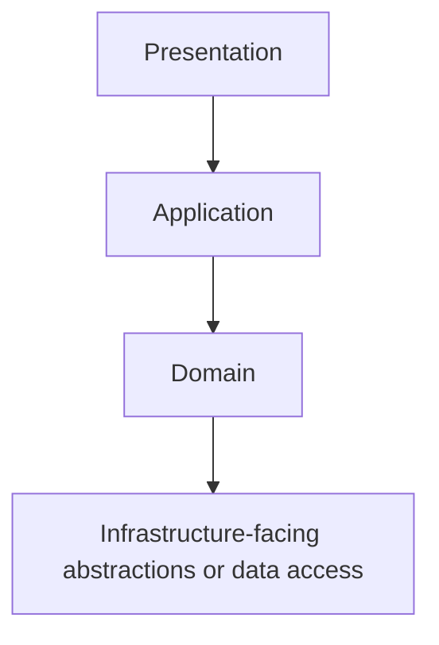
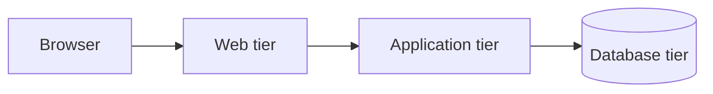
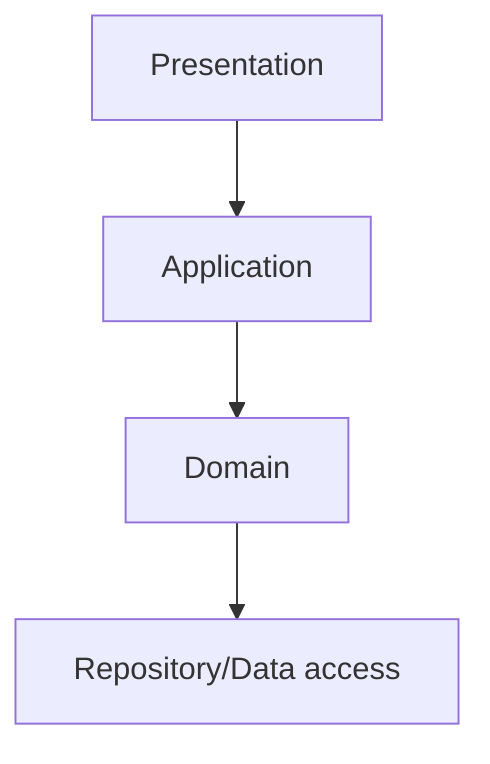
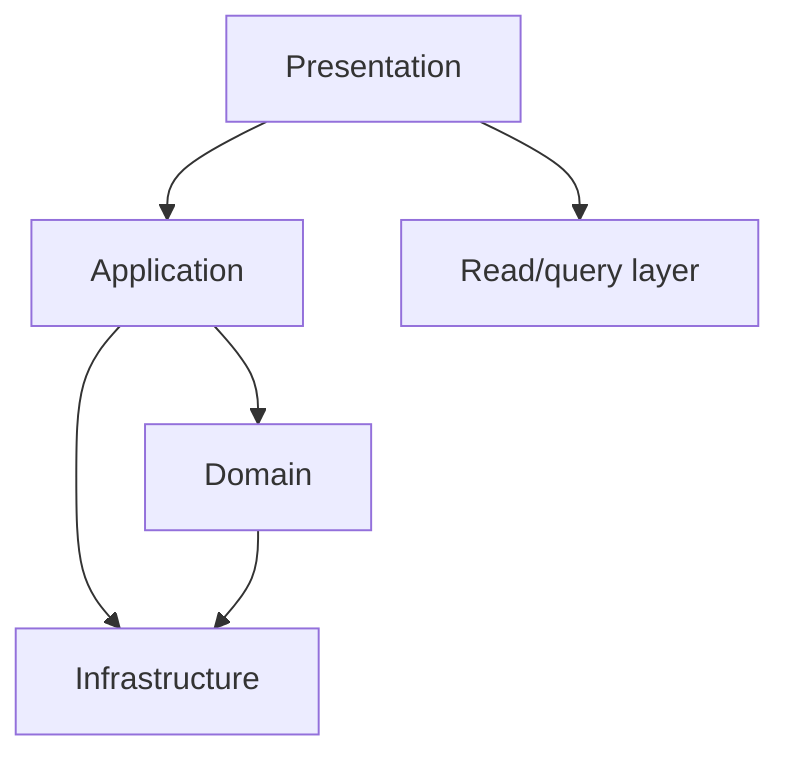
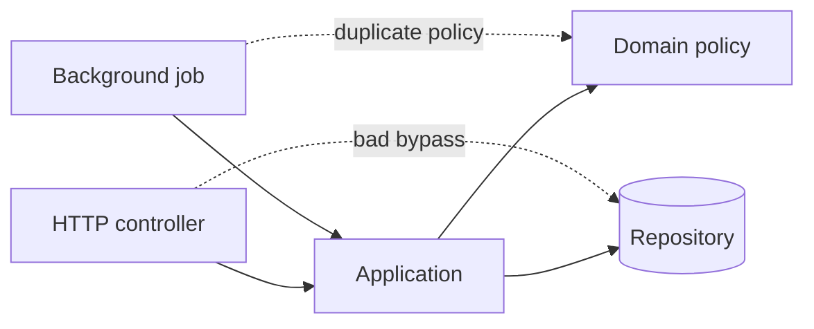

# Layered Architecture: Make Dependency Direction Explicit

## TL;DR

Layered architecture organizes responsibilities into **logical layers** and constrains which directions dependencies may flow.

A common shape is:

```text
Presentation
    |
Application
    |
Domain
    |
Infrastructure
```

But the value is not the folder names. The value is the **dependency rule** and the responsibility each layer owns.



A healthy layered design should answer:

- which layer owns each decision;
- which direction calls and imports may flow;
- when bypassing a layer is allowed;
- where transactions and mappings begin/end;
- how cross-cutting concerns are applied without creating sideways dependencies;
- when horizontal layers are making feature changes harder rather than easier.

## 1. A layer is a logical responsibility boundary

<TermBox term="Layer">
A **layer** is a logical grouping of responsibilities with an intended dependency relationship to other groups.

A layer can exist inside one process, package, deployable, or repository. It does not need a network boundary.

**Why it matters:** layering gives teams a simple rule for where code belongs and which dependencies are permitted.
</TermBox>

Typical responsibilities might be:

| Layer | Primary responsibility |
| --- | --- |
| Presentation | HTTP/UI input, protocol concerns, response formatting |
| Application | Orchestrate use cases and transaction boundaries |
| Domain | Business policy, invariants, decisions |
| Infrastructure | Database, queues, files, external services, framework adapters |

These names are conventional, not universal.

A system may instead use:

```text
API -> Services -> Data Access
```

or:

```text
UI -> Business -> Persistence
```

The important part is that each team can explain what belongs in each layer and why.

## 2. Layer is not the same thing as tier

<TermBox term="Layer vs tier">
A **layer** is a logical organization of responsibilities. A **tier** is a physical deployment boundary, usually separated by process, machine, network, or scaling boundary.

One tier may host several layers. One logical layer may also be distributed across more than one tier.
</TermBox>

For example, this is still layered even if everything runs in one process:

```text
single deployable
  presentation/
  application/
  domain/
  infrastructure/
```

And this is multi-tier:



Do not create network hops just because code is organized into layers.

Physical separation adds latency, failure modes, deployment coordination, observability needs, and security boundaries. Those require separate justification.

## 3. The dependency rule is the architecture

<TermBox term="Dependency rule">
A **dependency rule** states which layers may depend on which other layers.

Without such a rule, folders named `controllers`, `services`, and `repositories` may look layered while arbitrary imports silently erase the boundary.
</TermBox>

Example rule:

```text
presentation -> application
application -> domain
infrastructure -> domain contracts
presentation !-> infrastructure internals
```

The exact arrows depend on the architecture style.

Classic N-tier designs often let higher layers call lower layers directly. Designs influenced by dependency inversion may make infrastructure implement contracts owned by an inner policy layer.

Do not mix these models accidentally. Write the rule down.

## 4. Strict and relaxed layering solve different problems

**Strict layering** means a layer may call only the next permitted adjacent layer.



Benefits:

- fewer dependency paths;
- easier replacement of intermediate policies;
- clearer enforcement;
- lower chance callers learn deep internals.

Costs:

- pass-through layers can appear;
- simple reads may require unnecessary plumbing;
- extra network latency if layers are also physical tiers.

**Relaxed layering** allows a layer to skip one or more lower layers when the contract permits it.



Benefits:

- less ceremony for simple paths;
- fewer pass-through calls;
- practical for read models and integration paths.

Costs:

- more dependency edges;
- easier boundary erosion;
- callers may learn deeper implementation details.

Choose deliberately. “Always strict” and “anything may call anything” are both weak policies.

## 5. Presentation should translate protocols, not own business policy

Presentation code typically handles:

- HTTP routing and status codes;
- authentication context extraction;
- request parsing and validation of protocol shape;
- serialization;
- UI formatting;
- translating application errors to protocol responses.

A controller can reject malformed JSON or an invalid UUID format.

But a rule such as:

```text
A trial account may create at most 3 active projects.
```

belongs with the business/application policy that must be consistent across HTTP, background jobs, CLI tools, and future APIs.

If the rule lives only in the controller, another entry point can bypass it.

## 6. Application layer coordinates a use case

The application layer is a useful home for workflow orchestration:

```text
receive command
  -> load required state
  -> invoke domain policy
  -> persist changes
  -> enqueue/publish durable follow-up work
  -> return use-case result
```

It should usually answer questions such as:

- What is the unit of work?
- Which domain objects participate?
- Where does the transaction boundary start and end?
- Which side effects happen before commit?
- Which side effects must be deferred/outboxed?
- What result does the caller receive?

It should not become a dumping ground for every business rule.

If application services contain all decisions while the domain layer contains only data classes, the architecture may be “layered” in folders but not in responsibility.

## 7. Domain layer owns business decisions and invariants

The domain layer should contain policy that should remain consistent regardless of transport or storage.

Examples:

```text
Can this subscription be paused?
Can this order transition from PAID to CANCELED?
How is a price rounded?
Which permissions allow this state transition?
```

A domain rule should not require an HTTP request object to execute.

It should also avoid depending unnecessarily on database driver types, ORM sessions, message-broker clients, or framework lifecycle objects.

That keeps policy testable and prevents infrastructure changes from rewriting business logic.

## 8. Infrastructure layer owns mechanisms, not business meaning

Infrastructure concerns include:

- SQL/ORM implementations;
- object storage;
- message queues;
- email providers;
- caches;
- clocks and external API clients;
- framework adapters.

A repository implementation may know SQL table names.

The business policy should not.

A mail adapter may know provider retry headers.

The password-reset policy should not.

This boundary allows mechanisms to change more often than business meaning.

## 9. Mapping belongs at boundaries

Leaking one representation through every layer creates hidden coupling.

Common representations include:

- HTTP DTOs;
- application commands/results;
- domain objects/value types;
- persistence rows/entities;
- event payloads;
- external-provider schemas.

A useful flow might be:

```text
HTTP DTO
  -> application command
  -> domain values/entities
  -> persistence mapping
```

Mapping has a cost. Do not create five identical classes just to satisfy a diagram.

But mapping is valuable when representations have different reasons to change.

For example, a database column rename should not automatically break a public API contract.

## 10. Transaction boundaries should follow use cases, not repository calls

A common layered failure is allowing each repository method to independently open and commit its own transaction.

Suppose `PlaceOrder` requires:

1. create order;
2. reserve inventory;
3. record payment intent metadata.

If each repository commits independently, the application can stop halfway and violate invariants.

A stronger model is:

```text
application use case
  -> begin unit of work
  -> call domain + repositories
  -> verify outcome
  -> commit once
```

That does not mean every use case needs one database transaction. Remote side effects cannot be made atomic by pretending they share a transaction.

Use outbox/saga/idempotency patterns where cross-system boundaries require them.

## 11. Bypasses are where layered systems decay

A bypass happens when code jumps around the intended responsibility owner.

Examples:

```text
Controller -> database table directly
Background job -> presentation helper
Repository -> HTTP client with business branching
Domain model -> framework request context
```

The problem is not merely an “illegal import.”

The deeper problem is that responsibility becomes duplicated or fragmented.



A boundary rule should make the intended route easier than the bypass.

## 12. Cross-cutting concerns should cross execution, not ownership

Logging, tracing, authorization context, metrics, retries, caching, and transactions may appear across many layers.

That does not mean every layer should own its own independent version of the policy.

Useful techniques include:

- middleware/interceptors for protocol-wide behavior;
- decorators around application handlers;
- infrastructure adapters;
- shared observability primitives;
- explicit policy objects for authorization or retry rules.

Avoid a “utils” layer that becomes a new horizontal dependency for unrelated concerns.

Cross-cutting mechanisms still need ownership and contracts.

## 13. Horizontal layers can fight feature locality

Layered architecture optimizes for separation by **technical responsibility**.

But a feature change may then span:

```text
controllers/
services/
domain/
repositories/
```

If most work repeatedly changes all four, the structure can increase coordination.

Feature-oriented modules or vertical slices may improve locality:

```text
subscriptions/
  presentation/
  application/
  domain/
  infrastructure/
```

This is not anti-layering.

Layers can exist **inside a feature module**.

The decision is about which axis should dominate navigation and ownership.

## 14. When layered architecture fits well

Layered architecture is useful when:

- responsibilities are well understood;
- one deployable is appropriate;
- the team benefits from a simple dependency model;
- business policy should be separated from protocols and data access;
- the system resembles a traditional enterprise or CRUD-heavy application;
- migration cost favors an incremental architecture rather than a major rewrite.

It is less attractive when:

- feature work constantly cuts across every horizontal layer;
- layers are mostly pass-through code;
- independent deployment/scaling is a real requirement;
- domain workflows need ports/adapters around many external systems;
- teams need stronger business-capability ownership than technical-layer ownership.

## 15. Production failure: the controller bypassed the policy layer

An admin endpoint was added to reactivate suspended subscriptions.

The normal path was:

```text
HTTP -> SubscriptionApplication -> SubscriptionPolicy -> Repository
```

The new endpoint was considered “simple” and wrote the database directly:

```text
HTTP -> subscriptions table
```

It set `status = ACTIVE` but skipped the rule that required an up-to-date payment method and reset a fraud-review flag.

A nightly billing job later charged accounts that should have remained suspended.

**Impact:** suspended accounts were incorrectly reactivated and charged, support had to reverse payments, and the team could no longer trust subscription status as evidence that activation invariants had run.

**Root cause:** the layer boundary was treated as ceremony instead of an ownership rule. The presentation layer bypassed the application/domain policy and wrote persistence state directly.

**Correct pattern:** route every state-changing entry point through the same application capability, keep activation invariants with the policy owner, prohibit presentation-to-persistence writes, and add a boundary test that exercises HTTP and background entry points against the same use-case contract.

## 16. Self-check

<details>
<summary>If every layer has a folder, is the system layered?</summary>

No. Layering is defined by responsibility and dependency rules. If presentation code imports ORM entities and writes tables directly, folder names do not preserve the architecture.
</details>

<details>
<summary>Should strict layering always be preferred?</summary>

No. Strict layering limits dependency paths, but can create pass-through layers and unnecessary overhead. Relaxed layering can be appropriate when bypasses are explicit, safe, and do not leak ownership or volatile internals.
</details>

<details>
<summary>Are layers and tiers interchangeable terms?</summary>

No. Layers are logical responsibility boundaries. Tiers are physical deployment boundaries. They may align, but they do not have to.
</details>

<details>
<summary>Does feature-oriented packaging mean abandoning layers?</summary>

No. A feature module can contain its own presentation, application, domain, and infrastructure boundaries. The question is which axis should dominate change locality and ownership.
</details>

## 17. Production checklist

- [ ] Each layer has a documented responsibility.
- [ ] The dependency rule is explicit and reviewable.
- [ ] Layer and tier terminology is not conflated.
- [ ] Strict vs relaxed bypass rules are deliberate.
- [ ] Presentation code does not own business invariants.
- [ ] Application services define clear use-case and transaction boundaries.
- [ ] Domain policy avoids unnecessary framework/storage dependencies.
- [ ] Infrastructure details stay behind owned contracts where useful.
- [ ] DTO/domain/persistence mapping exists where representations have different reasons to change.
- [ ] Cross-cutting concerns have explicit owners rather than ad hoc helpers.
- [ ] Forbidden bypasses can be detected by tests, lint rules, or dependency checks.
- [ ] Feature changes are reviewed for horizontal-layer coordination cost.

## Agent rule

When an agent adds code to a layered system, it should identify **which layer owns the decision, which dependency edge is being added, whether the edge follows the documented rule, and whether a bypass duplicates business policy**. Do not add another pass-through layer solely to satisfy folder symmetry.

## Sources

- Microsoft Learn, [N-tier architecture style](https://learn.microsoft.com/en-us/azure/architecture/guide/architecture-styles/n-tier).
- Microsoft Learn, [Architecture styles](https://learn.microsoft.com/en-us/azure/architecture/guide/architecture-styles/).
- Martin Fowler, *Patterns of Enterprise Application Architecture*, Layering chapter and related patterns.
