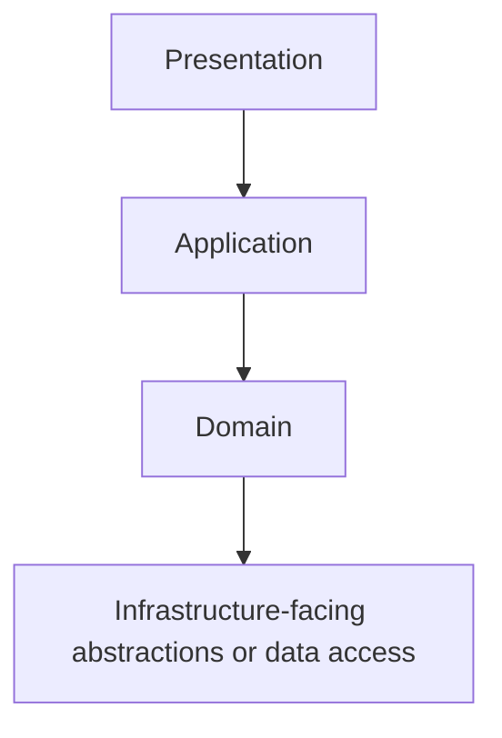
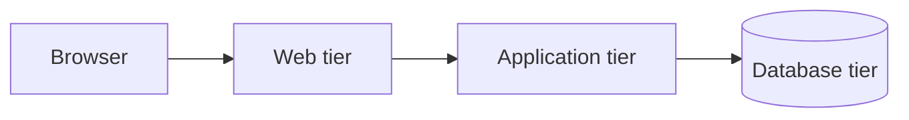
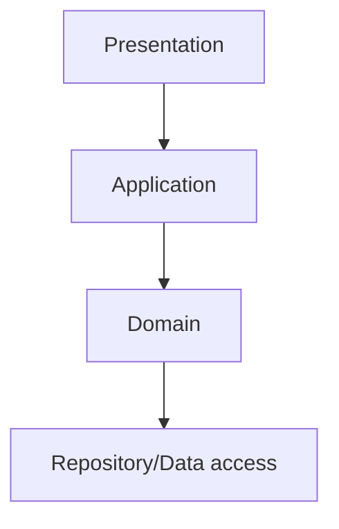
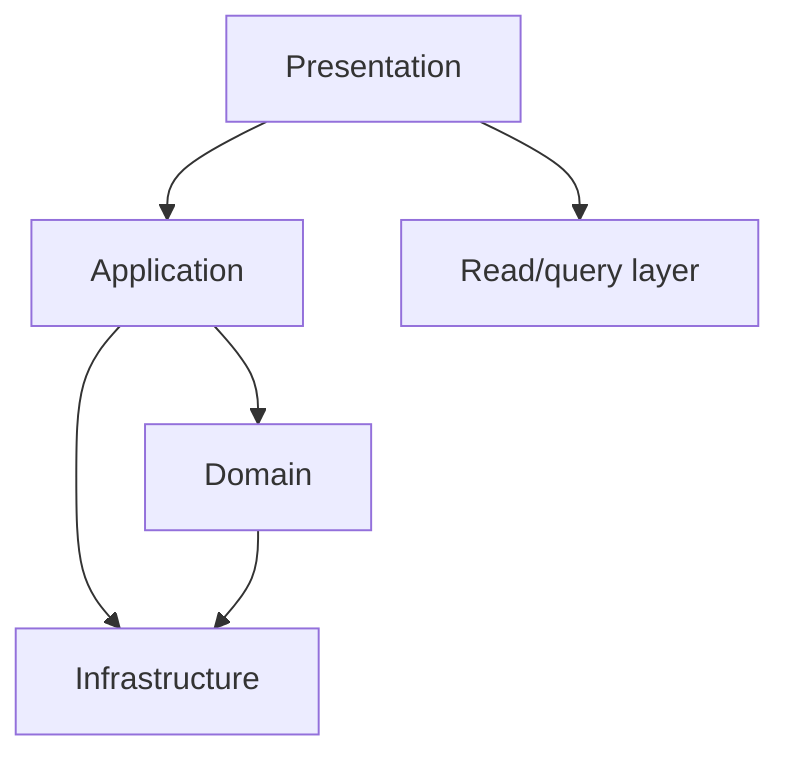
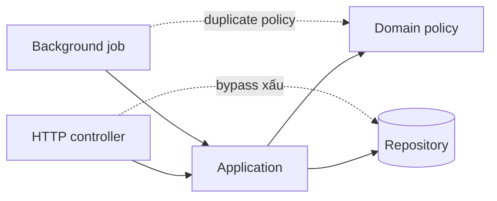

# Layered Architecture: Làm Hướng Phụ thuộc Trở nên Tường minh

## Tóm tắt nhanh

Layered architecture tổ chức responsibility thành các **layer logic** và quy định dependency được phép đi theo hướng nào.

Một cấu trúc phổ biến:

```text
Presentation
    |
Application
    |
Domain
    |
Infrastructure
```

Giá trị không nằm ở tên folder. Giá trị nằm ở **quy tắc phụ thuộc** và responsibility mà mỗi layer sở hữu.



Một layered design lành mạnh cần trả lời được:

- decision nào thuộc layer nào;
- call/import được phép đi theo hướng nào;
- khi nào được phép bypass một layer;
- transaction và mapping bắt đầu/kết thúc ở đâu;
- cross-cutting concern được áp dụng thế nào mà không tạo dependency ngang;
- khi nào horizontal layer làm change locality tệ hơn thay vì tốt hơn.

## 1. Layer là ranh giới responsibility logic

<TermBox term="Layer">
**Layer** là nhóm responsibility logic có dependency relationship dự kiến với những nhóm khác.

Layer có thể nằm trong một process, package, deployable hoặc repository. Nó không cần network boundary.

**Vì sao quan trọng:** layering cho team một rule đơn giản về code nên nằm ở đâu và dependency nào được phép tồn tại.
</TermBox>

Một cách phân chia thường gặp:

| Layer | Responsibility chính |
| --- | --- |
| Presentation | HTTP/UI input, protocol concern, response formatting |
| Application | Orchestrate use case và transaction boundary |
| Domain | Business policy, invariant, decision |
| Infrastructure | Database, queue, file, external service, framework adapter |

Tên gọi chỉ là convention, không phải chuẩn bắt buộc.

Hệ thống khác có thể dùng:

```text
API -> Services -> Data Access
```

hoặc:

```text
UI -> Business -> Persistence
```

Điểm quan trọng là team giải thích được code thuộc layer nào và vì sao.

## 2. Layer không giống tier

<TermBox term="Layer vs tier">
**Layer** là cách tổ chức responsibility về mặt logic. **Tier** là physical deployment boundary, thường được tách bằng process, machine, network hoặc scaling boundary.

Một tier có thể host nhiều layer. Một logical layer cũng có thể trải trên nhiều tier.
</TermBox>

Ví dụ này vẫn là layered architecture dù chạy trong một process:

```text
single deployable
  presentation/
  application/
  domain/
  infrastructure/
```

Còn đây là multi-tier:



Đừng tạo network hop chỉ vì code được chia thành layer.

Physical separation làm tăng latency, failure mode, deployment coordination, observability need và security boundary. Các chi phí đó cần lý do riêng.

## 3. Dependency rule mới là phần kiến trúc quan trọng

<TermBox term="Dependency rule">
**Quy tắc phụ thuộc** mô tả layer nào được phép phụ thuộc vào layer nào.

Nếu không có rule này, các folder tên `controllers`, `services`, `repositories` có thể trông rất “layered” nhưng arbitrary import vẫn xóa sạch boundary.
</TermBox>

Ví dụ rule:

```text
presentation -> application
application -> domain
infrastructure -> domain contracts
presentation !-> infrastructure internals
```

Arrow cụ thể phụ thuộc architecture style.

Classic N-tier thường cho upper layer gọi lower layer. Thiết kế dùng dependency inversion có thể để infrastructure implement contract do policy layer bên trong sở hữu.

Không nên trộn hai model này một cách vô thức. Hãy ghi dependency rule ra rõ ràng.

## 4. Strict và relaxed layering giải quyết trade-off khác nhau

**Strict layering** nghĩa là layer chỉ gọi layer liền kề được phép tiếp theo.



Lợi ích:

- ít dependency path hơn;
- intermediate policy dễ thay thế hơn;
- enforcement rõ;
- caller ít biết deep internals hơn.

Chi phí:

- dễ xuất hiện pass-through layer;
- simple read có thể phải đi qua plumbing không cần thiết;
- tăng network latency nếu layer cũng là physical tier.

**Relaxed layering** cho phép một layer skip một hoặc nhiều lower layer nếu contract cho phép.



Lợi ích:

- bớt ceremony ở simple path;
- giảm pass-through call;
- thực tế cho read model và integration path.

Chi phí:

- nhiều dependency edge hơn;
- boundary dễ bị erosion;
- caller có thể học quá nhiều implementation detail.

Hãy chọn có chủ đích. “Luôn strict” và “gọi đâu cũng được” đều là policy yếu.

## 5. Presentation layer dịch protocol, không sở hữu business policy

Presentation thường xử lý:

- HTTP route và status code;
- lấy authentication context;
- parse request và validate protocol shape;
- serialization;
- UI formatting;
- map application error thành protocol response.

Controller có thể reject JSON sai hoặc UUID sai format.

Nhưng rule như:

```text
Trial account chỉ được tạo tối đa 3 project đang active.
```

nên thuộc business/application policy để nhất quán giữa HTTP, background job, CLI và future API.

Nếu rule chỉ nằm trong controller, entry point khác có thể bypass nó.

## 6. Application layer điều phối use case

Application layer phù hợp cho workflow orchestration:

```text
nhận command
  -> load state cần thiết
  -> gọi domain policy
  -> persist change
  -> enqueue/publish durable follow-up work
  -> trả use-case result
```

Layer này thường trả lời:

- Unit of work là gì?
- Domain object nào tham gia?
- Transaction boundary bắt đầu/kết thúc ở đâu?
- Side effect nào xảy ra trước commit?
- Side effect nào cần defer/outbox?
- Caller nhận result nào?

Application service không nên thành nơi chứa mọi business rule.

Nếu toàn bộ decision nằm ở application service còn domain chỉ có data class, folder có thể layered nhưng responsibility thì không.

## 7. Domain layer sở hữu business decision và invariant

Domain layer nên chứa policy phải nhất quán bất kể transport hay storage.

Ví dụ:

```text
Subscription có được pause không?
Order có được chuyển từ PAID sang CANCELED không?
Price được rounding thế nào?
Permission nào cho phép state transition này?
```

Domain rule không nên cần HTTP request object.

Nó cũng nên tránh phụ thuộc không cần thiết vào database driver type, ORM session, message-broker client hay framework lifecycle object.

Nhờ đó policy dễ test và infrastructure change ít ép business logic phải viết lại.

## 8. Infrastructure layer sở hữu mechanism, không sở hữu business meaning

Infrastructure concern gồm:

- SQL/ORM implementation;
- object storage;
- message queue;
- email provider;
- cache;
- clock và external API client;
- framework adapter.

Repository implementation có thể biết SQL table name. Business policy không cần biết.

Mail adapter có thể biết provider retry header. Password-reset policy không cần biết.

Boundary này cho phép mechanism thay đổi nhanh hơn business meaning.

## 9. Mapping nên nằm ở boundary

Để một representation leak xuyên mọi layer tạo hidden coupling.

Representation thường gặp:

- HTTP DTO;
- application command/result;
- domain object/value type;
- persistence row/entity;
- event payload;
- external-provider schema.

Flow hợp lý có thể là:

```text
HTTP DTO
  -> application command
  -> domain values/entities
  -> persistence mapping
```

Mapping có chi phí. Không nên tạo năm class giống hệt nhau chỉ để “đúng sơ đồ”.

Nhưng mapping hữu ích khi representation có reason-to-change khác nhau.

Ví dụ database column rename không nên tự động phá public API contract.

## 10. Transaction boundary nên theo use case, không theo từng repository call

Layered failure phổ biến là mỗi repository method tự mở và commit transaction.

Giả sử `PlaceOrder` cần:

1. tạo order;
2. reserve inventory;
3. ghi payment intent metadata.

Nếu từng repository commit độc lập, flow có thể dừng giữa chừng và phá invariant.

Model mạnh hơn:

```text
application use case
  -> begin unit of work
  -> gọi domain + repositories
  -> verify outcome
  -> commit một lần
```

Điều này không có nghĩa mọi use case đều cần một database transaction. Remote side effect không thể trở nên atomic chỉ vì ta giả vờ chúng dùng chung transaction.

Dùng outbox/saga/idempotency khi cross-system boundary yêu cầu.

## 11. Bypass là nơi layered system bắt đầu mục ruỗng

Bypass xảy ra khi code đi vòng qua responsibility owner dự kiến.

Ví dụ:

```text
Controller -> database table trực tiếp
Background job -> presentation helper
Repository -> HTTP client kèm business branching
Domain model -> framework request context
```

Vấn đề không chỉ là “illegal import”. Vấn đề sâu hơn là responsibility bị duplicate hoặc phân mảnh.



Boundary rule nên khiến intended path dễ dùng hơn bypass.

## 12. Cross-cutting concern nên cắt execution, không cắt ownership

Logging, tracing, authorization context, metrics, retry, cache và transaction có thể xuất hiện xuyên nhiều layer.

Điều đó không có nghĩa mỗi layer tự sở hữu một phiên bản policy riêng.

Technique hữu ích:

- middleware/interceptor cho protocol-wide behavior;
- decorator quanh application handler;
- infrastructure adapter;
- shared observability primitive;
- explicit policy object cho authorization/retry rule.

Tránh tạo “utils layer” làm dependency ngang mới cho các concern không liên quan.

Cross-cutting mechanism vẫn cần owner và contract.

## 13. Horizontal layer có thể chống lại feature locality

Layered architecture tối ưu separation theo **technical responsibility**.

Nhưng một feature change có thể phải chạm:

```text
controllers/
services/
domain/
repositories/
```

Nếu hầu hết work đều đổi cả bốn, structure có thể tăng coordination.

Feature-oriented module hoặc vertical slice có thể local hơn:

```text
subscriptions/
  presentation/
  application/
  domain/
  infrastructure/
```

Đây không phải chống layering. Layer có thể tồn tại **bên trong feature module**.

Decision là axis nào nên chi phối navigation và ownership.

## 14. Khi nào layered architecture phù hợp

Layered architecture phù hợp khi:

- responsibility tương đối rõ;
- một deployable là hợp lý;
- team cần dependency model đơn giản;
- business policy cần tách khỏi protocol và data access;
- hệ thống giống traditional enterprise hoặc CRUD-heavy application;
- migration cost ưu tiên incremental architecture thay vì rewrite lớn.

Nó kém hấp dẫn hơn khi:

- feature work liên tục cắt qua mọi horizontal layer;
- layer chủ yếu là pass-through code;
- independent deployment/scaling là requirement thật;
- domain workflow cần nhiều port/adapter quanh external system;
- team cần business-capability ownership mạnh hơn technical-layer ownership.

## 15. Production failure: controller bypass policy layer

Một admin endpoint được thêm để reactivate suspended subscription.

Path bình thường:

```text
HTTP -> SubscriptionApplication -> SubscriptionPolicy -> Repository
```

Endpoint mới bị xem là “đơn giản” nên write database trực tiếp:

```text
HTTP -> subscriptions table
```

Nó set `status = ACTIVE` nhưng bỏ qua rule yêu cầu payment method còn hợp lệ và reset fraud-review flag.

Nightly billing job sau đó charge các account lẽ ra vẫn phải suspended.

**Hậu quả:** account bị reactivate và charge sai, support phải reverse payment, và team không còn tin `subscription.status` chứng minh activation invariant đã chạy.

**Nguyên nhân cốt lõi:** layer boundary bị coi là ceremony thay vì ownership rule. Presentation layer bypass application/domain policy và write persistence state trực tiếp.

**Cách khắc phục chuẩn:** route mọi state-changing entry point qua cùng application capability, giữ activation invariant ở policy owner, cấm presentation-to-persistence write, và thêm boundary test để HTTP/background entry point cùng chạy qua một use-case contract.

## 16. Tự kiểm tra

<details>
<summary>Nếu mọi layer đều có folder riêng thì hệ thống đã layered chưa?</summary>

Chưa. Layering được xác định bởi responsibility và dependency rule. Nếu presentation import ORM entity rồi write table trực tiếp, folder name không giữ được architecture.
</details>

<details>
<summary>Có nên luôn ưu tiên strict layering?</summary>

Không. Strict layering giới hạn dependency path nhưng có thể tạo pass-through layer và overhead. Relaxed layering có thể phù hợp nếu bypass được định nghĩa rõ, an toàn và không leak ownership/volatile internal.
</details>

<details>
<summary>Layer và tier có phải cùng một khái niệm?</summary>

Không. Layer là logical responsibility boundary. Tier là physical deployment boundary. Chúng có thể align nhưng không bắt buộc.
</details>

<details>
<summary>Package theo feature có nghĩa là bỏ layering?</summary>

Không. Một feature module có thể chứa presentation, application, domain và infrastructure boundary riêng. Câu hỏi là axis nào nên chi phối change locality và ownership.
</details>

## 17. Checklist production

- [ ] Mỗi layer có responsibility được mô tả rõ.
- [ ] Dependency rule tường minh và review được.
- [ ] Không đánh đồng layer với tier.
- [ ] Strict vs relaxed bypass rule được chọn có chủ đích.
- [ ] Presentation code không sở hữu business invariant.
- [ ] Application service có use-case và transaction boundary rõ.
- [ ] Domain policy tránh framework/storage dependency không cần thiết.
- [ ] Infrastructure detail nằm sau owned contract khi phù hợp.
- [ ] DTO/domain/persistence mapping tồn tại nơi representation có reason-to-change khác nhau.
- [ ] Cross-cutting concern có owner thay vì ad hoc helper.
- [ ] Forbidden bypass có thể được phát hiện bằng test, lint rule hoặc dependency check.
- [ ] Feature change được review về horizontal-layer coordination cost.

## Quy tắc cho agent

Khi agent thêm code vào layered system, nó phải nêu rõ **layer nào sở hữu decision, dependency edge nào đang được thêm, edge có tuân documented rule hay không, và bypass có làm duplicate business policy hay không**. Không thêm pass-through layer chỉ để folder tree cân đối.

## Nguồn tham khảo

- Microsoft Learn, [N-tier architecture style](https://learn.microsoft.com/en-us/azure/architecture/guide/architecture-styles/n-tier).
- Microsoft Learn, [Architecture styles](https://learn.microsoft.com/en-us/azure/architecture/guide/architecture-styles/).
- Martin Fowler, *Patterns of Enterprise Application Architecture*, phần Layering và các pattern liên quan.
