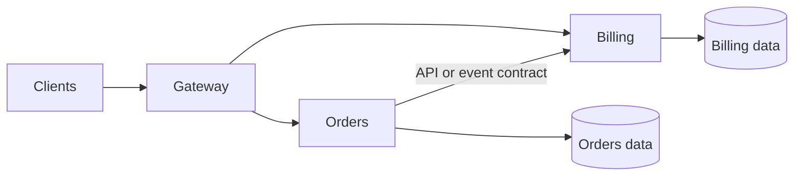
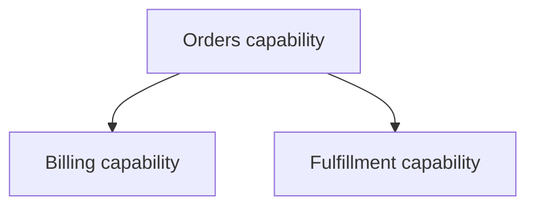
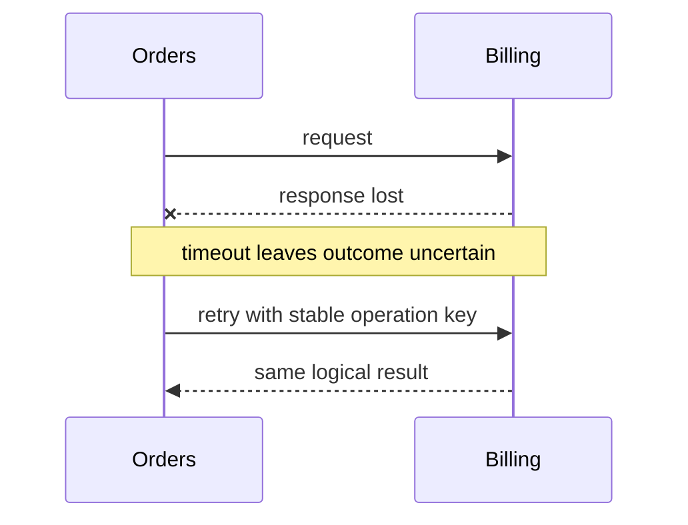
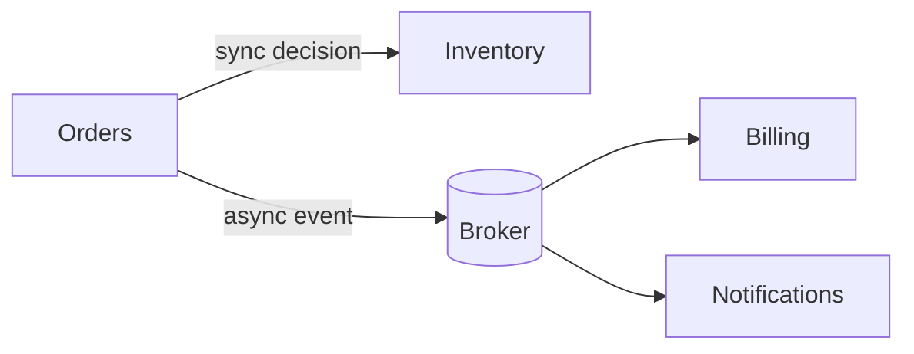

# Microservices: Independent Deployment Boundaries

The true acid test of a microservices architecture is uncompromising: can Team A ship Service A to production at 10:00 AM on a Tuesday without scheduling a coordination meeting with Teams B, C, and D? If releasing a feature requires multi-team release trains, lockstep cross-service deployments, or synchronized database schema updates, you do not have microservices—you have an in-process monolith sliced across a latency-ridden network.

The genuine reward of microservices is autonomous deployment, decoupled team velocity, and surgical elasticity. But the invoice arrives immediately: every internal call becomes an unreliable network traverse subject to timeouts, retry storms, circuit breaks, partial failure, dual-write dilemmas, and distributed consistency reconciliation.

> 💡 **Rule of thumb:** The only legitimate technical justification for microservices is independent deployability and autonomous operational ownership. If a release requires cross-team synchronization meetings or a shared database transaction, you are bearing the distributed systems tax—timeouts, retries, and partial failure—without receiving any of the autonomy dividends.

## TL;DR

- **Independent deployability is the foundational metric**: Each service must be built, tested, and deployed to production on its own release cadence without forcing synchronous lockstep releases across upstream or downstream dependencies.
- **Strict data sovereignty per service**: Each microservice exclusively owns its domain data and private datastore. Sharing a single database across services reintroduces hidden schema coupling and destroys autonomous deployment.
- **Embrace distributed systems failure semantics**: Every remote call can lag, fail partially, or time out in an indeterminate state. Systems must be engineered with explicit timeouts, exponential backoff retries, idempotent consumer keys, and circuit breakers.
- **Asynchronous coordination replaces distributed transactions**: Avoid two-phase commits across network boundaries. Rely on eventual consistency, the transactional outbox pattern, and saga orchestration or choreography.
- **Fatal pitfall:** **The Distributed Monolith & Dual-Write Trap**—Splitting services across separate containers while letting them write to a shared database or attempting uncoordinated dual-writes to a database and a message broker without an outbox table. When one write succeeds and the other fails, data corruption becomes permanent and untraceable.

Microservices can enable independent scaling, release cadence, team ownership, and fault isolation. They also turn internal calls into network operations with timeout, retry, partial failure, versioning, observability, and consistency costs.

<TermBox term="Service boundary">
A **service boundary** is an independent process and deployment boundary with one clear responsibility, public contract, runtime owner, and data owner.
</TermBox>

## Autonomy is more than separate binaries

Independent deployment means one service can change and roll out without requiring unrelated services to rebuild or release, provided its contracts remain compatible.

A service should usually align with a business capability such as Orders, Billing, Identity, or Fulfillment rather than a technical layer such as Controllers or Repositories.

A team that owns a service should also own its contract, operational behavior, capacity signals, and incident response.

<TermBox term="Data sovereignty">
**Data sovereignty** means a service owns the meaning and mutation rules of its domain data. Other services collaborate through its contract rather than reading or writing its private tables directly.
</TermBox>

A **shared database** becomes hidden coupling when multiple services freely update the same tables. Physical database infrastructure may be shared, but logical ownership must remain explicit and cross-service table access should not become the integration API.

## Network calls have failure semantics

A remote call is not a local function call.

Every synchronous network interaction needs explicit timeout, retry, partial failure, and idempotency reasoning. A retry is only safe when duplicate effects are prevented or tolerated.

Use **synchronous** communication when the caller needs an immediate answer. Use **asynchronous** events when the producer can commit its own work and downstream completion may happen later.

Events still require an event contract for schema, ordering, duplicates, replay, and freshness. They do not make coupling disappear.

## Contracts must survive independent rollout

Independent services can run different versions during a deployment. An API contract or event contract therefore needs compatibility rules: additive evolution where possible, deliberate deprecation, stable error semantics, and tests for consumer-visible promises.

Semantic compatibility matters too. A field can keep the same JSON type while changing meaning and still break consumers.

## Consistency changes across service boundaries

Inside one local database transaction, atomicity is straightforward. Across services, a single distributed transaction is often unavailable or undesirable.

Many workflows use local transactions plus asynchronous coordination and accept **eventual consistency** where the business permits it. A transactional **outbox** can persist state plus an event-to-publish record atomically; a **saga** can model multi-step work and compensating actions.

These patterns make failure and recovery explicit rather than pretending the distributed workflow is one local transaction.

## Observability is part of the operating model

A request can cross many services before failing. Useful observability correlates trace identifiers, service spans, structured logs, latency/error metrics, and dependency health.

Independent operation also requires dashboards, alerts, capacity signals, runbooks, and clear ownership. Without them, service count grows faster than operational understanding.

## Scaling and fault isolation are conditional benefits

A service can **scale independently** only when it has separate deployment and capacity controls. Separate processes can improve **fault isolation**, but shared databases, shared quotas, long synchronous chains, and retry storms can reconnect failure domains.

<TermBox term="Distributed monolith">
A **distributed monolith** is split across processes but remains tightly coupled in change, deployment, data, or runtime behavior. It pays network complexity without gaining meaningful service autonomy.
</TermBox>

Warning signs include shared writable tables, coordinated releases across many services, circular dependencies, long mandatory call chains, and one internal model package imported everywhere.

## Production scenario

A commerce platform extracts Orders, Billing, Inventory, and Notifications into separate containers. They still share one writable database, import one internal domain package, deploy together, and run checkout through a long synchronous chain.

**Impact:** small changes need broad coordination, one slow dependency stalls checkout, retries amplify load, schema changes break several services, and incidents are hard to trace.

**Root cause:** process boundaries were created before data ownership, version-tolerant contracts, failure semantics, and deployment autonomy. The result is a distributed monolith.

**Correct pattern:** assign capability and data ownership first, remove cross-service table writes, expose explicit contracts, shorten synchronous critical paths, use events only where delayed completion fits, add timeout/idempotency/trace boundaries, and extract services only when independent operation gives measurable value.

Self-check: should every module become a microservice?

No. A module is primarily a change boundary. A microservice adds an independent process and deployment boundary plus distributed-system cost. Extract only when scaling, release, security, availability, fault-isolation, or team-autonomy evidence justifies it.

## Production checklist

- [ ] Each service owns one coherent business capability.
- [ ] Services can deploy independently without routine release trains.
- [ ] Domain data has one clear service owner; shared database tables are not integration APIs.
- [ ] Synchronous calls define timeout, retry, idempotency, and partial-failure behavior.
- [ ] Asynchronous events define schema, ordering, duplicate, replay, and freshness expectations.
- [ ] API and event contracts tolerate overlapping service versions.
- [ ] Cross-service workflows define eventual consistency and recovery.
- [ ] Logs, metrics, and traces correlate work across service boundaries.
- [ ] Independent scaling and fault isolation are verified rather than assumed.
- [ ] New service extraction has a concrete operational benefit.

## Agent rule

Identify the owning service first, preserve its data and contract boundary, treat every remote interaction as a fallible distributed operation, and reject decomposition that adds network boundaries without measurable deployment or operational autonomy.

## Sources

- Microsoft Learn — [Microservices architecture](https://learn.microsoft.com/en-us/dotnet/architecture/microservices/architect-microservice-container-applications/microservices-architecture)
- Microsoft Learn — [Data sovereignty per microservice](https://learn.microsoft.com/en-us/dotnet/architecture/microservices/architect-microservice-container-applications/data-sovereignty-per-microservice)
- Azure Architecture Center — [Architecture styles](https://learn.microsoft.com/en-us/azure/architecture/guide/architecture-styles/)
- Martin Fowler — [Microservices](https://martinfowler.com/articles/microservices.html)
