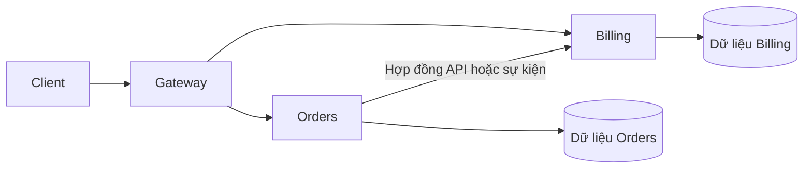
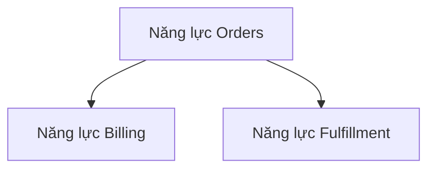
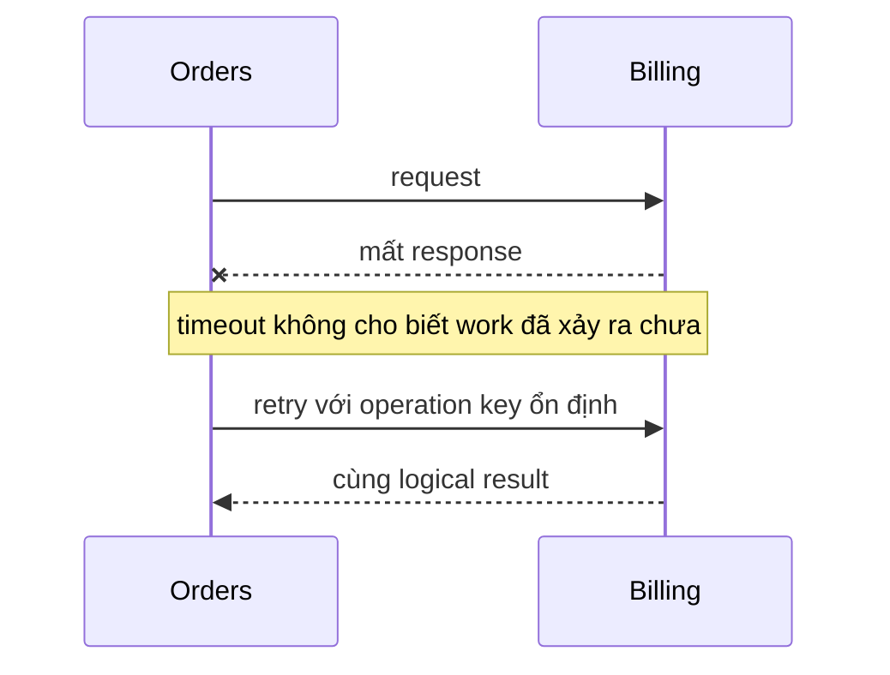
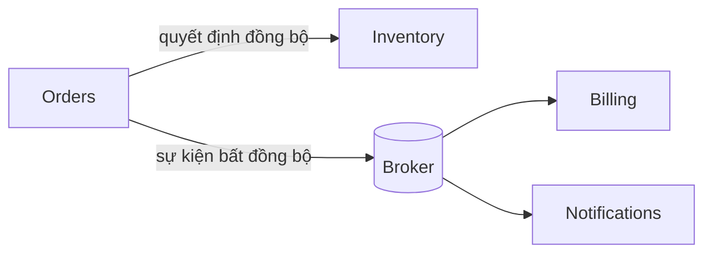

# Microservices: Ranh giới triển khai độc lập

## Tóm tắt nhanh

Một microservice là **ranh giới dịch vụ có thể triển khai độc lập**, sở hữu một **năng lực nghiệp vụ** gắn kết, hợp đồng công khai, hành vi production và dữ liệu domain của nó. Chỉ tách folder hay container là chưa đủ.

Microservices có thể mang lại khả năng mở rộng độc lập, nhịp phát hành riêng, ownership theo đội và cô lập lỗi tốt hơn. Đổi lại, mọi tương tác liên service trở thành tương tác qua mạng với timeout, retry, lỗi từng phần, versioning, khả năng quan sát và bài toán nhất quán.

<TermBox term="Ranh giới dịch vụ">
**Ranh giới dịch vụ** là ranh giới process và triển khai độc lập với một trách nhiệm rõ, hợp đồng công khai, owner vận hành và owner dữ liệu.
</TermBox>

## Tính tự chủ không chỉ là binary riêng

Triển khai độc lập nghĩa là một service có thể thay đổi và rollout mà không buộc các service không liên quan phải build và release cùng lúc, miễn hợp đồng vẫn tương thích.

Service thường nên bám theo năng lực nghiệp vụ như Orders, Billing, Identity hoặc Fulfillment thay vì tách theo lớp kỹ thuật như Controller hay Repository.

Đội sở hữu service cũng nên sở hữu hợp đồng, hành vi runtime, tín hiệu capacity và trách nhiệm xử lý sự cố của service đó.

<TermBox term="Chủ quyền dữ liệu">
**Chủ quyền dữ liệu** nghĩa là một service sở hữu meaning và quy tắc mutation của dữ liệu domain. Service khác cộng tác qua hợp đồng thay vì đọc hoặc ghi trực tiếp table riêng của owner.
</TermBox>

**Database dùng chung** trở thành hidden coupling khi nhiều service tự do update cùng table. Hạ tầng database vật lý có thể dùng chung, nhưng quyền sở hữu logic phải rõ và table chéo service không được biến thành integration API.

## Network call có failure semantics riêng

Remote call không phải local function call.

Mọi tương tác **đồng bộ** qua mạng cần timeout, retry, lỗi từng phần và idempotency rõ ràng. Retry chỉ an toàn khi duplicate effect được ngăn hoặc chấp nhận có chủ đích.

Dùng synchronous call khi caller cần câu trả lời ngay. Dùng **bất đồng bộ** qua sự kiện khi producer có thể commit phần việc của mình và downstream hoàn tất sau.

Event vẫn cần **hợp đồng** về schema, ordering, duplicate, replay và freshness. Event không làm coupling biến mất.

## Hợp đồng phải sống qua rollout độc lập

Khi deploy, version cũ và mới của service có thể cùng tồn tại. API contract và event contract vì vậy cần quy tắc compatibility: ưu tiên thay đổi additive, deprecate có chủ đích, error semantics ổn định và test các promise mà consumer nhìn thấy.

Compatibility về semantics cũng quan trọng. Một field giữ nguyên kiểu JSON nhưng đổi meaning vẫn có thể làm consumer hỏng.

## Tính nhất quán thay đổi khi qua service boundary

Trong một local database transaction, atomicity khá trực tiếp. Qua nhiều service, một **giao dịch phân tán** duy nhất thường khó triển khai hoặc không đáng chi phí vận hành.

Nhiều workflow dùng local transaction cộng asynchronous coordination và chấp nhận **nhất quán cuối cùng** khi nghiệp vụ cho phép. Transactional **outbox** có thể lưu state cùng record sự kiện cần publish một cách atomic; **saga** có thể mô hình hóa workflow nhiều bước và hành động bù khi bước sau thất bại.

Các pattern này không xóa failure; chúng làm state và recovery rule rõ ràng.

## Khả năng quan sát là một phần của operating model

Một request có thể đi qua nhiều service trước khi lỗi. Khả năng quan sát hữu ích cần correlate trace ID, span theo service, structured log, metric latency/error và dependency health.

Vận hành độc lập cũng đòi hỏi dashboard, alert, capacity signal, runbook và ownership rõ. Nếu thiếu các thứ này, số lượng service sẽ tăng nhanh hơn hiểu biết vận hành.

## Independent scaling và cô lập lỗi là lợi ích có điều kiện

Một service chỉ **mở rộng độc lập** khi nó có deployment và capacity control riêng. Process riêng có thể cải thiện **cô lập lỗi**, nhưng shared database, quota dùng chung, synchronous chain dài và retry storm có thể nối các failure domain trở lại với nhau.

<TermBox term="Distributed monolith">
Một **monolith phân tán** là hệ thống đã tách process nhưng vẫn coupling chặt về thay đổi, deployment, data hoặc runtime behavior. Nó chịu network complexity nhưng không có autonomy thực sự.
</TermBox>

Dấu hiệu thường gặp: shared writable table, release phải phối hợp nhiều service, dependency vòng, call chain bắt buộc quá dài và một internal model package được import khắp nơi.

## Tình huống production

Một nền tảng commerce tách Orders, Billing, Inventory và Notifications thành container riêng. Cả bốn vẫn ghi chung một database, import cùng internal domain package, deploy cùng nhau và checkout phải đi qua một synchronous chain dài.

**Hậu quả:** thay đổi nhỏ cần phối hợp rộng, một dependency chậm làm checkout kẹt, retry khuếch đại tải, schema change làm nhiều service hỏng và incident khó trace.

**Nguyên nhân cốt lõi:** process boundary được tạo trước khi có data ownership, hợp đồng chịu được version lệch nhau, failure semantics và deployment autonomy. Kết quả là monolith phân tán.

**Cách khắc phục chuẩn:** gán capability và sở hữu dữ liệu trước, bỏ cross-service table write, expose hợp đồng rõ và version-tolerant, rút ngắn critical synchronous path, chỉ dùng event khi delayed completion phù hợp, thêm timeout/idempotency/trace boundary và chỉ tách service khi independent operation mang giá trị đo được.

Tự kiểm tra: mọi module có nên thành microservice không?

Không. Module chủ yếu là change boundary. Microservice thêm process và deployment boundary độc lập cùng chi phí distributed system. Chỉ extract khi có bằng chứng về scaling, release, security, availability, fault isolation hoặc team autonomy.

## Checklist production

- [ ] Mỗi service sở hữu một năng lực nghiệp vụ gắn kết.
- [ ] Service có thể triển khai độc lập mà không cần release train thường xuyên.
- [ ] Dữ liệu domain có một owner rõ; table trong database dùng chung không phải integration API.
- [ ] Sync call có timeout, retry, idempotency và semantics cho lỗi từng phần.
- [ ] Event bất đồng bộ có schema, ordering, duplicate, replay và freshness expectation.
- [ ] API/event contract chịu được nhiều version cùng tồn tại.
- [ ] Workflow liên service định nghĩa eventual consistency và recovery.
- [ ] Log, metric và trace correlate được công việc qua service boundary.
- [ ] Khả năng mở rộng độc lập và cô lập lỗi được verify thay vì giả định.
- [ ] Việc extract service mới có lợi ích vận hành cụ thể.

## Quy tắc cho agent

Khi thay đổi hệ microservices, xác định owner service trước, bảo vệ data và contract boundary của nó, xem mọi remote interaction là distributed operation có thể lỗi và từ chối decomposition chỉ thêm network boundary mà không tạo deployment hoặc operational autonomy đo được.

## Nguồn tham khảo

- Microsoft Learn — [Microservices architecture](https://learn.microsoft.com/en-us/dotnet/architecture/microservices/architect-microservice-container-applications/microservices-architecture)
- Microsoft Learn — [Data sovereignty per microservice](https://learn.microsoft.com/en-us/dotnet/architecture/microservices/architect-microservice-container-applications/data-sovereignty-per-microservice)
- Azure Architecture Center — [Architecture styles](https://learn.microsoft.com/en-us/azure/architecture/guide/architecture-styles/)
- Martin Fowler — [Microservices](https://martinfowler.com/articles/microservices.html)
