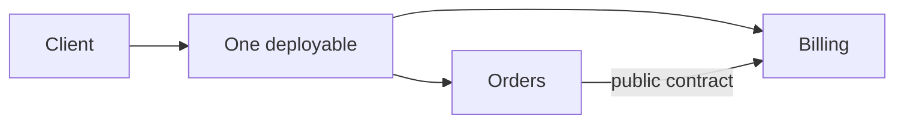
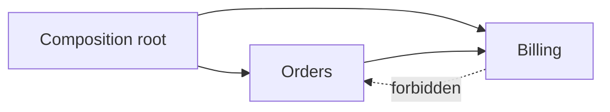
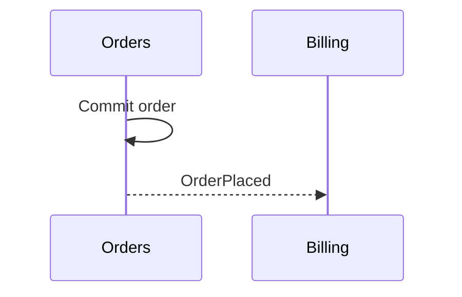
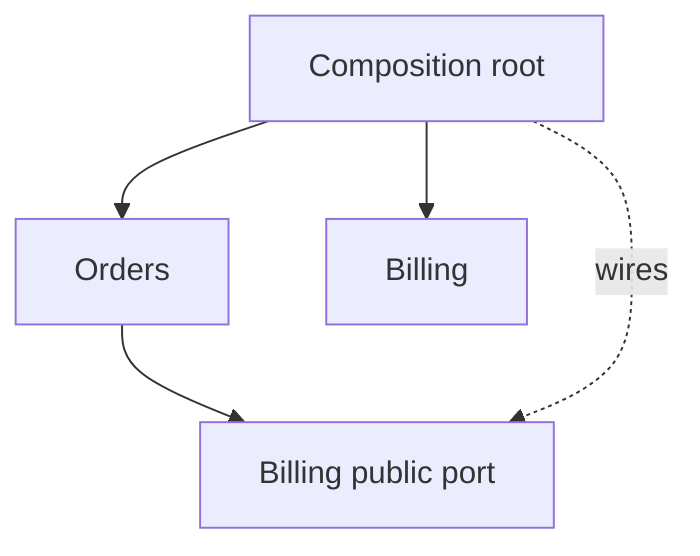

# Modular Monolith: Enforce Boundaries Inside One Deployable

Many engineering organizations make a fatal assumption: they believe that the only way to cure spaghetti code and establish clean architectural boundaries is to physically split their system into dozens of microservices. They deploy across Kubernetes clusters, configure distributed tracing, and immediately drown in network latency, distributed transactions, and cascading timeouts. Yet the core truth remains unforgiving: if an engineering team cannot maintain clean, disciplined module boundaries within a single process and memory space, splitting that codebase across a network will only produce a distributed catastrophe—the dreaded distributed monolith.

The **modular monolith** represents the true architectural sweet spot. It preserves the operational elegance and deployment velocity of **one deployable application** while enforcing uncompromising boundaries, public contracts, and strict data ownership inside the system.

> 💡 **Rule of thumb:** If you cannot enforce module boundaries in a single process with compiler checks and architecture tests, you cannot enforce them over a network with microservices. Master logical data ownership and strict public interfaces within one deployable first—extracting a microservice becomes trivial only when the internal boundary is already airtight.

## TL;DR

- **Single deployable with strict internal boundaries**: Delivers the operational simplicity of a **single deployable** unit while organizing code into cohesive modules that communicate strictly via explicit public contracts.
- **Logical data ownership inside a single database**: Even when modules share a physical database, each module strictly owns its dedicated tables and schemas. Cross-module queries and direct table writes are strictly forbidden.
- **Zero-latency in-process collaboration**: Modules interact through fast **in-process function calls** or internal domain events rather than serialized network RPCs, eliminating distributed transaction overhead.
- **Enforced via automated architecture tests**: Guardrails such as ArchUnit, dependency-cruiser, or language-level visibility ensure that private internals cannot be bypassed by convenient deep imports.
- **Fatal pitfall:** **The Database Backdoor**—Treating the shared database as an integration free-for-all where Module A executes direct SQL queries or joins against Module B's private tables. This erases module isolation instantly and makes future refactoring or service extraction impossible without rewriting the entire persistence layer.



<TermBox term="Module boundary">
A **module boundary** surrounds a cohesive capability with a clear owner, public contract, and private implementation details.
</TermBox>

<TermBox term="Public contract">
A **public contract** is the operations, messages, and data shapes other modules may depend on. ORM entities, repositories, and table names should stay private internals.
</TermBox>

## Enforce dependency direction



Use public entry points, forbid deep imports, and make dependency cycles fail an **architecture test** or import rule.

<TermBox term="Logical data ownership">
**Logical data ownership** means one module owns business data meaning and mutation even when modules share one physical database.
</TermBox>

```text
Orders owns: orders, order_lines
Billing owns: invoices, payment_attempts
```

**Direct database access** or cross-module queries bypass owner invariants. Prefer a public operation or intentional read model.

## Calls, events, and transactions

An **in-process function call** is appropriate when the caller needs an immediate answer.



Events still have contracts for semantics, ordering, duplicates, and freshness. A shared database can support a local **transaction** across modules, but the boundary needs a named owner.



A module boundary improves change locality; it does not provide process-level **fault isolation** or independent scaling.

Extract to a **microservice** only when independent deployment brings concrete scaling, security, fault-isolation, or release-cadence value.

## Production scenario

Orders imports Billing ORM entities, Billing queries Orders tables directly, and a shared `core` package owns business rules.

**Impact:** small features require broad coordination and future service extraction would move hidden coupling across the network.

**Root cause:** package names exist without enforced public contracts, private internals, dependency direction, or data ownership.

**Correct pattern:** assign capability owners, forbid deep imports, route cross-module reads/writes through explicit contracts, assign table/schema ownership, break cycles, and enforce the dependency graph with architecture tests.

<details>
<summary>Self-check: must every module be independently deployable?</summary>

No. A modular monolith deliberately keeps one deployment boundary. Independent deployment changes the topology toward services or microservices.

</details>

## Production checklist

- [ ] There is one understood **single deployable**.
- [ ] Modules align with capabilities and ownership.
- [ ] Public contracts are small; private internals cannot be deep-imported.
- [ ] The **dependency graph** is machine-checkable.
- [ ] Business data has module ownership even in a shared database.
- [ ] Direct cross-module table writes are forbidden or explicit exceptions.
- [ ] In-process calls and events are chosen by semantics.
- [ ] Cross-module transaction boundaries have an owner.
- [ ] Module boundaries are not confused with fault isolation.
- [ ] Extraction requires concrete operational evidence.

## Agent rule

Identify the owning module first, use its public contract, keep storage and implementation details private, and strengthen a machine-checkable boundary when a change reveals an unauthorized dependency.

## Sources

- Microsoft Learn — https://learn.microsoft.com/en-us/shows/on-dotnet/on-dotnet-live-modular-monoliths-with-aspnet-core
- Martin Fowler, Monolith First — https://martinfowler.com/bliki/MonolithFirst.html
