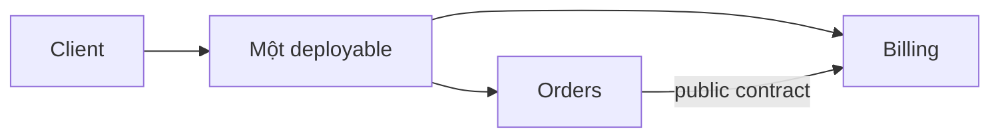
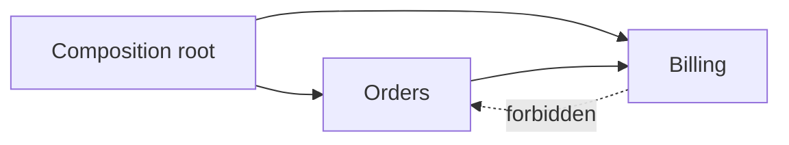
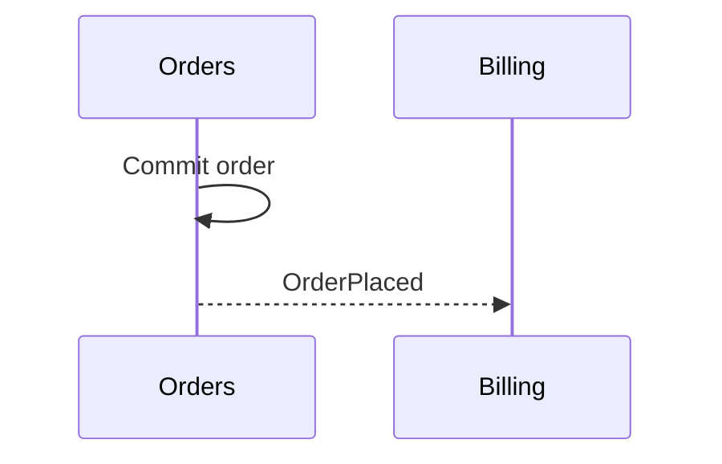
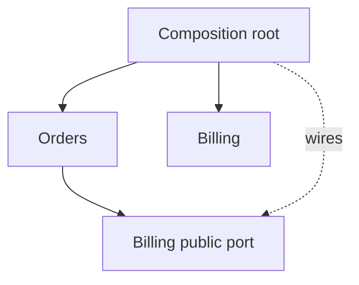

# Modular Monolith: Ranh giới module trong một deployable

## Tóm tắt nhanh

Modular monolith giữ **một đơn vị triển khai** nhưng chia ứng dụng thành module có ownership, public contract và guardrail rõ.



Module dùng chung process/database vật lý nhưng không nên dùng chung ownership. Module boundary không tự tạo **cô lập lỗi**, independent scaling hay independent rollout như microservice.

<TermBox term="Module boundary">
**Module boundary** bao quanh capability gắn kết, có owner, public contract và implementation detail riêng. Folder chỉ là representation; boundary phải được enforce.
</TermBox>

<TermBox term="Public contract">
**Public contract** là operation, message và data shape mà module khác được phép phụ thuộc vào. ORM entity, repository, table name và vendor SDK type nên là private internals.
</TermBox>

## Dependency phải nhìn thấy và kiểm tra được



Chỉ import public entry point; cấm deep import; dependency cycle phải làm **architecture test** fail.

<TermBox term="Logical data ownership">
**Logical data ownership** nghĩa là một module sở hữu meaning và mutation của dữ liệu dù nhiều module dùng chung một database vật lý.
</TermBox>

```text
Orders owns: orders, order_lines
Billing owns: invoices, payment_attempts
```

**Direct database access** hoặc query chéo module vào table của owner khác bypass invariant và coupling consumer vào schema nội bộ. Ưu tiên public query/operation hoặc read model được publish có chủ đích.

## Sync call, event và transaction

Khi caller cần kết quả ngay, **in-process function call** là lựa chọn tốt: `Checkout -> Pricing.calculateQuote() -> Inventory.reserve()`.



Shared database cho phép local **transaction** qua nhiều module, nhưng transaction boundary cần owner rõ. Không cấm cross-module transaction máy móc; hãy document invariant và ảnh hưởng tới future extraction.

## Composition và vận hành



Composition root biết concrete implementation; business code không dùng global service locator. Modular monolith cải thiện change locality và ownership nhưng không tạo process-level fault isolation.

Chỉ tách thành **microservice** khi independent deployment có lợi ích cụ thể: scaling khác biệt, security/availability boundary riêng, fault isolation có giá trị đo được hoặc release cadence độc lập. Trước extraction hãy thu nhỏ contract, bỏ deep import, gán table/schema ownership, bỏ cross-module write, phá cycle và thêm boundary test.

## Tình huống production

Hệ thống có folder `orders`, `billing`, `catalog`, nhưng Orders import Billing ORM entity, Billing query trực tiếp table Orders, shared `core` chứa business rules và một thay đổi pricing chạm nhiều module.

**Hậu quả:** feature nhỏ cần phối hợp rộng, schema refactor gây regression khó đoán và future service extraction chỉ chuyển hidden coupling qua network.

**Nguyên nhân cốt lõi:** package name tồn tại nhưng không enforce public contract, private internals, dependency direction hay data ownership.

**Cách khắc phục chuẩn:** gán capability owner, cấm deep import, route cross-module read/write qua contract, gán table/schema ownership, phá cycle và enforce dependency graph bằng architecture test; sau đó replay thay đổi để đo blast radius.

<details>
<summary>Tự kiểm tra: mọi module có phải deploy độc lập không?</summary>

Không. Modular monolith chủ động giữ một deployment boundary. Independent deployment sẽ đổi topology theo hướng service hoặc microservice.

</details>

## Checklist production

- [ ] Có **một deployable** được hiểu rõ.
- [ ] Module theo capability/ownership và public contract nhỏ.
- [ ] Private internals không bị deep-import.
- [ ] **Dependency graph** được architecture test enforce.
- [ ] Business data có module ownership dù dùng database dùng chung.
- [ ] In-process call/event được chọn theo semantics.
- [ ] Transaction qua nhiều module có owner.
- [ ] Không nhầm module boundary với fault isolation.
- [ ] Extraction cần operational evidence cụ thể.

## Quy tắc cho agent

Khi thay đổi modular monolith, **xác định module owner trước, đi qua public contract, giữ storage/implementation detail ở private và tăng cường machine-checkable boundary khi phát hiện unauthorized dependency**.

## Nguồn tham khảo

- Microsoft Learn — [Modular Monoliths with ASP.NET Core](https://learn.microsoft.com/en-us/shows/on-dotnet/on-dotnet-live-modular-monoliths-with-aspnet-core)
- Martin Fowler — [Monolith First](https://martinfowler.com/bliki/MonolithFirst.html)
