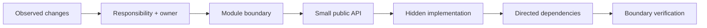
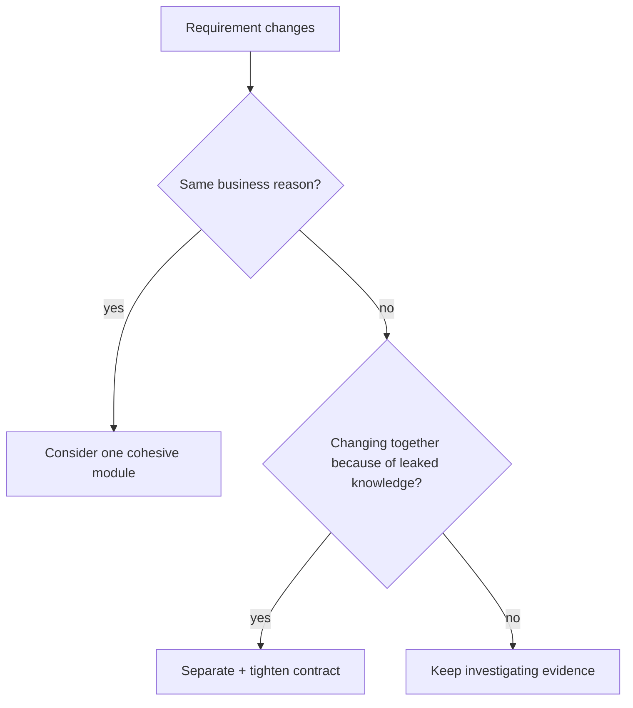
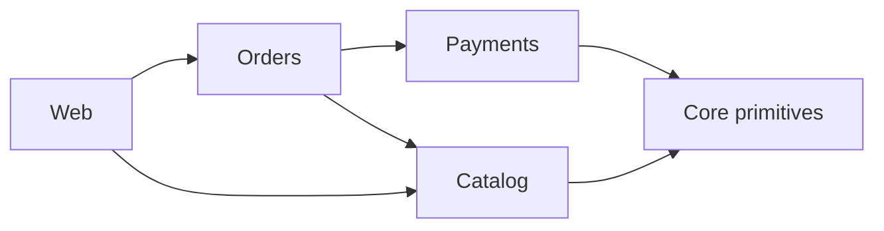
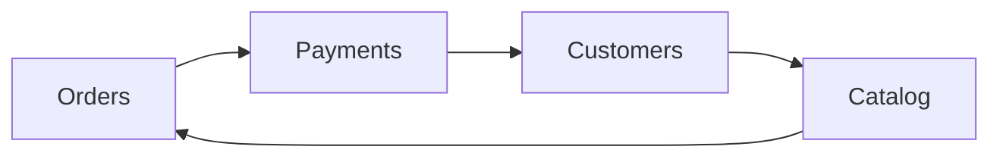

# Modularity: Build Boundaries That Survive Change

## TL;DR

A module is useful when it gives the rest of the system a **small stable contract** while keeping volatile implementation knowledge private.

Use this operating loop:

```text
change pattern
  -> identify one coherent responsibility + owner
  -> choose a module boundary
  -> expose only the capability callers need
  -> hide storage / algorithms / workflow details
  -> constrain dependency direction
  -> remove cycles and deep imports
  -> verify callers can change less often
```



A folder is not automatically a module. A package is not automatically a module. A microservice is not automatically a good module.

The useful property is **change containment**.

## 1. A module is a change boundary

<TermBox term="Module boundary">
A **module boundary** separates a coherent capability from the rest of the system through an explicit contract.

Inside the boundary, implementation details may change together. Outside the boundary, callers should depend mainly on the contract rather than those details.

**Why it matters:** a good module lets teams replace internals without coordinating edits across many unrelated areas.
</TermBox>

Suppose checkout needs pricing.

Weak boundary:

```text
checkout/
  controller.ts
  pricing-rule.ts
  tax-table.ts
  coupon-repository.ts
  currency-rounding.ts
```

The names look organized, but checkout directly knows several pricing internals.

Stronger boundary:

```text
pricing/
  public.ts
  internal/
    pricing-policy.ts
    tax-rules.ts
    coupon-repository.ts
    rounding.ts

checkout/
  checkout-service.ts -> pricing/public.ts
```

The caller asks for a capability:

```ts
pricing.quote({ cart, customer, currency })
```

It does not choose the tax rule, inspect pricing tables, or know which repository is used.

That is modularity in operation.

## 2. Start from reasons to change, not directory aesthetics

The easiest modularization mistake is moving files before understanding why they change.

Useful evidence includes:

- business capabilities that have a clear owner;
- files that repeatedly change together;
- rules that protect the same invariant;
- data that has one authoritative writer;
- workflows that evolve on the same cadence;
- dependencies that should not leak to most callers.

Do not interpret co-change mechanically. Two files changing together may indicate one module, but it may also indicate accidental coupling that should be removed.

Ask:

1. What business capability is changing?
2. Which code owns its invariant?
3. Which decisions should callers not have to know?
4. Which changes should remain internal next time?



## 3. Information hiding is more important than file hiding

<TermBox term="Information hiding">
**Information hiding** means a module conceals design decisions that are likely to change so callers do not depend on them.

Examples include table shape, cache strategy, third-party SDK details, retry policy, parsing rules, and algorithm choices.

Private syntax helps, but the architectural goal is to hide **volatile knowledge**.
</TermBox>

A module can have `private` methods and still leak its internals.

For example:

```ts
await orderRepository.insertOrderRow(...)
await orderRepository.insertOrderLineRows(...)
await inventoryRepository.decrementRows(...)
```

The caller now knows persistence sequence and schema concepts.

A better contract might be:

```ts
await ordering.placeOrder(command)
```

Now the module can change transaction boundaries, tables, or persistence strategy without forcing all callers to change.

### Hide mechanisms behind capabilities

Prefer:

```text
sendPasswordReset(userId)
```

over:

```text
renderResetTemplate()
getSmtpClient()
buildMimeMessage()
sendSmtpMessage()
```

Callers usually need the outcome, not the mechanism.

## 4. Keep the public API deliberately small

Every exported symbol creates another thing callers can depend on.

Treat a module's public API like a product surface:

- export capabilities, not convenience internals;
- use domain-shaped inputs and outputs;
- avoid returning persistence models when callers do not need them;
- document failure and consistency behavior;
- deprecate before removing widely used contracts;
- keep implementation imports inaccessible by convention or tooling.

A useful structure is:

```text
billing/
  index.ts          <- public API
  contracts.ts      <- public types
  internal/
    invoice.ts
    pricing.ts
    repository.ts
    provider.ts
```

Then enforce that other modules import only from:

```text
billing/index.ts
```

not:

```text
billing/internal/repository.ts
```

Deep imports are often a sign that the public contract is missing a real capability—or that a caller is reaching across ownership boundaries.

## 5. Package by feature when behavior belongs together

A type-oriented structure can scatter one business change across many top-level folders:

```text
controllers/
services/
repositories/
models/
validators/
```

Adding “pause subscription” may require touching every folder.

A feature boundary can make the change more local:

```text
subscriptions/
  pause-subscription.ts
  subscription-policy.ts
  subscription-repository.ts
  public.ts
```

This does **not** mean every feature deserves its own repository, deployment, or database.

Logical modularity and physical deployment are separate decisions.

## 6. Draw the dependency graph

<TermBox term="Dependency graph">
A **dependency graph** represents modules as nodes and dependency relationships as directed edges.

The graph helps reveal cycles, central modules with excessive responsibility, unstable dependency direction, and places where changes can propagate broadly.
</TermBox>

Example:



This is easier to reason about than:



The second graph contains a cycle. A change can travel around the loop, initialization order becomes harder, tests require larger graphs, and ownership becomes ambiguous.

### Break cycles by moving the right responsibility

Do not automatically introduce an interface just to make arrows disappear.

Try these questions first:

1. Is a responsibility in the wrong module?
2. Is shared policy duplicated across both sides?
3. Should a neutral lower-level abstraction own the shared concept?
4. Is one side querying data it should receive through a purpose-built contract?
5. Is an event appropriate because the reaction is genuinely asynchronous?

Interfaces are useful when they protect a meaningful policy or volatility boundary, not as graph cosmetics.

## 7. Stable dependencies reduce ripple effects

A volatile module should not become a universal dependency if a more stable contract can sit in front of it.

Examples of volatile details:

- vendor SDKs;
- database drivers;
- rapidly changing workflow engines;
- third-party schemas;
- UI framework types;
- experimental algorithms.

Keep those near the edge of the owning module.

Callers should depend on concepts that change more slowly:

```text
Fulfillment -> ShippingQuotePort
                  |
                  v
            CarrierSdkAdapter
```

This is not a command to abstract everything.

If there is one stable implementation and no meaningful volatility boundary, an extra interface can add ceremony without reducing risk.

## 8. Ownership makes a module real

A module without clear ownership often becomes a shared dumping ground.

For each important module, answer:

- Which team or subsystem owns its public contract?
- Which business invariants does it enforce?
- Who can write its authoritative data?
- What compatibility promise do callers receive?
- Which internals may change without coordination?

Ownership is especially important in a modular monolith because process boundaries do not enforce separation for you.

You may share one physical database while still enforcing rules such as:

```text
Orders owns writes to order state.
Billing reads through a view/query contract.
Billing does not update orders tables directly.
```

## 9. Boundary tests make modularity executable

Architecture that exists only in a diagram will drift.

Use machine-checkable guardrails where the cost is justified:

- lint rules that reject forbidden deep imports;
- dependency-cycle checks;
- package export maps;
- contract tests for public APIs;
- integration tests at module boundaries;
- schema ownership rules;
- code-review checks for new cross-module dependencies.

Example policy:

```text
checkout/* may import pricing/public
checkout/* must not import pricing/internal/*
```

The important point is not the specific tool. The important point is making the boundary **observable and enforceable**.

## 10. Operate with change-frequency evidence

A module structure should evolve as the system's change patterns become clearer.

Track signals such as:

- files/modules that repeatedly change together;
- number of modules touched per feature;
- number of teams required for one change;
- contract breakage frequency;
- cyclic dependency count;
- deep-import violations;
- tests that require unrelated modules to boot.

These are investigation signals, not universal target numbers.

A “module count” KPI alone is dangerous. Splitting one coherent capability into ten packages can make the architecture worse while making the metric look more modular.

## 11. A practical modularization procedure

When a feature area feels tangled, use this sequence.

### Step 1 — pick a real recent change

Choose a feature or incident that required too many coordinated edits.

### Step 2 — map touched responsibilities

Label each touched file/module by the business decision it contains.

### Step 3 — identify the rule owner

Decide where the invariant should live.

### Step 4 — design the narrow contract

Express what callers need without exposing how it is implemented.

### Step 5 — move cohesive behavior inward

Move policy, validation, persistence orchestration, and volatile details behind the owner boundary when they belong there.

### Step 6 — remove bypass paths

Replace deep imports, direct table writes, and duplicated policy with the intended contract.

### Step 7 — inspect the dependency graph

Break cycles and suspicious reverse dependencies.

### Step 8 — add boundary verification

Add tests or lint/dependency rules for the highest-risk boundary.

### Step 9 — replay the original change

Ask: if the same requirement arrived tomorrow, how many modules and owners would need coordinated edits now?

That final replay is the proof of improvement.

## 12. Production failure: a “shared” package became the real monolith

A SaaS product created a `shared-domain` package so Orders, Billing, Support, and Reporting could reuse customer/account logic.

Over time, the package accumulated:

- database entities;
- billing status rules;
- order eligibility rules;
- API request types;
- notification helpers;
- vendor SDK wrappers.

A billing rule change then required releases across four areas because all of them imported internal shared types and helpers.

**Impact:** a small billing policy change expanded into a coordinated multi-team release, delayed deployment, and caused an unrelated reporting job to fail after a shared type changed.

**Root cause:** the package grouped code by “things many teams use” rather than one cohesive responsibility. Its public surface exposed volatile implementation knowledge, creating a highly connected dependency hub.

**Correct pattern:** move business rules back to their owning modules, keep genuinely stable primitives separate, expose narrow contracts, forbid deep imports, and migrate callers one capability at a time. Verify improvement by replaying the billing change and confirming unrelated modules no longer need edits.

## 13. Self-check

<details>
<summary>A package has no cyclic imports, but every feature change still touches six modules. Is the design modular?</summary>

Not necessarily. An acyclic graph is useful, but modularity is about containing change and hiding knowledge. If one business decision is scattered across six modules, the boundaries may still have low cohesion or leak responsibility even though the graph has no cycle.
</details>

<details>
<summary>Should every module expose an interface and have a separate database?</summary>

No. Interfaces are useful when they protect a meaningful boundary, and logical data ownership does not require a separate physical database. Add indirection or physical isolation when the constraints justify it, not as a ritual.
</details>

<details>
<summary>Is duplicate code always evidence that modules should share an abstraction?</summary>

No. Duplicate **business knowledge** that must change together is dangerous. Coincidentally similar implementation code may be healthier to keep separate if the responsibilities evolve independently.
</details>

## 14. Production checklist

- [ ] Each major module has a coherent responsibility and an identifiable owner.
- [ ] Public APIs expose capabilities rather than persistence or vendor internals.
- [ ] Callers do not deep-import internal files.
- [ ] The dependency graph is understood and important cycles are removed.
- [ ] Shared packages contain stable concepts, not unrelated convenience code.
- [ ] Authoritative writes have clear ownership even when modules share a database.
- [ ] Boundary contracts document important failure and consistency behavior.
- [ ] High-risk boundaries have contract/integration tests or dependency guardrails.
- [ ] Recent change history is used to evaluate whether boundaries reduce coordination.
- [ ] The same real change scenario would touch fewer unrelated modules after refactoring.

## Agent rule

When an agent proposes a new module, it should state **what change it contains, what knowledge it hides, what public contract it exposes, who owns it, and which dependency edges it adds**. Do not create modules only to make the directory tree look architectural.

## Sources

- David L. Parnas, “On the Criteria To Be Used in Decomposing Systems into Modules,” *Communications of the ACM*, 1972.
- Microsoft Learn, [Design for evolution](https://learn.microsoft.com/en-us/azure/architecture/guide/design-principles/design-for-evolution).
- Microsoft Learn, [Code metrics — Class coupling](https://learn.microsoft.com/en-us/visualstudio/code-quality/code-metrics-class-coupling).
