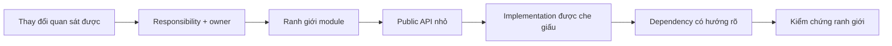
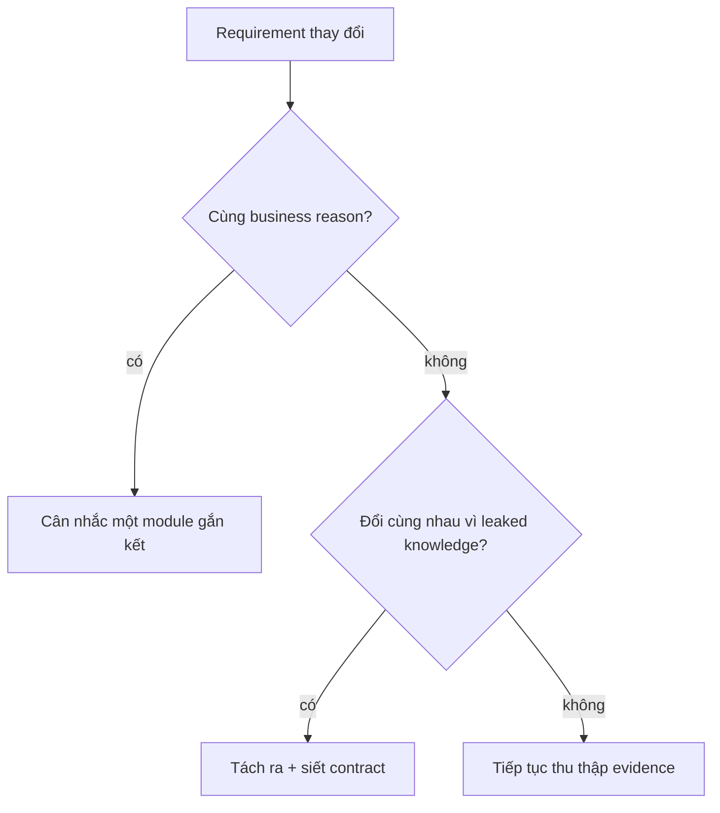
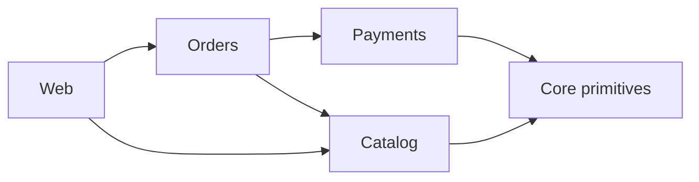
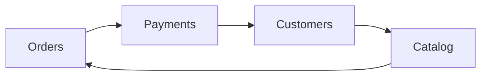

# Modularity: Xây Ranh giới Chịu được Thay đổi

## Tóm tắt nhanh

Một module hữu ích khi nó cung cấp cho phần còn lại của hệ thống một **hợp đồng nhỏ và ổn định**, đồng thời giữ kiến thức triển khai dễ thay đổi ở bên trong.

Dùng vòng vận hành này:

```text
change pattern
  -> xác định responsibility + owner nhất quán
  -> chọn ranh giới module
  -> chỉ công khai capability caller cần
  -> giấu storage / thuật toán / workflow detail
  -> kiểm soát hướng phụ thuộc
  -> loại cycle và deep import
  -> kiểm chứng caller phải đổi ít hơn
```



Một folder không tự động là module. Một package không tự động là module. Một microservice cũng không tự động là module tốt.

Tính chất quan trọng là **khoanh vùng thay đổi**.

## 1. Module là một ranh giới thay đổi

<TermBox term="Module boundary">
**Ranh giới module** tách một capability nhất quán khỏi phần còn lại của hệ thống bằng một hợp đồng rõ ràng.

Bên trong ranh giới, chi tiết triển khai có thể thay đổi cùng nhau. Bên ngoài ranh giới, caller chủ yếu nên phụ thuộc vào contract thay vì phụ thuộc vào những chi tiết đó.

**Vì sao quan trọng:** module tốt cho phép thay internals mà không buộc nhiều khu vực không liên quan phải sửa đồng thời.
</TermBox>

Giả sử checkout cần pricing.

Ranh giới yếu:

```text
checkout/
  controller.ts
  pricing-rule.ts
  tax-table.ts
  coupon-repository.ts
  currency-rounding.ts
```

Tên file có vẻ gọn, nhưng checkout biết trực tiếp quá nhiều chi tiết pricing.

Ranh giới mạnh hơn:

```text
pricing/
  public.ts
  internal/
    pricing-policy.ts
    tax-rules.ts
    coupon-repository.ts
    rounding.ts

checkout/
  checkout-service.ts -> pricing/public.ts
```

Caller yêu cầu một capability:

```ts
pricing.quote({ cart, customer, currency })
```

Nó không tự chọn tax rule, không đọc pricing table, và không cần biết repository nào được dùng.

Đó là modularity khi được vận hành thật.

## 2. Bắt đầu từ reason-to-change, không phải thẩm mỹ thư mục

Sai lầm modularization dễ gặp nhất là di chuyển file trước khi hiểu **vì sao** chúng thay đổi.

Evidence hữu ích gồm:

- business capability có owner rõ;
- file thường xuyên thay đổi cùng nhau;
- rule bảo vệ cùng một invariant;
- dữ liệu có một writer có thẩm quyền;
- workflow phát triển cùng cadence;
- dependency không nên lộ cho phần lớn caller.

Không nên diễn giải co-change một cách máy móc. Hai file thay đổi cùng nhau có thể thuộc cùng module, nhưng cũng có thể là accidental coupling cần loại bỏ.

Hãy hỏi:

1. Business capability nào đang thay đổi?
2. Code nào sở hữu invariant đó?
3. Quyết định nào caller không cần biết?
4. Lần sau, thay đổi nào nên nằm hoàn toàn bên trong module?



## 3. Che giấu thông tin quan trọng hơn chỉ che file

<TermBox term="Information hiding">
**Che giấu thông tin** nghĩa là module giấu các quyết định thiết kế có khả năng thay đổi để caller không phụ thuộc vào chúng.

Ví dụ gồm cấu trúc table, cache strategy, chi tiết SDK bên thứ ba, retry policy, parsing rule và algorithm choice.

Cú pháp `private` hữu ích, nhưng mục tiêu kiến trúc là giấu **kiến thức dễ biến động**.
</TermBox>

Một module có thể toàn `private` method nhưng vẫn leak internals.

Ví dụ:

```ts
await orderRepository.insertOrderRow(...)
await orderRepository.insertOrderLineRows(...)
await inventoryRepository.decrementRows(...)
```

Caller giờ biết persistence sequence và schema concept.

Contract tốt hơn có thể là:

```ts
await ordering.placeOrder(command)
```

Giờ module có thể thay transaction boundary, table hoặc persistence strategy mà caller không phải sửa theo.

### Giấu mechanism sau capability

Ưu tiên:

```text
sendPasswordReset(userId)
```

thay vì:

```text
renderResetTemplate()
getSmtpClient()
buildMimeMessage()
sendSmtpMessage()
```

Caller thường cần outcome, không cần mechanism.

## 4. Giữ public API nhỏ một cách có chủ đích

Mỗi exported symbol tạo thêm một thứ caller có thể phụ thuộc vào.

Hãy coi public API của module như product surface:

- export capability, không export convenience internal;
- dùng input/output mang ngữ nghĩa domain;
- không trả persistence model nếu caller không cần;
- mô tả failure và consistency behavior;
- deprecate trước khi xóa contract có nhiều caller;
- giữ implementation import không thể truy cập bằng convention hoặc tooling.

Một cấu trúc hữu ích:

```text
billing/
  index.ts          <- public API
  contracts.ts      <- public types
  internal/
    invoice.ts
    pricing.ts
    repository.ts
    provider.ts
```

Sau đó enforce module khác chỉ import từ:

```text
billing/index.ts
```

chứ không phải:

```text
billing/internal/repository.ts
```

Deep import thường cho thấy public contract đang thiếu một capability thật — hoặc caller đang vượt qua ownership boundary.

## 5. Package by feature khi behavior thuộc về nhau

Cấu trúc theo loại kỹ thuật có thể làm một business change bị rải qua nhiều folder cấp cao:

```text
controllers/
services/
repositories/
models/
validators/
```

Thêm “pause subscription” có thể buộc chạm vào tất cả folder trên.

Feature boundary có thể làm change local hơn:

```text
subscriptions/
  pause-subscription.ts
  subscription-policy.ts
  subscription-repository.ts
  public.ts
```

Điều này **không** có nghĩa mỗi feature cần một repository, deployment hay database riêng.

Logical modularity và physical deployment là hai quyết định khác nhau.

## 6. Vẽ dependency graph

<TermBox term="Dependency graph">
**Đồ thị phụ thuộc** biểu diễn module thành node và dependency relationship thành edge có hướng.

Graph giúp phát hiện cycle, module trung tâm gánh quá nhiều trách nhiệm, dependency direction không ổn định và các vị trí change dễ lan rộng.
</TermBox>

Ví dụ:



Dễ suy luận hơn graph này:



Graph thứ hai có cycle. Change có thể chạy quanh vòng, initialization order khó hơn, test cần graph lớn hơn và ownership trở nên mơ hồ.

### Break cycle bằng cách chuyển đúng responsibility

Đừng tự động thêm interface chỉ để mũi tên biến mất.

Hãy hỏi trước:

1. Responsibility có đang nằm sai module không?
2. Policy dùng chung có đang bị duplicate ở hai bên không?
3. Một abstraction trung lập ở tầng thấp hơn có nên sở hữu concept chung không?
4. Một bên có đang query data lẽ ra nên nhận qua contract có mục đích rõ không?
5. Event có phù hợp vì reaction thực sự asynchronous không?

Interface hữu ích khi nó bảo vệ một policy hoặc volatility boundary có ý nghĩa, không phải để graph đẹp hơn.

## 7. Stable dependency giảm ripple effect

Một module biến động mạnh không nên trở thành dependency phổ quát nếu có thể đặt một contract ổn định hơn trước nó.

Ví dụ chi tiết dễ biến động:

- vendor SDK;
- database driver;
- workflow engine thay đổi nhanh;
- schema bên thứ ba;
- UI framework type;
- thuật toán thử nghiệm.

Giữ chúng gần edge của module sở hữu.

Caller nên phụ thuộc vào concept thay đổi chậm hơn:

```text
Fulfillment -> ShippingQuotePort
                  |
                  v
            CarrierSdkAdapter
```

Đây không phải lệnh “abstract everything”.

Nếu chỉ có một implementation ổn định và không có volatility boundary thật, thêm interface chỉ tạo ceremony.

## 8. Ownership làm module trở thành boundary thật

Module không có ownership rõ thường thành shared dumping ground.

Với mỗi module quan trọng, hãy trả lời:

- Team/subsystem nào sở hữu public contract?
- Module enforce business invariant nào?
- Ai được quyền ghi authoritative data?
- Caller nhận compatibility promise gì?
- Internal nào được phép đổi mà không cần coordination?

Ownership đặc biệt quan trọng trong modular monolith vì process boundary không ép separation giúp bạn.

Có thể dùng chung một physical database mà vẫn enforce rule:

```text
Orders sở hữu write vào order state.
Billing đọc qua view/query contract.
Billing không update trực tiếp orders table.
```

## 9. Boundary test biến modularity thành thứ enforce được

Architecture chỉ tồn tại trên diagram sẽ drift.

Dùng machine-checkable guardrail khi chi phí hợp lý:

- lint rule chặn forbidden deep import;
- dependency-cycle check;
- package export map;
- contract test cho public API;
- integration test tại module boundary;
- schema ownership rule;
- code-review check cho cross-module dependency mới.

Policy ví dụ:

```text
checkout/* được import pricing/public
checkout/* không được import pricing/internal/*
```

Điểm quan trọng không phải tool cụ thể. Điểm quan trọng là làm ranh giới **quan sát được và enforce được**.

## 10. Vận hành bằng evidence từ change frequency

Module structure nên tiến hóa khi change pattern của hệ thống rõ hơn.

Theo dõi signal như:

- file/module thường xuyên thay đổi cùng nhau;
- số module bị chạm trên mỗi feature;
- số team cần phối hợp cho một change;
- tần suất contract bị break;
- số cyclic dependency;
- số deep-import violation;
- test phải boot module không liên quan.

Đây là signal để điều tra, không phải target number phổ quát.

KPI “số lượng module” riêng lẻ rất nguy hiểm. Chia một capability gắn kết thành mười package có thể làm kiến trúc tệ hơn nhưng metric trông có vẻ modular hơn.

## 11. Quy trình modularization thực tế

Khi một feature area trở nên rối, dùng trình tự này.

### Bước 1 — chọn một change thật gần đây

Chọn feature hoặc incident từng yêu cầu quá nhiều coordinated edit.

### Bước 2 — map responsibility bị chạm

Gắn nhãn mỗi file/module theo business decision mà nó chứa.

### Bước 3 — xác định rule owner

Quyết định invariant nên sống ở đâu.

### Bước 4 — thiết kế contract hẹp

Diễn đạt caller cần gì mà không lộ cách triển khai.

### Bước 5 — đưa cohesive behavior vào trong

Di chuyển policy, validation, persistence orchestration và volatile detail vào owner boundary khi chúng thuộc về đó.

### Bước 6 — xóa bypass path

Thay deep import, direct table write và duplicated policy bằng contract dự kiến.

### Bước 7 — kiểm dependency graph

Break cycle và reverse dependency đáng ngờ.

### Bước 8 — thêm boundary verification

Thêm test hoặc lint/dependency rule cho boundary có rủi ro cao nhất.

### Bước 9 — replay change ban đầu

Hỏi: nếu requirement đó quay lại ngày mai, giờ cần bao nhiêu module và owner cùng sửa?

Replay này là bằng chứng cải thiện.

## 12. Production failure: package “shared” trở thành monolith thật sự

Một sản phẩm SaaS tạo package `shared-domain` để Orders, Billing, Support và Reporting reuse customer/account logic.

Theo thời gian package chứa:

- database entity;
- billing status rule;
- order eligibility rule;
- API request type;
- notification helper;
- vendor SDK wrapper.

Một billing rule change sau đó đòi release bốn khu vực vì tất cả import shared type/helper nội bộ.

**Hậu quả:** một thay đổi billing nhỏ biến thành multi-team release có coordination cao, deployment bị chậm, và một reporting job không liên quan bị lỗi sau khi shared type đổi.

**Nguyên nhân cốt lõi:** package gom code theo tiêu chí “nhiều team cùng dùng” thay vì một responsibility gắn kết. Public surface leak volatile implementation knowledge và biến package thành dependency hub có degree rất cao.

**Cách khắc phục chuẩn:** đưa business rule về module sở hữu, tách stable primitive thực sự, expose contract hẹp, chặn deep import và migrate caller theo từng capability. Replay billing change để xác nhận module không liên quan აღარ cần sửa.

## 13. Tự kiểm tra

<details>
<summary>Một package không có cyclic import nhưng mỗi feature change vẫn chạm sáu module. Thiết kế có modular không?</summary>

Chưa chắc. Acyclic graph hữu ích, nhưng modularity là khoanh vùng change và giấu knowledge. Nếu một business decision bị rải qua sáu module, boundary vẫn có thể low cohesion hoặc leak responsibility dù graph không có cycle.
</details>

<details>
<summary>Mỗi module có nên expose interface và có database riêng?</summary>

Không. Interface hữu ích khi bảo vệ boundary có ý nghĩa, còn logical data ownership không yêu cầu physical database riêng. Chỉ thêm indirection hoặc isolation khi constraint thực sự cần.
</details>

<details>
<summary>Duplicate code có luôn chứng minh hai module nên share abstraction?</summary>

Không. Duplicate **business knowledge** phải thay đổi cùng nhau là nguy hiểm. Implementation code chỉ tình cờ giống nhau có thể nên tách riêng nếu responsibilities tiến hóa độc lập.
</details>

## 14. Checklist production

- [ ] Mỗi major module có responsibility gắn kết và owner xác định được.
- [ ] Public API expose capability thay vì persistence/vendor internals.
- [ ] Caller không deep-import internal file.
- [ ] Dependency graph được hiểu và các cycle quan trọng đã được loại bỏ.
- [ ] Shared package chứa stable concept, không chứa convenience code không liên quan.
- [ ] Authoritative write có ownership rõ dù các module dùng chung database.
- [ ] Boundary contract mô tả failure và consistency behavior quan trọng.
- [ ] Boundary rủi ro cao có contract/integration test hoặc dependency guardrail.
- [ ] Change history gần đây được dùng để đánh giá boundary có giảm coordination hay không.
- [ ] Cùng một change scenario thật sẽ chạm ít module không liên quan hơn sau refactor.

## Quy tắc cho agent

Khi agent đề xuất module mới, nó phải nêu rõ **change nào module sẽ khoanh vùng, knowledge nào được giấu, public contract nào được expose, ai sở hữu module và dependency edge nào được thêm**. Không tạo module chỉ để directory tree trông “có kiến trúc”.

## Nguồn tham khảo

- David L. Parnas, “On the Criteria To Be Used in Decomposing Systems into Modules,” *Communications of the ACM*, 1972.
- Microsoft Learn, [Design for evolution](https://learn.microsoft.com/en-us/azure/architecture/guide/design-principles/design-for-evolution).
- Microsoft Learn, [Code metrics — Class coupling](https://learn.microsoft.com/en-us/visualstudio/code-quality/code-metrics-class-coupling).
