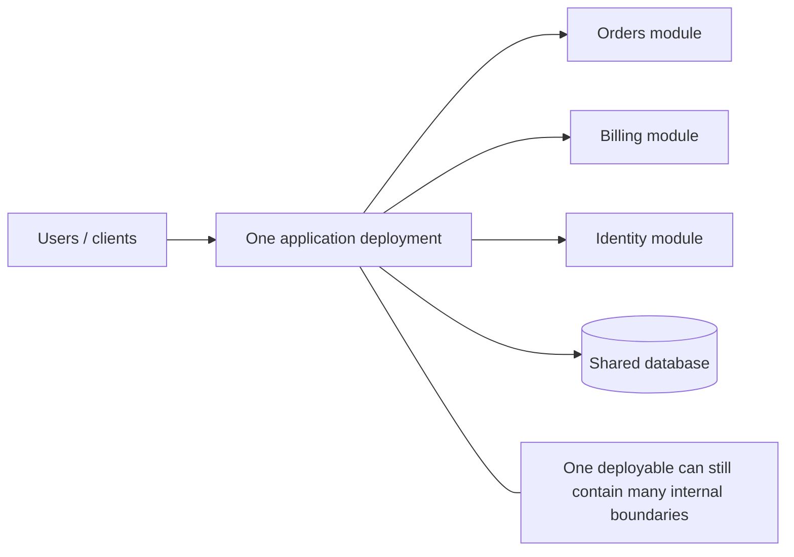
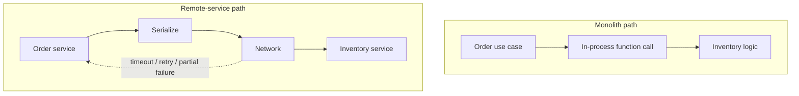
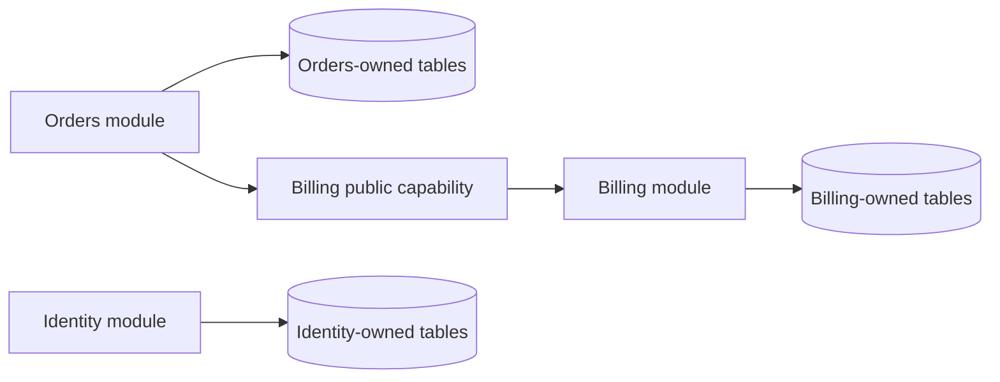
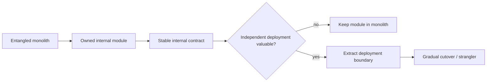
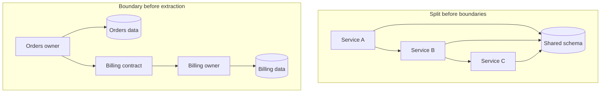

# Monolith Architecture: One Deployment Boundary, Many Possible Designs

## TL;DR

A **monolith** is primarily a deployment topology: most application behavior is packaged, released, and scaled as **one application unit** rather than as independently deployable services.

That does **not** mean:

- one source file;
- one module;
- one architectural layer;
- no background jobs;
- no external database;
- no internal boundaries;
- automatically bad design.

A monolith can contain strong modules, clean dependency rules, cohesive ownership, and well-tested interfaces. It can also become a tightly coupled big ball of mud. The difference comes from **internal structure and change discipline**, not from the word “monolith.”



The main architectural trade is straightforward:

```text
fewer distributed-system boundaries
  ↔
greater coupling at deployment, scaling, and failure boundaries
```

## 1. Define the monolith by deployment boundary first

<TermBox term="Deployment boundary">
A **deployment boundary** is the unit that is built, versioned, rolled out, rolled back, and usually scaled together.

In a monolithic architecture, the application is typically deployed as one unit even when its source code contains multiple modules, packages, layers, or assemblies.

**Why it matters:** deployment topology determines which changes, failures, resource decisions, and release procedures are coupled operationally.
</TermBox>

Microsoft's architecture guidance describes a monolithic application as self-contained in its core behavior and typically deployed as a single unit. If it scales horizontally, the application is usually duplicated as a whole rather than scaling one internal component independently.

A useful mental model is:

```text
source-code structure != deployment topology
```

You can have:

```text
controllers/
application/
domain/
infrastructure/
orders/
billing/
identity/
```

and still deploy the whole application as one artifact.

Conversely, splitting source code into several repositories does not automatically create independent services if they must always release together.

## 2. A monolith is not synonymous with unstructured code

The common failure is to use “monolith” as shorthand for:

```text
large + old + tightly coupled + hard to change
```

Those are separate properties.

A healthy monolith can have:

- cohesive modules;
- explicit public APIs between modules;
- private implementation details;
- dependency direction rules;
- package boundaries;
- ownership by capability;
- contract and architecture tests;
- clear transaction ownership;
- controlled shared-data access.

A bad microservice system can still have low cohesion, circular dependencies, shared schemas, and release coupling—only now over the network.

So ask two different questions:

1. **How is the system deployed?**
2. **How is the system internally structured?**

Do not use one answer as a substitute for the other.

## 3. The first major benefit is operational simplicity

A single application boundary removes many distributed coordination problems from ordinary feature development.

Inside one process, collaboration can often be:

```text
function call
  -> return value
```

rather than:

```text
network call
  -> serialization
  -> timeout
  -> retry
  -> partial failure
  -> tracing
  -> versioned remote contract
```



This simplicity can produce real value:

- easier local development;
- simpler debugging;
- fewer deployment artifacts;
- fewer remote contracts;
- lower observability overhead;
- less operational infrastructure;
- simpler end-to-end testing for many workflows.

AWS guidance explicitly notes that a monolith can be a valid choice in some situations and that many applications naturally begin as monoliths.

Do not pay distributed-systems cost before you need distributed deployment autonomy.

## 4. In-process calls are cheap, but architectural coupling can still be expensive

<TermBox term="In-process coupling">
**In-process coupling** is dependency between parts of the application that collaborate within the same runtime boundary.

The call itself is cheap compared with a network hop, but the **change coupling** can still be severe if one module reaches into another module's internals, tables, mutable state, or framework types.

**Why it matters:** low runtime latency does not imply good change locality.
</TermBox>

This is fine:

```text
Checkout module
  -> InventoryReservation public operation
```

This is more dangerous:

```text
Checkout module
  -> InventoryRepository internal class
  -> inventory tables
  -> stock calculation helper
  -> private cache structure
```

Both are in-process. Only one preserves a meaningful boundary.

Monoliths make cross-boundary access technically easy. That convenience is useful, but it means **discipline must replace network-enforced separation**.

## 5. Shared transactions are a real advantage

A monolith often uses one primary relational database and can coordinate related state changes inside one local database transaction.

For example:

```text
create order
reserve inventory
record payment intent
write outbox row
COMMIT
```

When those rows live under one transactional authority, preserving invariants can be much simpler than coordinating state across independently owned service databases.

This is one reason not to split a system merely to copy an architectural trend.

But the benefit has a condition:

> shared transactional capability should not become shared ownership of every table.

If every feature can read and write every table, the database becomes the hidden integration API of the whole application.

Then schema changes gain a large blast radius even though deployment remains simple.

## 6. A shared database can be convenient without becoming ownerless

A monolith may use one physical database while maintaining logical ownership.

For example:

```text
Orders owns:
  orders
  order_lines
  order_status_history

Billing owns:
  payment_attempts
  refunds

Identity owns:
  users
  credentials
```

Other modules should prefer owned operations or stable read models rather than arbitrary cross-table writes.



One database server does not require one ownership boundary.

This distinction becomes especially important before evolving toward a modular monolith or services later.

## 7. Scaling a monolith usually scales the whole application

A typical monolith scales horizontally by adding more instances of the entire application behind a load balancer.

```text
instance 1 = all application capabilities
instance 2 = all application capabilities
instance 3 = all application capabilities
```

That is operationally simple, but it can be inefficient when only one internal workload needs more capacity.

Example:

```text
Image processing needs 8x CPU.
Account settings needs almost none.
```

If both live in one deployment unit, scaling for image processing may duplicate account-settings code and memory too.

This does not automatically require microservices. Other options include:

- optimize the hotspot;
- use asynchronous workers;
- isolate a heavy job runner;
- scale the database independently;
- add caching;
- move only the proven hotspot behind a separate deployment boundary later.

Use measurements before changing architecture.

## 8. Release coupling is the central operational constraint

A monolith's application parts are released together.

That gives one release pipeline and one rollback unit, but it also means unrelated changes may share the same deployment event.

<TermBox term="Release coupling">
**Release coupling** means multiple application capabilities must move through versioning, rollout, and rollback as one operational release unit.

A monolith intentionally accepts this coupling in exchange for fewer independently versioned services and simpler runtime integration.

**Why it matters:** when team count and change frequency grow, release coupling can become more expensive than the distributed-system complexity that separate deployables would introduce.
</TermBox>

A useful question is not:

> “Is one deployment old-fashioned?”

Ask:

> “Is coordinated deployment materially slowing safe delivery?”

If ten teams can ship through one pipeline without blocking one another, there may be no problem to solve.

## 9. Failure blast radius follows the deployment and process boundary

A severe defect inside one monolithic process can affect the whole application instance.

Examples:

- memory leak;
- CPU runaway;
- thread/event-loop starvation;
- unbounded queue growth;
- process crash;
- deployment regression;
- global connection-pool exhaustion.

When the whole application is replicated across instances, instance-level failures can be contained by load balancing and health checks. But a bad release may still affect every capability because they share the same artifact.

This is a different failure model from independently deployed services.

Do not confuse:

```text
module boundary
```

with:

```text
fault-isolation boundary
```

A module can isolate source dependencies without isolating process crashes.

## 10. Monoliths can still use background workers and external infrastructure

Monolithic architecture does not require all computation to happen synchronously in one HTTP process.

A monolithic application can use:

- PostgreSQL;
- Redis;
- object storage;
- a queue;
- scheduled jobs;
- CDN and reverse proxy;
- external payment or email providers.

The classification is about the application's primary deployment and ownership topology, not about whether the application talks to external systems.

Be careful with worker topology, though.

If web and worker processes are independently deployable and evolve different ownership/contracts, the architecture may be moving beyond a simple monolith. Name the topology based on actual operational boundaries, not repository layout.

## 11. Team count changes the economics

A small team often benefits from one deployment boundary because communication already happens inside the team.

As the organization grows, pressure can appear when:

- many teams edit the same modules;
- code ownership is unclear;
- CI duration grows substantially;
- unrelated changes repeatedly block releases;
- rollback requires reverting unrelated work;
- one area dominates capacity needs;
- schema ownership becomes contested.

The response should not automatically be “microservices.”

First improve:

- module ownership;
- dependency boundaries;
- CI partitioning;
- test strategy;
- deployment automation;
- observability;
- schema ownership.

If those improvements restore change locality, the monolith may remain the right deployment topology.

## 12. Avoid the distributed monolith trap

A **distributed monolith** has multiple runtime services but keeps monolithic coupling.

Typical symptoms:

```text
Service A cannot deploy unless B and C deploy.
A writes directly to B's schema.
Every request synchronously crosses five services.
One change requires editing four repositories.
Services share one release train.
```

This keeps much of the coupling of a monolith while adding:

- network latency;
- partial failures;
- serialization;
- retries;
- tracing;
- remote contract management;
- deployment orchestration.

Splitting processes is not the same as creating autonomous services.

## 13. “Start monolithic” is not “stay unstructured”

A monolith is often a strong default when:

- the domain is still being discovered;
- one team owns most of the system;
- traffic can scale by replicating the whole app;
- transactions across capabilities are common;
- operational simplicity is valuable;
- deployment independence has not proven valuable yet.

But this should come with an architectural requirement:

> keep internal boundaries strong enough that future choices remain reversible.

That means avoiding accidental global state, arbitrary table access, circular module dependencies, and framework types spread everywhere.

A well-structured monolith preserves options.

## 14. Decompose only when a boundary earns independent deployment

Good decomposition signals are concrete.

Examples:

- one capability needs a radically different scaling profile;
- one area has a distinct availability or security boundary;
- teams repeatedly block each other's releases;
- a capability needs an independent technology lifecycle;
- fault isolation for one workload is economically important;
- ownership is already clear and cross-boundary transactions are uncommon;
- the boundary can expose a stable contract without constant coordinated changes.

Weak reason:

```text
“Microservices are modern.”
```

Strong reason:

```text
“Media transcoding consumes 80% of CPU, deploys 12 times per day,
needs independent autoscaling, and rarely participates in synchronous
transactions with the rest of the application.”
```

AWS modernization guidance recommends understanding the business use case, technology, and interdependencies before decomposing a monolith. Patterns such as decomposition by business capability, subdomain, or the strangler approach are tools—not goals by themselves.

## 15. A migration should reduce coupling, not only move code

A useful decomposition sequence is:

```text
1. identify capability ownership
2. stop cross-boundary writes
3. define a stable internal contract
4. measure call patterns and transaction needs
5. extract only when independent deployment has value
6. migrate callers gradually
7. remove the old path
```



The most valuable preparation often happens **before** any network boundary exists.

## 16. Production failure: the deployable is blamed for missing boundaries

A commerce application began with six engineers and one deployment.

Five years later it still deploys as one application, but internal discipline disappeared:

```text
Checkout imports Inventory internals.
Inventory reads Billing tables.
Billing calls Identity helper classes.
Admin jobs write directly to all schemas.
Every module imports one giant Shared package.
```

The team concludes:

> “The monolith is the problem. We need microservices.”

They split the code into six services without first establishing ownership.

The result still has a shared database, synchronous call chains, coordinated deploys, and cross-service schema access.

**Impact:** latency and failure modes increase, debugging now requires distributed tracing, deployments become more complex, but feature changes still span multiple components and teams.

**Root cause:** the original problem was uncontrolled coupling and absent ownership. The migration changed process boundaries before fixing dependency and data boundaries, creating a distributed monolith.

**Correct pattern:** establish module and schema ownership inside the monolith first, stop cross-boundary writes, shrink public contracts, measure change and runtime coupling, then extract only capabilities that benefit from independent deployment, scaling, fault isolation, or ownership.



## 17. Self-check

<details>
<summary>If an application has 20 modules but ships as one application artifact, is it still a monolith?</summary>

Yes. Internal modularity and deployment topology are different dimensions. A well-structured application can have many modules and still be monolithic because those modules are built, released, and scaled as one deployment unit.
</details>

<details>
<summary>Does using PostgreSQL, Redis, a queue, or object storage make the application non-monolithic?</summary>

No. External infrastructure does not by itself change the application's deployment topology. The useful question is whether the application capabilities themselves are independently deployable and operationally autonomous.
</details>

<details>
<summary>If one module needs more CPU, must it become a microservice?</summary>

No. First measure the bottleneck and consider optimization, asynchronous workers, caching, or isolating a specific job runner. Extraction becomes compelling when independent scaling plus the added distributed-system cost is economically justified.
</details>

## 18. Production checklist

- [ ] The application has a clearly understood deployment boundary and rollback unit.
- [ ] Internal modules have explicit ownership rather than arbitrary cross-feature imports.
- [ ] Shared database infrastructure still has logical schema/table ownership.
- [ ] Cross-module writes happen through owned capabilities or explicit contracts.
- [ ] Local transactions are used deliberately where they simplify real invariants.
- [ ] Horizontal scaling behavior and resource hotspots are measured.
- [ ] Release coupling is measured as a delivery constraint rather than assumed to be bad.
- [ ] Process-level failure blast radius is understood and mitigated with health checks, replication, and resilience controls.
- [ ] CI and test suites are partitioned enough that one codebase does not imply one slow feedback loop.
- [ ] Decomposition proposals name a concrete benefit: independent deployment, scaling, fault isolation, security, or ownership.
- [ ] No proposed service depends on direct writes to another capability's data.
- [ ] Extraction is preceded by boundary cleanup rather than used as a substitute for it.

## Agent rule

When evaluating a monolith, **separate deployment topology from internal design quality**. Do not recommend services merely because the codebase is large. First identify ownership, change coupling, data boundaries, transaction needs, scaling hotspots, release coupling, and failure-isolation requirements. Extract a capability only when an independent operational boundary creates more value than the distributed-system complexity it adds.

## Sources

- [Microsoft Learn — Common web application architectures](https://learn.microsoft.com/en-us/dotnet/architecture/modern-web-apps-azure/common-web-application-architectures)
- [Microsoft Learn — Leveraging containers and orchestrators](https://learn.microsoft.com/en-us/dotnet/architecture/cloud-native/leverage-containers-orchestrators)
- [AWS Prescriptive Guidance — Decomposing monoliths into microservices](https://docs.aws.amazon.com/prescriptive-guidance/latest/modernization-decomposing-monoliths/)
- [AWS Prescriptive Guidance — Comparing micro-frontends with alternative architectures](https://docs.aws.amazon.com/prescriptive-guidance/latest/micro-frontends-aws/micro-frontend-alternatives.html)
