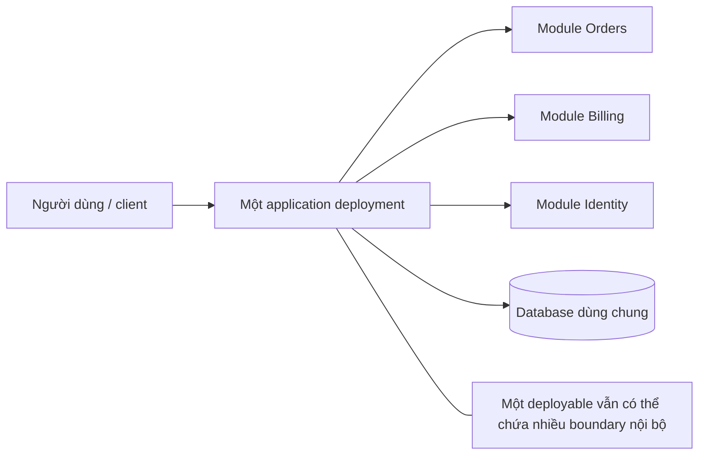
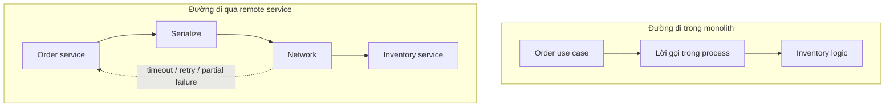
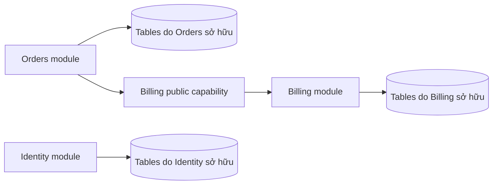
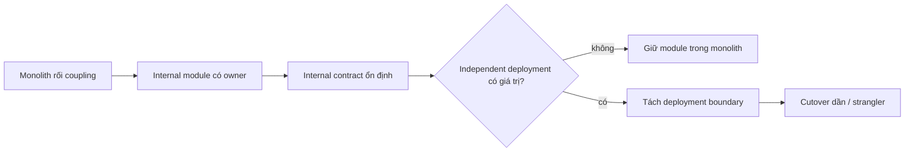
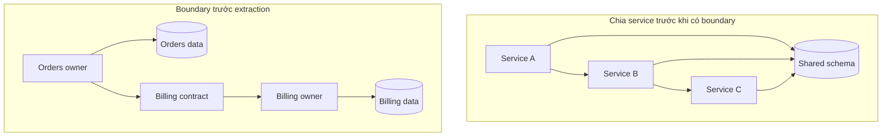

# Kiến trúc Monolith: Một ranh giới triển khai, nhiều cách thiết kế

Đúng 2 giờ chiều ngày siêu sale Black Friday, lưu lượng truy cập đổ về chạm đỉnh kỷ lục. Đột nhiên, một tính năng phụ trợ vừa mới phát hành—tính năng xuất file báo cáo thuế định dạng PDF theo tháng—kích hoạt một lỗi rò rỉ bộ nhớ (memory leak) do không giải phóng buffer. Chỉ trong vòng vài phút, bộ nhớ heap bị vắt kiệt, bộ gom rác (Garbage Collector) quá tải đẩy CPU lên 100%, các tiến trình ứng dụng chết chìm và toàn bộ cổng thanh toán tê liệt hoàn toàn. Vì toàn bộ hệ thống được đóng gói thành một đơn vị triển khai (deployment unit) duy nhất, sự cố ở một tính năng phụ trợ không quan trọng đã kéo sập toàn bộ cỗ máy kiếm tiền cốt lõi của doanh nghiệp.

Sự cố kinh hoàng này phơi bày sự đánh đổi căn bản nhất của kiến trúc monolith: sự tiện lợi tuyệt đối của các lời gọi hàm in-memory và giao dịch ACID cục bộ, được đánh đổi bằng một phạm vi ảnh hưởng lỗi (blast radius) dùng chung không có vách ngăn cô lập.

> 💡 **Quy tắc bỏ túi:** Monolith là một cấu trúc triển khai, không phải cái cớ cho sự buông lỏng ranh giới. Hãy tận dụng tối đa sự đơn giản của lời gọi hàm trong cùng tiến trình và giao dịch ACID cục bộ, nhưng phải luôn duy trì tính mô-đun nghiêm ngặt và chủ động cô lập các tác vụ nặng tài nguyên trước khi chúng kéo sập luồng nghiệp vụ sống còn.

## Tóm tắt nhanh

- **Đóng gói và triển khai như một đơn vị duy nhất**: Hầu hết mọi chức năng nghiệp vụ được build, phát hành và scale trong cùng một tiến trình ứng dụng như **một đơn vị triển khai**. Sự tương tác giữa các thành phần diễn ra tức thì qua lời gọi hàm nội bộ (in-process) thay vì phụ thuộc vào độ trễ và độ tin cậy của mạng.
- **Giao dịch ACID cục bộ loại bỏ gánh nặng phân tán**: Các thao tác biến đổi dữ liệu liên quan có thể hoàn tất nguyên tử trong một database transaction duy nhất, không cần đến sự phức tạp của saga, giao dịch hai pha hay đối soát nhất quán cuối cùng.
- **Phạm vi ảnh hưởng lỗi (blast radius) dùng chung là cái giá lớn nhất**: Một lỗi tràn bộ nhớ, ngoại lệ chưa bắt được hoặc luồng ngốn CPU ở một tính năng phụ có thể kéo sập toàn bộ tiến trình ứng dụng và mọi chức năng quan trọng khác.
- **Chất lượng kiến trúc do cấu trúc nội bộ quyết định**: Monolith có thể được phân tầng sạch sẽ, phân định quyền sở hữu module rõ ràng và bảo vệ bằng architecture test—hoặc có thể thoái hóa thành một mớ bòng bong (big ball of mud). Cấu trúc triển khai không quyết định độ sạch của mã nguồn.
- **Cạm bẫy chết người:** **Không cô lập phạm vi ảnh hưởng (Unbounded Blast Radius)**—Để các tác vụ nền ngốn tài nguyên (như xuất PDF, xử lý hình ảnh, tổng hợp báo cáo lớn) chạy chung bộ nhớ heap và pool kết nối database với các luồng thanh toán và đăng nhập cốt lõi mà không có cơ chế giới hạn tài nguyên hoặc tiến trình worker tách biệt.



Đánh đổi chính có thể tóm tắt như sau:

```text
ít ranh giới distributed-system hơn
  ↔
coupling lớn hơn ở deployment, scaling và failure boundary
```

## 1. Hãy định nghĩa monolith từ deployment boundary trước

<TermBox term="Deployment boundary">
**Deployment boundary** là đơn vị được build, version, rollout, rollback và thường được scale cùng nhau.

Trong kiến trúc monolith, ứng dụng thường được deploy như một đơn vị ngay cả khi source code chứa nhiều module, package, layer hay assembly.

**Vì sao quan trọng:** topology triển khai quyết định những thay đổi, failure, resource decision và release procedure nào bị coupling với nhau ở mức vận hành.
</TermBox>

Tài liệu kiến trúc của Microsoft mô tả ứng dụng monolith là ứng dụng có hành vi lõi tự chứa và thường được deploy như một đơn vị. Khi scale ngang, toàn bộ ứng dụng thường được nhân bản thay vì chỉ scale riêng một component nội bộ.

Mental model hữu ích là:

```text
cấu trúc source code != topology triển khai
```

Bạn có thể có:

```text
controllers/
application/
domain/
infrastructure/
orders/
billing/
identity/
```

nhưng vẫn deploy toàn bộ ứng dụng như một artifact.

Ngược lại, tách source code thành nhiều repository cũng không tự động tạo ra service độc lập nếu chúng luôn phải release cùng nhau.

## 2. Monolith không đồng nghĩa với code thiếu cấu trúc

Một lỗi diễn giải phổ biến là dùng “monolith” như cách viết tắt cho:

```text
lớn + cũ + coupling cao + khó thay đổi
```

Đó là các thuộc tính khác nhau.

Một monolith lành mạnh có thể có:

- module có cohesion tốt;
- public API rõ giữa các module;
- implementation detail private;
- dependency direction rõ;
- package boundary;
- ownership theo capability;
- contract test và architecture test;
- transaction ownership rõ;
- kiểm soát quyền truy cập dữ liệu dùng chung.

Một hệ microservice tệ vẫn có thể có cohesion thấp, dependency cycle, shared schema và release coupling—chỉ khác là giờ các coupling đó đi qua network.

Vì vậy hãy tách hai câu hỏi:

1. **Hệ thống được deploy thế nào?**
2. **Hệ thống được tổ chức nội bộ thế nào?**

Đừng dùng câu trả lời của câu này để thay cho câu kia.

## 3. Lợi ích đầu tiên là sự đơn giản vận hành

Một application boundary duy nhất loại bỏ nhiều bài toán coordination phân tán khỏi luồng phát triển feature thông thường.

Trong cùng process, collaboration thường có thể là:

```text
gọi hàm
  -> giá trị trả về
```

thay vì:

```text
network call
  -> serialization
  -> timeout
  -> retry
  -> partial failure
  -> tracing
  -> remote contract có version
```



Sự đơn giản này có giá trị thật:

- local development dễ hơn;
- debug đơn giản hơn;
- ít deployment artifact hơn;
- ít remote contract hơn;
- overhead observability thấp hơn;
- ít hạ tầng vận hành hơn;
- end-to-end test cho nhiều flow dễ hơn.

AWS cũng ghi nhận monolith có thể là lựa chọn hợp lý trong một số bối cảnh và nhiều ứng dụng tự nhiên bắt đầu dưới dạng monolith.

Đừng trả chi phí distributed system trước khi bạn thật sự cần deployment autonomy phân tán.

## 4. In-process call rẻ, nhưng architectural coupling vẫn có thể đắt

<TermBox term="In-process coupling">
**In-process coupling** là dependency giữa các phần của ứng dụng cộng tác trong cùng runtime boundary.

Bản thân lời gọi rẻ hơn nhiều so với network hop, nhưng **change coupling** vẫn có thể rất cao nếu một module chạm trực tiếp vào internals, table, mutable state hoặc framework type của module khác.

**Vì sao quan trọng:** runtime latency thấp không có nghĩa change locality tốt.
</TermBox>

Điều này ổn:

```text
Checkout module
  -> InventoryReservation public operation
```

Điều này nguy hiểm hơn:

```text
Checkout module
  -> InventoryRepository internal class
  -> inventory tables
  -> stock calculation helper
  -> private cache structure
```

Cả hai đều là in-process. Chỉ một cách giữ được boundary có ý nghĩa.

Monolith khiến cross-boundary access dễ về mặt kỹ thuật. Sự tiện lợi này hữu ích, nhưng đồng nghĩa **kỷ luật phải thay cho sự tách biệt do network cưỡng chế**.

## 5. Shared transaction là một lợi thế thật

Monolith thường dùng một relational database chính và có thể điều phối các thay đổi state liên quan trong một local database transaction.

Ví dụ:

```text
tạo order
reserve inventory
ghi payment intent
ghi outbox row
COMMIT
```

Khi các row này nằm dưới cùng một transactional authority, giữ invariant có thể đơn giản hơn nhiều so với phối hợp state trên nhiều service database độc lập.

Đây là một lý do để không chia hệ thống chỉ nhằm chạy theo xu hướng kiến trúc.

Nhưng lợi ích này có điều kiện:

> khả năng transaction dùng chung không nên biến thành ownership dùng chung của mọi table.

Nếu mọi feature đều có thể đọc và ghi mọi table, database trở thành integration API ẩn của toàn ứng dụng.

Khi đó schema change sẽ có blast radius lớn dù deployment vẫn đơn giản.

## 6. Shared database có thể tiện mà không cần trở thành ownerless

Monolith có thể dùng một physical database nhưng vẫn duy trì logical ownership.

Ví dụ:

```text
Orders sở hữu:
  orders
  order_lines
  order_status_history

Billing sở hữu:
  payment_attempts
  refunds

Identity sở hữu:
  users
  credentials
```

Module khác nên ưu tiên gọi owned operation hoặc dùng stable read model thay vì ghi tùy ý vào table của nhau.



Một database server không bắt buộc chỉ có một ownership boundary.

Phân biệt này đặc biệt quan trọng trước khi tiến hóa sang modular monolith hoặc service về sau.

## 7. Scale monolith thường là scale toàn bộ ứng dụng

Một monolith điển hình scale ngang bằng cách thêm nhiều instance của toàn ứng dụng sau load balancer.

```text
instance 1 = toàn bộ capability
instance 2 = toàn bộ capability
instance 3 = toàn bộ capability
```

Cách này đơn giản về vận hành, nhưng có thể không hiệu quả khi chỉ một workload nội bộ cần thêm capacity.

Ví dụ:

```text
Image processing cần CPU gấp 8 lần.
Account settings gần như không cần thêm.
```

Nếu cả hai sống trong một deployment unit, scale cho image processing có thể nhân bản cả code và memory của account settings.

Điều đó không tự động đồng nghĩa phải dùng microservice. Các lựa chọn khác gồm:

- tối ưu hotspot;
- dùng asynchronous worker;
- tách riêng heavy job runner;
- scale database độc lập;
- thêm caching;
- chỉ tách workload đã được chứng minh là hotspot thành deployment boundary riêng sau này.

Hãy đo trước khi thay kiến trúc.

## 8. Release coupling là constraint vận hành trung tâm

Các phần của monolith được release cùng nhau.

Điều này cho một release pipeline và một rollback unit, nhưng cũng khiến các thay đổi không liên quan có thể cùng đi qua một deployment event.

<TermBox term="Release coupling">
**Release coupling** nghĩa là nhiều capability phải đi qua versioning, rollout và rollback như một operational release unit.

Monolith chủ động chấp nhận coupling này để đổi lấy ít service version độc lập hơn và runtime integration đơn giản hơn.

**Vì sao quan trọng:** khi số team và tần suất thay đổi tăng, release coupling có thể trở nên đắt hơn chi phí distributed-system mà nhiều deployable riêng tạo ra.
</TermBox>

Câu hỏi hữu ích không phải:

> “Một deployment có lỗi thời không?”

Hãy hỏi:

> “Coordinated deployment có đang thực sự làm chậm delivery an toàn không?”

Nếu mười team vẫn ship qua một pipeline mà không chặn nhau, có thể chưa có vấn đề nào cần giải quyết.

## 9. Failure blast radius đi theo deployment và process boundary

Một defect nghiêm trọng trong một monolithic process có thể ảnh hưởng toàn application instance.

Ví dụ:

- memory leak;
- CPU runaway;
- hiện tượng đói tài nguyên thread/event-loop (starvation);
- queue tăng không giới hạn;
- process crash;
- deployment regression;
- global connection-pool exhaustion.

Khi toàn ứng dụng được nhân bản thành nhiều instance, failure ở một instance có thể được cô lập bằng load balancing và health check. Nhưng một release lỗi vẫn có thể ảnh hưởng mọi capability vì chúng cùng artifact.

Đây là failure model khác với các service deploy độc lập.

Đừng nhầm:

```text
module boundary
```

với:

```text
fault-isolation boundary
```

Module có thể cô lập source dependency nhưng không cô lập process crash.

## 10. Monolith vẫn có thể dùng background worker và hạ tầng ngoài

Kiến trúc monolith không yêu cầu mọi computation diễn ra đồng bộ trong một HTTP process.

Một monolithic application có thể dùng:

- PostgreSQL;
- Redis;
- object storage;
- queue;
- scheduled job;
- CDN và reverse proxy;
- payment hoặc email provider bên ngoài.

Phân loại nằm ở deployment và ownership topology chính của ứng dụng, không nằm ở việc ứng dụng có gọi hệ thống ngoài hay không.

Tuy nhiên cần cẩn thận với worker topology.

Nếu web và worker process có thể deploy độc lập và dần có ownership/contract khác nhau, kiến trúc có thể đang vượt khỏi một monolith đơn giản. Hãy đặt tên topology dựa trên operational boundary thật, không dựa trên layout repository.

## 11. Số team làm thay đổi economics

Một team nhỏ thường được lợi từ một deployment boundary vì communication đã diễn ra trong cùng team.

Khi tổ chức lớn lên, áp lực có thể xuất hiện khi:

- nhiều team sửa cùng module;
- code ownership không rõ;
- thời gian CI tăng mạnh;
- thay đổi không liên quan thường xuyên chặn release;
- rollback đòi hỏi revert cả thay đổi không liên quan;
- một vùng chiếm phần lớn capacity;
- schema ownership bị tranh chấp.

Phản ứng không nên tự động là “microservices”.

Trước tiên hãy cải thiện:

- module ownership;
- dependency boundary;
- CI partitioning;
- test strategy;
- deployment automation;
- observability;
- schema ownership.

Nếu các cải tiến này khôi phục change locality, monolith có thể vẫn là deployment topology phù hợp.

## 12. Tránh bẫy distributed monolith

**Distributed monolith** có nhiều runtime service nhưng vẫn giữ monolithic coupling.

Dấu hiệu thường gặp:

```text
Service A không deploy được nếu B và C chưa deploy.
A ghi trực tiếp vào schema của B.
Mỗi request đồng bộ đi qua năm service.
Một thay đổi phải sửa bốn repository.
Các service dùng chung một release train.
```

Cách này giữ nhiều coupling của monolith nhưng thêm:

- network latency;
- partial failure;
- serialization;
- retry;
- tracing;
- quản lý remote contract;
- orchestration deployment.

Tách process không đồng nghĩa tạo ra service tự chủ.

## 13. “Bắt đầu bằng monolith” không có nghĩa “giữ code vô cấu trúc”

Monolith thường là default mạnh khi:

- domain vẫn đang được khám phá;
- một team sở hữu phần lớn hệ thống;
- traffic có thể scale bằng cách nhân bản toàn app;
- transaction xuyên capability xảy ra thường xuyên;
- operational simplicity có giá trị lớn;
- deployment independence chưa chứng minh được giá trị.

Nhưng lựa chọn này nên đi kèm một yêu cầu kiến trúc:

> giữ boundary nội bộ đủ mạnh để các lựa chọn tương lai vẫn reversible.

Điều đó nghĩa là tránh global state vô chủ, arbitrary table access, circular module dependency và framework type lan khắp kho mã nguồn.

Một monolith có cấu trúc tốt giữ được option value.

## 14. Chỉ phân rã khi một boundary xứng đáng được deploy độc lập

Tín hiệu decomposition tốt phải cụ thể.

Ví dụ:

- một capability cần scaling profile khác hẳn;
- một vùng có availability hoặc security boundary riêng;
- các team liên tục chặn release của nhau;
- một capability cần technology lifecycle độc lập;
- fault isolation cho một workload có giá trị kinh tế rõ;
- ownership đã rõ và cross-boundary transaction ít;
- boundary có thể lộ ra contract ổn định mà không cần coordinated change liên tục.

Lý do yếu:

```text
“Microservice hiện đại hơn.”
```

Lý do mạnh:

```text
“Media transcoding dùng 80% CPU, deploy 12 lần/ngày,
cần autoscale độc lập và hiếm khi tham gia synchronous transaction
với phần còn lại của ứng dụng.”
```

Hướng dẫn modernization của AWS khuyến nghị hiểu rõ business use case, technology và interdependency trước khi phân rã monolith. Các pattern như phân rã theo business capability, subdomain hay strangler chỉ là công cụ—không phải mục tiêu tự thân.

## 15. Migration phải giảm coupling, không chỉ di chuyển code

Một chuỗi decomposition hữu ích là:

```text
1. xác định capability ownership
2. dừng cross-boundary write
3. định nghĩa internal contract ổn định
4. đo call pattern và transaction need
5. chỉ extract khi independent deployment có giá trị
6. migrate caller dần dần
7. xóa đường cũ
```



Phần chuẩn bị có giá trị nhất thường diễn ra **trước** khi xuất hiện network boundary.

## 16. Sự cố production: đổ lỗi cho deployable thay vì boundary bị thiếu

Một ứng dụng thương mại điện tử bắt đầu với sáu kỹ sư và một deployment.

Năm năm sau ứng dụng vẫn deploy như một đơn vị, nhưng kỷ luật nội bộ đã biến mất:

```text
Checkout import internals của Inventory.
Inventory đọc table của Billing.
Billing gọi helper class của Identity.
Admin job ghi trực tiếp mọi schema.
Mọi module import một package Shared khổng lồ.
```

Team kết luận:

> “Monolith là vấn đề. Chúng ta cần microservices.”

Họ chia code thành sáu service mà chưa thiết lập ownership trước.

Kết quả vẫn là shared database, synchronous call chain, coordinated deployment và cross-service schema access.

**Hậu quả:** latency và failure mode tăng, debug giờ cần distributed tracing, deployment phức tạp hơn, nhưng feature change vẫn trải qua nhiều component và nhiều team.

**Nguyên nhân cốt lõi:** vấn đề ban đầu là coupling mất kiểm soát và ownership không tồn tại. Migration đổi process boundary trước khi sửa dependency/data boundary, tạo ra một distributed monolith.

**Cách khắc phục chuẩn:** thiết lập module và schema ownership ngay trong monolith trước, dừng cross-boundary write, thu nhỏ public contract, đo change/runtime coupling, rồi chỉ extract capability thật sự được lợi từ independent deployment, scaling, fault isolation hoặc ownership.



## 17. Tự kiểm tra

<details>
<summary>Nếu một ứng dụng có 20 module nhưng ship như một application artifact, nó vẫn là monolith chứ?</summary>

Có. Internal modularity và deployment topology là hai chiều khác nhau. Một ứng dụng có cấu trúc tốt vẫn có thể là monolith nếu các module được build, release và scale như một deployment unit.
</details>

<details>
<summary>Dùng PostgreSQL, Redis, queue hoặc object storage có khiến ứng dụng không còn là monolith không?</summary>

Không. Hạ tầng ngoài tự nó không thay đổi deployment topology của ứng dụng. Câu hỏi hữu ích là các capability của ứng dụng có thể deploy độc lập và có operational autonomy hay không.
</details>

<details>
<summary>Nếu một module cần nhiều CPU hơn, nó bắt buộc phải thành microservice không?</summary>

Không. Trước hết hãy đo bottleneck và cân nhắc tối ưu, asynchronous worker, caching hoặc tách riêng một job runner cụ thể. Extraction chỉ thực sự hấp dẫn khi independent scaling đáng giá hơn chi phí distributed-system bổ sung.
</details>

## 18. Checklist production

- [ ] Ứng dụng có deployment boundary và rollback unit được hiểu rõ.
- [ ] Internal module có ownership rõ thay vì cross-feature import tùy ý.
- [ ] Shared database infrastructure vẫn có logical schema/table ownership.
- [ ] Cross-module write đi qua owned capability hoặc explicit contract.
- [ ] Local transaction được dùng có chủ đích khi nó đơn giản hóa invariant thật.
- [ ] Horizontal scaling behavior và resource hotspot được đo.
- [ ] Release coupling được đo như một delivery constraint thay vì mặc định xem là xấu.
- [ ] Process-level failure blast radius được hiểu và giảm bằng health check, replication và resilience control.
- [ ] CI và test suite được partition đủ để một kho mã nguồn duy nhất không đồng nghĩa với một chu kỳ phản hồi (feedback loop) chậm.
- [ ] Đề xuất decomposition nêu rõ lợi ích cụ thể: independent deployment, scaling, fault isolation, security hoặc ownership.
- [ ] Không service đề xuất nào phụ thuộc vào direct write sang dữ liệu của capability khác.
- [ ] Boundary cleanup diễn ra trước extraction thay vì dùng extraction để thay thế boundary cleanup.
- [ ] Tín hiệu phân rã kiến trúc được đo bằng evidence, không phải sự khó chịu mơ hồ.

## Quy tắc cho agent

Khi đánh giá một monolith, **hãy tách deployment topology khỏi chất lượng thiết kế nội bộ**. Đừng đề xuất tách service chỉ vì kho mã nguồn phình to. Trước tiên hãy xác định ownership, change coupling, data boundary, transaction need, scaling hotspot, release coupling và failure-isolation requirement. Chỉ extract một capability khi operational boundary độc lập tạo ra nhiều giá trị hơn complexity distributed-system mà nó bổ sung.

## Nguồn tham khảo

- [Microsoft Learn — Common web application architectures](https://learn.microsoft.com/en-us/dotnet/architecture/modern-web-apps-azure/common-web-application-architectures)
- [Microsoft Learn — Leveraging containers and orchestrators](https://learn.microsoft.com/en-us/dotnet/architecture/cloud-native/leverage-containers-orchestrators)
- [AWS Prescriptive Guidance — Decomposing monoliths into microservices](https://docs.aws.amazon.com/prescriptive-guidance/latest/modernization-decomposing-monoliths/)
- [AWS Prescriptive Guidance — Comparing micro-frontends with alternative architectures](https://docs.aws.amazon.com/prescriptive-guidance/latest/micro-frontends-aws/micro-frontend-alternatives.html)
