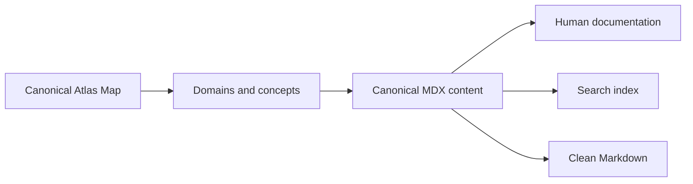

## Learn or look something up

Use the sidebar when you want to explore a domain and search when you already know the concept, symptom, API, or technique you need.

Use the [Software Engineering Map](./software-engineering-map) when you want to understand where a concept belongs in the larger engineering landscape and which areas are not covered yet.

## Follow prerequisite links deliberately

Lessons may name prerequisite concepts. You do not need to read every prerequisite first, but follow one when the current explanation assumes a mental model you do not yet have.

## Prefer the production section when referencing

When you already understand a topic, skim the TL;DR, examples, trade-offs, production considerations, and sources rather than rereading every explanation.

## Contribute corrections

Every lesson is stored in GitHub. Use the page action to propose edits when an example, claim, source, or explanation can be improved.

## Knowledge flow

