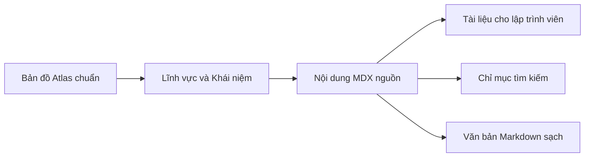

## Học mới hoặc tra cứu nhanh

Sử dụng thanh điều hướng bên cạnh (sidebar) khi bạn muốn khám phá toàn bộ một lĩnh vực, và sử dụng công cụ tìm kiếm khi bạn đã xác định rõ khái niệm, triệu chứng lỗi, API hoặc kỹ thuật mình cần.

Tham khảo [Bản đồ Kỹ nghệ Phần mềm](./software-engineering-map) khi bạn muốn định vị một khái niệm nằm ở tọa độ nào trong bức tranh toàn cảnh và nhận biết những phần nào hiện chưa có bài học.

## Đi theo liên kết tiên quyết một cách chủ động

Mỗi bài học có thể nêu tên các khái niệm tiên quyết. Bạn không nhất thiết phải đọc hết mọi bài tiên quyết trước, nhưng hãy mở chúng khi lời giải thích hiện tại dựa trên một mô hình tư duy mà bạn chưa từng tiếp cận.

## Ưu tiên mục Production khi cần tra cứu

Khi bạn đã nắm vững một chủ đề và chỉ quay lại để tra cứu, hãy lướt nhanh phần Tóm tắt (TL;DR), code mẫu, đánh đổi kỹ thuật, lưu ý trên môi trường thực tế (production considerations) và tài liệu nguồn thay vì phải đọc lại toàn bộ bài giải thích từ đầu.

## Đóng góp chỉnh sửa

Mỗi bài học đều được lưu trữ trực tiếp trên kho mã nguồn GitHub. Bạn có thể sử dụng nút thao tác trên trang để đề xuất sửa đổi nếu phát hiện ví dụ, khẳng định kỹ thuật, nguồn trích dẫn hoặc phần giải thích cần được cải thiện.

## Luồng luân chuyển tri thức

