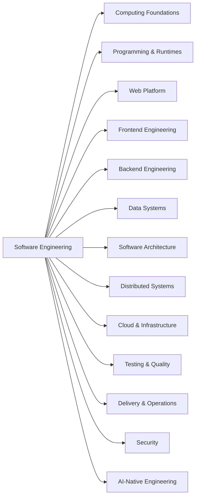

The Software Engineering Map is the canonical inventory of the engineering territory the Atlas intends to cover. It lives in `content/atlas-map.json` so humans, tests, tooling, and coding agents can share one stable vocabulary.

## From territory to content

```text
Atlas Map
  -> Domain
    -> Concept
      -> Content
```

A **domain** is a broad area such as Web Platform, Data Systems, or Cloud & Infrastructure. A **concept** is a durable coordinate inside that area, such as HTTP request lifecycle, database transactions, or cloud IAM. A content page teaches or applies one or more canonical concepts.

Loose `topics` remain useful for search and discovery. A page's `concepts` field is different: those IDs point to the canonical map and are validated in CI.

## The first map



The map is intentionally broad before it is complete. A concept is allowed to exist before dedicated content does; that makes missing coverage visible instead of letting the current sidebar define the perceived shape of software engineering.

## Map, coverage, content, path, and decision guide

**Map** answers: *What territory exists, and where does this concept belong?*

**Coverage** answers: *Which canonical concepts currently have substantive authored Atlas content?* See [Atlas Coverage](/docs/start-here/coverage). Uncovered concepts remain visible rather than disappearing from the map.

**Content** answers: *What mental model, rule, or practical technique should I understand here?* Content can be a concise concept note, a deep dive, a decision guide, a field guide, or an architecture walkthrough.

**Learning path** answers: *In what sequence should I learn a useful slice of the map?* [Learning Paths](/docs/learning-paths) provide curated traversals without implying one universal reading order.

**Decision guide** answers: *Given constraints and trade-offs, when should I choose one approach over another?* Decision guides are first-class content rather than framework popularity lists.

## Depth is separate from difficulty

Atlas content declares a target learning depth:

- `recognize` — identify the idea and place it in the system;
- `reason` — explain behavior, alternatives, trade-offs, and common failure modes;
- `operate` — design, debug, verify, or run the concept in realistic engineering work.

This is separate from `beginner`, `intermediate`, and `advanced`, which describe prerequisite difficulty.

## Coverage over volume

The Atlas should not optimize for article count. New content should fill important gaps, connect prerequisites, or improve engineering judgment. Not every map coordinate needs an interactive deep dive; a concise concept page is often the correct unit.
