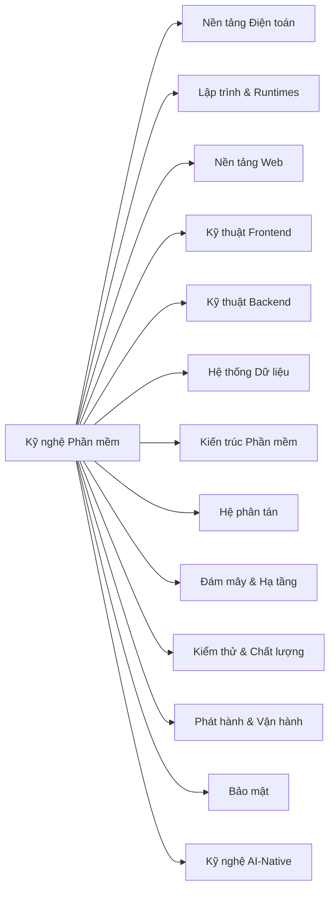

Bản đồ Kỹ nghệ Phần mềm (Software Engineering Map) là danh mục chuẩn hóa toàn bộ lãnh thổ tri thức kỹ thuật mà Atlas dự định bao phủ. Bản đồ này được lưu trữ tại file `content/atlas-map.json` để con người, bộ kiểm thử tự động, công cụ và các AI coding agent cùng chia sẻ chung một hệ từ vựng ổn định.

## Từ lãnh thổ tri thức đến bài học thực tế

```text
Bản đồ Atlas
  -> Lĩnh vực (Domain)
    -> Khái niệm (Concept)
      -> Nội dung bài học (Content)
```

Một **lĩnh vực (domain)** là một mảng kiến thức rộng như Nền tảng Web (Web Platform), Hệ thống Dữ liệu (Data Systems), hoặc Đám mây & Hạ tầng (Cloud & Infrastructure). Một **khái niệm (concept)** là một tọa độ bền vững bên trong mảng kiến thức đó, chẳng hạn như vòng đời yêu cầu HTTP, giao dịch cơ sở dữ liệu (database transactions), hoặc phân quyền IAM trên đám mây. Mỗi bài học sẽ giảng dạy hoặc ứng dụng một hay nhiều khái niệm chuẩn này.

Trường `topics` dạng tự do tiếp tục hữu ích cho việc tìm kiếm và khám phá nội dung. Tuy nhiên, trường `concepts` của bài học có tính chất hoàn toàn khác: các ID này trỏ trực tiếp đến bản đồ chuẩn hóa và được xác thực chặt chẽ trong quy trình CI.

## Bản đồ tổng quan ban đầu



Bản đồ được thiết kế có chủ đích nhằm bao quát diện rộng ngay từ trước khi nội dung được lấp đầy. Một khái niệm được phép xuất hiện trên bản đồ trước khi có bài học chuyên sâu riêng; điều này giúp những khoảng trống tri thức luôn hiển hiện rõ ràng thay vì để cấu trúc cây thư mục hiện tại quyết định hình dung của người học về thế giới kỹ nghệ phần mềm.

## Bản đồ, Độ bao phủ, Nội dung, Lộ trình và Cẩm nang ra quyết định

**Bản đồ (Map)** trả lời câu hỏi: *Toàn bộ lãnh thổ gồm những gì, và khái niệm này thuộc về khu vực nào?*

**Độ bao phủ (Coverage)** trả lời câu hỏi: *Những khái niệm chuẩn nào hiện đã có bài học chính thức trong Atlas?* Xem trang [Độ bao phủ Atlas](/vi/docs/start-here/coverage). Các khái niệm chưa có bài học vẫn hiển thị minh bạch chứ không bị giấu khỏi bản đồ.

**Nội dung (Content)** trả lời câu hỏi: *Tôi cần hiểu mô hình tư duy, quy tắc kỹ thuật hay kỹ năng thực hành nào ở đây?* Nội dung có thể là một ghi chú khái niệm súc tích, một bài phân tích sâu (deep dive), một cẩm nang ra quyết định (decision guide), một cẩm nang thực địa (field guide), hoặc một phân tích kiến trúc thực tế (architecture walkthrough).

**Lộ trình học tập (Learning path)** trả lời câu hỏi: *Nên học theo trình tự nào để đạt được một mục tiêu kỹ thuật cụ thể?* Xem [Lộ trình học tập](/vi/docs/learning-paths) để tiếp cận các lộ trình được tuyển chọn cẩn thận mà không áp đặt một thứ tự đọc cứng nhắc cho toàn bộ hệ thống.

**Cẩm nang ra quyết định (Decision guide)** trả lời câu hỏi: *Với những ràng buộc và đánh đổi kỹ thuật nhất định, khi nào nên chọn giải pháp này thay vì giải pháp khác?* Cẩm nang ra quyết định là tài liệu học tập hạng nhất, không phải bảng xếp hạng độ phổ biến của các framework.

## Mức độ tiếp cận độc lập với độ khó

Nội dung trong Atlas khai báo mức độ tiếp cận mục tiêu (`learningDepth`):

- `recognize` (Nhận biết) — nhận diện khái niệm và định vị vị trí của nó trong hệ thống;
- `reason` (Hiểu bản chất) — giải thích hành vi, các phương án thay thế, đánh đổi kỹ thuật và các lỗi sai thường gặp;
- `operate` (Vận hành thực tế) — thiết kế, gỡ lỗi, kiểm chứng hoặc vận hành khái niệm trong công việc kỹ thuật thực tế.

Phân loại này hoàn toàn độc lập với `beginner`, `intermediate`, và `advanced` vốn dùng để mô tả độ khó về mặt kiến thức tiên quyết.

## Giá trị bao phủ quan trọng hơn số lượng bài viết

Atlas không chạy theo số lượng bài viết đơn thuần. Mỗi nội dung mới phải giải quyết khoảng trống tri thức quan trọng, liên kết các kiến thức tiên quyết hoặc nâng cao năng lực phán đoán kỹ thuật. Không phải tọa độ nào trên bản đồ cũng cần một phòng thí nghiệm tương tác chuyên sâu; một trang giải thích khái niệm cô đọng và chuẩn xác thường là đơn vị học tập lý tưởng nhất.
