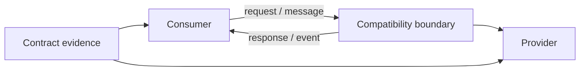
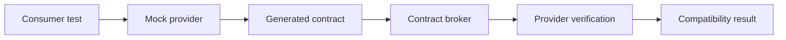
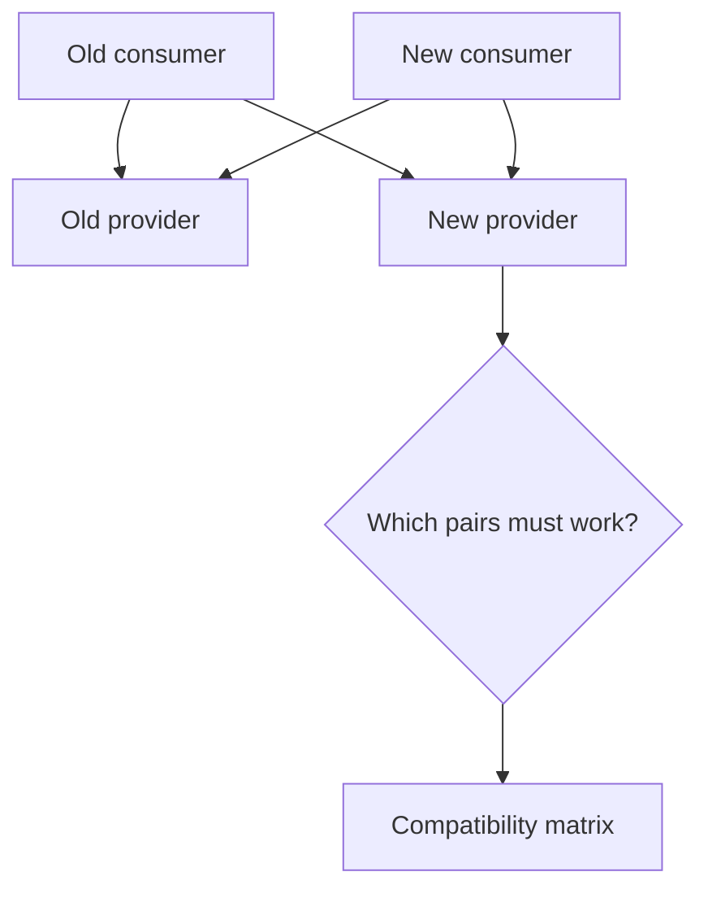

# Contract Testing: Reason About Compatibility Between Independently Changing Systems

## TL;DR

Between May 1 and May 2, 2026, Jira and Jira Service Management suffered a schema-compatibility incident across all Cloud regions. Atlassian's postmortem says a schema configuration reached the API gateway layer **before the corresponding application change existed in every production environment**, so the gateway expected a schema some application servers did not yet serve. Work-item viewing failed, editing degraded, and service was restored after 3 hours 19 minutes by redeploying the previous schema configuration. Atlassian's follow-up included automated pre-deployment checks for schema compatibility across production environments. **Both sides could be valid in isolation while the versions actually talking to each other were incompatible.**

> 💡 **Rule of thumb:** Use contract testing when two systems can change or deploy independently and correctness depends on them preserving a **shared understanding of requests, responses, messages, and events**.

- **Test compatibility, not the whole business flow:** Contract tests ask whether consumer and provider still agree at a communication boundary; they do not prove end-to-end business correctness.
- **Let real consumer needs shape the contract:** Consumer-driven contracts capture what a consumer actually sends and depends on, while provider/schema conformance answers a different question.
- **Specify minimally:** A consumer should contract for the fields and semantics it uses, not clone the provider's entire response and turn additive changes into false breakages.
- **Gate deployments by version compatibility:** Provider verification, broker matrices, and deployment checks matter because “latest consumer vs latest provider” is not enough when multiple versions are deployed.
- **Fatal pitfall:** Treating a schema file as proof that real consumers are compatible. A syntactically valid API can still break clients through changed meaning, enum handling, field removal, or rollout order.

<TermBox term="Contract">
A **contract** is the shared understanding at a communication boundary: what a consumer may send, what a provider may return or publish, and which parts of that exchange are required for compatibility.
</TermBox>

## Contract testing is about compatibility

A contract test focuses on **consumer ↔ provider** communication.

That communication may be:

- HTTP request/response;
- GraphQL query/result;
- asynchronous message;
- event payload;
- RPC/protobuf message;
- webhook.

The core question is:

> If these two versions communicate, will the message shape and semantics each side depends on still line up?

That is narrower than integration testing and much narrower than end-to-end testing.

Contract testing does **not prove business correctness** and does **not prove end-to-end behavior**.

It does not tell you whether checkout calculates tax correctly, whether the user sees the right confirmation, or whether a database transaction is durable.

It tells you whether the communication boundary remains compatible.

## Consumer and provider are roles, not architecture labels

A frontend calling an API is a consumer.

A backend service calling another service is also a consumer.

A worker processing a message is the consumer of that message.

The same service may be:

- provider to one application;
- consumer of another provider;
- producer of messages consumed elsewhere.

This vocabulary matters because the contract follows the interaction, not the deployment topology.

## Consumer-driven contracts capture actual needs

<TermBox term="Consumer-Driven Contract">
A **consumer-driven contract (CDC)** records the interactions a consumer actually needs from a provider. The consumer defines the expected request and the minimal response/message shape it relies on; the provider later verifies that it can satisfy those expectations.
</TermBox>

Pact is a common implementation of this model.

A simplified flow is:

The consumer test asks:

> Assuming the provider behaves according to this interaction, does my consumer send the right request and correctly handle the expected response?

The provider verification asks:

> Can the actual provider produce a response that satisfies this consumer's contract?

Both sides contribute evidence.

## Consumer-driven does not mean consumer controls the API

CDC does not mean every consumer can demand arbitrary provider behavior.

The provider still owns its API design.

Contract testing makes assumptions visible early:

- which consumers depend on which fields;
- which status codes are expected;
- which optional values are handled;
- which event keys are required;
- which message variants are consumed.

If a consumer asks for behavior the provider should not support, the failed verification becomes a design conversation before deployment instead of an outage afterward.

## Provider/schema conformance answers another question

A provider can also be tested against an API specification such as **OpenAPI**.

That asks:

> Does the provider implementation conform to its documented schema/specification?

This is valuable.

It catches drift between code and API documentation.

But **schema conformance is not enough to prove consumer usage is compatible**.

A schema might permit five response variants while a consumer only correctly handles three.

A new enum value may be valid according to the schema but crash a client with an exhaustive switch.

A field might remain type-compatible while its meaning changes.

So distinguish:

- **provider/schema contract testing** — implementation vs specification;
- **consumer-driven contract testing** — consumer expectations vs provider behavior.

They complement each other.

## Minimal expectations keep contracts evolvable

Pact explicitly encourages a **minimal expected response**.

If the provider returns:

- id;
- email;
- displayName;
- avatar;
- createdAt;
- preferences;
- internalFlags;

but the consumer uses only id and displayName, the contract should normally care about only those fields.

Why?

Because copying the entire response into the contract creates accidental coupling.

Then an **additive change / new field** can fail tests even though the consumer does not care.

Over-specified contracts become **brittle**.

A good contract describes what compatibility requires, not everything the provider happens to emit.

## Match semantics without hard-coding irrelevant values

Imagine the consumer needs:

- status code 200;
- JSON body with a string id;
- non-empty displayName;
- role in a known set.

The contract should express those constraints rather than exact values like:

- id must equal user-123;
- displayName must equal Alice;
- every unrelated field must appear in exact order.

Use exact matching only where exactness is part of the contract.

Loose matching everywhere is also dangerous.

The point is to model the consumer's real expectation precisely.

## Compatibility is directional

“Compatible” is incomplete unless you say **which version must work with which other version**.

For an independently deployed consumer and provider, reason about at least:

- **backward compatibility:** a **new provider** continues to satisfy an **old consumer**;
- **forward compatibility:** a **new consumer** can still work with an **old provider** where your rollout requires it;
- same-version compatibility: new consumer with new provider;
- deployed-version compatibility: the exact consumer/provider versions that coexist in an environment.

A common safe rollout is:

1. make the provider accept both old and new requests;
2. deploy the provider;
3. deploy consumers that use the new behavior;
4. observe migration;
5. remove old behavior only after no deployed consumer depends on it.

Independent deploys make rollout order part of compatibility reasoning.

<TermBox term="Compatibility Matrix">
A **compatibility matrix** records which concrete consumer and provider versions have been verified together. Deployment safety depends on the versions that actually coexist in an environment, not merely on “latest vs latest.”
</TermBox>

## Additive changes are usually safer, not automatically safe

For JSON/HTTP APIs, adding an optional response field is commonly backward-compatible **if consumers ignore unknown fields**.

But consumer behavior matters.

An additive field or enum value can still break a consumer that:

- rejects unknown JSON properties;
- uses an exhaustive switch over enum values;
- assumes a closed set of message variants;
- snapshots the entire response exactly;
- treats ordering or undocumented defaults as contract.

A contract is therefore both **shape and relied-upon semantics**.

Removing or renaming fields, changing types, adding required request properties, tightening validation, or changing documented status codes are classic breaking changes.

Version APIs or stage migrations when compatibility cannot be preserved.

## Protobuf evolution follows wire rules

Protocol Buffers can evolve safely, but only if teams respect the wire contract.

Important rules include:

- do not change an existing **field number**;
- when deleting a field, reserve its old field number so it cannot be reused;
- avoid reusing enum numeric values;
- understand that binary-wire compatibility differs from ProtoJSON compatibility;
- old consumers may ignore unknown new fields, but that does not mean every semantic change is safe.

“Schema compiles” is weaker evidence than “the versions that exchange these messages remain compatible.”

## Contract brokers turn verification into deployment evidence

A Pact Broker records:

- consumer version;
- provider version;
- the contract generated by the consumer;
- provider verification result;
- deployment/environment metadata.

The resulting **matrix** answers a practical question:

> Has the version I am about to deploy been verified against the versions it will actually communicate with?

Pact's `can-i-deploy` flow uses that matrix.

Checking only the **latest consumer against the latest provider is not enough** when production still runs older consumers, mobile clients, or staggered service versions.

A deployment gate should reason about **deployed / production versions**, not repository HEAD alone.

## Keep contract artifacts executable and versioned

Contracts should be versioned with code and generated or verified in **CI / pipeline**.

Avoid a **hand-maintained** JSON example or wiki page as the only contract artifact.

Those artifacts become **stale / drift** because nobody is forced to update them when implementations change.

Useful patterns include:

- OpenAPI/AsyncAPI/proto schemas reviewed and compatibility-diffed in CI;
- consumer-generated pacts published with the consumer version;
- provider verification published with the provider version;
- deployment metadata recorded after release;
- deprecation/version policy encoded as an executable release gate where practical.

## Production micro-scenario: an additive enum breaks the mobile consumer

An Orders API adds a new documented status value, `partially_refunded`. The provider treats the addition as non-breaking because no field was removed.

An older mobile client uses an exhaustive switch with no unknown/default branch. When it receives the new status, the order-details screen crashes.

- **Impact:** A subset of customers on older app versions cannot open refunded orders until they upgrade.
- **Root cause:** The provider classified compatibility from schema shape alone and did not verify the new provider behavior against deployed consumer expectations.
- **Correct pattern:** Capture the consumer's accepted enum behavior in a consumer-driven contract, verify provider changes against supported deployed consumer versions, design consumers to tolerate unknown enum values when the protocol permits it, and use a compatibility matrix before deployment.

## Check your mental model

> **Scenario:** The provider's OpenAPI spec still validates after a response field changes from nullable string to a required enum. Provider integration tests are green. Can the provider deploy safely?

Show the reasoning

Not from that evidence alone.

Schema conformance proves the provider matches its proposed schema. It does not prove existing consumers can handle the new requirement or enum semantics.

Check consumer expectations or consumer-driven contracts, then verify the proposed provider version against the deployed consumer versions that will call it.

If compatibility cannot be preserved, use versioning, a migration window, or an expand-and-contract rollout rather than silently changing the shared contract.

## Contract-testing checklist

- [ ] **Boundary:** Which consumer/provider interaction is the contract protecting?
- [ ] **Minimality:** Does the consumer assert only fields and semantics it truly depends on?
- [ ] **Consumer evidence:** Are real consumer expectations represented rather than guessed by the provider?
- [ ] **Provider verification:** Does the real provider replay and satisfy those interactions?
- [ ] **Provider states:** Are required provider states deterministic and cheap to establish?
- [ ] **HTTP semantics:** Are relevant method/path/header/status/body rules explicit?
- [ ] **Async semantics:** Are message/event payload, key, type, required fields, and relevant metadata explicit?
- [ ] **Backward compatibility:** Can a new provider still satisfy supported old consumers?
- [ ] **Forward compatibility:** Can rollout order require a new consumer to work with an old provider?
- [ ] **Additive changes:** Will consumers tolerate unknown fields/enum values where expected?
- [ ] **Protobuf:** Are field numbers preserved and deleted numbers/names reserved where needed?
- [ ] **Versioning:** Are truly breaking changes versioned or migrated deliberately?
- [ ] **Matrix:** Are the actual deployed consumer/provider versions represented?
- [ ] **Deployment gate:** Does can-i-deploy or equivalent check environment compatibility before release?
- [ ] **Drift:** Are contract artifacts generated/verified in CI rather than maintained only by hand?
- [ ] **Layering:** Are business correctness and full workflows left to integration/E2E evidence?

## Boundaries with the rest of Testing & Quality

Contract testing owns **compatibility at independently changing communication boundaries**.

- [Unit Testing](/docs/testing-quality/unit-testing) owns local behavioral logic.
- [Integration Testing](/docs/testing-quality/integration-testing) proves concrete runtime boundaries and dependency semantics.
- [End-to-End Testing](/docs/testing-quality/end-to-end-testing) proves assembled Critical User Journeys.
- [Test Doubles](/docs/testing-quality/test-doubles) owns mock/stub/fake fidelity and drift.

## Sources

- [Atlassian Jira Status — May 2026 schema incompatibility incident](https://jira-software.status.atlassian.com/incidents/vbl5kktb1tqy)
- [Pact Docs — Can I Deploy](https://docs.pact.io/pact_broker/can_i_deploy)
- [Pact Docs — Pact Broker overview](https://docs.pact.io/pact_broker/overview)
- [GitHub Docs — REST API breaking changes](https://docs.github.com/en/rest/about-the-rest-api/breaking-changes)
- [Protocol Buffers — Proto3 language guide](https://protobuf.dev/programming-guides/proto3/)
- [Stripe — APIs as infrastructure: future-proofing with versioning](https://stripe.com/blog/api-versioning)

