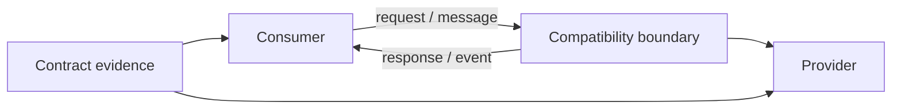
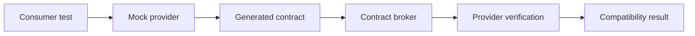
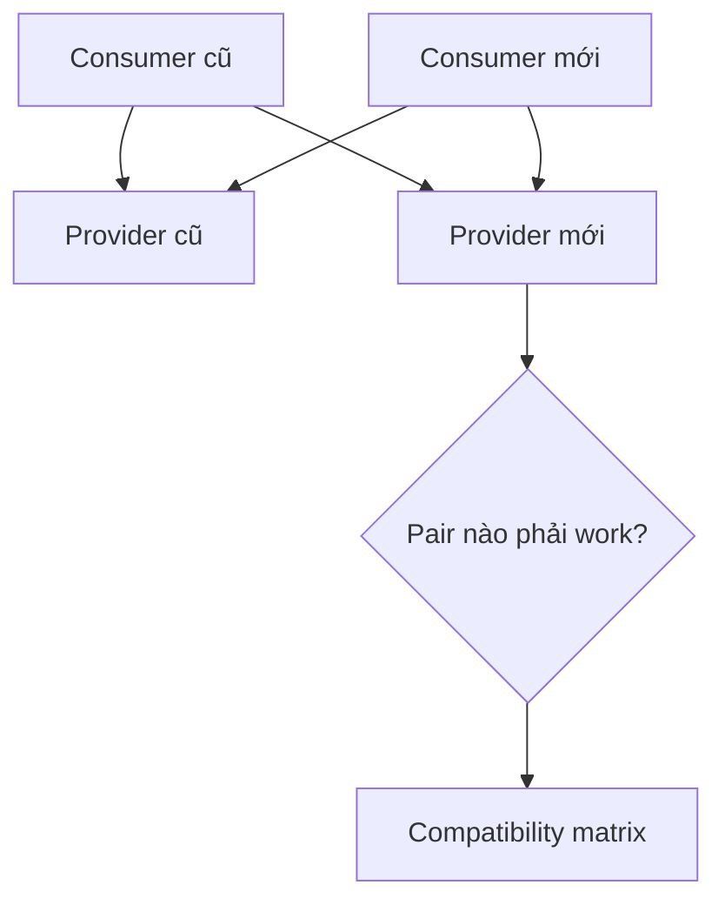

# Contract Testing: Suy luận về Tương thích giữa Các Hệ thống Thay đổi Độc lập

## TL;DR

Từ ngày 1 đến 2/05/2026, Jira và Jira Service Management gặp incident schema compatibility trên toàn bộ Cloud region. Postmortem của Atlassian cho biết schema configuration được deploy tới API gateway **trước khi application-level change tương ứng có mặt ở mọi production environment**, nên gateway kỳ vọng schema mà một số application server chưa phục vụ. Work-item view bị lỗi, editing degraded, và service được khôi phục sau 3 giờ 19 phút bằng cách redeploy schema configuration cũ. Follow-up của Atlassian gồm automated pre-deployment check để verify schema compatibility giữa các production environment. **Hai phía có thể đều hợp lệ khi đứng riêng nhưng những version thực sự giao tiếp với nhau vẫn incompatible.**

> 💡 **Quy tắc bỏ túi:** Dùng contract testing khi hai hệ thống có thể thay đổi hoặc deploy độc lập và correctness phụ thuộc vào việc chúng giữ **hiểu biết chung về request, response, message và event**.

- **Test compatibility, không test toàn business flow:** Contract test hỏi consumer và provider còn đồng ý tại communication boundary không; nó không chứng minh end-to-end business correctness.
- **Để nhu cầu consumer thật tạo nên contract:** Consumer-driven contract capture thứ consumer thực sự gửi và phụ thuộc, còn provider/schema conformance trả lời câu hỏi khác.
- **Đặc tả tối thiểu:** Consumer nên contract cho field và semantics nó dùng, không copy toàn bộ provider response rồi biến additive change thành false breakage.
- **Gate deploy theo version compatibility:** Provider verification, broker matrix và deployment check quan trọng vì “latest consumer vs latest provider” không đủ khi nhiều version cùng tồn tại.
- **Cạm bẫy chết người:** Xem schema file là bằng chứng real consumer tương thích. API hợp lệ về cú pháp vẫn có thể phá client vì đổi meaning, enum handling, field removal hoặc rollout order.

<TermBox term="Contract">
**Contract** là hiểu biết chung tại communication boundary: consumer được phép gửi gì, provider có thể trả hoặc publish gì, và phần nào của exchange là bắt buộc để giữ compatibility.
</TermBox>

## Contract testing là về compatibility

Contract test tập trung vào giao tiếp **consumer ↔ provider**.

Communication có thể là:

- HTTP request/response;
- GraphQL query/result;
- asynchronous message;
- event payload;
- RPC/protobuf message;
- webhook.

Câu hỏi cốt lõi:

> Nếu hai version này giao tiếp với nhau, message shape và semantics mà mỗi bên phụ thuộc có còn khớp không?

Nó hẹp hơn integration testing và hẹp hơn nhiều so với end-to-end testing.

Contract testing **không chứng minh business correctness** và **không chứng minh end-to-end behavior**.

Nó không nói checkout tính tax đúng chưa, user có thấy confirmation đúng không hay transaction database có durable không.

Nó nói communication boundary có còn tương thích không.

## Consumer và provider là role, không phải nhãn architecture

Frontend gọi API là consumer.

Backend service gọi một service khác cũng là consumer.

Worker xử lý message là consumer của message đó.

Cùng một service có thể:

- là provider cho application này;
- là consumer của provider khác;
- publish message cho consumer khác nữa.

Vocabulary này quan trọng vì contract đi theo interaction, không đi theo topology deploy.

## Consumer-driven contract capture nhu cầu thật

<TermBox term="Consumer-Driven Contract">
**Consumer-driven contract (CDC) / contract hướng consumer** ghi lại interaction mà consumer thực sự cần từ provider. Consumer định nghĩa request expected và minimal response/message shape nó phụ thuộc; provider sau đó verify rằng mình đáp ứng được expectation đó.
</TermBox>

Pact là một implementation phổ biến của model này.

Flow đơn giản:

Consumer test hỏi:

> Giả sử provider behave theo interaction này, consumer có gửi đúng request và handle đúng expected response không?

Provider verification hỏi:

> Actual provider có produce response thỏa contract của consumer không?

Cả hai phía cùng tạo evidence.

## Consumer-driven không có nghĩa consumer điều khiển API

CDC không có nghĩa mọi consumer được đòi arbitrary provider behavior.

Provider vẫn sở hữu API design.

Contract testing làm assumption hiện ra sớm:

- consumer nào phụ thuộc field nào;
- status code nào được expect;
- optional value nào được handle;
- event key nào bắt buộc;
- message variant nào đang được consume.

Nếu consumer đòi behavior provider không nên support, failed verification trở thành design conversation trước deploy thay vì outage sau deploy.

## Trạng thái provider giúp quá trình xác minh tất định

Khi provider chạy lại (replay) các tương tác của consumer trong quá trình xác minh (verification), provider thường cần dữ liệu có sẵn hoặc điều kiện hệ thống cụ thể (ví dụ: “người dùng 42 đã tồn tại” hoặc “người dùng 42 có hoá đơn quá hạn”).

Những điều kiện tiên quyết này được gọi là **trạng thái provider (provider states)**.

Để giữ việc xác minh provider đáng tin cậy và tốc độ:

- **Thiết lập trạng thái tất định (deterministic state setup):** nạp sẵn dữ liệu mẫu (seed data) ngay trước khi phát lại tương tác tương ứng;
- **Stub các dependency phụ thuộc:** stub dependency bên ngoài như cổng thanh toán hoặc dịch vụ gửi mail thay vì gọi API thật của bên thứ ba trong lúc xác minh;
- **Dọn dẹp sạch sẽ:** tránh gây nhiễm bẩn dữ liệu giữa các lần kiểm tra.

Trạng thái provider bảo đảm việc xác minh tập trung kiểm chứng ranh giới contract mà không bị biến tướng thành một môi trường end-to-end chậm chạp và chập chờn (flaky).

## Provider/schema conformance trả lời câu hỏi khác

Provider cũng có thể được test theo API specification như **OpenAPI**.

Câu hỏi:

> Provider implementation có conform với documented schema/specification không?

Điều này rất giá trị.

Nó bắt drift giữa code và API documentation.

Nhưng **schema conformance không đủ để chứng minh usage của consumer tương thích**.

Schema có thể cho phép năm response variant trong khi consumer chỉ handle đúng ba.

New enum value có thể valid theo schema nhưng làm client với exhaustive switch crash.

Field có thể giữ nguyên type nhưng đổi meaning.

Vì vậy tách rõ:

- **provider/schema contract testing** — implementation vs specification;
- **consumer-driven contract testing** — consumer expectation vs provider behavior.

Hai loại bổ sung cho nhau.

## Minimal expectation giúp contract dễ evolve

Pact khuyến nghị **minimal expected response / kỳ vọng tối thiểu**.

Nếu provider trả:

- id;
- email;
- displayName;
- avatar;
- createdAt;
- preferences;
- internalFlags;

nhưng consumer chỉ cần các field mà mình thực sự dùng (như id và displayName), contract thường chỉ nên quan tâm đúng các field được dùng đó.

Vì sao?

Copy toàn response vào contract tạo accidental coupling.

Khi đó **additive change / new field / thêm field** có thể làm test fail dù consumer không quan tâm.

Over-specified contract trở nên **brittle / mong manh / quá đặc tả**.

Contract tốt mô tả thứ compatibility cần, không phải mọi thứ provider tình cờ emit.

## Match semantics mà không hard-code value không liên quan

Giả sử consumer cần:

- status code 200;
- JSON body có string id;
- displayName không rỗng;
- role nằm trong known set.

Contract nên express những constraint này thay vì hard-code:

- id phải đúng user-123;
- displayName phải đúng Alice;
- mọi unrelated field phải xuất hiện chính xác.

Chỉ dùng exact matching nơi exactness thật sự là contract.

Loose matching mọi thứ cũng nguy hiểm.

Mục tiêu là model chính xác **nhu cầu consumer / kỳ vọng consumer**.

## Compatibility có hướng

Nói “compatible” là chưa đủ nếu không chỉ rõ **version nào phải work với version nào**.

Với consumer và provider deploy độc lập, cần reason ít nhất:

- **tương thích ngược / backward compatibility:** **provider mới** vẫn phục vụ được **consumer cũ**;
- **tương thích tiến / forward compatibility:** **consumer mới** vẫn work với **provider cũ** nếu rollout order yêu cầu;
- same-version compatibility: consumer mới với provider mới;
- deployed-version compatibility: đúng các version đang cùng tồn tại trong environment.

Một rollout an toàn thường là:

1. provider chấp nhận cả request cũ và mới;
2. deploy provider;
3. deploy consumer dùng behavior mới;
4. quan sát migration;
5. chỉ remove old behavior khi không còn deployed consumer phụ thuộc.

Deploy độc lập làm rollout order trở thành một phần của compatibility reasoning.

<TermBox term="Compatibility Matrix">
**Compatibility matrix / ma trận tương thích** ghi lại những concrete consumer/provider version đã được verify cùng nhau. Deployment safety phụ thuộc vào version thật sự cùng tồn tại trong environment, không chỉ “latest vs latest.”
</TermBox>

## Additive change thường an toàn hơn, không tự động an toàn

Với JSON/HTTP API, thêm optional response field thường backward-compatible **nếu consumer ignore unknown field**.

Nhưng consumer behavior mới là điều quyết định.

Một additive field hoặc enum value vẫn có thể làm consumer vỡ nếu consumer:

- reject unknown JSON property;
- dùng exhaustive switch với enum;
- assume closed set message variant;
- snapshot toàn bộ response exact;
- phụ thuộc ordering hoặc undocumented default.

Vì vậy contract gồm cả **shape lẫn semantics mà consumer thật sự dựa vào**.

Remove/rename field, đổi type, thêm required request property, siết validation hoặc đổi documented status code là các breaking change điển hình.

Hãy version API hoặc stage migration khi không thể giữ compatibility.

## Protobuf evolution tuân theo wire rule

Protocol Buffers có thể evolve an toàn nếu team tôn trọng wire contract.

Rule quan trọng:

- không đổi **field number** đang tồn tại;
- khi xóa field, reserve old field number để không bị reuse;
- tránh reuse enum numeric value;
- hiểu rằng binary-wire compatibility khác ProtoJSON compatibility;
- old consumer có thể ignore unknown new field, nhưng điều đó không làm mọi semantic change trở nên safe.

“Schema compile” là evidence yếu hơn “những version đang exchange message vẫn compatible.”

## Contract broker biến verification thành deployment evidence

Pact Broker lưu:

- consumer version;
- provider version;
- contract do consumer tạo;
- provider verification result;
- deployment/environment metadata.

**Matrix** từ đó trả lời câu thực dụng:

> Version sắp deploy đã được verify với những version mà nó thực sự giao tiếp chưa?

Flow `can-i-deploy` của Pact dùng matrix này.

Chỉ check **latest consumer với latest provider là không đủ** nếu production vẫn còn old consumer, mobile client hoặc service version rollout lệch nhau.

Deployment gate phải reason về **deployed / production version**, không chỉ repository HEAD.

## Giữ contract artifact executable và versioned

Contract nên được version cùng code và generate/verify trong **CI / pipeline**.

Tránh dùng một JSON example hoặc wiki page **duy trì thủ công / hand-maintained** làm contract artifact duy nhất.

Những artifact đó nhanh chóng **stale / drift / lệch** vì không có gì buộc chúng update khi implementation đổi.

Pattern hữu ích:

- OpenAPI/AsyncAPI/proto schema được review và compatibility-diff trong CI;
- consumer-generated pact publish cùng consumer version;
- provider verification publish cùng provider version;
- deployment metadata record sau release;
- deprecation/version policy được encode thành executable release gate khi phù hợp.

## Micro-scenario production: additive enum làm mobile consumer vỡ

Orders API thêm status mới `partially_refunded`. Provider coi đây là non-breaking vì không remove field nào.

Một mobile client cũ dùng exhaustive switch và không có unknown/default branch. Khi nhận status mới, màn order detail crash.

- **Hậu quả:** Một nhóm customer dùng app version cũ không mở được refunded order cho tới khi upgrade.
- **Nguyên nhân cốt lõi:** Provider đánh giá compatibility chỉ từ schema shape và không verify provider behavior mới với expectation của deployed consumer.
- **Cách khắc phục chuẩn:** Capture accepted enum behavior của consumer trong consumer-driven contract, verify provider change với supported deployed consumer version, thiết kế consumer tolerate unknown enum khi protocol cho phép và dùng compatibility matrix trước deployment.

## Kiểm tra mental model

> **Tình huống:** OpenAPI spec của provider vẫn validate sau khi response field đổi từ nullable string thành required enum. Provider integration test đều xanh. Provider có thể deploy an toàn chưa?

Show the reasoning

Chưa thể kết luận từ evidence đó.

Schema conformance chỉ chứng minh provider match proposed schema. Nó không chứng minh existing consumer xử lý được requirement/enum semantics mới.

Hãy check consumer expectation hoặc consumer-driven contract, rồi verify proposed provider version với deployed consumer version sẽ gọi nó.

Nếu không thể giữ compatibility, dùng versioning, migration window hoặc expand-and-contract rollout thay vì âm thầm đổi shared contract.

## Checklist Contract Testing

- [ ] **Boundary:** Consumer/provider interaction nào đang được contract bảo vệ?
- [ ] **Minimality:** Consumer có assert chỉ field/semantics nó thật sự phụ thuộc không?
- [ ] **Consumer evidence:** Real consumer expectation có được represent thay vì provider đoán không?
- [ ] **Provider verification:** Real provider có replay và satisfy các interaction đó không?
- [ ] **Provider states:** Required provider state có deterministic / tất định và rẻ để dựng không?
- [ ] **HTTP semantics:** Relevant method/path/header/status/body rule có explicit không?
- [ ] **Async semantics:** Message/event payload, key, type, required field và metadata quan trọng có explicit không?
- [ ] **Backward compatibility:** Provider mới có còn satisfy supported consumer cũ không?
- [ ] **Forward compatibility:** Rollout order có yêu cầu consumer mới work với provider cũ không?
- [ ] **Additive changes:** Consumer có tolerate unknown field/enum value khi expected không?
- [ ] **Protobuf:** Field number có giữ nguyên và deleted number/name có được reserve khi cần không?
- [ ] **Versioning:** Breaking change thật sự có được version hoặc migrate có chủ đích không?
- [ ] **Matrix:** Actual deployed consumer/provider version có được represent không?
- [ ] **Deployment gate:** can-i-deploy hoặc equivalent có check environment compatibility trước release không?
- [ ] **Drift:** Contract artifact có generate/verify trong CI thay vì chỉ viết tay không?
- [ ] **Layering:** Business correctness và full workflow có được để cho integration/E2E evidence không?

## Ranh giới với phần còn lại của Testing & Quality

Contract testing sở hữu **compatibility ở communication boundary giữa các hệ thống thay đổi độc lập**.

- [Unit Testing](/vi/docs/testing-quality/unit-testing) sở hữu local behavioral logic.
- [Integration Testing](/vi/docs/testing-quality/integration-testing) prove concrete runtime boundary và dependency semantics.
- [End-to-End Testing](/vi/docs/testing-quality/end-to-end-testing) prove assembled Critical User Journey.
- [Test Doubles](/vi/docs/testing-quality/test-doubles) sở hữu fidelity/drift của mock, stub và fake.

## Nguồn

- [Atlassian Jira Status — incident schema incompatibility tháng 05/2026](https://jira-software.status.atlassian.com/incidents/vbl5kktb1tqy)
- [Pact Docs — Can I Deploy](https://docs.pact.io/pact_broker/can_i_deploy)
- [Pact Docs — Pact Broker overview](https://docs.pact.io/pact_broker/overview)
- [GitHub Docs — REST API breaking changes](https://docs.github.com/en/rest/about-the-rest-api/breaking-changes)
- [Protocol Buffers — Proto3 language guide](https://protobuf.dev/programming-guides/proto3/)
- [Stripe — APIs as infrastructure: future-proofing with versioning](https://stripe.com/blog/api-versioning)

