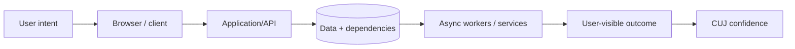
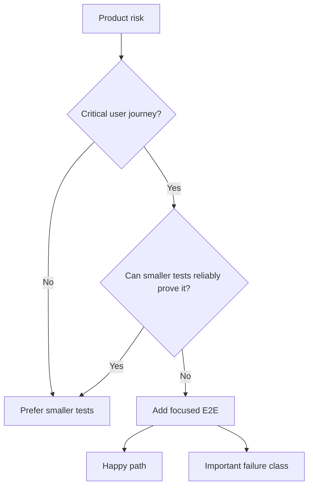
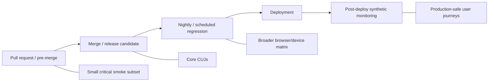

# End-to-End Testing: Reason About Critical User Journeys and System-Level Confidence

## TL;DR

On August 20, 2026, GitHub's Copilot cloud agent had an unusual failure mode: agent tasks themselves kept running and completing, but status and results shown to users lagged far behind. GitHub reported that at least 54 organizations saw task-status activity delayed above normal, with some customers waiting roughly **60–90 minutes** for up-to-date status and results. A component-level check saying “the task finished” could therefore be green while the actual user journey—submit work, wait, observe completion, inspect results—was broken. **End-to-end testing exists to protect that assembled journey, not merely the health of individual components.**

> 💡 **Rule of thumb:** Write an E2E test when a Critical User Journey depends on **system-level wiring or user-visible behavior that smaller tests cannot reliably prove**, then keep the E2E portfolio intentionally small.

- **Protect Critical User Journeys, not every feature branch:** E2E tests should cover a small set of business-critical workflows and important failure classes, not reproduce the unit-test matrix through a browser.
- **Assert what the user can observe:** Treat the assembled system as a black box where possible—navigate, act, and verify user-visible outcomes instead of internal implementation detail.
- **Engineer away timing flakiness:** Use resilient locators, auto-waiting, web-first assertions, isolated browser contexts, owned test data, and bounded timeouts rather than arbitrary sleeps.
- **Treat environment fidelity as a trade-off:** Real dependencies increase confidence but also cost, risk, and instability; sandboxes and fakes reduce those costs but can drift from production.
- **Fatal pitfall:** Letting retries turn a flaky first-run failure into a “pass.” A retry can classify and diagnose flakiness; it does not prove the first failure was harmless.

<TermBox term="Critical User Journey">
A **Critical User Journey (CUJ)** is a user goal whose successful completion materially matters to the user or business. Examples include “sign in and access the dashboard,” “pay and receive an order confirmation,” or “submit a job and observe its final result.”
</TermBox>

## E2E testing asks a system-level question

Unit tests reason about local behavior. Integration tests reason about concrete boundaries.

End-to-end tests reason about the **assembled system** from an externally meaningful start to an externally meaningful finish.

The system is treated as a **black box** as much as practical. The test does not need to know which internal service performed each step.

A useful E2E question is: can a signed-in customer add an in-stock item, pay, receive a confirmed order, and later see that order in history?

A weak E2E question asks whether an internal helper ran after a brittle DOM selector received a click.

The first asks about user behavior. The second asks about **implementation detail**.

## The unit of coverage is a journey, not a code branch

End-to-end tests depend on more moving parts: browser runtime, frontend, backend API, databases, queues/workers, authentication, configuration, environment health, and sometimes third-party services.

That is why the E2E portfolio should remain small.

Google's testing guidance recommends E2E coverage for **important use cases / Critical User Journeys** while keeping total E2E count low.

Do **not test every feature or every branch** through the browser.

Move cheap detail down to [Unit Testing](/docs/testing-quality/unit-testing) or [Integration Testing](/docs/testing-quality/integration-testing).

Keep E2E for risks that **cannot be reliably evaluated by a smaller test**:

- route + auth + API + persistence wiring;
- browser/runtime behavior;
- mixed frontend/backend version compatibility;
- asynchronous workflow completion;
- user-visible redirects and session state;
- deployment/configuration wiring;
- cross-service behavior whose value exists only as a complete journey.

## Select journeys by criticality and unique risk

Start with a product/business map.

| Journey | Why it may deserve E2E |
| --- | --- |
| sign in → dashboard | auth/session/routing wiring |
| add item → checkout → confirmation | business critical multi-service path |
| upload → processing → downloadable output | async status and artifact delivery |
| invite teammate → accept invite → access project | email/token/authz lifecycle |
| create deployment → observe healthy version | control plane + runtime visibility |

For each **critical journey**, ask whether one **happy path** and one important **failure class / error class** are enough.

The goal is not exhaustive browser coverage. The goal is a **small E2E portfolio** that answers high-value system-level questions.

## Assert user-visible outcomes

Browser tests should interact through the same surface the user sees.

Prefer **user-facing locators** such as Playwright getByRole and getByLabel.

Role and label based locators also exercise useful **accessibility** semantics.

Avoid brittle **CSS selector**, long **XPath**, or exact **DOM structure** paths when a semantic locator exists.

Use an explicit test ID when no stable user-facing role, name, label, text, or other contract exists.

## Waiting should model a condition, not elapsed time

Modern web applications are asynchronous.

Playwright provides **auto-wait / actionability** checks before actions and **web-first assertions / auto-retrying assertions** for expected states.

Prefer “click submit, then wait until status is Completed within a bounded timeout” over “click submit, sleep five seconds, then read status.”

A waitForTimeout or **fixed delay** encodes a timing guess.

Every async wait needs a bounded **timeout / deadline** so a genuinely broken test stops and produces evidence.

<TermBox term="Web-First Assertion">
A **web-first assertion** repeatedly observes browser state until the expected condition becomes true or a timeout expires. It models eventual UI readiness more accurately than reading a value once after an arbitrary sleep.
</TermBox>

## Isolation starts with a fresh browser context

Playwright creates isolated **browser contexts** for tests by default.

A fresh context isolates **cookies**, **local storage**, **session storage / sessionStorage**, permissions, and browser session state.

This makes tests easier to keep **order independent**.

Browser isolation alone is not enough. Server-side **test data** can still collide.

Use unique users/resources, a namespace or tenant ID, per-test project/workspace names, and deterministic cleanup where necessary.

If tests run in **parallel** or are **sharded**, identifiers must remain collision-safe across workers and machines.

## Do not make every E2E test repeat login

Authentication is often expensive.

If every test repeats the entire login UI journey, one auth UI change can block unrelated checkout, settings, and search tests.

Playwright supports reusable **authenticated state / storageState**.

A common strategy:

- keep a **dedicated login** E2E test for the authentication journey itself;
- create authenticated state in setup for tests whose subject is something else;
- give parallel workers separate accounts when server-side state can collide.

Authentication state may contain reusable **cookies, token, secret, or credential** material. Do not commit it to source control.

## Test data setup should preserve the journey boundary

Arrange data through the UI, a test API, controlled fixture, or a known snapshot depending on what the journey is proving.

Use the cheapest setup that does not bypass the behavior being tested.

If the journey is “create account,” do not create the account through an API before the test.

If the journey is “edit existing account settings,” API setup may be a good optimization.

## Third-party dependencies require a fidelity decision

Real journeys often cross a **third-party / external provider**: payments, identity, email, SMS, shipping, maps, or fraud checks.

Calling production providers in every E2E run can be expensive, **rate limited**, unsafe, slow, or nondeterministic.

Alternatives include provider **sandbox**, local **fake / stub / test double**, or controlled test tenants.

But every fake can **drift / diverge** from the real provider.

A practical split may be:

- fast stubbed E2E for local wiring;
- sandbox integration for provider realism;
- contract checks for compatibility;
- a tiny production-safe synthetic when risk justifies it.

## E2E is not the place for every validation permutation

If checkout has 30 card-validation rules, do not write 30 browser journeys when smaller tests can prove those rules reliably.

One or two E2E journeys can prove the page submits, important errors reach the user, and successful payment reaches confirmation.

The detailed matrix belongs lower in the testing portfolio.

## Retries are diagnostics, not absolution

<TermBox term="Flaky E2E Test">
A **flaky E2E test** can pass and fail without a relevant product change. Common causes include shared data, timing guesses, unstable locators, dependency health, environment drift, race conditions, and hidden ordering.
</TermBox>

CI may **retry / rerun** failed browser tests.

If the **first run / initial run** fails and a retry passes, you learned the test or environment is flaky.

That retry is **not a pass and not proof** that the first failure was harmless.

Track flaky classification separately.

For persistent flakiness, assign an **owner**, collect artifacts, fix the cause, temporarily **quarantine** only when necessary, and set a deadline for returning the test to the trusted gate.

## Preserve diagnostic artifacts

Useful CI **diagnostic artifacts** include:

- Playwright **trace / Trace Viewer** data;
- **screenshots**;
- browser **console logs**;
- failed **network request / response** details;
- test-step timing;
- application/server logs;
- generated IDs and environment/version information.

Playwright traces capture actions and DOM snapshots and can surface network activity around a failure.

## Separate product failure from environment failure

Distinguish product regression from test bug, test-data collision, unavailable environment, third-party outage, deployment not ready, and known flakiness.

Otherwise every failure becomes “rerun CI.”

The failure should point engineers toward the broken layer.

## Browser coverage should be representative

Playwright can run **Chromium, Firefox, and WebKit** and emulate **device / mobile / viewport** configurations.

That does not imply every journey belongs in every combination.

Choose a **representative matrix** based on real **traffic / usage**, business **risk**, supported-browser policy, known compatibility differences, and mobile importance.

For example:

- critical smoke subset on Chromium for every PR;
- core CUJs on Chromium for release candidates;
- representative Firefox/WebKit coverage on scheduled regression;
- mobile/device variants for journeys that materially differ on small screens.

Avoid an unmaintainable Cartesian product.

## Place E2E at different delivery stages

### Pull request / pre-merge

Run a fast **smoke / critical subset**.

### Merge or release candidate

Run the core CUJ portfolio against the release artifact/environment.

### Nightly / scheduled regression

Run broader browser/device matrices, long flows, and expensive provider sandboxes.

### Post-deploy

Run a small set of safe **synthetic monitoring / production checks** against the deployed system.

Pre-release E2E is **not monitoring**, and monitoring is **not a substitute** for pre-release E2E.

One asks “should this release ship?” The other asks “is the deployed user journey healthy now?”

## Synthetic monitoring protects the deployed journey

The GitHub August 2026 incident demonstrates why user-visible outcomes matter.

The agent task itself completed, yet users could not see current status/results promptly.

A worker-level health check could remain green while a production-safe synthetic journey would observe the user-visible delay.

Mature systems often need both pre-release journey evidence and post-deploy journey health signals.

## Cross-browser matrices should follow risk

Browser engines and device constraints can change behavior, but multiplying every CUJ by every browser, locale, timezone, viewport, and permission creates combinatorial cost.

Use smaller tests for most permutations.

Reserve E2E variants for differences that materially change the journey: mobile navigation, browser-specific auth/session behavior, permission prompts, file upload APIs, responsive checkout, or known WebKit/Firefox differences.

## Production micro-scenario: the “green checkout” that never verifies confirmation

A commerce team has an E2E test called “checkout.” It uses cached auth state, seeds a cart through an API, clicks **Pay**, and considers the journey successful as soon as an internal payment request returns HTTP 200.

A deployment breaks the asynchronous order-confirmation worker. Payment authorization succeeds, but customers remain on “Processing” and never receive a confirmed order.

- **Impact:** Customers retry payment, contact support, and some create duplicate authorizations because the UI never reaches a trustworthy final state.
- **Root cause:** The E2E test stopped at an internal transport milestone instead of the **user-visible outcome** of the Critical User Journey.
- **Correct pattern:** Define the journey as “submit payment → observe confirmed order → find order in history,” use bounded web-first assertions for async completion, keep payment-response permutations in smaller tests, and add a production-safe synthetic for confirmation when operationally feasible.

## Check your mental model

> **Scenario:** A team has 420 browser tests. Most validate individual form rules. The suite takes 55 minutes, retries hide intermittent failures, and engineers often merge after rerunning failed jobs. Someone proposes adding every new validation rule as another E2E test because “the browser is closest to the user.”

Show the reasoning

High fidelity is valuable only when it buys unique confidence.

Move validation permutations that unit or integration tests can prove reliably down to those layers.

Keep a small E2E portfolio for Critical User Journeys and system-level failure classes that smaller tests cannot reliably prove.

Then remove arbitrary sleeps, isolate data, use resilient user-facing locators and web-first assertions, preserve trace artifacts, and classify retry-passing tests as flaky rather than clean.

The right question is not “can the browser test this?” It is “is the browser the cheapest reliable place to prove this risk?”

## E2E checklist

- [ ] **Journey:** Is this a Critical User Journey or uniquely important system-level failure class?
- [ ] **Smaller-test check:** Can unit, integration, or contract tests prove it more cheaply?
- [ ] **Boundary:** Does the test begin and end at meaningful user-visible points?
- [ ] **Black-box behavior:** Does it avoid unnecessary implementation detail?
- [ ] **Locators:** Are role/label/user-facing locators preferred over CSS/XPath DOM structure?
- [ ] **Waiting:** Are auto-waiting and web-first assertions used instead of fixed sleeps?
- [ ] **Timeouts:** Are async expectations bounded by useful deadlines?
- [ ] **Browser isolation:** Does each test get a fresh browser context?
- [ ] **Data isolation:** Are users/resources/namespaces unique and parallel-safe?
- [ ] **Authentication:** Is login tested in a dedicated journey rather than repeated everywhere?
- [ ] **Credentials:** Are cookies/tokens/auth state protected from source control and artifacts?
- [ ] **Third parties:** Is the real-vs-sandbox-vs-fake decision explicit?
- [ ] **Flakiness:** Is a first-run failure that passes on retry tracked as flaky?
- [ ] **Ownership:** Do quarantined/flaky tests have an owner and remediation path?
- [ ] **Diagnostics:** Are traces, screenshots, console/network evidence, and IDs preserved on failure?
- [ ] **Browser matrix:** Does cross-browser/device coverage reflect traffic and risk?
- [ ] **CI placement:** Is the PR subset small while broader regression runs at an appropriate stage?
- [ ] **Production:** Are post-deploy synthetic checks separated conceptually from pre-release E2E?

## Boundaries with the rest of Testing & Quality

This lesson owns **assembled user journeys and user-visible system confidence**.

- [Test Strategy](/docs/testing-quality/test-strategy) decides which risks justify expensive E2E evidence.
- [Unit Testing](/docs/testing-quality/unit-testing) owns detailed behavioral permutations at low cost.
- [Integration Testing](/docs/testing-quality/integration-testing) owns real component/dependency boundaries in controlled environments.
- [Contract Testing](/docs/testing-quality/contract-testing) owns compatibility between independently changing producers and consumers.
- [Test Doubles](/docs/testing-quality/test-doubles) owns fake/stub/mock fidelity and drift trade-offs.

## Sources

- [GitHub — Availability report: August 2026](https://github.blog/news-insights/company-news/github-availability-report-august-2026/)
- [Google Testing Blog — How Much Testing is Enough?](https://testing.googleblog.com/2021/06/how-much-testing-is-enough.html)
- [Google Testing Blog — What Makes a Good End-to-End Test?](https://testing.googleblog.com/2016/09/testing-on-toilet-what-makes-good-end.html)
- [Google Testing Blog — Just Say No to More End-to-End Tests](https://testing.googleblog.com/2015/04/just-say-no-to-more-end-to-end-tests.html)
- [Playwright — Best Practices](https://playwright.dev/docs/best-practices)
- [Playwright — Auto-waiting](https://playwright.dev/docs/actionability)
- [Playwright — Isolation](https://playwright.dev/docs/browser-contexts)
- [Playwright — Authentication](https://playwright.dev/docs/auth)
- [Playwright — Trace Viewer](https://playwright.dev/docs/trace-viewer)
