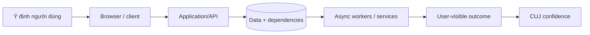
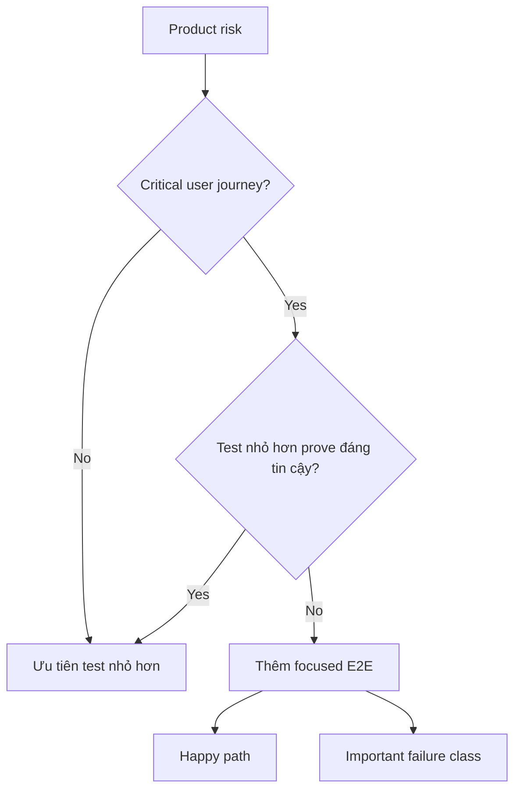
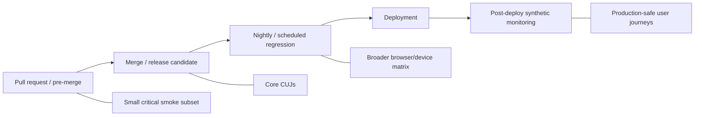

# End-to-End Testing: Suy luận về Critical User Journey và Confidence Cấp Hệ thống

## TL;DR

Ngày 20/08/2026, GitHub Copilot cloud agent gặp một failure mode rất đáng chú ý: agent task vẫn chạy và hoàn thành, nhưng status/result mà user nhìn thấy bị lag nghiêm trọng. GitHub báo cáo ít nhất 54 tổ chức có task-status activity chậm hơn baseline, và ở một số trường hợp status/result cập nhật trễ khoảng **60–90 phút**. Component-level check kiểu “task đã finish” có thể vẫn xanh trong khi actual user journey—submit công việc, chờ, thấy completion, đọc result—đã vỡ. **End-to-end testing tồn tại để bảo vệ assembled journey đó, không chỉ health của từng component.**

> 💡 **Quy tắc bỏ túi:** Viết E2E test khi một Critical User Journey phụ thuộc vào **system-level wiring hoặc user-visible behavior mà test nhỏ hơn không thể chứng minh đáng tin cậy**, rồi giữ portfolio E2E có chủ đích ở quy mô nhỏ.

- **Bảo vệ Critical User Journey, không test mọi feature branch:** E2E nên cover một tập nhỏ business-critical workflow và important failure class, không copy unit-test matrix lên browser.
- **Assert thứ user quan sát được:** Xem assembled system như black box khi có thể—navigate, act và verify user-visible outcome thay vì internal implementation detail.
- **Loại timing flakiness bằng design:** Dùng resilient locator, auto-waiting, web-first assertion, isolated browser context, test data do test sở hữu và bounded timeout thay vì sleep tùy ý.
- **Xem environment fidelity là trade-off:** Dependency thật tăng confidence nhưng cũng tăng cost/risk/instability; sandbox và fake giảm chi phí nhưng có thể drift khỏi production.
- **Cạm bẫy chết người:** Để retry biến first-run failure thành một “pass.” Retry có thể giúp classify/diagnose flakiness; nó không chứng minh failure đầu tiên vô hại.

<TermBox term="Critical User Journey">
**Critical User Journey (CUJ) / hành trình người dùng trọng yếu** là user goal mà completion có ý nghĩa đáng kể với user hoặc business. Ví dụ: “sign in rồi vào dashboard,” “pay rồi nhận order confirmation,” hoặc “submit job rồi quan sát final result.”
</TermBox>

## E2E testing hỏi câu hỏi ở cấp hệ thống

Unit test reason về local behavior. Integration test reason về concrete boundary.

End-to-end test reason về **hệ thống đã lắp ghép / toàn hệ thống** từ một externally meaningful start tới externally meaningful finish.

Hệ thống được xem như **black box / hộp đen** càng nhiều càng tốt. Test không cần biết internal service nào thực hiện từng step.

Câu hỏi E2E tốt là: customer đã sign in có thể add item, pay, nhận confirmed order và sau đó thấy order trong history không?

Câu hỏi yếu là: internal helper có chạy sau khi một brittle DOM selector được click không?

Câu đầu hỏi user behavior. Câu sau hỏi **implementation detail / chi tiết triển khai**.

## Unit của coverage là journey, không phải code branch

E2E phụ thuộc nhiều moving part: browser runtime, frontend, backend API, database, queue/worker, authentication, configuration, environment health và đôi khi third-party service.

Đó là lý do cần **giữ số lượng E2E ít** và duy trì một **portfolio nhỏ** có chủ đích.

Guidance của Google khuyến nghị E2E cho **important use case / Critical User Journey** và giữ total E2E count low.

**Không test mọi feature hoặc mọi branch** qua browser.

Đưa cheap detail xuống [Unit Testing](/vi/docs/testing-quality/unit-testing) hoặc [Integration Testing](/vi/docs/testing-quality/integration-testing).

Giữ E2E cho risk mà **test nhỏ hơn không thể đánh giá đáng tin cậy**:

- route + auth + API + persistence wiring;
- browser/runtime behavior;
- mixed frontend/backend version compatibility;
- asynchronous workflow completion;
- user-visible redirect và session state;
- deployment/config wiring;
- cross-service behavior chỉ có ý nghĩa khi journey hoàn chỉnh.

## Chọn journey theo criticality và unique risk

Bắt đầu từ product/business map.

| Journey | Vì sao có thể xứng đáng E2E |
| --- | --- |
| sign in → dashboard | auth/session/routing wiring |
| add item → checkout → confirmation | business-critical multi-service path |
| upload → processing → downloadable output | async status + artifact delivery |
| invite teammate → accept invite → access project | email/token/authz lifecycle |
| create deployment → observe healthy version | control plane + runtime visibility |

Với mỗi **critical journey**, hỏi một **happy path** và một important **failure class / error class** đã đủ chưa.

Goal không phải exhaustive browser coverage. Goal là **portfolio E2E nhỏ** trả lời các system-level question giá trị cao.

## Assert user-visible outcome

Browser test nên interact qua cùng surface user nhìn thấy.

Ưu tiên **user-facing locator / locator theo người dùng** như Playwright getByRole và getByLabel.

Role/label locator cũng exercise semantics **accessibility / khả năng truy cập**.

Tránh brittle **CSS selector**, long **XPath** hoặc exact **DOM structure / cấu trúc DOM** khi semantic locator tồn tại.

Dùng explicit test ID khi không có role/name/label/text contract đủ ổn định.

## Waiting phải model condition, không model thời gian trôi

Web app hiện đại là asynchronous.

Playwright cung cấp **auto-wait / actionability / tự chờ điều kiện tương tác** trước action và **web-first assertion / assertion tự retry / assertion theo web** cho expected state.

Ưu tiên “click submit, rồi đợi status là Completed trong bounded timeout” thay vì “click submit, sleep 5 giây, rồi đọc status.”

waitForTimeout hoặc **fixed delay / delay cố định** encode timing guess.

Mọi async wait cần **timeout / deadline / bounded / giới hạn thời gian** để test broken thật sự dừng và tạo evidence.

<TermBox term="Web-First Assertion">
**Web-first assertion** quan sát browser state lặp lại tới khi expected condition true hoặc timeout hết. Nó model eventual UI readiness tốt hơn đọc value một lần sau arbitrary sleep.
</TermBox>

## Isolation bắt đầu từ fresh browser context

Playwright tạo isolated **browser context / ngữ cảnh trình duyệt** cho test theo default.

Fresh context cô lập **cookie**, **local storage**, **session storage / sessionStorage**, permission và browser session state.

Điều này giúp test **không phụ thuộc thứ tự / độc lập với thứ tự**.

Browser isolation vẫn chưa đủ. Server-side **test data / dữ liệu test** vẫn có thể collide.

Dùng **dữ liệu riêng**: unique user/resource, namespace hoặc tenant ID, per-test project/workspace name và deterministic cleanup khi cần.

Nếu test chạy **parallel / song song** hoặc được **shard / phân mảnh**, identifier phải collision-safe xuyên worker/machine.

## Đừng bắt mọi E2E test lặp lại login

**Authentication / xác thực / đăng nhập** thường đắt.

Nếu mọi test lặp entire login UI journey, một auth UI change có thể block checkout/settings/search không liên quan.

Playwright hỗ trợ reusable **authenticated state / storageState / trạng thái đăng nhập**.

Strategy thường dùng:

- giữ một **dedicated login / test riêng đăng nhập** cho auth journey;
- tạo authenticated state trong setup cho test có subject khác;
- dùng account riêng theo worker khi server-side state có thể collide.

Auth state có thể chứa **cookie, token, secret, credential / thông tin xác thực** có thể reuse. Đừng commit chúng vào source control.

## Test data setup phải giữ đúng journey boundary

Có thể arrange data qua UI, test API, controlled fixture hoặc known snapshot.

Dùng setup rẻ nhất nhưng không bypass behavior đang được prove.

Nếu journey là “create account,” đừng create account qua API trước test.

Nếu journey là “edit settings,” API setup có thể hợp lý.

## Third-party dependency cần quyết định fidelity rõ ràng

Real journey thường đi qua **third-party / bên thứ ba / external provider / provider ngoài**: payment, identity, email, SMS, shipping, maps hoặc fraud.

Gọi production provider trong mọi E2E run có thể đắt, **rate limit / giới hạn request**, **không an toàn**, chậm hoặc nondeterministic.

Alternative gồm provider **sandbox**, local **fake / stub / test double**, hoặc controlled test tenant.

Nhưng fake có thể **drift / diverge / lệch / khác thực tế**.

Một evidence split thực dụng:

- fast stubbed E2E cho local wiring;
- sandbox integration cho provider realism;
- contract check cho compatibility;
- tiny production-safe synthetic khi risk justify.

Đây là trade-off giữa confidence, **cost / chi phí**, safety và stability.

## E2E không phải nơi cho mọi validation permutation

Nếu checkout có 30 card-validation rule, đừng viết 30 browser journey khi smaller test prove chúng reliable hơn.

Một vài E2E có thể prove page submit, important error tới user và successful payment tới confirmation.

Detailed matrix thuộc layer thấp hơn.

## Retry là diagnostic, không phải absolution

<TermBox term="Flaky E2E Test">
**Flaky E2E test / test chập chờn** lúc pass lúc fail mà không có relevant product change. Cause thường là shared data, timing guess, unstable locator, dependency health, environment drift, race condition và hidden ordering.
</TermBox>

CI có thể **retry / rerun / chạy lại** failed browser test.

Nếu **first run / initial run / lần chạy đầu** fail rồi retry pass, bạn học được test hoặc environment đang **flaky / flakiness / chập chờn**.

Retry đó **không phải pass và không phải bằng chứng** failure đầu vô hại.

Track flaky classification riêng.

Với persistent flakiness: assign **owner / người chịu trách nhiệm**, collect artifact, fix cause, **quarantine / cách ly** tạm khi thật cần và có deadline quay lại trusted gate.

## Giữ diagnostic artifact

CI **diagnostic / chẩn đoán artifact** hữu ích gồm:

- Playwright **trace / Trace Viewer**;
- **screenshot / ảnh chụp**;
- browser **console log**;
- failed **network / mạng request / response** detail;
- test-step timing;
- app/server log;
- generated ID + environment/version.

Playwright trace capture action, DOM snapshot và network activity quanh failure.

## Tách product failure khỏi environment failure

Phân biệt product regression, test bug, test-data collision, environment unavailable, third-party outage, deployment not ready và known flakiness.

Nếu không, mọi failure biến thành “rerun CI.”

Failure signal nên hướng engineer về layer bị vỡ.

## Browser coverage nên đại diện

Playwright chạy **Chromium, Firefox và WebKit** và emulate **device / thiết bị / mobile / viewport**.

Điều đó không có nghĩa mọi journey phải nhân qua mọi combination.

Chọn **representative / đại diện matrix** theo real **traffic / usage / lưu lượng**, business **risk / rủi ro**, browser support policy, known compatibility difference và mobile importance.

Ví dụ:

- critical smoke subset trên Chromium cho mọi PR;
- core CUJ trên Chromium cho release candidate;
- representative Firefox/WebKit ở scheduled regression;
- mobile/device variant cho journey khác thực sự trên small screen.

## Đặt E2E ở các delivery stage khác nhau

### Pull request / pre-merge

Chạy fast **smoke / critical subset / subset trọng yếu**.

### Merge hoặc release candidate

Chạy core CUJ portfolio trên release artifact/environment.

### Nightly / scheduled / định kỳ regression / hồi quy

Chạy broader browser/device matrix, long flow và expensive provider sandbox.

### Post-deploy / sau deploy

Chạy một tập nhỏ safe **synthetic monitoring / production check** trên deployed system.

Pre-release E2E **không phải monitoring**, và monitoring **không thay thế monitor/test pre-release**.

Một bên hỏi “release này có nên ship?” Bên kia hỏi “deployed user journey hiện giờ có healthy không?”

## Synthetic monitoring bảo vệ deployed journey

Incident GitHub tháng 8/2026 cho thấy vì sao user-visible outcome quan trọng.

Agent task hoàn thành nhưng user không thấy status/result cập nhật kịp thời.

Worker-level health check có thể vẫn xanh trong khi production-safe synthetic journey quan sát được user-visible delay.

Mature system thường cần cả pre-release journey evidence và post-deploy journey health signal.

## Cross-browser matrix phải theo risk

Browser engine và device constraint có thể đổi behavior, nhưng nhân mọi CUJ theo mọi browser/locale/timezone/viewport/permission tạo combinatorial cost.

Dùng smaller test cho phần lớn permutation.

Giữ E2E variant cho khác biệt thực sự thay đổi journey: mobile navigation, browser-specific auth/session, permission prompt, file upload API, responsive checkout hoặc known WebKit/Firefox differences.

## Micro-scenario production: “green checkout” nhưng không verify confirmation

Commerce team có E2E test tên “checkout.” Test dùng cached auth state, seed cart qua API, click **Pay** và coi journey success ngay khi internal payment request trả HTTP 200.

Một deployment làm asynchronous order-confirmation worker hỏng. Payment authorization success nhưng customer kẹt ở “Processing” và không bao giờ nhận confirmed order.

- **Hậu quả:** Customer retry payment, contact support và một số người tạo duplicate authorization vì UI không bao giờ tới final state đáng tin.
- **Nguyên nhân cốt lõi:** E2E dừng ở internal transport milestone thay vì **kết quả người dùng thấy / user-visible outcome** của Critical User Journey.
- **Cách khắc phục chuẩn:** Định nghĩa journey là “submit payment → observe confirmed order → thấy order trong history,” dùng bounded web-first assertion cho async completion, giữ payment-response permutation ở smaller test và thêm production-safe synthetic cho confirmation khi vận hành cho phép.

## Kiểm tra mental model

> **Tình huống:** Team có 420 browser test. Phần lớn validate individual form rule. Suite chạy 55 phút, retry che intermittent failure và engineer thường merge sau khi rerun failed job. Có đề xuất thêm mọi validation rule mới thành E2E vì “browser gần user nhất.”

Xem giải thích chi tiết

High fidelity chỉ đáng giá khi mua được unique confidence.

Move validation permutation mà unit/integration test prove reliable xuống layer đó.

Giữ portfolio E2E nhỏ cho Critical User Journey và system-level failure class mà smaller test không prove đáng tin.

Sau đó bỏ arbitrary sleep, isolate data, dùng user-facing locator + web-first assertion, preserve trace artifact và classify test pass sau retry là flaky thay vì clean.

Câu hỏi đúng không phải “browser có test được không?” mà là “browser có phải nơi rẻ nhất nhưng đáng tin để prove risk này không?”

## Checklist E2E

- [ ] **Journey:** Đây có phải Critical User Journey hoặc uniquely important system-level failure class không?
- [ ] **Smaller-test check:** Unit, integration hoặc contract test có prove rẻ hơn không?
- [ ] **Boundary:** Test begin/end ở meaningful user-visible point không?
- [ ] **Black-box behavior:** Có tránh unnecessary implementation detail không?
- [ ] **Locators:** Role/label/user-facing locator có được ưu tiên hơn CSS/XPath DOM structure không?
- [ ] **Waiting:** Auto-wait và web-first assertion có thay fixed sleep không?
- [ ] **Timeouts:** Async expectation có bounded deadline không?
- [ ] **Browser isolation:** Mỗi test có fresh browser context không?
- [ ] **Data isolation:** User/resource/namespace có unique và parallel-safe không?
- [ ] **Authentication:** Login có dedicated journey thay vì repeat mọi nơi không?
- [ ] **Credentials:** Cookie/token/auth state có được bảo vệ khỏi source control/artifact không?
- [ ] **Third parties:** Real-vs-sandbox-vs-fake decision có explicit không?
- [ ] **Flakiness:** First-run fail rồi retry pass có được track flaky không?
- [ ] **Ownership:** Quarantined/flaky test có owner và remediation path không?
- [ ] **Diagnostics:** Trace, screenshot, console/network evidence và ID có được preserve khi fail không?
- [ ] **Browser matrix:** Cross-browser/device coverage có phản ánh traffic và risk không?
- [ ] **CI placement:** PR subset có nhỏ và broader regression chạy đúng stage không?
- [ ] **Production:** Post-deploy synthetic check có tách concept khỏi pre-release E2E không?

## Ranh giới với phần còn lại của Testing & Quality

Bài này sở hữu **assembled user journey và user-visible system confidence**.

- [Test Strategy](/vi/docs/testing-quality/test-strategy) quyết định risk nào justify expensive E2E evidence.
- [Unit Testing](/vi/docs/testing-quality/unit-testing) sở hữu detailed behavioral permutation ở cost thấp.
- [Integration Testing](/vi/docs/testing-quality/integration-testing) sở hữu real component/dependency boundary trong controlled environment.
- [Contract Testing](/vi/docs/testing-quality/contract-testing) sở hữu compatibility giữa producer/consumer thay đổi độc lập.
- [Test Doubles](/vi/docs/testing-quality/test-doubles) sở hữu fake/stub/mock fidelity và drift trade-off.

## Nguồn

- [GitHub — Availability report: August 2026](https://github.blog/news-insights/company-news/github-availability-report-august-2026/)
- [Google Testing Blog — How Much Testing is Enough?](https://testing.googleblog.com/2021/06/how-much-testing-is-enough.html)
- [Google Testing Blog — What Makes a Good End-to-End Test?](https://testing.googleblog.com/2016/09/testing-on-toilet-what-makes-good-end.html)
- [Google Testing Blog — Just Say No to More End-to-End Tests](https://testing.googleblog.com/2015/04/just-say-no-to-more-end-to-end-tests.html)
- [Playwright — Best Practices](https://playwright.dev/docs/best-practices)
- [Playwright — Auto-waiting](https://playwright.dev/docs/actionability)
- [Playwright — Isolation](https://playwright.dev/docs/browser-contexts)
- [Playwright — Authentication](https://playwright.dev/docs/auth)
- [Playwright — Trace Viewer](https://playwright.dev/docs/trace-viewer)
