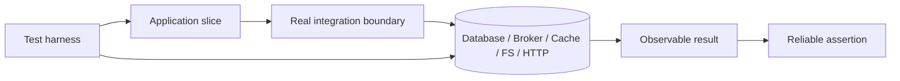
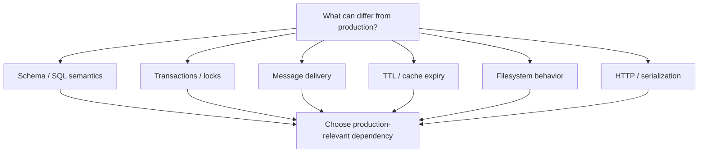
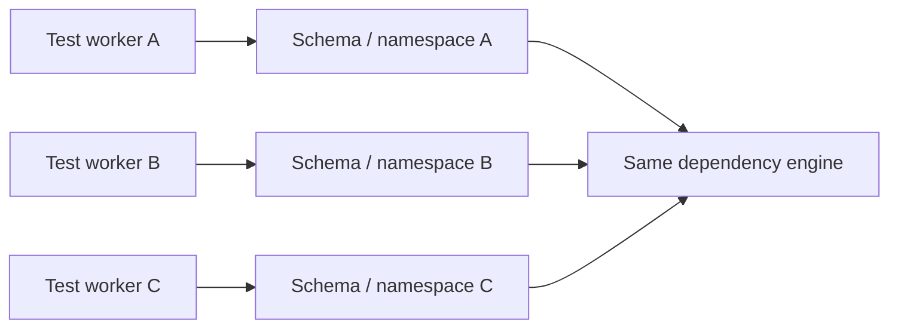

# Integration Testing: Operate Real Boundaries in Controlled Environments

## TL;DR

On July 24, 2026, GitHub experienced a pull-request creation incident during a Vitess backfill. A cancellation path executed behavior operators did not expect, dropped a backing table in the target keyspace, and left a vschema reference pointing at something that no longer existed. GitHub restored service by reverting the database change and later added stronger pre-flight validation, clearer operational guidance, and lower-environment end-to-end testing. **The lesson for integration testing is narrower but important: boundary behavior must be exercised against the real semantics you depend on, including failure and cancellation paths.**

> 💡 **Rule of thumb:** Use an integration test when correctness depends on **how your code and a real boundary behave together**—schema, protocol, transaction, serialization, lifecycle, or failure semantics—not merely on your local business logic.

- **Use real boundary semantics, not convenient substitutes:** If production uses PostgreSQL, RabbitMQ, Redis, S3-compatible object storage, or an HTTP service, integration evidence should exercise the semantics that matter from that class of dependency.
- **Keep the topology controlled and narrow:** An integration test can start one service plus one database or broker. It is **not automatically a full system or end-to-end test**.
- **Treat schema and lifecycle as executable behavior:** Migrations, constraints, transaction isolation, startup readiness, retries, acknowledgements, TTLs, cleanup, and shutdown paths are part of the contract.
- **Design for isolation and parallelism:** Unique schemas/databases/namespaces, minimal fixtures, bounded polling, and deterministic teardown prevent shared-state flakiness.
- **Fatal pitfall:** Passing tests against an in-memory or simplified substitute while production relies on different SQL, locking, transaction, delivery, or lifecycle semantics.

<TermBox term="Integration Boundary">
An **integration boundary** is where your code depends on another implementation or protocol whose real behavior matters: SQL/database semantics, message delivery, cache expiry, filesystem behavior, HTTP serialization, or another service's contract.
</TermBox>

## Integration testing is about real boundaries, not full systems

An integration test verifies that two or more real pieces work together.

That does **not** mean booting the entire company stack.

Good scopes include:

- repository layer + real PostgreSQL;
- worker + real message broker;
- cache adapter + real Redis;
- file-processing code + real filesystem behavior;
- HTTP client + a controlled service implementation;
- migration tooling + a realistic starting schema.

The environment should be **controlled**, but the boundary behavior should be **real or production-compatible**.

Unit tests answer “does my logic behave correctly under controlled inputs?”

Integration tests answer “does my code still behave correctly when the real boundary participates?”

End-to-end tests answer a broader question: “does the assembled user/system workflow work through the deployed path?”

## Prefer production-relevant semantics

The goal is not “use Docker everywhere.” The goal is to preserve semantics that can change outcomes.

For databases, those semantics can include:

- SQL dialect;
- constraint behavior;
- foreign keys;
- unique indexes;
- null handling;
- transaction isolation;
- locking;
- generated values;
- extensions;
- collation;
- timezone behavior;
- query planner behavior.

SQLite can be useful for local development or a particular product, but **SQLite is not PostgreSQL**. If production correctness depends on PostgreSQL-specific behavior, a SQLite-backed test does not prove that boundary.

Likewise, an in-memory queue does not automatically model broker acknowledgement, redelivery, ordering, or persistence semantics.

## Database integration tests should start with the real schema

A database test is weak if it creates a hand-written simplified schema that production never uses.

Prefer running the same migrations or schema-management path used by the application.

Verify:

- you can apply migrations cleanly;
- application queries work against the resulting schema;
- constraints reject invalid states;
- indexes/uniqueness assumptions behave as expected;
- defaults/generated columns are visible as expected;
- serializers map database values correctly.

For important schema changes, test from a **previous schema or production-like starting state**, not only from an empty database.

That catches a different class of failure:

- old rows violate a new constraint;
- backfill logic mishandles nulls;
- an index build changes performance or lock behavior;
- a migration assumes data that does not exist in older environments.

## Migrations are executable compatibility paths

A migration is not just a file that eventually produces the desired schema.

It is an ordered transition.

A useful migration test can:

1. create the previous schema;
2. seed representative old data;
3. apply the migration;
4. run new application queries;
5. verify transformed/backfilled data;
6. exercise rollback, forward-fix, or recovery behavior where your operational model supports it.

Do not invent rollback as a guarantee if your production process is forward-only.

The key is to test the **recovery path you actually operate**.

GitHub's July 2026 incident is useful here because the dangerous behavior was in an operational cancellation path around a database backfill, not in the final intended schema alone.

## Transaction isolation is part of behavior

PostgreSQL's isolation levels change what concurrent transactions can observe and when serialization failures can occur.

If correctness depends on concurrency, test the real database isolation behavior.

Examples:

- two reservations racing for the last seat;
- unique username creation;
- account balance updates;
- job claiming with row locks;
- idempotency-key insertion.

A mock repository cannot reproduce lock queues or serialization failure semantics.

Integration tests do not need to reproduce every production concurrency pattern, but critical invariants should be exercised against the actual transaction model.

## Constraints are executable business guardrails

A database constraint is code.

If production relies on:

- foreign keys;
- unique constraints;
- check constraints;
- not-null rules;

test behavior against them.

Do not mock the repository to “throw duplicate error” and call the boundary tested.

The value of the integration test is discovering whether the database returns the error shape your adapter expects and whether your transaction ends in the state your code assumes.

## Broker tests should exercise delivery semantics

Message brokers add behavior that an in-memory callback cannot faithfully reproduce.

Important integration cases include:

- publish → consume;
- **ack / acknowledgement**;
- nack/reject behavior;
- **redelivery** after consumer failure;
- duplicates under **at-least-once** delivery;
- ordering guarantees or lack of them;
- dead-letter routing;
- retry headers/metadata;
- visibility timeout where relevant.

The application should usually be **idempotent** wherever duplicate delivery is possible.

A valuable test is not “handler function returns success.”

It is:

> after a message is delivered, processing fails after a state change but before ack; when the broker delivers again, does the system avoid duplicating the business effect?

## Cache tests need real expiry and serialization behavior

Cache adapters often look trivial until semantics matter.

Test relevant behavior such as:

- key encoding;
- serialization/deserialization;
- TTL / expiration;
- missing-key behavior;
- atomic operations;
- namespace/prefix rules;
- stale data handling.

Avoid timing tests that literally wait minutes for TTLs.

Use short deterministic TTLs with bounded polling, or dependency features that let you control time where available.

## Filesystem integration tests catch real path behavior

The filesystem is an integration boundary when behavior depends on:

- path normalization;
- permissions;
- atomic rename;
- file existence;
- directory creation;
- encoding;
- symlink behavior;
- temporary files;
- cleanup.

Use an isolated temporary directory.

Do not let tests share a fixed path such as /tmp/test-output across parallel workers.

## HTTP integration tests should target the boundary you own

For an internal HTTP service, an integration test may boot the real application/server adapter and exercise it over HTTP.

Useful evidence includes:

- routing;
- headers;
- serialization;
- status/error mapping;
- middleware;
- authentication adapter wiring;
- request limits.

For third-party APIs, live calls in every CI run are often unstable, slow, rate-limited, expensive, or unsafe.

Use a controlled provider sandbox or local service where appropriate, then cover compatibility separately with [Contract Testing](/docs/testing-quality/contract-testing).

A contract test asks whether two sides agree on an interface.

An integration test asks whether your code works with a concrete implementation of that interface.

## Start dependencies by readiness, not by sleeping

<TermBox term="Readiness Signal">
A **readiness signal** tells the test harness that a dependency can perform the operation the test needs. “Process started” or “port open” may be weaker than “database accepts queries” or “service health endpoint reports ready.”
</TermBox>

A common flaky pattern is:

> start database → sleep 3 seconds → run test

This fails on slower CI workers and wastes time on fast ones.

Prefer a **wait strategy** based on:

- health check;
- successful command;
- log message;
- HTTP readiness;
- listening port when that is actually sufficient.

Testcontainers supports explicit wait strategies and startup timeouts. Docker Compose can gate dependencies on service health.

Use a startup timeout as a failure bound, not a fixed delay as a readiness guess.

## Containers help, but they are not the definition of integration testing

Testcontainers and Docker Compose make disposable dependencies practical.

They help with:

- pinning dependency versions;
- isolated networks;
- lifecycle management;
- startup/readiness;
- cleanup;
- local/CI parity.

But a container image is not automatically identical to production.

Production may differ in:

- version;
- extensions/plugins;
- configuration;
- storage;
- auth;
- collation;
- timezone;
- TLS;
- topology.

Pin versions intentionally and configure the semantics your code actually relies on.

## Cleanup strategy changes what you can observe

<TermBox term="Hermetic Test Environment">
A **hermetic test environment** minimizes uncontrolled external state. Its dependencies, data, configuration, and lifecycle are owned by the test so one run does not silently inherit state from another.
</TermBox>

Common cleanup strategies:

### Transaction rollback

Wrap each test in a transaction and roll it back.

Fast, but it has caveats:

- code using a second connection may not share the same transaction;
- background workers may not see uncommitted data;
- after-commit hooks do not run normally;
- real commit behavior is not exercised.

### Truncate/reset tables

More realistic commit behavior, but can be slower and must respect foreign keys/sequences.

### Disposable database/schema

Create a database or schema per suite/test worker.

Excellent isolation, especially for parallel execution, at higher setup cost.

### Disposable container

Strong isolation for small suites, but startup cost may be higher.

Choose based on the failure modes you need evidence for.

Do not use transaction rollback if the thing you are testing happens **after commit**.

## Parallel tests need isolated names

Fast integration suites often run concurrently.

Safe strategies include:

- unique database per worker;
- unique schema per worker;
- unique tenant/test-run ID;
- queue/topic namespace per worker;
- cache key prefix;
- temporary directory per test.

Fixtures should be **minimal**.

Large shared seed datasets become hidden APIs: one test changes row 42 and ten unrelated tests fail.

Prefer each test to create the data required for its scenario.

## Eventual consistency needs bounded polling

Asynchronous systems rarely become reliable when you add arbitrary sleeps.

Bad pattern:

> publish message → sleep 5 seconds → expect database row

Better:

> publish message → poll the observable result until success or a 5-second deadline

The test should define:

- what condition means success;
- poll interval/backoff;
- total timeout/deadline;
- diagnostic output on timeout.

For **eventual consistency**, an assertion such as “eventually, this row reaches processed state” models the contract better than “sleep exactly 2 seconds.”

Bound the polling so a broken test fails quickly and predictably.

## Failure paths deserve real boundary evidence

Integration tests are especially valuable for failures that mocks often oversimplify:

- connection refused;
- connection reset;
- constraint violation;
- deadlock/serialization failure;
- timeout;
- broker redelivery;
- malformed payload;
- expired cache entry;
- partial write;
- migration/backfill failure.

Do not make every test a chaos experiment.

Pick failure modes where adapter behavior, retry policy, transaction boundaries, or recovery semantics matter.

## Make failures diagnosable

When integration tests fail in CI, collect enough evidence to explain the boundary.

Useful diagnostics:

- dependency logs;
- container logs;
- application logs;
- failed SQL/error code;
- current schema/migration version;
- broker queue/topic name;
- test-run namespace;
- timeout condition;
- seed/fixture identifiers.

A test that says only “expected true, got false” after 40 seconds is expensive to operate.

## Production micro-scenario: green repository tests, broken production query

A service uses PostgreSQL in production but runs repository tests against an in-memory SQLite database. A new query depends on PostgreSQL null ordering and a partial unique index. The SQLite tests pass. After deployment, duplicate active rows violate the intended invariant and a production write path begins returning errors.

- **Impact:** New account provisioning intermittently fails, retries increase database load, and support sees apparently random 500s.
- **Root cause:** The suite tested repository logic against a convenient substitute whose SQL and constraint semantics did not match the production database boundary.
- **Correct pattern:** Keep unit tests for query-building logic where useful, but run integration tests against the same production database engine/version family, apply real migrations, seed the conflicting data shape, assert the real constraint/error mapping, and include a concurrency case if the invariant depends on racing writes.

## Check your mental model

> **Scenario:** Every database integration test runs inside one transaction that is rolled back afterward. A new feature publishes an event only from an after-commit hook. The test inserts a row and expects the event, but the event never appears. Should the team mock the after-commit hook so the existing transaction strategy can stay unchanged?

Show the reasoning

Not for the test that is supposed to prove the real commit-to-event integration.

The transaction wrapper changed the behavior under test: no real commit means the after-commit path is never exercised.

Keep rollback-based tests for cases where commit semantics are irrelevant.

Add a smaller set of tests that allow a real commit, isolate their data with a disposable schema/database or careful cleanup, and verify the event through the real boundary.

The cleanup mechanism must not erase the behavior you intended to test.

## Integration-testing checklist

- [ ] **Boundary:** Which real integration boundary is this test proving?
- [ ] **Scope:** Can the test stay narrower than full-system E2E?
- [ ] **Production semantics:** Are engine/version/configuration differences that matter represented?
- [ ] **Schema:** Are real migrations or schema-management paths used?
- [ ] **Starting state:** Do important migrations run from representative old schema/data?
- [ ] **Constraints:** Are foreign keys, uniqueness, nullability, and check constraints exercised where relevant?
- [ ] **Transactions:** Are isolation, locking, commit, and serialization semantics represented when correctness depends on them?
- [ ] **Messaging:** Are ack/nack, redelivery, duplicates, ordering, and idempotency tested where relevant?
- [ ] **Readiness:** Does the harness wait on a real readiness signal instead of a fixed sleep?
- [ ] **Isolation:** Does each test/worker own its database/schema/namespace/key prefix/temp directory?
- [ ] **Cleanup:** Does the cleanup strategy preserve the commit and side-effect behavior being tested?
- [ ] **Fixtures:** Is seed data minimal and owned by the scenario?
- [ ] **Parallelism:** Can the suite run concurrently without cross-test collisions?
- [ ] **Async:** Are eventually-consistent assertions bounded by polling deadlines?
- [ ] **Diagnostics:** Will a CI failure show dependency logs, error codes, migration version, and test namespace?
- [ ] **Layering:** Is compatibility better covered by a contract test or the full user journey by E2E?

## Boundaries with the rest of Testing & Quality

This lesson owns **real component/dependency boundaries in controlled environments**.

- [Unit Testing](/docs/testing-quality/unit-testing) owns fast behavioral logic with controlled dependencies.
- [End-to-End Testing](/docs/testing-quality/end-to-end-testing) owns broader assembled workflows and critical user journeys.
- [Contract Testing](/docs/testing-quality/contract-testing) owns compatibility between independently changing producers/consumers.
- [Test Doubles](/docs/testing-quality/test-doubles) owns mocks, stubs, fakes, simulators, and the risk of model drift.

## Sources

- [GitHub — Availability report: July 2026](https://github.blog/news-insights/company-news/github-availability-report-july-2026/)
- [Testcontainers for Node.js — Wait strategies](https://node.testcontainers.org/features/wait-strategies/)
- [Docker Docs — Control startup and shutdown order in Compose](https://docs.docker.com/compose/how-tos/startup-order/)
- [PostgreSQL 17 — Transaction Isolation](https://www.postgresql.org/docs/17/transaction-iso.html)
- [Vitest — globalSetup](https://main.vitest.dev/config/globalsetup)
- [Vitest — Setup and Teardown](https://main.vitest.dev/guide/learn/setup-teardown)
