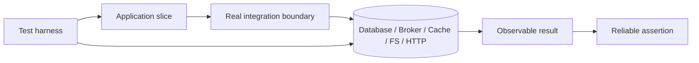
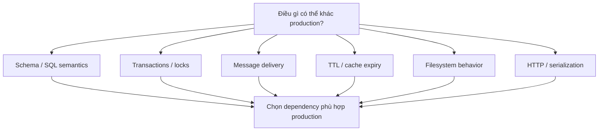
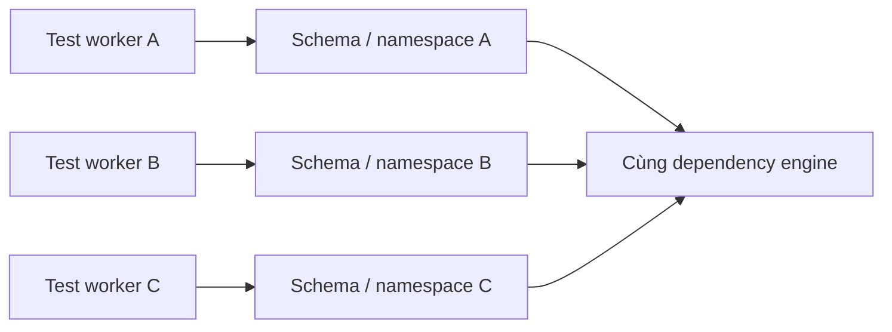

# Integration Testing: Vận hành Boundary Thật trong Môi trường Được Kiểm soát

## TL;DR

Ngày 24/07/2026, GitHub gặp incident khi tạo pull request trong lúc chạy Vitess backfill. Một cancellation path thực thi behavior operator không dự đoán, drop backing table ở target keyspace và để lại vschema reference trỏ tới thứ không còn tồn tại. GitHub phục hồi bằng cách revert database change, rồi bổ sung pre-flight validation mạnh hơn, operational guidance rõ hơn và end-to-end testing ở lower environment. **Bài học cho integration testing hẹp hơn nhưng rất quan trọng: boundary behavior phải được exercise với đúng semantics mà hệ thống thật sự phụ thuộc, kể cả failure và cancellation path.**

> 💡 **Quy tắc bỏ túi:** Dùng integration test khi correctness phụ thuộc vào **cách code của bạn và một boundary thật phối hợp với nhau**—schema, protocol, transaction, serialization, lifecycle hoặc failure semantics—chứ không chỉ local business logic.

- **Dùng boundary semantics thật, không dùng substitute tiện tay:** Nếu production dùng PostgreSQL, RabbitMQ, Redis, S3-compatible storage hoặc HTTP service, integration evidence cần exercise semantics quan trọng của loại dependency đó.
- **Giữ topology được kiểm soát và đủ hẹp:** Integration test có thể chỉ start một service cùng một database hoặc broker. Nó **không tự động là full system hay end-to-end test**.
- **Xem schema và lifecycle là executable behavior:** Migration, constraint, transaction isolation, startup readiness, retry, acknowledgement, TTL, cleanup và shutdown path đều thuộc contract.
- **Thiết kế cho isolation và parallelism:** Unique schema/database/namespace, fixture tối thiểu, bounded polling và teardown tất định giúp tránh shared-state flakiness.
- **Cạm bẫy chết người:** Test pass trên in-memory hoặc simplified substitute trong khi production dựa vào SQL, locking, transaction, delivery hoặc lifecycle semantics khác.

<TermBox term="Integration Boundary">
**Integration boundary / ranh giới tích hợp** là nơi code phụ thuộc vào implementation hoặc protocol khác mà real behavior có ý nghĩa: SQL/database semantics, message delivery, cache expiry, filesystem behavior, HTTP serialization hoặc contract của service khác.
</TermBox>

## Integration testing là về boundary thật, không phải full system

Integration test kiểm tra hai hoặc nhiều real piece làm việc cùng nhau.

Điều đó **không có nghĩa phải boot toàn bộ company stack**.

Scope tốt gồm:

- repository layer + PostgreSQL thật;
- worker + message broker thật;
- cache adapter + Redis thật;
- file-processing code + filesystem behavior thật;
- HTTP client + service implementation được kiểm soát;
- migration tooling + realistic starting schema.

Environment nên **được kiểm soát**, nhưng boundary behavior nên là **implementation thật hoặc tương thích production**.

Unit test trả lời: “local logic có behave đúng dưới input được control không?”

Integration test trả lời: “code có còn behave đúng khi boundary thật tham gia không?”

End-to-end test trả lời câu rộng hơn: “assembled user/system workflow có hoạt động xuyên deployed path không?”

## Ưu tiên semantics phù hợp production

Mục tiêu không phải “mọi thứ đều chạy Docker.” Mục tiêu là giữ những semantics có thể thay đổi outcome.

Với database, các semantics đó có thể gồm:

- SQL dialect;
- constraint behavior;
- foreign key;
- unique index;
- null handling;
- transaction isolation;
- locking;
- generated value;
- extension;
- collation;
- timezone;
- query planner behavior.

SQLite có thể hữu ích cho local development hoặc một product cụ thể, nhưng **SQLite không phải PostgreSQL**. Nếu production correctness phụ thuộc PostgreSQL-specific behavior thì test backed by SQLite không chứng minh boundary đó.

Tương tự, in-memory queue không mặc định model được broker acknowledgement, redelivery, ordering hoặc persistence semantics.

## Database integration test nên bắt đầu từ schema thật

Database test yếu nếu tự dựng hand-written simplified schema mà production chưa từng dùng.

Ưu tiên chạy cùng migration hoặc schema-management path như application.

Verify:

- migration apply sạch;
- application query chạy trên resulting schema;
- constraint reject invalid state;
- index/uniqueness assumption behave như dự kiến;
- default/generated column visible đúng;
- serializer map database value đúng.

Với schema change quan trọng, test từ **schema trước / previous schema hoặc production-like starting state**, không chỉ từ empty database.

Nó bắt class failure khác:

- old row vi phạm new constraint;
- backfill mishandle null;
- index build tạo performance/lock behavior khác;
- migration assume data không tồn tại ở environment cũ.

## Migration là executable compatibility path

Migration không chỉ là file cuối cùng tạo ra desired schema.

Nó là một ordered transition.

Migration test hữu ích có thể:

1. tạo previous schema;
2. seed representative old data;
3. **chạy / áp dụng migration**;
4. chạy new application query;
5. verify transformed/backfilled data;
6. exercise rollback, forward fix hoặc recovery behavior nếu operational model hỗ trợ.

Đừng invent rollback guarantee nếu production process thực tế là forward-only.

Điểm chính là test **recovery path thật sự được vận hành**.

Incident GitHub tháng 7/2026 hữu ích vì dangerous behavior nằm trong cancellation path quanh database backfill, không chỉ ở final intended schema.

## Transaction isolation là một phần của behavior

PostgreSQL isolation level thay đổi concurrent transaction nhìn thấy gì và khi nào serialization failure có thể xảy ra.

Nếu correctness phụ thuộc concurrency, test real database isolation behavior.

Ví dụ:

- hai reservation race cho seat cuối;
- unique username creation;
- account balance update;
- job claiming bằng row lock;
- idempotency-key insertion.

Mock repository không reproduce lock queue hay serialization failure semantics.

Integration test không cần reproduce mọi production concurrency pattern, nhưng critical invariant nên được exercise trên actual transaction model.

## Constraint là executable business guardrail

Database constraint là code.

Nếu production dựa vào:

- foreign key / khóa ngoại;
- unique constraint / unique index / chỉ mục duy nhất;
- check constraint;
- not-null rule;

hãy test behavior với chúng.

Đừng mock repository “throw duplicate error” rồi coi boundary đã được test.

Giá trị của integration test là phát hiện database trả error shape nào, adapter map nó thế nào và transaction kết thúc ở state nào.

## Broker test cần exercise delivery semantics

Message broker thêm behavior mà in-memory callback khó reproduce đầy đủ.

Case quan trọng gồm:

- publish → consume;
- **ack / acknowledgement**;
- nack/reject;
- **redelivery / giao lại** sau consumer failure;
- duplicate dưới **at-least-once** delivery;
- ordering guarantee hoặc không guarantee **thứ tự message**;
- dead-letter routing;
- retry metadata;
- visibility timeout nếu relevant.

Application thường phải **idempotent** khi duplicate delivery có thể xảy ra.

Test có giá trị không phải “handler function returns success.”

Mà là:

> message được deliver, processing fail sau state change nhưng trước ack; khi broker giao lại thì system có tránh duplicate business effect không?

## Cache test cần real expiry và serialization behavior

Cache adapter trông đơn giản cho tới khi semantics matter.

Test relevant behavior:

- key encoding;
- serialization/deserialization;
- TTL / expiration / hết hạn;
- missing key;
- atomic operation;
- namespace/prefix;
- stale-data handling.

Tránh test timing phải chờ hàng phút cho TTL.

Dùng TTL ngắn có bounded polling hoặc dependency feature cho phép control time nếu có.

## Filesystem integration test bắt real path behavior

Filesystem là integration boundary khi behavior phụ thuộc:

- path normalization;
- permission;
- atomic rename;
- file existence;
- directory creation;
- encoding;
- symlink;
- temporary file;
- cleanup.

Dùng isolated temporary directory.

Đừng để test share fixed path như /tmp/test-output giữa parallel worker.

## HTTP integration test nên target boundary bạn sở hữu

Với internal HTTP service, integration test có thể boot real application/server adapter và gọi qua HTTP.

Evidence hữu ích gồm:

- routing;
- header;
- serialization;
- status/error mapping;
- middleware;
- auth adapter wiring;
- request limit.

Với third-party API, live call mỗi CI run thường unstable, chậm, rate-limited, tốn tiền hoặc unsafe.

Dùng controlled provider sandbox hoặc local service khi phù hợp, rồi cover compatibility riêng bằng [Contract Testing](/vi/docs/testing-quality/contract-testing).

Contract test hỏi hai phía có đồng ý interface không.

Integration test hỏi code của bạn có work với một concrete implementation của interface đó không.

## Start dependency bằng readiness, không bằng sleep

<TermBox term="Readiness Signal">
**Readiness signal / tín hiệu sẵn sàng** cho test harness biết dependency đã thực hiện được operation mà test cần. “Process started” hoặc “port open” có thể yếu hơn “database nhận query” hay “service health endpoint báo ready.”
</TermBox>

Flaky pattern phổ biến:

> start database → sleep 3 giây → chạy test

Nó fail trên CI worker chậm và lãng phí trên worker nhanh.

Ưu tiên **wait strategy** dựa trên:

- health check;
- successful command;
- log message;
- HTTP readiness;
- listening port khi thật sự đủ.

Testcontainers hỗ trợ explicit wait strategy và **startup timeout / timeout khởi động**. Docker Compose có thể gate dependency bằng service health.

Dùng timeout làm failure bound, không dùng fixed delay làm readiness guess.

## Container hữu ích nhưng không định nghĩa integration testing

Testcontainers và Docker Compose giúp disposable dependency thực dụng hơn.

Chúng giúp:

- pin version;
- isolated network;
- lifecycle management;
- startup/readiness;
- cleanup;
- local/CI parity.

Nhưng container image không mặc định giống production.

Production có thể khác về:

- version / phiên bản;
- extension/plugin;
- config;
- storage;
- auth;
- collation;
- timezone / múi giờ;
- TLS;
- topology.

Pin version có chủ đích và configure semantics mà code thật sự dựa vào.

## Cleanup strategy thay đổi thứ bạn quan sát được

<TermBox term="Hermetic Test Environment">
**Hermetic test environment** giảm uncontrolled external state. Dependency, data, config và lifecycle được test sở hữu để run này không âm thầm inherit state từ run khác.
</TermBox>

### Transaction rollback

Wrap mỗi test trong transaction rồi **rollback transaction / rollback giao dịch**.

Nhanh nhưng có caveat:

- code dùng **nhiều connection / connection thứ hai** có thể không share transaction;
- background worker không thấy uncommitted data;
- **after commit / sau commit** hook không chạy bình thường;
- real commit behavior không được exercise.

### Truncate/reset table

Commit behavior realistic hơn nhưng chậm hơn và phải tôn trọng foreign key/sequence.

### Disposable database/schema

Tạo **database tạm / schema riêng** cho suite hoặc worker.

Isolation rất tốt cho parallel execution, đổi lại setup cost cao hơn.

### Disposable container

Isolation mạnh cho suite nhỏ, nhưng startup cost có thể cao.

Chọn dựa trên failure mode cần evidence.

Đừng dùng transaction rollback nếu behavior cần test xảy ra **sau commit**.

## Parallel test cần isolated name

Integration suite nhanh thường chạy **parallel / song song / đồng thời**.

Strategy an toàn:

- **unique database / database riêng** cho worker;
- **unique schema / schema riêng** cho worker;
- namespace theo test-run/tenant;
- queue/topic namespace;
- cache **key prefix / tiền tố key**;
- temporary directory riêng.

**Test data / seed data / fixture** nên **minimal / tối thiểu**.

Shared dataset lớn trở thành hidden API: một test sửa row 42 và mười test khác fail.

Ưu tiên mỗi scenario tự tạo data nó cần.

## Eventual consistency cần bounded polling

Asynchronous system hiếm khi reliable hơn chỉ vì thêm arbitrary sleep.

Bad pattern:

> publish message → sleep 5 giây → expect database row

Tốt hơn:

> publish message → **poll / thăm dò** observable result tới khi success hoặc chạm 5-second **deadline / timeout / bounded** limit

Test nên define:

- success condition;
- poll interval/backoff;
- total deadline;
- diagnostic khi timeout.

Với **eventual consistency / nhất quán cuối cùng**, assertion kiểu “eventually row đạt processed state” model contract tốt hơn “sleep đúng 2 giây.”

Bound polling để broken test fail nhanh và predictable.

## Failure path cần real boundary evidence

Integration test đặc biệt hữu ích cho failure mà mock thường oversimplify:

- connection refused/reset;
- constraint violation;
- deadlock/serialization failure;
- timeout;
- broker redelivery;
- malformed payload;
- cache expiry;
- partial write;
- migration/backfill failure.

Không cần biến mọi test thành chaos experiment.

Chọn failure mode nơi adapter behavior, retry policy, transaction boundary hoặc recovery semantics thật sự quan trọng.

## Làm failure dễ diagnose

Khi integration test fail trong CI, collect đủ evidence để giải thích boundary.

Diagnostic hữu ích:

- dependency/container log;
- application log;
- failed SQL/error code;
- schema/migration version;
- queue/topic name;
- test-run namespace;
- timeout condition;
- fixture identifier.

Test chỉ báo “expected true, got false” sau 40 giây rất đắt để operate.

## Micro-scenario production: repository test xanh, production query vỡ

Service dùng PostgreSQL ở production nhưng chạy repository test trên in-memory SQLite. Query mới phụ thuộc PostgreSQL null ordering và partial unique index. SQLite test pass. Sau deploy, duplicate active row vi phạm intended invariant và production write path bắt đầu trả error.

- **Hậu quả:** Account provisioning mới fail ngắt quãng, retry tăng database load và support thấy các 500 có vẻ ngẫu nhiên.
- **Nguyên nhân cốt lõi:** Suite test repository logic bằng convenient substitute có SQL/constraint semantics không giống production database boundary.
- **Cách khắc phục chuẩn:** Giữ unit test cho query-building logic khi hữu ích, nhưng chạy integration test trên cùng database engine/version family như production, apply real migration, seed conflicting data shape, assert real constraint/error mapping và thêm concurrency case nếu invariant phụ thuộc racing write.

## Kiểm tra mental model

> **Tình huống:** Mọi database integration test chạy trong một transaction rồi rollback. Feature mới publish event chỉ từ after-commit hook. Test insert row và expect event nhưng event không bao giờ xuất hiện. Team có nên mock after-commit hook để giữ nguyên transaction strategy?

Show the reasoning

Không, nếu test đó phải prove real commit-to-event integration.

Transaction wrapper đã thay đổi behavior under test: không có real commit thì after-commit path không bao giờ được exercise.

Giữ rollback-based test cho case mà commit semantics không quan trọng.

Thêm một nhóm test nhỏ cho phép real commit, isolate data bằng disposable schema/database hoặc cleanup có kiểm soát, rồi verify event qua real boundary.

Cleanup mechanism không được xóa chính behavior bạn muốn test.

## Checklist Integration Testing

- [ ] **Boundary:** Real integration boundary nào đang được test chứng minh?
- [ ] **Scope:** Test có giữ hẹp hơn full-system E2E không?
- [ ] **Production semantics:** Engine/version/config difference quan trọng có được represent không?
- [ ] **Schema:** Có dùng real migration hoặc schema-management path không?
- [ ] **Starting state:** Migration quan trọng có chạy từ representative old schema/data không?
- [ ] **Constraints:** Foreign key, uniqueness, nullability và check constraint có được exercise khi relevant không?
- [ ] **Transactions:** Isolation, locking, commit và serialization semantics có được represent khi correctness phụ thuộc chúng không?
- [ ] **Messaging:** Ack/nack, redelivery, duplicate, ordering và idempotency có được test khi relevant không?
- [ ] **Readiness:** Harness chờ real readiness signal thay vì fixed sleep không?
- [ ] **Isolation:** Mỗi test/worker có sở hữu database/schema/namespace/key prefix/temp directory không?
- [ ] **Cleanup:** Cleanup strategy có giữ nguyên commit/side-effect behavior đang test không?
- [ ] **Fixtures:** Seed data có tối thiểu và thuộc scenario không?
- [ ] **Parallelism:** Suite chạy concurrent mà không cross-test collision không?
- [ ] **Async:** Eventually-consistent assertion có bounded polling deadline không?
- [ ] **Diagnostics:** CI failure có dependency log, error code, migration version và test namespace không?
- [ ] **Layering:** Compatibility nên thuộc contract test hay full user journey nên thuộc E2E hơn không?

## Ranh giới với phần còn lại của Testing & Quality

Bài này sở hữu **real component/dependency boundary trong controlled environment**.

- [Unit Testing](/vi/docs/testing-quality/unit-testing) sở hữu fast behavioral logic với controlled dependency.
- [End-to-End Testing](/vi/docs/testing-quality/end-to-end-testing) sở hữu broader assembled workflow và critical user journey.
- [Contract Testing](/vi/docs/testing-quality/contract-testing) sở hữu compatibility giữa producer/consumer thay đổi độc lập.
- [Test Doubles](/vi/docs/testing-quality/test-doubles) sở hữu mock, stub, fake, simulator và risk model drift.

## Nguồn

- [GitHub — Availability report: July 2026](https://github.blog/news-insights/company-news/github-availability-report-july-2026/)
- [Testcontainers for Node.js — Wait strategies](https://node.testcontainers.org/features/wait-strategies/)
- [Docker Docs — Control startup and shutdown order in Compose](https://docs.docker.com/compose/how-tos/startup-order/)
- [PostgreSQL 17 — Transaction Isolation](https://www.postgresql.org/docs/17/transaction-iso.html)
- [Vitest — globalSetup](https://main.vitest.dev/config/globalsetup)
- [Vitest — Setup and Teardown](https://main.vitest.dev/guide/learn/setup-teardown)
