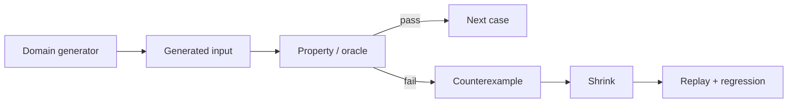
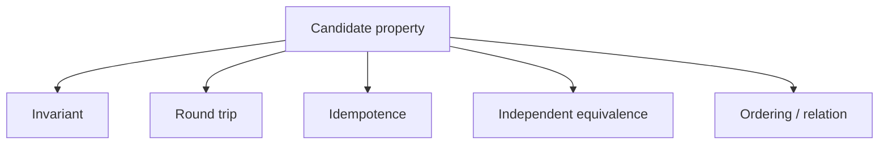
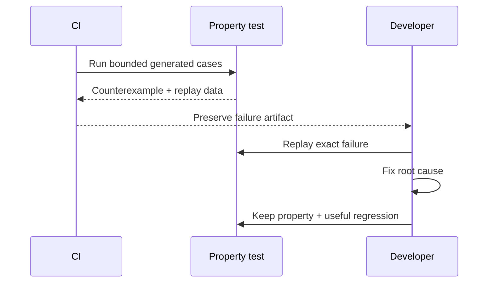

# Property-Based Testing: Search for Counterexamples

## TL;DR

In January 2026, Anthropic described using property-based testing to discover bugs across widely used Python packages. The useful lesson is not “random inputs find everything.” It is that a **strong property plus a realistic generator can search cases humans did not enumerate, then return a reproducible counterexample**.

> 💡 **Rule of thumb:** State a behavior that must hold across a family of valid inputs, generate that family deliberately, and treat every failure as a counterexample to shrink and replay.

- **Properties are executable claims, not proofs.** A passing finite run is evidence over the sampled inputs.
- **Generators define the search space.** They should encode the real domain and make risky boundaries reachable.
- **Shrinking improves diagnosis.** A large failing value can often be reduced to a small, understandable counterexample.
- **Replay makes failures durable.** Preserve the seed, path, or explicit failing example.
- **Fatal pitfall:** Reimplementing the production algorithm inside the property creates a correlated oracle that can repeat the same bug.



<TermBox term="Property">
A **property** is an executable statement expected to hold for every valid value in a described domain. A property-based test samples that domain and tries to falsify the statement.
</TermBox>

## Think in properties, not just examples

Example-based tests document concrete behavior:

```ts
expect(sortNumbers([3, 1, 2])).toEqual([1, 2, 3]);
```

Property-based tests ask what should remain true over many values:

```ts
fc.assert(
  fc.property(fc.array(fc.integer()), (items) => {
    const sorted = sortNumbers(items);
    expect(sorted).toHaveLength(items.length);
    expect(sorted).toEqual([...sorted].sort((a, b) => a - b));
  }),
);
```

Useful property shapes include:

- **invariant:** conserved facts remain true after an operation;
- **round trip:** `decode(encode(x)) = x`;
- **idempotence:** `normalize(normalize(x)) = normalize(x)`;
- **equivalence:** a new implementation agrees with an independent reference;
- **relation:** ordering, monotonicity, symmetry, or conservation rules hold.



A passing property is **not** a mathematical proof. The run is finite, the generator has a distribution, and the oracle may be weak. Property-based testing is best understood as automated falsification: search broadly for a value that breaks the claim.

## Generators are part of the specification

<TermBox term="Generator">
A **generator** (often called an arbitrary or strategy) describes how valid inputs are built. It determines what regions of the input space the test can actually search.
</TermBox>

Suppose a coupon has a code, percentage, and optional expiry. A useful generator encodes real constraints and intentionally reaches:

- empty/minimum/maximum sizes;
- percentage boundaries;
- expired and future timestamps;
- Unicode or normalization cases where the contract permits them;
- combinations that cross validation boundaries.

Prefer generating valid values directly instead of generating arbitrary data and discarding almost all of it with filters. Heavy filtering wastes runs and can make shrinking harder to interpret.

“Valid” is also not the same as “representative.” If a parser generator almost always emits short ASCII strings, a green run says little about long input, escapes, Unicode, repeated fields, or deep nesting.

## Shrink and replay before fixing

<TermBox term="Shrinking">
**Shrinking** is the framework's search for a simpler counterexample after a failure. The result is optimized for simplicity, not necessarily for production severity.
</TermBox>

A 200-item failure may shrink to something like:

```json
{"items":[{"name":""}]}
```

That small case is easier to understand, reproduce, report, and preserve as a regression.

Hypothesis stores/replays failing examples; fast-check reports replay information such as a seed and shrink path. Whatever the framework, preserve enough failure data that CI can hand a developer the exact case.



Randomized input is not permission for flaky infrastructure. Isolate clocks, random IDs inside production code, shared databases, files, network calls, and order-dependent global state.

## Stateful and model-based testing

Some bugs require a sequence: create → update → delete → recreate → read.

Stateful/model-based property testing generates **action sequences** and checks invariants after each step. The reference model should be simpler than the real implementation. If it copies the same caches, queries, retries, and persistence rules, it can reproduce the same design bug.

This style is useful for caches, collections, storage engines, lifecycle APIs, workflow engines, and state machines.

Property-based testing and fuzzing overlap, but the emphasis often differs: property tests center on structured domain generators, semantic oracles, shrinking, and replay; fuzzing often emphasizes execution volume, coverage guidance, crashes, sanitizers, or long-running campaigns.

## Production micro-scenario: pricing rounding drifts

A checkout service stores percentage discounts as basis points. Example tests cover familiar values such as 5%, 10%, and 20%. A refactor changes floating-point rounding, and values near a half-step boundary occasionally round differently from the business rule.

A property generates valid discounts across the supported range and compares the result with an independent integer/decimal reference.

- **Impact:** A small subset of orders differ by one basis point, creating reconciliation noise.
- **Root cause:** Examples did not search rounding boundaries, and the implementation mixed binary floating-point with a decimal rule.
- **Correct pattern:** Generate boundary-heavy values, use an independent oracle, shrink mismatches, replay the exact counterexample, and keep both the broad property and a concrete regression.

## Use CI budgets deliberately

Property tests belong in the evidence portfolio from [Test Strategy](/docs/testing-quality/test-strategy).

- **Pull-request CI:** fast, bounded properties with useful replay data.
- **Scheduled CI:** larger sample counts and broader stateful searches.
- **Dedicated fuzzing:** long-running search where coverage-guided exploration is valuable.

Increasing from 100 to 100,000 cases does not rescue a weak oracle. Design the property and generator first.

## Check your mental model

> **Scenario:** A property runs 10,000 generated JSON documents and passes, but the generator only emits ASCII keys shorter than 20 characters. Can the team conclude the adapter is safe for arbitrary user input?

<details>
<summary>Show the reasoning</summary>

No. The passing run only provides evidence over the searched distribution and asserted property. If production accepts Unicode, long keys, combining characters, or deep structures, those regions remain weakly tested. Expand the generator to match the real contract and bias it toward relevant boundaries.

</details>

## Property-based testing checklist

- [ ] **Property:** Is the claim general and independent of one concrete example?
- [ ] **Oracle:** Is it independent from the production implementation?
- [ ] **Domain:** Does the generator encode real validity constraints?
- [ ] **Boundaries:** Can empty, minimum, maximum, Unicode, and structurally hard cases occur?
- [ ] **Distribution:** Does search pressure reach risky regions?
- [ ] **Filtering:** Can strict preconditions be generated directly instead?
- [ ] **Shrinking:** Will a failure reduce to a valid, understandable counterexample?
- [ ] **Replay:** Does CI preserve seed/path/example data?
- [ ] **State:** Are unrelated clocks, databases, files, and global state isolated?
- [ ] **Sequences:** Would a stateful/model-based search expose bugs single values cannot?
- [ ] **Budget:** Is PR search bounded, with heavier exploration scheduled separately?

## Boundaries with the rest of Testing & Quality

- [Unit Testing](/docs/testing-quality/unit-testing) owns fast local examples; property tests often run there.
- [Integration Testing](/docs/testing-quality/integration-testing) owns real dependency semantics.
- [Contract Testing](/docs/testing-quality/contract-testing) owns compatibility between independently changing systems.
- [End-to-End Testing](/docs/testing-quality/end-to-end-testing) owns assembled Critical User Journeys.
- Static Analysis complements runtime search by reasoning from source/type models without generated runtime cases.
- Test Doubles affect the fidelity of generated tests that cross simulated dependencies.

## Sources

- [Anthropic — Finding bugs across the Python ecosystem with Claude and property-based testing](https://www.anthropic.com/research/property-based-testing)
- [Hypothesis — Property-based testing for Python](https://hypothesis.works/)
- [Hypothesis — Replaying failed tests](https://hypothesis.readthedocs.io/en/latest/tutorial/replaying-failures.html)
- [Hypothesis — Stateful testing](https://hypothesis.readthedocs.io/en/latest/stateful.html)
- [fast-check — Properties](https://fast-check.dev/docs/core-blocks/properties/)
- [fast-check — Model-based testing](https://fast-check.dev/docs/advanced/model-based-testing/)
