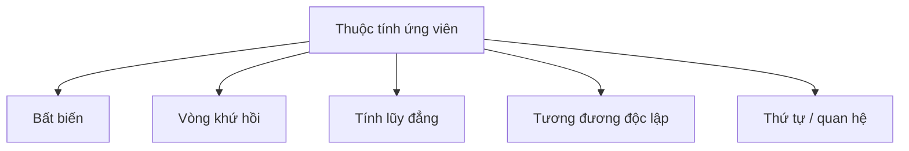
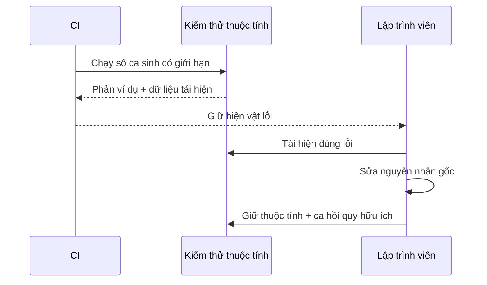

# Kiểm thử Dựa trên Thuộc tính: Tìm Phản ví dụ

## Tóm tắt nhanh

Tháng 01/2026, Anthropic mô tả việc dùng kiểm thử dựa trên thuộc tính để tìm lỗi trong nhiều thư viện Python phổ biến. Bài học không phải “dữ liệu ngẫu nhiên sẽ tìm được mọi lỗi”. Điểm quan trọng là **một thuộc tính mạnh kết hợp với bộ sinh sát miền dữ liệu có thể tìm những ca con người không liệt kê, rồi trả về phản ví dụ có thể tái hiện**.

> 💡 **Quy tắc bỏ túi:** Hãy phát biểu một hành vi phải đúng trên một họ đầu vào hợp lệ, sinh họ đầu vào đó có chủ đích, rồi xem mỗi lỗi là một phản ví dụ cần được thu nhỏ và tái hiện.

- **Thuộc tính là mệnh đề thực thi được, không phải chứng minh.** Một lần chạy hữu hạn chỉ tạo bằng chứng trên các mẫu đã thử.
- **Bộ sinh định nghĩa không gian tìm kiếm.** Nó phải mô hình hóa miền thật và cho phép chạm tới các biên rủi ro.
- **Thu nhỏ giúp chẩn đoán.** Một đầu vào hỏng lớn thường có thể rút thành phản ví dụ nhỏ, dễ hiểu.
- **Tái hiện làm lỗi bền vững.** Hãy lưu hạt giống, đường thu nhỏ hoặc ví dụ hỏng cụ thể.
- **Sai lầm chí mạng:** Chép lại thuật toán production trong thuộc tính tạo một bộ kiểm tra tương quan, có thể lặp lại cùng lỗi.


<TermBox term="Thuộc tính">
**Thuộc tính** là một mệnh đề có thể thực thi và được kỳ vọng đúng với mọi giá trị hợp lệ trong miền đã mô tả. Bài kiểm thử lấy mẫu miền đó và cố tìm phản ví dụ.
</TermBox>

## Nghĩ bằng thuộc tính, không chỉ bằng ví dụ

Kiểm thử theo ví dụ ghi lại hành vi cụ thể:

```ts
expect(sortNumbers([3, 1, 2])).toEqual([1, 2, 3]);
```

Kiểm thử dựa trên thuộc tính hỏi điều gì phải luôn đúng qua nhiều giá trị:

```ts
fc.assert(
  fc.property(fc.array(fc.integer()), (items) => {
    const sorted = sortNumbers(items);
    expect(sorted).toHaveLength(items.length);
    expect(sorted).toEqual([...sorted].sort((a, b) => a - b));
  }),
);
```

Các dạng thuộc tính hữu ích gồm:

- **bất biến:** sự thật bắt buộc vẫn đúng sau thao tác;
- **vòng khứ hồi:** `decode(encode(x)) = x`;
- **tính lũy đẳng:** `normalize(normalize(x)) = normalize(x)`;
- **tương đương:** cài đặt mới khớp với nguồn tham chiếu độc lập;
- **quan hệ:** quy tắc thứ tự, đơn điệu, đối xứng hoặc bảo toàn vẫn đúng.



Một thuộc tính đạt **không phải** chứng minh toán học. Lần chạy là hữu hạn, bộ sinh có phân bố riêng và bộ kiểm tra có thể quá yếu. Cách hiểu tốt là tự động tìm cách bác bỏ mệnh đề bằng phản ví dụ.

## Bộ sinh là một phần của đặc tả

<TermBox term="Bộ sinh">
**Bộ sinh** là mô tả cách tạo đầu vào hợp lệ. Một số thư viện gọi nó là arbitrary hoặc strategy. Bộ sinh quyết định vùng nào của không gian đầu vào mà bài kiểm thử thật sự có thể tìm kiếm.
</TermBox>

Giả sử coupon có mã, phần trăm và ngày hết hạn tùy chọn. Bộ sinh hữu ích nên mã hóa ràng buộc thật và cố ý chạm tới:

- kích thước rỗng, tối thiểu và tối đa;
- biên phần trăm;
- thời điểm đã hết hạn và trong tương lai;
- Unicode hoặc dạng chuẩn hóa nếu hợp đồng cho phép;
- tổ hợp cắt qua ranh giới validation.

Ưu tiên sinh trực tiếp giá trị hợp lệ thay vì sinh tùy ý rồi lọc bỏ gần hết. Lọc quá mạnh vừa lãng phí số lần chạy vừa có thể làm quá trình thu nhỏ khó hiểu hơn.

“Hợp lệ” cũng không đồng nghĩa “đại diện tốt”. Nếu bộ sinh parser gần như chỉ tạo chuỗi ASCII ngắn, một lần chạy xanh nói rất ít về chuỗi dài, ký tự thoát, Unicode, trường lặp hoặc cấu trúc lồng sâu.

## Thu nhỏ và tái hiện trước khi sửa

<TermBox term="Thu nhỏ">
**Thu nhỏ** là quá trình công cụ tìm một phản ví dụ đơn giản hơn sau khi phát hiện lỗi. Kết quả được tối ưu cho sự đơn giản, không nhất thiết cho mức độ nghiêm trọng trong production.
</TermBox>

Một lỗi với 200 phần tử có thể rút còn:

```json
{"items":[{"name":""}]}
```

Ca nhỏ dễ hiểu, tái hiện, báo lỗi và giữ làm hồi quy hơn.

Hypothesis lưu và phát lại ví dụ hỏng; fast-check báo thông tin tái hiện như hạt giống và đường thu nhỏ. Dù dùng thư viện nào, CI nên lưu đủ dữ liệu để lập trình viên chạy lại đúng phản ví dụ.



Dữ liệu sinh không phải lý do để chấp nhận kiểm thử chập chờn. Hãy cô lập đồng hồ, định danh ngẫu nhiên trong code production, cơ sở dữ liệu dùng chung, tệp, lời gọi mạng và trạng thái toàn cục phụ thuộc thứ tự.

## Kiểm thử có trạng thái và theo mô hình

Một số lỗi cần cả chuỗi hành động: tạo → cập nhật → xóa → tạo lại → đọc.

Kiểm thử thuộc tính có trạng thái hoặc theo mô hình sinh **chuỗi thao tác** và kiểm tra bất biến sau mỗi bước. Mô hình tham chiếu phải đơn giản hơn hệ thống thật. Nếu nó sao chép cùng cache, query, retry và persistence, nó có thể lặp lại cùng lỗi thiết kế.

Cách này hữu ích cho cache, collection, storage engine, API có vòng đời, workflow engine và state machine.

Kiểm thử dựa trên thuộc tính và kiểm thử mờ có giao nhau. Kiểm thử thuộc tính thường nhấn mạnh bộ sinh có cấu trúc, bộ kiểm tra ngữ nghĩa, thu nhỏ và tái hiện; kiểm thử mờ thường nhấn mạnh số lần thực thi lớn, hướng dẫn bằng độ phủ, crash, sanitizer hoặc chiến dịch chạy dài.

## Kịch bản production: làm tròn giá bị lệch

Một dịch vụ checkout lưu phần trăm giảm giá dưới dạng basis point. Ví dụ kiểm thử chỉ bao phủ các mức quen thuộc 5%, 10% và 20%. Một refactor thay đổi cách làm tròn số thực, khiến giá trị sát nửa bước đôi khi lệch quy tắc nghiệp vụ.

Một thuộc tính sinh phần trăm hợp lệ trên toàn khoảng và so kết quả với quy tắc tham chiếu độc lập dùng số nguyên hoặc số thập phân.

- **Hậu quả:** Một nhóm nhỏ đơn hàng lệch một basis point, tạo nhiễu khi đối soát.
- **Nguyên nhân cốt lõi:** Ví dụ không tìm các biên làm tròn, còn cài đặt trộn số thực nhị phân với quy tắc thập phân.
- **Cách khắc phục chuẩn:** Sinh nhiều giá trị biên, dùng bộ kiểm tra độc lập, thu nhỏ sai lệch, tái hiện phản ví dụ và giữ cả thuộc tính rộng lẫn ca hồi quy cụ thể.

## Phân bổ ngân sách CI có chủ đích

Kiểm thử dựa trên thuộc tính là một phần danh mục bằng chứng trong [Chiến lược Kiểm thử](/vi/docs/testing-quality/test-strategy).

- **CI cho pull request:** thuộc tính nhanh, có giới hạn và có dữ liệu tái hiện.
- **CI theo lịch:** số mẫu lớn hơn và tìm kiếm trạng thái rộng hơn.
- **Kiểm thử mờ riêng:** chiến dịch dài khi tìm kiếm theo độ phủ mang lại giá trị.

Tăng từ 100 lên 100.000 ca không cứu được một bộ kiểm tra yếu. Hãy thiết kế thuộc tính và bộ sinh trước.

## Tự kiểm tra mô hình tư duy

> **Kịch bản:** Một thuộc tính chạy 10.000 tài liệu JSON và đều đạt, nhưng bộ sinh chỉ tạo khóa ASCII ngắn hơn 20 ký tự. Có thể kết luận adapter an toàn với mọi dữ liệu người dùng không?

<details>
<summary>Xem giải thích chi tiết</summary>

Không. Lần chạy chỉ cung cấp bằng chứng trên phân bố đã tìm kiếm và thuộc tính đã khẳng định. Nếu production chấp nhận Unicode, khóa dài, ký tự tổ hợp hoặc cấu trúc lồng sâu, các vùng đó vẫn được kiểm tra yếu. Hãy mở rộng bộ sinh để khớp hợp đồng thật và ưu tiên các biên liên quan.

</details>

## Danh sách kiểm tra

- [ ] **Thuộc tính:** Mệnh đề có tổng quát và độc lập với một ví dụ cụ thể không?
- [ ] **Bộ kiểm tra:** Có độc lập với cài đặt production không?
- [ ] **Miền:** Bộ sinh có mã hóa đúng ràng buộc hợp lệ không?
- [ ] **Biên:** Ca rỗng, tối thiểu, tối đa, Unicode và cấu trúc khó có thể xuất hiện không?
- [ ] **Phân bố:** Việc tìm kiếm có chạm vùng rủi ro đủ thường xuyên không?
- [ ] **Lọc:** Có thể sinh trực tiếp điều kiện chặt thay vì loại gần hết mẫu không?
- [ ] **Thu nhỏ:** Lỗi có rút về phản ví dụ hợp lệ, dễ hiểu không?
- [ ] **Tái hiện:** CI có giữ hạt giống, đường thu nhỏ hoặc ví dụ hỏng không?
- [ ] **Trạng thái:** Đồng hồ, cơ sở dữ liệu, tệp và trạng thái toàn cục có được cô lập không?
- [ ] **Chuỗi thao tác:** Kiểm thử theo mô hình có thể tìm lỗi mà một giá trị đơn lẻ không tìm được không?
- [ ] **Ngân sách:** Tìm kiếm trên PR có giới hạn và phần nặng hơn được chuyển sang tác vụ theo lịch không?

## Ranh giới với Testing & Chất lượng

- [Kiểm thử Đơn vị](/vi/docs/testing-quality/unit-testing) chịu trách nhiệm ví dụ cục bộ nhanh; kiểm thử thuộc tính thường chạy ở lớp này.
- [Kiểm thử Tích hợp](/vi/docs/testing-quality/integration-testing) chịu trách nhiệm ngữ nghĩa dependency thật.
- [Contract Testing](/vi/docs/testing-quality/contract-testing) chịu trách nhiệm tương thích giữa các hệ thống thay đổi độc lập.
- [Kiểm thử Đầu-cuối](/vi/docs/testing-quality/end-to-end-testing) chịu trách nhiệm hành trình người dùng quan trọng trên hệ thống đã lắp ghép.
- Phân tích tĩnh bổ sung cho tìm kiếm lúc chạy bằng cách suy luận từ mô hình mã nguồn và kiểu dữ liệu.
- Test double ảnh hưởng độ trung thực của các bài kiểm thử sinh dữ liệu khi đi qua dependency mô phỏng.

## Nguồn tham khảo

- [Anthropic — Finding bugs across the Python ecosystem with Claude and property-based testing](https://www.anthropic.com/research/property-based-testing)
- [Hypothesis — Property-based testing for Python](https://hypothesis.works/)
- [Hypothesis — Replaying failed tests](https://hypothesis.readthedocs.io/en/latest/tutorial/replaying-failures.html)
- [Hypothesis — Stateful testing](https://hypothesis.readthedocs.io/en/latest/stateful.html)
- [fast-check — Properties](https://fast-check.dev/docs/core-blocks/properties/)
- [fast-check — Model-based testing](https://fast-check.dev/docs/advanced/model-based-testing/)
