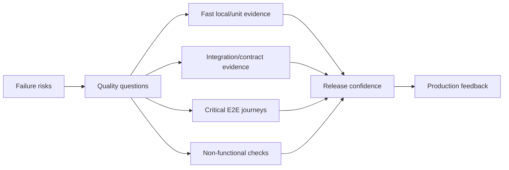
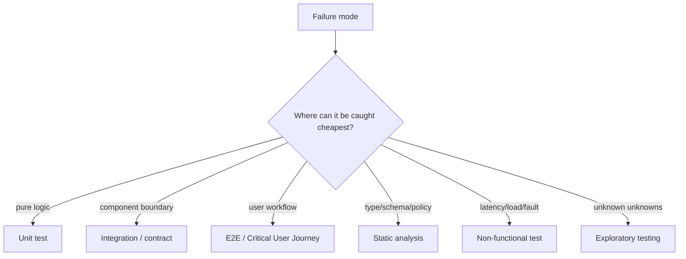
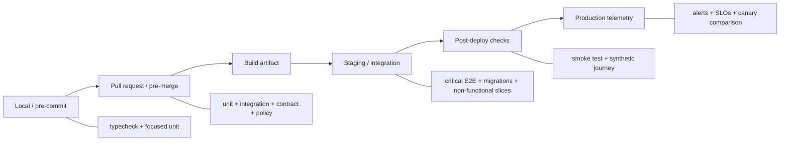

# Test Strategy: Operate Risk-Driven Evidence Across the Delivery Pipeline

## TL;DR

On August 1, 2012, Knight Capital deployed trading software incorrectly. According to the U.S. SEC, a defective legacy function was activated, the router sent more than four million orders while trying to fill only 212 customer orders, and Knight Capital lost more than **$460 million** in about 45 minutes. The incident was not caused by a lack of one particular test type; it exposed a broader control failure across software change, release verification, monitoring, and safeguards. **A test strategy is not a pile of test cases. It is a deliberate evidence system for the failures that matter most.**

> 💡 **Rule of thumb:** For every important failure mode, choose the **cheapest test that gives trustworthy evidence at the right fidelity**, then add a smaller number of broader tests for boundary interactions and critical user journeys.

- **Start from risk, not test count:** Ask what can fail, how expensive the failure is, and which layer can detect it earliest. A repository with 20,000 tests can still have a blind spot around one production-critical boundary.
- **Use a portfolio, not one favorite test type:** Unit, integration, contract, end-to-end, static analysis, exploratory, performance, load, security, and production checks answer different questions.
- **Optimize for signal quality:** Speed, fidelity, reliability, diagnosability, and maintenance cost trade off against each other. A slower realistic test is valuable only when it covers evidence cheaper tests cannot provide.
- **Treat flakiness as a defect in the evidence system:** A test that fails randomly teaches teams to ignore failures. Quarantine may protect CI temporarily, but the fix is to remove nondeterminism, shared-state coupling, clock/randomness leaks, or unstable dependencies.
- **Fatal pitfall:** Treating green CI as proof the release is safe. Tests sample assumptions before release; deployment controls, canaries, observability, rollback, and production feedback are separate safety layers.

<TermBox term="Test Oracle">
A **test oracle** is the rule that decides whether observed behavior is correct. An assertion, invariant, snapshot, reference implementation, schema, or business rule can act as an oracle. A test with realistic setup but a weak oracle can still miss the defect you care about.
</TermBox>

## Strategy begins with failure modes

Do not begin with “we need 80% coverage.” Begin with questions such as:

- Can money be charged twice?
- Can an authorization check be skipped?
- Can a schema change break an older client?
- Can a worker acknowledge a message before durable work finishes?
- Can a migration corrupt existing data?
- Can a rollout route users to an incompatible version?
- Can retries amplify an upstream outage?

A good strategy maps each important **risk / failure mode** to evidence.

This is why **test count is not quality**. More tests can add maintenance cost without adding meaningful confidence.

Code **coverage** is evidence about execution, not proof of correctness. A line can execute without the test asserting the important outcome.

## The testing pyramid is a heuristic, not a quota

Google popularized the testing pyramid as a useful default: many small tests, fewer broader integration tests, and relatively few end-to-end tests.

The old 70/20/10 split is a heuristic, **not an exact ratio** to enforce.

Modern systems vary: compiler/library code may justify a large unit-test base; data pipelines may need more integration/property tests; distributed services may need contract and fault-injection evidence; UI-heavy products need focused browser coverage around important journeys.

Keep the pyramid's economic insight: broad tests usually cost more to run, maintain, and diagnose. Do not cargo-cult a percentage.

## Choose test placement by trade-offs

Google's newer SMURF framing goes beyond “unit vs integration vs E2E.” Evaluate a test on:

- **Speed:** how quickly does it return feedback?
- **Maintainability:** how much setup and fixture churn does it create?
- **Cost:** what infrastructure and runtime does it consume?
- **Reliability:** does the same code produce the same result?
- **Fidelity:** how closely does it match real behavior?
- **Diagnosability:** when it fails, how quickly can an engineer isolate the reason?

| Test style | Speed | Fidelity | Diagnosability | Typical value |
| --- | --- | --- | --- | --- |
| Unit | very high | low-medium | high | business rules, state transitions, pure transformations |
| Integration | medium-high | medium-high | medium-high | database, queue, filesystem, framework, service boundary |
| Contract | high-medium | boundary-specific | high | request/response or message compatibility |
| E2E | low | high | low-medium | critical user journeys, wiring, deployment integration |
| Static analysis | very high | semantic/static only | high | types, lint, policy, dependency constraints |
| Exploratory/manual | variable | high | human-dependent | usability, ambiguous behavior, unknown unknowns |

The goal is not maximum fidelity everywhere. It is enough fidelity at the lowest useful cost.

## Unit, integration, contract, and E2E each own different evidence

**Unit tests** are best for cheap behavioral detail: domain rules, state machines, parsing, validation, calculations, authorization decisions, retry policy, and edge cases. The later [Unit Testing](/docs/testing-quality/unit-testing) lesson owns test design and isolation mechanics.

**Integration tests** prove real boundary behavior: ORM ↔ database, application ↔ schema/migration, producer ↔ broker, service ↔ cache, filesystem permissions, framework serialization, and SDK assumptions. See [Integration Testing](/docs/testing-quality/integration-testing).

**Contract tests** target compatibility directly: API schema, required/optional fields, status/error semantics, event/message schemas, generated clients, and consumer expectations. See [Contract Testing](/docs/testing-quality/contract-testing).

<TermBox term="Critical User Journey">
A **Critical User Journey (CUJ)** is a workflow whose successful completion matters materially to the user or business, such as “sign in and complete checkout” or “create a deployment and observe it become healthy.” E2E coverage should prioritize these journeys instead of duplicating every low-level branch through the browser.
</TermBox>

**End-to-end tests** should protect CUJs and a small number of system-wide wiring assumptions. Good candidates include checkout → payment → durable order, upload → processing → downloadable result, or deployment → health → user-visible version. See [End-to-End Testing](/docs/testing-quality/end-to-end-testing).

## Static, exploratory, performance, and security evidence belong too

**Static analysis** can reject classes of defects before runtime: typecheck, compiler errors, lint rules, dependency constraints, schema validation, policy-as-code, security scanners, and architecture checks. See [Static Analysis](/docs/testing-quality/static-analysis).

**Exploratory / manual testing** remains useful when requirements are ambiguous, UX combinations are new, or the risk is not yet reducible to a stable automated oracle. Important repeatable regressions should later become automated.

Functional checks are not enough. Depending on risk, add **performance testing**, **load testing**, fault-tolerance checks, and **security testing**. Accessibility and localization may also be part of the quality portfolio.

## Test failure paths, not only happy paths

At important boundaries, ask what happens on timeout, retry, duplicate, partial response, malformed input, stale version, permission denial, connection reset, queue backlog, and dependency unavailability.

A suite can cover every happy-path line and still miss the incident mechanism.

Release behavior also deserves tests: configuration selection, feature flags, migrations, artifact/version identity, mixed-version compatibility, **rollback**, startup with production-like config, and release scripts.

Knight Capital is a reminder that software correctness and release correctness are connected but not identical.

## Flakiness destroys trust

<TermBox term="Flaky Test">
A **flaky test** sometimes passes and sometimes fails without a relevant product-code change. Common causes include uncontrolled clocks, random seeds, race conditions, shared state, real network dependencies, order dependence, resource contention, and eventually consistent systems.
</TermBox>

A flaky test creates a dangerous loop: repeated false alarms normalize reruns until a real regression is ignored.

Control the sources of nondeterminism:

- inject or freeze the **clock/time**;
- fix or print the **random seed**;
- remove hidden **shared state**;
- create independent **test data / fixtures**;
- make cleanup reliable;
- use hermetic/isolated dependencies where appropriate;
- wait on explicit conditions instead of arbitrary sleeps;
- bound eventual-consistency polling.

Temporary **quarantine** can keep CI usable, but quarantined tests need an owner and deadline. Blind **retry/rerun** logic can hide real races.

Shared environments create extra failure modes: test-data collisions, service-version skew, deployment races, rate-limit contention, and unreliable cleanup. Prefer ephemeral or isolated environments where the evidence requires isolation.

## Test doubles and property tests are portfolio tools

Mocks, stubs, fakes, and simulators can make local tests fast and precise, but they can also encode a false world. Use a test double when the test is about local behavior, then verify the real dependency in another layer. See [Test Doubles](/docs/testing-quality/test-doubles).

Property-based testing is useful when an invariant is clearer than a hand-picked list of examples—for example, “for every valid sequence of credits and debits, the balance invariant holds.” See [Property-Based Testing](/docs/testing-quality/property-based-testing).

## Put checks at the earliest useful gate

### Pre-merge

Use fast, reliable gates: typecheck/lint/static analysis, unit tests, focused integration tests, contract/schema tests, and security/policy checks.

### Before or during release

Use checks that require built/deployed reality: representative migrations, critical E2E journeys, startup/config verification, and performance smoke checks.

### Post-deploy

Use **smoke tests**, **synthetic** transactions, health/readiness evidence, **canary / progressive delivery** comparisons, and production **observability / monitoring / telemetry**.

Testing and deployment safety reinforce each other, but they are not the same system.

## Testing cannot prove production safety

**Testing cannot prove** correctness across every production state. It samples behavior under chosen inputs, dependencies, and environments.

Confidence is stronger when independent layers agree: static constraints, focused tests, real integrations, CUJ E2E, deployment safeguards, canary evidence, production telemetry, and incident learning.

Green CI is evidence, not certainty.

## Production micro-scenario: 15,000 green tests, one broken payment boundary

A commerce service has thousands of fast unit tests and 92% line coverage. The payment client is always mocked. A provider changes an optional response field from omitted to explicit `null`. The application's decoder rejects `null`, but no real-schema integration or contract test exists. CI is green, release proceeds, and every new checkout fails after payment authorization.

- **Impact:** Customers are charged or authorized but cannot complete checkout; support volume spikes and operators must reconcile incomplete orders.
- **Root cause:** The strategy optimized test count and code coverage but had no evidence at the payment integration boundary. The mock encoded the team's assumption instead of the provider's actual contract.
- **Correct pattern:** Keep unit tests for local payment logic, add provider-schema/contract tests and a realistic integration fixture, cover the critical checkout CUJ end to end, then use post-deploy synthetic checkout plus observability to detect residual production mismatch.

## Check your mental model

> **Scenario:** A team has a flaky 35-minute E2E suite. A proposal says, “Replace every E2E test with unit tests because unit tests are faster and the testing pyramid says most tests should be unit tests.”

Show the reasoning

The conclusion is too broad.

For validation rules, formatting, local state transitions, or deterministic business logic, a smaller unit test is usually better. For a database migration, service contract, browser routing, or critical checkout journey, replacing the broad test with only a unit test can remove necessary fidelity.

Refactor the portfolio: move cheap behavioral cases down; create integration or contract tests for boundaries; keep a small number of high-value CUJ E2E tests; remove duplicate broad scenarios; and fix flakiness instead of normalizing reruns.

The pyramid is an economic heuristic, not an instruction to erase system-level evidence.

## Test strategy checklist

- [ ] **Risk:** Which user, data, money, security, compatibility, and availability failures matter most?
- [ ] **Oracle:** What observable result proves the behavior is correct?
- [ ] **Cheapest layer:** Can this failure be caught reliably below E2E?
- [ ] **Boundaries:** Which database, queue, API schema/contract, filesystem, framework, or external service interactions require real integration evidence?
- [ ] **CUJs:** Which user journeys justify broad end-to-end verification?
- [ ] **Failure paths:** Are timeout, retry, duplicate, malformed, permission-denied, partial-failure, and rollback behaviors covered where relevant?
- [ ] **Static checks:** Which properties should compiler/typecheck/lint/policy/security tooling reject before tests run?
- [ ] **Non-functional:** Which latency, load, scalability, resilience, security, accessibility, or localization risks need dedicated checks?
- [ ] **Flakiness:** Does every flaky test have an owner, cause, and remediation path instead of unlimited reruns?
- [ ] **Isolation:** Are clocks, random seeds, shared state, network dependencies, fixtures, and cleanup controlled?
- [ ] **Feedback speed:** Can developers get high-signal failures before expensive suites run?
- [ ] **Diagnosability:** When a test fails, can an engineer identify the broken contract quickly?
- [ ] **Release path:** Are artifact identity, configuration, migration, mixed versions, rollback, and deployment hooks tested where risky?
- [ ] **Post-deploy:** Are smoke/synthetic checks, canary signals, and observability connected to release decisions?
- [ ] **Review:** Is the suite periodically pruned when tests duplicate evidence without adding confidence?

## Boundaries with the rest of Testing & Quality

This lesson owns the **portfolio and placement problem**. The deeper lessons own mechanics:

- [Unit Testing](/docs/testing-quality/unit-testing)
- [Integration Testing](/docs/testing-quality/integration-testing)
- [End-to-End Testing](/docs/testing-quality/end-to-end-testing)
- [Contract Testing](/docs/testing-quality/contract-testing)
- [Property-Based Testing](/docs/testing-quality/property-based-testing)
- [Static Analysis](/docs/testing-quality/static-analysis)
- [Test Doubles](/docs/testing-quality/test-doubles)

## Sources

- [SEC — SEC Charges Knight Capital With Violations of Market Access Rule](https://www.sec.gov/newsroom/press-releases/2013-222)
- [Google Testing Blog — SMURF: Beyond the Test Pyramid](https://testing.googleblog.com/2024/10/smurf-beyond-test-pyramid.html)
- [Google Testing Blog — Just Say No to More End-to-End Tests](https://testing.googleblog.com/2015/04/just-say-no-to-more-end-to-end-tests.html)
- [Google Testing Blog — How Much Testing is Enough?](https://testing.googleblog.com/2021/06/how-much-testing-is-enough.html)
- [Microsoft Azure Well-Architected Framework — Architecture strategies for testing](https://learn.microsoft.com/en-us/azure/well-architected/operational-excellence/testing)
