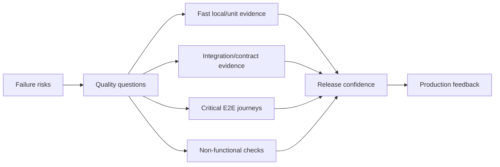
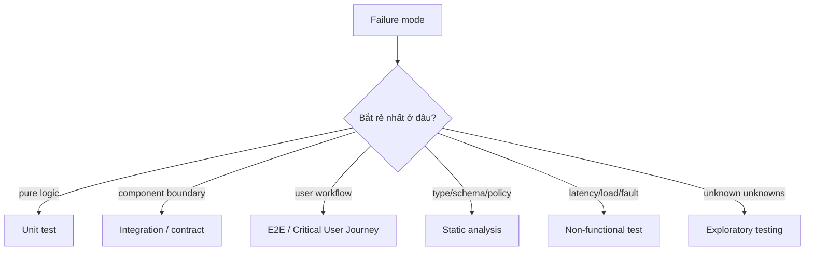
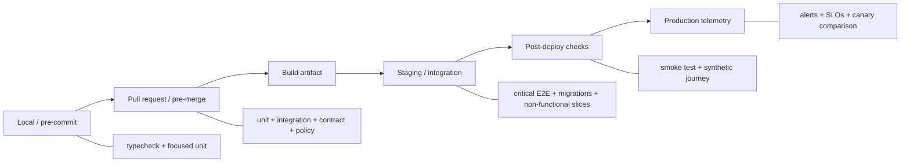

# Test Strategy: Vận hành Bằng chứng Theo Rủi ro Xuyên suốt Delivery Pipeline

## TL;DR

Ngày 01/08/2012, Knight Capital deploy trading software sai. Theo U.S. SEC, một legacy function lỗi bị kích hoạt, router gửi hơn bốn triệu order khi chỉ đang cố fill 212 customer order, và Knight Capital lỗ hơn **460 triệu USD** trong khoảng 45 phút. Incident này không đơn giản là “thiếu một loại test”; nó cho thấy failure rộng hơn giữa software change, release verification, monitoring và safety guardrail. **Test strategy không phải một đống test case. Nó là hệ thống bằng chứng có chủ đích cho những failure quan trọng nhất.**

> 💡 **Quy tắc bỏ túi:** Với mỗi failure mode quan trọng, chọn **test rẻ nhất nhưng cho bằng chứng đáng tin ở fidelity cần thiết**, rồi thêm số ít test rộng hơn để cover integration boundary và critical user journey.

- **Bắt đầu từ risk, không từ số lượng test:** Hỏi cái gì có thể fail, failure đắt tới đâu và layer nào bắt nó sớm nhất. Repo có 20.000 test vẫn có thể mù ở một production-critical boundary.
- **Dùng portfolio, không thần tượng một test type:** Unit, integration, contract, E2E, static analysis, exploratory, performance, load, security và production check trả lời các câu khác nhau.
- **Tối ưu chất lượng signal:** Speed, fidelity, reliability, diagnosability và maintenance cost trade off với nhau. Test realistic nhưng chậm chỉ đáng tiền khi nó cover evidence mà test rẻ hơn không cung cấp.
- **Xem flakiness là defect của evidence system:** Test fail ngẫu nhiên dạy team bỏ qua failure. Quarantine chỉ là biện pháp tạm; fix thật là loại nondeterminism, shared-state coupling, clock/randomness leak hoặc unstable dependency.
- **Cạm bẫy chết người:** Coi green CI là bằng chứng release an toàn. Test sample assumption trước release; deployment control, canary, observability, rollback và production feedback là các safety layer khác.

<TermBox term="Test Oracle">
**Test oracle** là rule quyết định observed behavior có đúng hay không. Assertion, invariant, snapshot, reference implementation, schema hoặc business rule đều có thể làm oracle. Setup rất realistic nhưng oracle yếu vẫn có thể miss defect quan trọng.
</TermBox>

## Strategy bắt đầu từ failure mode

Đừng bắt đầu bằng “cần 80% coverage.” Hãy bắt đầu bằng các câu hỏi:

- tiền có thể bị charge hai lần không?
- authorization check có thể bị skip không?
- schema change có thể phá older client không?
- worker có ack message trước khi work durable không?
- migration có thể corrupt existing data không?
- rollout có route user tới incompatible version không?
- retry có amplify upstream outage không?

Strategy tốt map mỗi **rủi ro / kiểu lỗi / failure mode** quan trọng sang evidence.

Đó là lý do **đếm test / số lượng test không phải chất lượng**. Nhiều test hơn có thể tăng maintenance cost mà không tăng confidence.

Code **coverage / độ bao phủ** là evidence về execution, **không phải chất lượng** và không chứng minh correctness. Một line có thể được execute mà test không assert outcome quan trọng.

## Testing pyramid là heuristic, không phải quota

Google popularize **testing pyramid / kim tự tháp kiểm thử** như default hữu ích: nhiều small test, ít broader integration test hơn và chỉ số ít E2E.

Tỷ lệ 70/20/10 cũ chỉ là heuristic, **không phải tỷ lệ cố định / tỷ lệ chính xác** để enforce.

System khác nhau cần portfolio khác nhau: compiler/library có thể cần rất nhiều unit test; data pipeline cần nhiều integration/property test; distributed service cần contract/fault evidence; UI-heavy product cần browser coverage tập trung quanh journey quan trọng.

Giữ economic insight của pyramid: broad test thường đắt hơn về runtime, maintenance và diagnosis. Đừng cargo-cult percentage.

## Chọn placement bằng trade-off

SMURF framing mới hơn của Google hữu ích vì đi xa hơn “unit vs integration vs E2E.”

Đánh giá test theo:

- **Speed / tốc độ:** feedback quay lại nhanh tới đâu?
- **Maintainability:** setup/fixture churn lớn tới đâu?
- **Cost / chi phí:** cần bao nhiêu infra/runtime?
- **Reliability / độ ổn định:** cùng code có cho cùng result?
- **Fidelity / độ chân thực / giống production:** behavior gần thực tế tới đâu?
- **Diagnosability / khả năng chẩn đoán:** khi fail, engineer khoanh vùng nguyên nhân nhanh được không?

| Test style | Speed | Fidelity | Diagnosability | Giá trị thường gặp |
| --- | --- | --- | --- | --- |
| Unit | rất cao | thấp-vừa | cao | business rule, state transition, pure transform |
| Integration | vừa-cao | vừa-cao | vừa-cao | database, queue, filesystem, framework, service boundary |
| Contract | cao-vừa | theo boundary | cao | compatibility request/response hoặc message |
| E2E | thấp | cao | thấp-vừa | critical user journey, wiring, deployment integration |
| Static analysis | rất cao | static/semantic | cao | type, lint, policy, dependency constraint |
| Exploratory/manual | biến đổi | cao | phụ thuộc human | usability, ambiguous behavior, unknown unknown |

Goal không phải “maximum fidelity ở mọi nơi.” Goal là đủ fidelity với cost thấp nhất hữu ích.

## Unit, integration, contract và E2E sở hữu evidence khác nhau

**Unit test** phù hợp với behavioral detail rẻ: domain rule, state machine, parsing, validation, calculation, authorization decision, retry policy và edge case. Bài [Unit Testing](/vi/docs/testing-quality/unit-testing) sẽ đi sâu test design/isolation.

**Integration test** chứng minh real boundary behavior: ORM ↔ **database**, app ↔ schema/migration, producer ↔ queue/broker, service ↔ cache, filesystem permission, framework serialization và SDK assumption. Xem [Integration Testing](/vi/docs/testing-quality/integration-testing).

**Contract test** nhắm trực tiếp compatibility: API schema, required/optional field, status/error semantics, event/message schema, generated client và consumer expectation. Xem [Contract Testing](/vi/docs/testing-quality/contract-testing).

<TermBox term="Critical User Journey">
**Critical User Journey (CUJ) / hành trình người dùng trọng yếu** là workflow mà completion có giá trị lớn với user/business, ví dụ “sign in rồi checkout thành công” hoặc “create deployment rồi observe healthy.” E2E nên ưu tiên các journey này thay vì duplicate mọi low-level branch qua browser.
</TermBox>

**End-to-end test** nên bảo vệ CUJ và một số ít system-wide wiring assumption: checkout → payment → durable order, upload → processing → downloadable result, hoặc deployment → health → user-visible version. Xem [End-to-End Testing](/vi/docs/testing-quality/end-to-end-testing).

## Static, exploratory, performance và security evidence cũng thuộc strategy

**Static analysis / phân tích tĩnh** có thể reject class defect trước runtime: typecheck, compiler error, lint rule, dependency constraint, schema validation, policy-as-code, security scanner và architecture check. Xem [Static Analysis](/vi/docs/testing-quality/static-analysis).

**Exploratory / kiểm thử thăm dò** và **manual testing / kiểm thử thủ công** hữu ích khi requirement ambiguous, UX có nhiều combination mới hoặc risk chưa reduce được thành automated oracle ổn định. Regression quan trọng đã reproduce được nên được capture thành automated test nhỏ nhất hữu ích.

Functional check chưa đủ. Tùy risk, cần thêm **performance testing / kiểm thử hiệu năng**, **load test / kiểm thử tải**, fault-tolerance test và **security test / kiểm thử bảo mật**. Accessibility và localization cũng có thể thuộc portfolio.

## Test failure path, không chỉ happy path

Ở boundary quan trọng, hãy hỏi timeout, retry, duplicate, partial response, malformed input, stale version, permission denied, connection reset, queue backlog và dependency unavailable xảy ra thì sao.

Suite cover mọi happy path vẫn có thể miss incident mechanism.

Release behavior cũng cần evidence: configuration selection, feature flag, migration, artifact/version identity, mixed-version compatibility, **rollback**, startup với production-like config và release script.

Knight Capital nhắc rằng software correctness và release correctness liên quan nhưng không giống nhau.

## Flakiness phá trust

<TermBox term="Flaky Test">
**Flaky test / test chập chờn** lúc pass lúc fail mà không có relevant product-code change. Cause thường gồm uncontrolled **clock/thời gian**, random seed, race condition, shared state, real network dependency, order dependence, resource contention và eventually consistent system.
</TermBox>

Flaky test tạo feedback loop nguy hiểm: false alarm lặp lại làm engineer normalize rerun cho tới khi real regression bị ignore.

Control nguồn nondeterminism:

- inject/freeze **clock**;
- fix hoặc print **random seed / ngẫu nhiên**;
- remove hidden **shared state / trạng thái dùng chung**;
- tạo independent **test data / fixture / dữ liệu test**;
- cleanup reliable;
- dùng **hermetic / isolated / cô lập** dependency khi phù hợp;
- wait explicit condition thay vì arbitrary sleep;
- bound eventual-consistency polling.

Temporary **quarantine / cách ly** có thể giữ CI usable, nhưng quarantined test cần owner và deadline. Blind **retry/rerun** có thể giấu race thật.

**Shared environment / môi trường dùng chung** còn tạo test-data collision, service-version skew, deployment race, rate-limit contention và cleanup khó. Ưu tiên ephemeral/isolated environment khi evidence cần isolation.

## Test double và property test là portfolio tool

Mock, stub, fake và simulator làm local test nhanh/precise nhưng cũng có thể encode false world. Dùng double khi test tập trung local behavior, rồi verify real dependency ở layer khác. Xem [Test Doubles](/vi/docs/testing-quality/test-doubles).

Property-based testing hữu ích khi invariant rõ hơn danh sách example hand-picked, ví dụ “với mọi valid credit/debit sequence, balance invariant vẫn giữ.” Xem [Property-Based Testing](/vi/docs/testing-quality/property-based-testing).

## Đặt check ở gate sớm nhất hữu ích

### Pre-merge / trước merge

Dùng fast reliable gate: typecheck/lint/static analysis, unit test, focused integration test, contract/schema test và security/policy check.

### Trước hoặc trong release

Dùng check cần built/deployed reality: representative migration, critical E2E, startup/config verification và performance smoke.

### Post-deploy / sau deploy / sau triển khai

Dùng **smoke test**, **synthetic** transaction, health/readiness evidence, **canary / progressive delivery / triển khai dần** comparison và production **observability / monitoring / telemetry**.

Testing và deployment safety reinforce nhau nhưng không phải cùng một system.

## Kiểm thử không chứng minh production safety

**Test không chứng minh / kiểm thử không chứng minh** correctness trong mọi production state. Nó sample behavior dưới input, dependency và environment đã chọn.

Confidence mạnh hơn khi nhiều independent evidence layer cùng đồng thuận: static constraint, focused test, real integration, CUJ E2E, deployment safeguard, canary evidence, production telemetry và incident learning.

Green CI là bằng chứng, không phải certainty.

## Micro-scenario production: 15.000 green test, một payment boundary vỡ

Commerce service có hàng nghìn fast unit test và 92% line coverage. Payment client luôn bị mock. Provider đổi optional response field từ omitted sang explicit `null`. Decoder của app reject `null`, nhưng không có real-schema integration hay contract test. CI green, release đi tiếp và mọi checkout mới fail sau payment authorization.

- **Hậu quả:** Customer bị charge/authorize nhưng không hoàn tất checkout; support spike và operator phải reconcile incomplete order.
- **Nguyên nhân cốt lõi:** Strategy tối ưu số lượng test và code coverage nhưng không có evidence tại payment integration boundary. Mock encode assumption của team thay vì actual provider contract.
- **Cách khắc phục chuẩn:** Giữ unit test cho local payment logic, thêm provider-schema/contract test và realistic integration fixture, cover critical checkout CUJ bằng E2E, rồi dùng post-deploy synthetic checkout + observability để bắt residual production mismatch.

## Kiểm tra mental model

> **Tình huống:** Team có flaky E2E suite dài 35 phút. Proposal nói: “Replace mọi E2E bằng unit test vì unit test nhanh hơn và testing pyramid nói phần lớn test nên là unit.”

Show the reasoning

Kết luận quá rộng.

Với validation rule, formatting, local state transition hoặc deterministic business logic, smaller unit test thường tốt hơn. Với database migration, service contract, browser routing hoặc critical checkout journey, replace broad test bằng chỉ unit test có thể xóa fidelity cần thiết.

Refactor portfolio: move cheap behavioral case xuống; tạo integration/contract test cho boundary; giữ số ít CUJ E2E high-value; remove duplicate broad scenario; và fix flakiness thay vì normalize rerun.

Pyramid là economic heuristic, không phải instruction xóa system-level evidence.

## Checklist Test Strategy

- [ ] **Risk:** Failure nào về user, data, money, security, compatibility và availability quan trọng nhất?
- [ ] **Oracle:** Observable result nào chứng minh behavior đúng?
- [ ] **Cheapest layer:** Failure này có thể bắt reliably dưới E2E không?
- [ ] **Boundaries:** Database, queue, API schema/contract, filesystem, framework hay external service nào cần real integration evidence?
- [ ] **CUJs:** User journey nào đủ quan trọng để justify broad E2E?
- [ ] **Failure paths:** Timeout, retry, duplicate, malformed, permission denied, partial failure và rollback có được cover khi relevant?
- [ ] **Static checks:** Property nào compiler/typecheck/lint/policy/security tooling nên reject trước khi test chạy?
- [ ] **Non-functional:** Risk latency, load, scalability, resilience, security, accessibility hoặc localization nào cần check riêng?
- [ ] **Flakiness:** Mỗi flaky test có owner, cause và remediation path thay vì unlimited rerun không?
- [ ] **Isolation:** Clock, random seed, shared state, network dependency, fixture và cleanup có được control không?
- [ ] **Feedback speed:** Developer có nhận high-signal failure trước expensive suite không?
- [ ] **Diagnosability:** Khi test fail, engineer khoanh vùng broken contract nhanh được không?
- [ ] **Release path:** Artifact identity, configuration, migration, mixed version, rollback và deployment hook có được test nơi có risk không?
- [ ] **Post-deploy:** Smoke/synthetic check, canary signal và observability có nối vào release decision không?
- [ ] **Review:** Suite có được prune định kỳ khi test duplicate evidence mà không tăng confidence không?

## Ranh giới với phần còn lại của Testing & Quality

Bài này sở hữu bài toán **portfolio và placement**. Các bài sâu hơn sở hữu mechanics:

- [Unit Testing](/vi/docs/testing-quality/unit-testing)
- [Integration Testing](/vi/docs/testing-quality/integration-testing)
- [End-to-End Testing](/vi/docs/testing-quality/end-to-end-testing)
- [Contract Testing](/vi/docs/testing-quality/contract-testing)
- [Property-Based Testing](/vi/docs/testing-quality/property-based-testing)
- [Static Analysis](/vi/docs/testing-quality/static-analysis)
- [Test Doubles](/vi/docs/testing-quality/test-doubles)

## Nguồn

- [SEC — SEC Charges Knight Capital With Violations of Market Access Rule](https://www.sec.gov/newsroom/press-releases/2013-222)
- [Google Testing Blog — SMURF: Beyond the Test Pyramid](https://testing.googleblog.com/2024/10/smurf-beyond-test-pyramid.html)
- [Google Testing Blog — Just Say No to More End-to-End Tests](https://testing.googleblog.com/2015/04/just-say-no-to-more-end-to-end-tests.html)
- [Google Testing Blog — How Much Testing is Enough?](https://testing.googleblog.com/2021/06/how-much-testing-is-enough.html)
- [Microsoft Azure Well-Architected Framework — Architecture strategies for testing](https://learn.microsoft.com/en-us/azure/well-architected/operational-excellence/testing)
