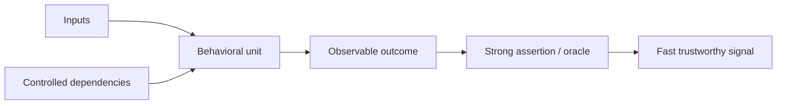
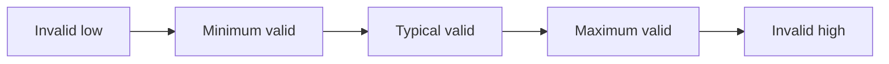
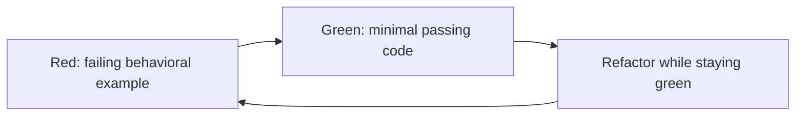

# Unit Testing: Operate Fast, Deterministic Behavioral Checks

## TL;DR

On February 29, 2012, Windows Azure hit a leap-day bug in Guest Agent certificate creation. The code calculated a one-year expiry by incrementing the year, turning February 29, 2012 into the invalid date February 29, 2013. Guest Agents failed to initialize, recovery logic restarted and moved virtual machines, and the bug propagated through clusters. Microsoft later called out leap-day edge cases and controllable clocks as concrete things unit tests should exercise. **The small date rule was testable in isolation; the missing evidence was around a boundary value that ordinary-day examples did not cover.**

> 💡 **Rule of thumb:** A good unit test verifies **one meaningful behavioral contract** with controlled dependencies, explicit inputs, a strong oracle, and a failure signal that tells you what behavior broke.

- **Define the unit by behavior, not file size:** A unit may be one function, a small class, or several collaborating objects if they form one behavioral boundary. “One file = one unit” is not a useful rule.
- **Test public outcomes, not implementation choreography:** Prefer returned values, observable state, emitted domain effects, and meaningful side effects over private methods or incidental call order.
- **Make edge cases deliberate:** Use equivalence classes, boundary values, parameterized cases, invalid inputs, and state-transition tables instead of relying on a few happy-path examples.
- **Control nondeterminism:** Clocks, randomness, UUID generation, globals, network calls, filesystems, and databases must be injected, replaced, or moved to another test layer so the unit suite stays deterministic and order independent.
- **Fatal pitfall:** A green unit suite can still be weak if assertions are shallow, mocks encode the same mistake as production, coverage is treated as correctness, or important integration behavior is tested nowhere.

<TermBox term="Behavioral Unit">
A **behavioral unit** is the smallest practical slice of code whose externally observable behavior you want to specify. It is **not automatically one function, one class, or one file**; the useful boundary is the behavior the test can describe clearly and control cheaply.
</TermBox>

## A unit is a behavioral boundary

“Unit test every function” is a poor operating rule. It encourages exposing private helpers, mirroring control flow, and rewriting tests for harmless refactors.

Instead ask:

> What public behavior should remain true if the implementation changes tomorrow?

Useful behavioral units include:

- a discount policy mapping cart facts to a price adjustment;
- a parser mapping bytes to a domain value or parse error;
- an authorization decision mapping actor/resource/action facts to allow or deny;
- a state machine mapping current state + event to next state + effect;
- a retry policy mapping attempt count + error class to next action.

A unit can involve multiple private helpers. Those helpers do not each need tests if the public behavior already specifies them.

Google's testing guidance recommends testing public APIs and avoiding unnecessary dependence on implementation details because behavior-focused tests survive refactors better.

## Make the test readable as a tiny specification

Arrange–Act–Assert and Given–When–Then are both useful reading structures.

A focused test should describe **one behavior / one scenario**. That does not mean one assertion; several assertions may jointly describe one outcome.

Good test names say what behavior is expected:

- rejects withdrawal when amount exceeds available balance;
- expires reset token at its deadline;
- does not send a duplicate welcome email for an existing user.

Avoid names such as works, test2, or callsHelperCorrectly.

Google also recommends clarity, completeness, and concision: a test should be readable enough to act as documentation for the public behavior.

## The oracle matters more than execution

<TermBox term="Test Oracle">
A **test oracle** is the rule that decides whether the result is correct. Executing code is not enough; the assertion must distinguish intended behavior from plausible wrong behavior.
</TermBox>

Weak assertions merely prove that code returned or did not throw.

Stronger assertions check the observable contract:

- exact domain result;
- state before and after;
- error code/type;
- emitted domain event;
- meaningful state-changing side effect.

Ask:

> What plausible wrong implementation would still pass this assertion?

If many wrong implementations still pass, the oracle is weak.

## Cover equivalence classes, then attack boundaries

Most input spaces are too large to enumerate. Group them into **equivalence classes** whose members should behave similarly, then test representative examples.

For a length rule, classes might be too short, valid, and too long.

Then test **boundary values** around the transition.

<TermBox term="Boundary Value">
A **boundary value** is an input at or immediately around the point where behavior changes: zero, empty, minimum, maximum, just-before/just-after a deadline, month/year rollover, numeric limits, or the first invalid value.
</TermBox>

High-value edge cases commonly include:

- zero and negative values;
- empty collections or strings;
- null or missing optional values;
- minimum and maximum limits;
- exactly-at, just-before, and just-after a deadline;
- off-by-one indexes;
- month-end and year-end;
- leap day;
- overflow or precision edges.

The Azure 2012 incident is the classic shape: ordinary dates can all pass while February 29 exposes a hidden invalid-state transition.

## Use parameterized tests when only the data changes

When many cases share one rule, use a **parameterized / table-driven** test instead of copying the test body.

Vitest supports test.for and test.each for this pattern.

A transfer-limit rule might enumerate:

| Amount | Expected |
| ---: | :--- |
| 0 | reject |
| 1 | accept |
| 10,000 | accept |
| 10,001 | reject |

Keep them together when setup and assertions are the same behavior.

Split them when the cases require different setup, different oracles, or represent different failure concepts.

## Test state transitions and invariants

Stateful code is often easiest to reason about as:

(current state, event) → (next state, effects)

For an order:

| Current | Event | Next | Effect |
| --- | --- | --- | --- |
| pending | pay | paid | record payment |
| paid | ship | shipped | publish shipment |
| shipped | cancel | error/unchanged | no refund |
| cancelled | pay | error/unchanged | reject |

Test valid **state transitions**, forbidden transitions, and important **invariants**.

Example invariant:

> A cancelled order can never become shipped.

This is usually more stable than asserting private fields or helper calls.

## Test errors and failure outcomes explicitly

Error handling is behavior.

Exercise relevant cases such as:

- invalid input;
- parse failure;
- authorization denial;
- exhausted retry;
- impossible state transition;
- overflow or underflow;
- business-rule rejection;
- dependency-error translation.

Assert the observable error contract: error code/type, unchanged state, returned result, and whether a meaningful side effect did or did not happen.

Avoid asserting internal stack traces or private exception construction unless consumers depend on them.

## Control time instead of waiting for time

Time-dependent tests become slow or flaky when they use the real clock.

Inject a clock or time source so you can test:

- before a deadline;
- exactly at a deadline;
- after a deadline;
- leap day and year rollover;
- daylight-saving boundaries when relevant;
- precision and truncation.

Vitest supports **fake timers** for timer APIs so tests can advance time without sleeping.

Do not use real sleeps to make a unit test wait for a timeout.

## Control randomness and generated IDs

Randomness is another hidden input.

Prefer:

- inject a random source;
- use a fixed seed and print it on failure;
- inject a UUID / ID generator;
- assert properties rather than exact random values when that is the real contract.

A reproducible unit test should be able to recreate the same failure from the same inputs.

## Unit tests must be order independent

A test should pass alone, after another test, or in parallel.

Watch for:

- mutable global state;
- singleton caches;
- process environment mutation;
- filesystem leftovers;
- shared database rows;
- fake timers not restored;
- mocks not reset;
- ambient locale or timezone.

Removing unnecessary **shared state** is stronger than repeatedly cleaning it up.

A suite that depends on execution order is not deterministic evidence.

## Keep real network, database, and filesystem behavior out of the unit layer

If a test requires a real **network**, live **database**, message broker, cloud credential, or shared **filesystem**, it may still be a useful test, but it is normally an integration test.

This boundary preserves the unit suite's operating properties:

- fast;
- deterministic;
- cheap;
- easy to run locally;
- easy to diagnose.

Move real infrastructure evidence to [Integration Testing](/docs/testing-quality/integration-testing).

## Use mocks without overspecifying choreography

Mocks, stubs, fakes, and other **test doubles** can make a unit fast and controlled.

But a mock-heavy test can become an implementation transcript:

- verify lookup helper called once;
- verify read-only method called before another method;
- verify internal cache key exactly;
- verify incidental call order.

Such tests become **brittle / fragile** because harmless refactors break them.

Prefer public output and state.

Verify an **interaction / method call** when that interaction **is the behavior**, especially meaningful **state-changing side effects**:

- payment captured once;
- email sent once;
- audit record persisted;
- message published.

Google specifically warns that verifying non-state-changing calls often adds brittleness without proving useful behavior.

The [Test Doubles](/docs/testing-quality/test-doubles) lesson owns mock/stub/fake mechanics in depth.

## Strong tests survive refactoring

Thought experiment:

> If I replace the algorithm but preserve public behavior, which tests should fail?

Usually none.

Tests should fail because behavior changes, not because a helper was renamed, calls were reordered, a cache was added, or one method became three.

That is why unit tests should target **public behavior / public API / observable behavior** rather than implementation detail.

## Coverage is a map, not a verdict

Coverage answers:

> Which code did this suite execute?

It does not answer:

> Were the assertions strong enough?

A suite can execute 100% of a function and assert almost nothing.

Therefore **coverage is not correctness and coverage is not quality**.

Use coverage to find suspicious gaps, not as the sole definition of done.

## Mutation testing probes assertion strength

**Mutation testing** makes small changes to production code—flip a condition, alter a constant, remove a branch—and reruns tests.

If tests still pass, the mutation survived.

That can expose:

- a **weak assertion**;
- behavior nobody tests;
- redundant tests;
- execution coverage without useful discrimination.

Mutation testing is more expensive than ordinary unit tests, so use it selectively on important logic rather than turning it into another vanity percentage.

## Red–green–refactor is a development loop, not proof

Test-driven development (TDD) commonly uses:

Red–green–refactor can keep feedback tight, force a concrete contract before implementation, and make small refactors safer.

But **TDD does not guarantee correctness**.

You can still test the wrong requirement, miss a boundary, write a weak assertion, or mock reality incorrectly.

Use TDD as a workflow, then still apply [Test Strategy](/docs/testing-quality/test-strategy).

## Production micro-scenario: the coupon suite that tests its own algorithm

A checkout service implements “buy 3, cheapest item free.” The production code sorts eligible items and chooses the free item.

The unit tests calculate their expected total by copying the same sorting and selection algorithm into a shared test helper.

A refactor accidentally changes both production and the test helper to choose the most expensive item. Every test remains green because the oracle repeats the same bug.

- **Impact:** Customers receive excessive discounts and margin drops before finance notices.
- **Root cause:** The test executed the code, but expected results were generated from the same algorithmic idea as production, so the oracle was not independent.
- **Correct pattern:** State simple input/output examples directly, include equivalence classes and boundary cases (one item, two items, exactly three, four items, tied prices), assert the business-visible total and chosen free item, and keep test logic simpler than production logic.

## Check your mental model

> **Scenario:** A private calculateTax helper is split into three helpers. Forty unit tests that directly invoked the old private method now need rewriting. Should the team expose the new helpers and recreate the same forty tests?

Show the reasoning

Usually no.

Ask what public business behavior those tests protected.

If the contract is “quote returns subtotal, tax, and total according to jurisdiction rules,” test that behavior using representative equivalence classes and boundary values.

Private helper structure is an implementation choice.

If a helper is genuinely an independent reusable policy with its own stable contract, extracting it into a real module may justify direct tests. But do not create APIs merely so tests can mirror implementation details.

The refactor pain is evidence that the suite was coupled to choreography instead of behavior.

## Unit-testing checklist

- [ ] **Behavioral boundary:** Can the test state one meaningful public behavior without describing private implementation?
- [ ] **Readable structure:** Are Arrange–Act–Assert or Given–When–Then roles obvious?
- [ ] **Focused scenario:** Does the test cover one behavior/scenario rather than several unrelated stories?
- [ ] **Strong oracle:** Would a plausible wrong implementation fail?
- [ ] **Equivalence classes:** Did you choose representative valid and invalid classes deliberately?
- [ ] **Boundary values:** Did you test zero/empty/min/max, off-by-one, deadlines, leap day/year rollover, or other relevant edges?
- [ ] **Parameterized cases:** Are repeated examples expressed as data instead of copied test code?
- [ ] **State transitions:** Are valid/invalid transitions and invariants explicit?
- [ ] **Errors:** Are invalid input and failure outcomes tested, not just happy paths?
- [ ] **Deterministic time:** Is the clock injected or controlled rather than slept on?
- [ ] **Deterministic randomness:** Are seeds/random sources and UUID/ID generators controllable?
- [ ] **Isolation:** Is the test independent of order, globals, shared state, network, database, and filesystem?
- [ ] **Interactions:** Are mocks focused on meaningful side effects instead of incidental call order?
- [ ] **Refactor resilience:** Would implementation-only changes leave behavioral assertions intact?
- [ ] **Coverage:** Are coverage gaps investigated without treating the percentage as correctness?
- [ ] **Suite speed:** Is the unit suite fast enough to run continuously during development?

## Boundaries with the rest of Testing & Quality

This lesson owns **small, fast behavioral checks**.

- [Test Strategy](/docs/testing-quality/test-strategy) decides which risks deserve which evidence.
- [Integration Testing](/docs/testing-quality/integration-testing) verifies real component and infrastructure boundaries.
- [Property-Based Testing](/docs/testing-quality/property-based-testing) explores large input spaces through invariants.
- [Static Analysis](/docs/testing-quality/static-analysis) proves properties without executing tests.
- [Test Doubles](/docs/testing-quality/test-doubles) goes deeper on mocks, stubs, fakes, simulators, and contract drift.

## Sources

- [Microsoft Azure — Summary of Windows Azure Service Disruption on Feb 29th, 2012](https://azure.microsoft.com/en-us/blog/summary-of-windows-azure-service-disruption-on-feb-29th-2012/)
- [Microsoft Azure — Is your code ready for the leap year?](https://azure.microsoft.com/en-us/blog/is-your-code-ready-for-the-leap-year/)
- [Google Testing Blog — Test Behavior, Not Implementation](https://testing.googleblog.com/2013/08/testing-on-toilet-test-behavior-not.html)
- [Google Testing Blog — What Makes a Good Test?](https://testing.googleblog.com/2014/03/testing-on-toilet-what-makes-good-test.html)
- [Google Testing Blog — Keep Tests Focused](https://testing.googleblog.com/2018/06/testing-on-toilet-keep-tests-focused.html)
- [Google Testing Blog — How I Learned To Stop Writing Brittle Tests and Love Expressive APIs](https://testing.googleblog.com/2024/04/how-i-learned-to-stop-writing-brittle.html)
- [Vitest — Writing Tests: Parameterized Tests](https://vitest.dev/guide/learn/writing-tests)
- [Vitest — Mocking Timers](https://vitest.dev/guide/mocking/timers)
