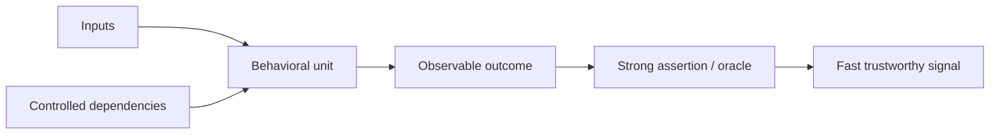
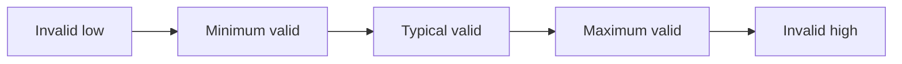
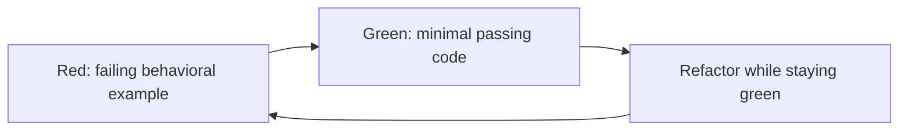

# Unit Testing: Vận hành Kiểm tra Hành vi Nhanh và Tất định

## TL;DR

Ngày 29/02/2012, Windows Azure gặp leap-day bug trong logic tạo certificate của Guest Agent. Code tính thời hạn một năm bằng cách tăng year, biến 29/02/2012 thành ngày không hợp lệ 29/02/2013. Guest Agent không initialize được, recovery logic restart/move VM và bug lan qua cluster. Microsoft sau đó nêu rõ leap-day edge case và clock có thể kiểm soát là những thứ unit test nên exercise. **Phần date rule nhỏ hoàn toàn có thể test cô lập; evidence bị thiếu nằm ở boundary value mà ordinary-day example không cover.**

> 💡 **Quy tắc bỏ túi:** Unit test tốt kiểm chứng **một behavioral contract có ý nghĩa** với dependency được kiểm soát, input tường minh, oracle mạnh và failure signal cho biết behavior nào vừa vỡ.

- **Định nghĩa unit theo behavior, không theo kích thước file:** Unit có thể là một function, class nhỏ hoặc vài object cộng tác nếu chúng tạo thành một behavioral boundary. “Một file = một unit” không phải rule hữu ích.
- **Test public outcome, không test implementation choreography:** Ưu tiên return value, observable state, domain effect và side effect có ý nghĩa thay vì private method hay incidental call order.
- **Chủ động đánh boundary:** Dùng equivalence class, boundary value, parameterized case, invalid input và state-transition table thay vì dựa vào vài happy-path example.
- **Kiểm soát nondeterminism:** Clock, randomness, UUID generation, global, network, filesystem và database phải được inject, replace hoặc chuyển sang layer khác để unit suite deterministic và không phụ thuộc thứ tự.
- **Cạm bẫy chết người:** Green unit suite vẫn có thể yếu nếu assertion hời hợt, mock encode cùng mistake với production, coverage bị coi là correctness hoặc behavior tích hợp quan trọng không được test ở đâu cả.

<TermBox term="Behavioral Unit">
**Behavioral unit / đơn vị hành vi** là slice code nhỏ nhất thực dụng mà bạn muốn đặc tả bằng externally observable behavior. Nó **không mặc định là một function, một class hay một file**; boundary hữu ích là behavior mà test mô tả rõ và control rẻ.
</TermBox>

## Unit là behavioral boundary

“Unit test mọi function” là operating rule kém. Nó khuyến khích expose private helper, mirror control flow và rewrite test khi refactor vô hại.

Thay vào đó hỏi:

> Public behavior nào phải giữ nguyên nếu ngày mai implementation đổi?

Ví dụ behavioral unit hữu ích:

- discount policy map cart fact → price adjustment;
- parser map bytes → domain value hoặc parse error;
- authorization decision map actor/resource/action → allow hoặc deny;
- state machine map current state + event → next state + effect;
- retry policy map attempt count + error class → next action.

Một unit có thể dùng nhiều private helper. Helper không cần test riêng nếu public behavior đã đặc tả đủ.

Guidance của Google khuyến nghị test public API và tránh phụ thuộc không cần thiết vào **implementation detail / chi tiết triển khai** vì behavior-focused test sống qua refactor tốt hơn.

## Viết test như một specification nhỏ, dễ đọc

Arrange–Act–Assert và Given–When–Then đều là reading structure hữu ích.

Focused test nên mô tả **một hành vi / một scenario**. Điều này không có nghĩa chỉ một assertion; vài assertion có thể cùng mô tả một outcome.

Tên test nên nói rõ behavior:

- rejects withdrawal when amount exceeds available balance;
- expires reset token at its deadline;
- does not send duplicate welcome email for an existing user.

Tránh tên như works, test2 hoặc callsHelperCorrectly.

Google cũng nhấn mạnh clarity, completeness và concision: test nên đủ **rõ ràng / dễ đọc** để làm documentation cho public behavior.

## Oracle quan trọng hơn việc code có chạy

<TermBox term="Test Oracle">
**Test oracle** là rule quyết định result có đúng hay không. Code execute chưa đủ; assertion phải phân biệt intended behavior với plausible wrong behavior.
</TermBox>

Assertion yếu chỉ chứng minh code return hoặc không throw.

Assertion mạnh kiểm observable contract:

- exact domain result / **kết quả / giá trị trả về**;
- state trước và sau;
- error code/type;
- emitted domain event;
- meaningful state-changing side effect.

Hỏi:

> Plausible wrong implementation nào vẫn pass assertion này?

Nếu nhiều implementation sai vẫn pass, oracle đang yếu.

## Chọn equivalence class rồi tấn công boundary

Input space thường quá lớn để enumerate. Nhóm input thành **equivalence class / lớp tương đương** mà các member behave giống nhau, rồi chọn representative example.

Với length rule, class có thể là quá ngắn, hợp lệ và quá dài.

Sau đó test **boundary value / giá trị biên** quanh transition.

<TermBox term="Boundary Value">
**Boundary value / giá trị biên** là input tại hoặc ngay quanh điểm behavior đổi: zero, empty, minimum, maximum, just-before/just-after deadline, month/year rollover, numeric limit hoặc first invalid value.
</TermBox>

Boundary case giá trị cao thường gồm:

- zero và negative;
- empty collection/string hoặc **rỗng**;
- null/missing optional value;
- minimum / **tối thiểu** và maximum / **tối đa**;
- đúng deadline, ngay trước, ngay sau;
- **off-by-one** index;
- cuối tháng/cuối năm;
- **ngày nhuận / leap day**;
- overflow/precision edge.

Azure 2012 là shape kinh điển: ordinary date pass hết trong khi 29/02 làm lộ hidden invalid-state transition.

## Dùng parameterized test khi chỉ data thay đổi

Khi nhiều case dùng cùng rule, dùng **parameterized / table-driven / tham số hóa / theo bảng** thay vì copy test body.

Vitest hỗ trợ test.for và test.each.

Ví dụ transfer-limit:

| Amount | Expected |
| ---: | :--- |
| 0 | reject |
| 1 | accept |
| 10,000 | accept |
| 10,001 | reject |

Giữ chung khi setup và assertion cùng một behavior.

Tách khi case cần setup khác, oracle khác hoặc đại diện failure concept khác.

## Test state transition và invariant

Stateful code thường dễ reason dưới dạng:

(current state, event) → (next state, effects)

| Current | Event | Next | Effect |
| --- | --- | --- | --- |
| pending | pay | paid | record payment |
| paid | ship | shipped | publish shipment |
| shipped | cancel | error/unchanged | no refund |
| cancelled | pay | error/unchanged | reject |

Test valid **state transition / chuyển trạng thái**, forbidden transition và **invariant / bất biến** quan trọng.

Ví dụ invariant:

> Cancelled order không bao giờ thành shipped.

Behavior-level evidence này ổn định hơn private field/helper call.

## Test invalid input và error tường minh

Error handling cũng là behavior.

Exercise case relevant:

- invalid input / **đầu vào không hợp lệ**;
- parse failure;
- authorization denial;
- exhausted retry;
- impossible state transition;
- overflow/underflow;
- business-rule rejection;
- dependency-error translation.

Assert observable error contract: error code/type, state không đổi, **kết quả / return value**, và meaningful side effect có hoặc không xảy ra.

Tránh assert internal stack trace/private exception construction nếu consumer không phụ thuộc chúng.

## Control time thay vì chờ time

Time-dependent test dễ chậm/flaky khi dùng real clock.

Inject **clock / nguồn thời gian** để test:

- trước deadline;
- đúng deadline;
- sau deadline;
- leap day/year rollover;
- daylight-saving boundary khi relevant;
- precision/truncation.

Vitest hỗ trợ **fake timer** để advance timer API mà không sleep thật.

Đừng dùng real sleep để “cho time trôi” trong unit test.

## Control randomness và generated identifier

Randomness là hidden input.

Ưu tiên:

- inject **random / ngẫu nhiên** source;
- dùng fixed **seed** và print seed khi fail;
- inject **UUID / ID generator / bộ sinh ID / định danh**;
- assert property thay vì exact random value khi đó mới là real contract.

Test tất định phải recreate được cùng failure từ cùng input.

## Unit test phải order independent

Test phải pass khi chạy riêng, chạy sau test khác hoặc chạy parallel.

Cẩn thận:

- mutable **global state / trạng thái toàn cục**;
- singleton cache;
- process environment mutation;
- filesystem leftover;
- shared database row;
- fake timer chưa restore;
- mock chưa reset;
- ambient locale/timezone.

Loại unnecessary **shared state / trạng thái dùng chung** mạnh hơn việc luôn cleanup nó.

Suite **không phụ thuộc thứ tự / độc lập với thứ tự** mới là deterministic evidence.

## Đưa real network/database/filesystem ra khỏi unit layer

Nếu test cần real **network / mạng**, live **database / cơ sở dữ liệu**, message broker, cloud credential hoặc shared **filesystem / hệ thống tệp**, nó có thể vẫn hữu ích nhưng thường là integration test.

Boundary này giữ operating property của unit suite:

- nhanh;
- deterministic;
- rẻ;
- dễ chạy local;
- dễ diagnose.

Real-infrastructure evidence thuộc [Integration Testing](/vi/docs/testing-quality/integration-testing).

## Dùng mock mà không overspecify choreography

Mock, stub, fake và test double giúp unit nhanh và controlled.

Nhưng mock-heavy test dễ thành transcript implementation:

- verify read-only helper gọi một lần;
- verify exact **method call / lời gọi hàm**;
- verify incidental **call order / thứ tự gọi**;
- verify temporary cache key.

Test kiểu này **brittle / fragile / mong manh** vì refactor vô hại vẫn fail.

Ưu tiên public output và state.

Verify **interaction / tương tác** khi interaction **là behavior**, nhất là meaningful **state-changing / side effect / tác dụng phụ / thay đổi trạng thái**:

- payment captured một lần;
- email sent một lần;
- audit record persisted;
- message published.

Google cảnh báo verify non-state-changing call thường tăng brittleness mà không prove useful behavior.

Bài [Test Doubles](/vi/docs/testing-quality/test-doubles) sẽ đi sâu mock/stub/fake.

## Test mạnh sống qua refactor

Thought experiment:

> Nếu thay algorithm nhưng public behavior không đổi, test nào nên fail?

Thường là không test nào.

Test nên fail vì behavior đổi, không phải vì helper rename, internal call reorder, cache được thêm hoặc một method tách thành ba.

Đó là lý do unit test nên nhắm **public behavior / public API / hành vi quan sát** thay vì implementation detail.

## Coverage là bản đồ, không phải verdict

**Coverage / độ bao phủ** trả lời:

> Code nào được suite execute?

Nó không trả lời:

> Assertion có đủ mạnh không?

Suite có thể execute 100% function mà gần như không assert gì.

Vì vậy **coverage không phải correctness / không chứng minh đúng và coverage không phải chất lượng**.

Dùng coverage để tìm suspicious gap, không dùng percentage làm định nghĩa duy nhất của done.

## Mutation testing probe độ mạnh assertion

**Mutation testing / mutation test / kiểm thử đột biến** thay đổi production code nhỏ—flip condition, đổi constant, bỏ branch—rồi chạy lại test.

Nếu test vẫn pass, mutation survive.

Điều này có thể lộ:

- **weak assertion / assertion yếu**;
- behavior chưa được test;
- redundant test;
- execution coverage nhưng thiếu discrimination.

Mutation testing đắt hơn unit test thường, nên dùng có chọn lọc trên critical logic.

## Red–green–refactor là development loop, không phải proof

Test-driven development (TDD) thường dùng:

**Red–green–refactor** có thể giữ feedback nhanh, buộc contract cụ thể trước implementation và giúp refactor nhỏ an toàn hơn.

Nhưng **TDD không đảm bảo / không bảo đảm correctness**.

Bạn vẫn có thể test sai requirement, miss boundary, viết assertion yếu hoặc mock reality sai.

Dùng TDD như workflow, rồi vẫn áp dụng [Test Strategy](/vi/docs/testing-quality/test-strategy).

## Micro-scenario production: coupon suite tự test chính algorithm của nó

Checkout service áp dụng rule “mua 3, item rẻ nhất miễn phí.” Production code sort eligible item và chọn free item.

Unit test tính expected total bằng cách copy cùng sorting/selection algorithm vào shared test helper.

Refactor vô tình làm cả production và test helper chọn item đắt nhất. Tất cả test vẫn green vì oracle lặp lại cùng bug.

- **Hậu quả:** Customer nhận discount quá lớn và margin giảm trước khi finance phát hiện.
- **Nguyên nhân cốt lõi:** Test execute behavior nhưng expected result được generate từ cùng algorithmic idea với production, nên oracle không độc lập.
- **Cách khắc phục chuẩn:** Viết input/output example trực tiếp, thêm equivalence class và boundary case (một item, hai item, đúng ba, bốn item, tied price), assert business-visible total và free item, giữ test logic đơn giản hơn production logic.

## Kiểm tra mental model

> **Tình huống:** Private calculateTax helper bị tách thành ba helper. Bốn mươi unit test gọi trực tiếp method cũ giờ cần rewrite. Team có nên expose ba helper mới và recreate cùng bốn mươi test?

Show the reasoning

Thường là không.

Hỏi public business behavior mà các test cũ muốn bảo vệ.

Nếu contract là “quote trả subtotal, tax và total theo jurisdiction rule,” test behavior đó bằng representative equivalence class và boundary value.

Private helper structure là implementation choice.

Nếu một helper thật sự là independent reusable policy với stable contract riêng, extract thành module thật có thể justify direct test. Nhưng đừng tạo API chỉ để test mirror implementation detail.

Refactor pain là evidence suite đã coupling vào choreography thay vì behavior.

## Checklist Unit Testing

- [ ] **Behavioral boundary:** Test có mô tả một public/observable behavior có ý nghĩa mà không kể private implementation không?
- [ ] **Readable structure:** Arrange–Act–Assert hoặc Given–When–Then có rõ không?
- [ ] **Focused scenario:** Test cover một behavior/scenario thay vì nhiều câu chuyện không liên quan không?
- [ ] **Strong oracle:** Một plausible wrong implementation có fail không?
- [ ] **Equivalence classes:** Representative valid/invalid class đã được chọn có chủ đích chưa?
- [ ] **Boundary values:** Zero/empty/min/max, off-by-one, deadline, leap-day/year rollover hoặc relevant edge đã test chưa?
- [ ] **Parameterized cases:** Repeated example có được biểu diễn như data thay vì copy test code không?
- [ ] **State transitions:** Valid/invalid transition và invariant đã explicit chưa?
- [ ] **Errors:** Invalid input và failure outcome đã được test, không chỉ happy path?
- [ ] **Deterministic time:** Clock được inject/control thay vì sleep chưa?
- [ ] **Deterministic randomness:** Seed/random source và UUID/ID generator có controllable không?
- [ ] **Isolation:** Test độc lập với order, global/shared state, network, database và filesystem không?
- [ ] **Interactions:** Mock tập trung meaningful side effect thay vì incidental call order không?
- [ ] **Refactor resilience:** Implementation-only change có để behavioral assertion nguyên vẹn không?
- [ ] **Coverage:** Coverage gap được investigate mà không coi percentage là correctness không?
- [ ] **Suite speed:** Unit suite đủ nhanh để chạy liên tục trong development không?

## Ranh giới với phần còn lại của Testing & Quality

Bài này sở hữu **small, fast behavioral checks**.

- [Test Strategy](/vi/docs/testing-quality/test-strategy) quyết định risk nào cần evidence nào.
- [Integration Testing](/vi/docs/testing-quality/integration-testing) verify real component/infrastructure boundary.
- [Property-Based Testing](/vi/docs/testing-quality/property-based-testing) explore input space lớn bằng invariant.
- [Static Analysis](/vi/docs/testing-quality/static-analysis) prove property mà không execute test.
- [Test Doubles](/vi/docs/testing-quality/test-doubles) đi sâu mock, stub, fake, simulator và contract drift.

## Nguồn

- [Microsoft Azure — Summary of Windows Azure Service Disruption on Feb 29th, 2012](https://azure.microsoft.com/en-us/blog/summary-of-windows-azure-service-disruption-on-feb-29th-2012/)
- [Microsoft Azure — Is your code ready for the leap year?](https://azure.microsoft.com/en-us/blog/is-your-code-ready-for-the-leap-year/)
- [Google Testing Blog — Test Behavior, Not Implementation](https://testing.googleblog.com/2013/08/testing-on-toilet-test-behavior-not.html)
- [Google Testing Blog — What Makes a Good Test?](https://testing.googleblog.com/2014/03/testing-on-toilet-what-makes-good-test.html)
- [Google Testing Blog — Keep Tests Focused](https://testing.googleblog.com/2018/06/testing-on-toilet-keep-tests-focused.html)
- [Google Testing Blog — How I Learned To Stop Writing Brittle Tests and Love Expressive APIs](https://testing.googleblog.com/2024/04/how-i-learned-to-stop-writing-brittle.html)
- [Vitest — Writing Tests: Parameterized Tests](https://vitest.dev/guide/learn/writing-tests)
- [Vitest — Mocking Timers](https://vitest.dev/guide/mocking/timers)
