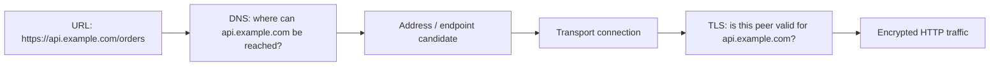
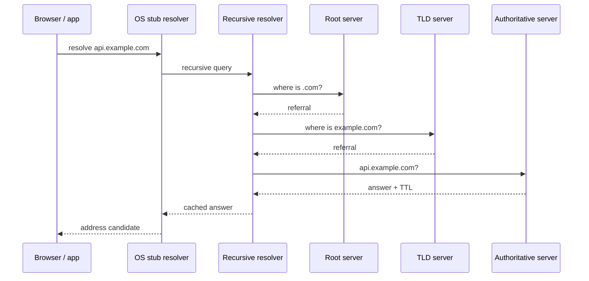
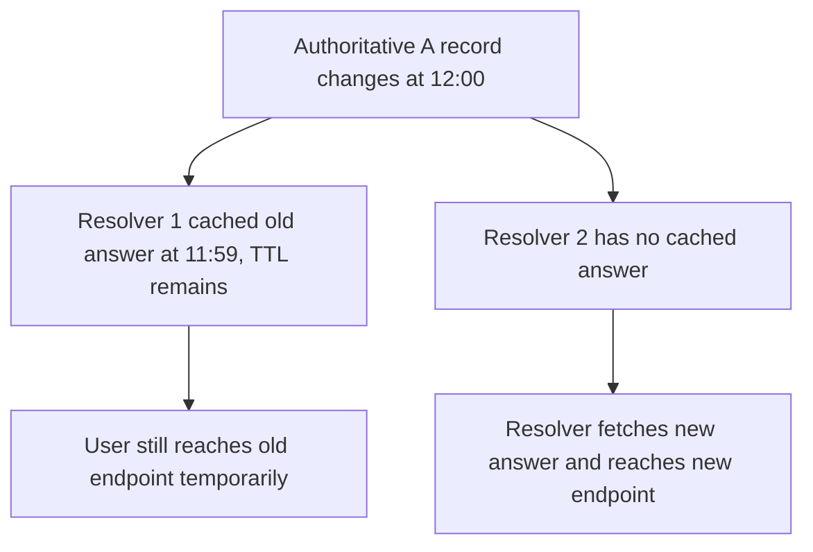
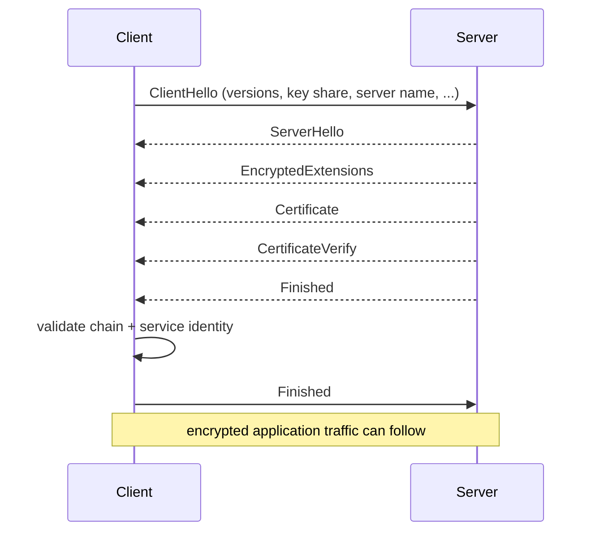

# DNS Resolution & TLS: From Hostname to Authenticated HTTPS

## TL;DR

For a **fresh** HTTPS connection, two questions have to be answered before HTTP application data can flow:

1. **Where should this hostname be reached?** DNS resolution turns a name such as `api.example.com` into routing information, often an IP address.
2. **Is the peer I reached actually authorized to represent that service name?** TLS establishes cryptographic keys and authenticates the service identity presented by the server.

Do not collapse those questions into one. A DNS answer can point you to an address without proving that the server at that address is the right `api.example.com`. TLS certificate and service-identity verification provide a separate authentication boundary.

Also do not assume every HTTP request repeats DNS and TLS. Browser, OS, and recursive DNS caches can satisfy name lookups; existing HTTP connections can be reused; TLS sessions can be resumed. This lesson explains the **fresh-setup path** so you can recognize when each stage is present or skipped.

## One mental model: locate first, authenticate second

The hostname participates in both halves, but for different reasons:

- DNS uses it as a lookup name.
- TLS service-identity verification uses it as the **reference identity** the server must be authorized to represent.

<TermBox term="Reference identity">
A **reference identity** is the service identity the client intends to reach, commonly derived from the hostname in the URI.

**Why it matters here:** connecting to an IP address returned by DNS does not replace hostname verification. A server can be reachable at the right address and still present a certificate that is not valid for the intended service name.
</TermBox>

## DNS resolution is usually cache-first

A browser or application commonly asks a local resolver rather than walking the DNS hierarchy itself. The exact cache layers vary by platform, but the reasoning is consistent: **check usable cached data before doing more network work**.

A conceptual cache-miss path looks like this:

Real resolution may stop much earlier because the recursive resolver already has the answer, a CNAME target, or delegation data cached. The diagram is a **miss-path mental model**, not a promise that every lookup sends all of those queries.

<TermBox term="Recursive resolver">
A **recursive resolver** accepts a client's resolution request and does the work needed to return an answer or error, often using its cache before contacting other DNS servers.

**Why it matters here:** two users can temporarily receive different answers after a DNS change because their resolvers cached data at different times.
</TermBox>

### Authoritative data and cached data answer different questions

When debugging a DNS incident, ask which view you are observing:

- the **authoritative** server tells you what the zone currently publishes;
- a **recursive resolver** may legitimately return an older cached record until its TTL expires;
- a browser or OS may have another local cache in front of the recursive resolver.

Seeing the new record at the authoritative server does not prove every client will see it immediately.

## TTL is a cache lifetime, not a propagation countdown

DNS resource records carry a **TTL** that limits how long cached data can be reused. A resolver that cached an address with 300 seconds remaining can keep answering from that cache until the remaining TTL expires.

This is why production cutovers need an overlap window. Lowering TTL **before** a planned change can reduce how long newly cached old data remains useful, but lowering TTL at the moment of the change cannot retroactively shorten TTLs already cached elsewhere.

Negative results can also be cached under DNS rules, so a recently created name may still appear nonexistent to resolvers that cached an earlier negative answer.

## DNS does not authenticate the HTTPS server

Suppose DNS returns `203.0.113.20` for `api.example.com`. Reaching that address proves routing worked well enough to contact something there. It does **not** prove that something is authorized to serve `api.example.com`.

That distinction matters during:

- CDN or load-balancer migrations;
- multi-tenant hosting;
- stale DNS answers during cutovers;
- accidental or malicious DNS changes;
- direct-IP health checks that bypass the hostname users actually request.

TLS adds the authentication and encryption boundary.

## TLS 1.3 establishes keys and authenticates the service

The current TLS 1.3 specification is **RFC 9846**, which obsoletes RFC 8446 while retaining TLS version 1.3. A simplified full handshake for certificate-based server authentication looks like this:

This is intentionally a teaching-level view. TLS 1.3 supports resumption and other paths, and protocol integrations can change transport details. The stable reasoning is:

1. negotiate supported cryptographic parameters;
2. establish shared traffic keys;
3. authenticate the handshake and the server's presented credential;
4. verify that the presented service identity matches the service the client intended to reach;
5. only then treat the channel as authenticated for application traffic.

<TermBox term="CertificateVerify">
In a TLS 1.3 certificate-authenticated handshake, **CertificateVerify** proves that the endpoint possesses the private key corresponding to its certificate and binds that proof to the handshake transcript.

**Why it matters here:** receiving a certificate is not enough. The handshake verifies possession, while the client separately validates trust and whether the certificate represents the intended service identity.
</TermBox>

## Certificate trust and hostname identity are separate checks

A useful debugging model is to split certificate validation into at least two questions:

- **Can I build and validate an acceptable trust path for the presented certificate?**
- **Does the certificate's presented identity match the reference identity I intended to reach?**

RFC 9525 defines current guidance for service identity in TLS and obsoletes the older RFC 6125 guidance.

For `https://api.example.com/...`, the client normally verifies the service against `api.example.com`, not merely against whichever IP address DNS returned. That is why testing a new HTTPS endpoint only by opening its bare IP can miss the exact identity path real users exercise.

### SNI helps the server choose the right virtual service

Many servers host multiple DNS names on one address. The TLS ClientHello can carry the requested server name through the server-name extension (commonly called **SNI**). The server can use that information to select the correct certificate and configuration.

A failure can therefore be hostname-specific even when the IP and port are healthy:

- the load balancer is reachable;
- TCP or another transport is established;
- the wrong virtual host or certificate is selected;
- TLS identity verification fails before HTTP reaches the application.

## Fresh connection setup is not every-request setup

The existing HTTP Request Lifecycle lesson intentionally separates HTTP semantics from network setup. Keep that boundary here too.

A later request might:

- reuse cached DNS data;
- reuse an already-open HTTP/1.1 or HTTP/2 connection;
- use an existing HTTP/3 connection over QUIC;
- use TLS resumption rather than a full certificate-authenticated handshake.

So when debugging latency, do not automatically attribute every request to “DNS + TLS time.” Measure whether a fresh lookup or handshake actually occurred.

## Production scenario: DNS cutover exposes a certificate mistake

A team migrates `api.example.com` from an old load balancer to a new one.

- the old DNS A record points to `203.0.113.10`;
- the new record points to `203.0.113.20`;
- the DNS TTL is 300 seconds;
- the new load balancer passes an IP-based health check;
- its certificate is valid for `new-api.internal.example`, but not `api.example.com`;
- some recursive resolvers still have the old address cached while others fetch the new address.

**Impact:** users see an intermittent-looking incident. Clients still using the old cached address succeed, while clients reaching the new address fail during TLS certificate/service-identity verification before an HTTP response exists.

**Root cause:** the cutover treated “new IP is healthy” as equivalent to “the HTTPS service is ready.” The deployment did not validate the new endpoint using the real hostname/reference identity, and the overlap created by DNS TTLs made the failure appear inconsistent across users.

**Correct pattern:** provision and verify a certificate valid for `api.example.com` before changing DNS; test the new endpoint with the real hostname and SNI/service-identity path; keep the old endpoint valid through the expected DNS cache window; observe resolver answers and TLS failures separately; only retire the old endpoint after the cutover window and traffic evidence show it is safe.

The durable lesson is that a DNS migration is also a **service-identity migration** when HTTPS terminates at a new endpoint.

## Self-check

A browser reports a certificate-name mismatch for `https://api.example.com`, but `dig api.example.com` returns the IP you expected and the load balancer is accepting connections.

What can you conclude, and what should you inspect next?

Show the reasoning

DNS resolution succeeding means name lookup produced an address. The client also reached far enough into TLS to evaluate the presented certificate. That does not mean the HTTPS identity is correct.

Inspect the certificate selected for the `api.example.com` reference identity, the SNI/virtual-host configuration, certificate chain and validity, and whether the endpoint being tested is the same one clients reach. Changing the DNS TTL is not a fix for a certificate-name mismatch.

## DNS + TLS review checklist

- [ ] **Reference hostname:** What exact hostname from the URL is the client trying to reach?
- [ ] **Cache layer:** Am I looking at browser/OS cache, recursive resolver cache, or authoritative DNS data?
- [ ] **TTL:** Could an old positive or negative answer still be legitimately cached?
- [ ] **Record chain:** If CNAME or other indirection is involved, have I followed the complete resolution chain?
- [ ] **Address overlap:** During a cutover, are both old and new endpoints expected to receive traffic?
- [ ] **Transport boundary:** Did the client reach the endpoint, or is the failure still before connection setup?
- [ ] **ClientHello / SNI:** Is the intended server name being sent so the correct virtual service and certificate are selected?
- [ ] **Certificate trust:** Can the client validate the presented certificate chain according to its trust policy?
- [ ] **Service identity:** Is the certificate valid for the reference hostname according to current TLS service-identity rules?
- [ ] **Fresh versus reused:** Did this request actually perform DNS resolution and a full TLS handshake, or reuse cached/established state?
- [ ] **Observability:** Can logs and metrics distinguish DNS errors, connect failures, TLS alerts, certificate failures, and HTTP responses?

## Agent rule

When diagnosing “HTTPS is down,” do not jump straight to the application. Identify the failed boundary in order: cached or fresh DNS resolution, selected address, transport connection, TLS handshake, certificate trust, service-identity match, then HTTP. Preserve the original hostname through testing; a bare-IP probe can hide SNI and certificate-identity failures that real clients experience.

## Related concepts

- **HTTP Request Lifecycle** — begins after or on top of connection state that may already exist; not every request repeats DNS and TLS.
- **CDN Behavior** — DNS, anycast, edge selection, and certificate termination can move the serving endpoint away from the origin.
- **Cloud Networking** — load balancers, routing, and private/public address boundaries affect which endpoint DNS returns.
- **Logs, Metrics & Traces** — network setup failures need stage-specific telemetry instead of one generic request error.

Continue with [HTTP Request Lifecycle](/docs/web-platform/http-request-lifecycle) to trace what happens once authenticated connection state is available.

## Sources

Primary standards verified on **2026-09-10**:

- [RFC 1034 — Domain Names: Concepts and Facilities](https://www.rfc-editor.org/rfc/rfc1034.html)
- [RFC 1035 — Domain Names: Implementation and Specification](https://www.rfc-editor.org/rfc/rfc1035.html)
- [RFC 2308 — Negative Caching of DNS Queries](https://www.rfc-editor.org/rfc/rfc2308.html)
- [RFC 9846 — The Transport Layer Security (TLS) Protocol Version 1.3](https://www.rfc-editor.org/rfc/rfc9846.html)
- [RFC 9525 — Service Identity in TLS](https://www.rfc-editor.org/rfc/rfc9525.html)
- [RFC 6066 — TLS Extensions: Server Name Indication](https://www.rfc-editor.org/rfc/rfc6066.html)

This lesson is **evolving** with a 180-day review target. DNS architecture is durable, but TLS standards, browser behavior, certificate policy, resolver behavior, and deployment practices continue to evolve; source freshness therefore matters.
