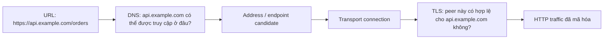
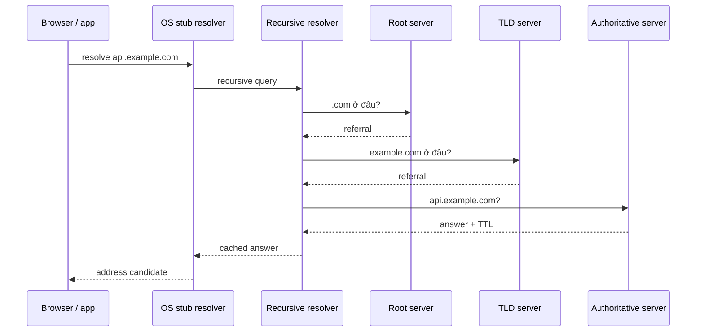
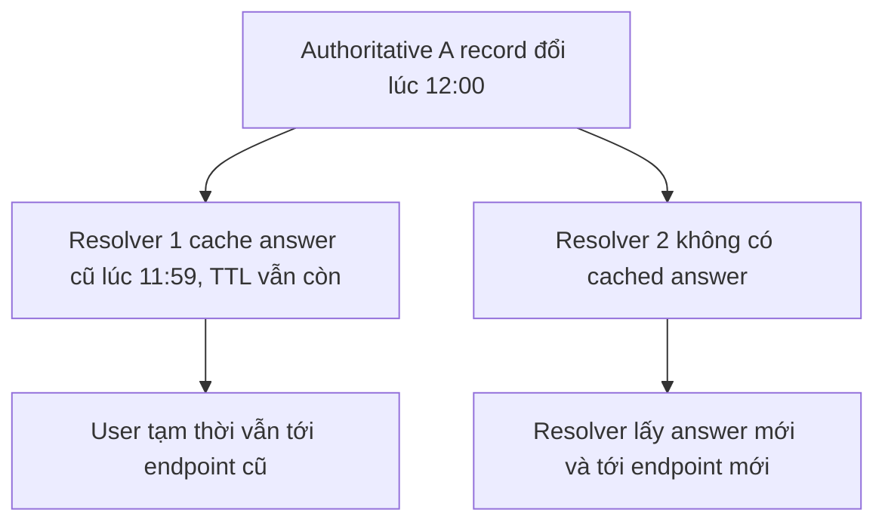
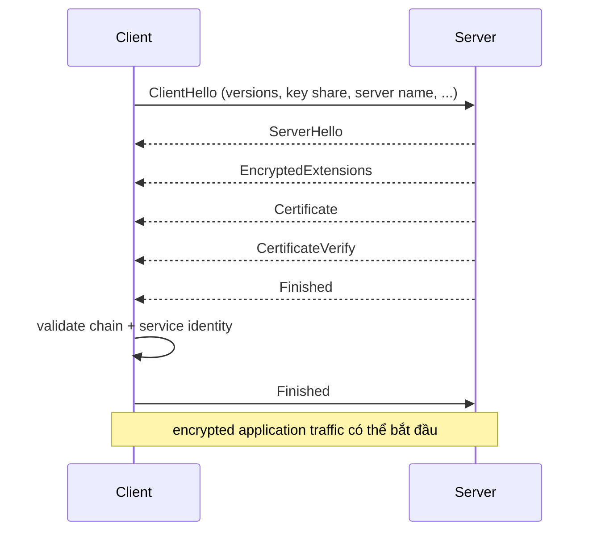

# Phân giải DNS & TLS: Từ Hostname tới HTTPS được Xác thực

## Tóm tắt

Với một kết nối HTTPS **mới**, hai câu hỏi phải được trả lời trước khi HTTP application data có thể chạy:

1. **Hostname này nên được truy cập ở đâu?** DNS resolution biến tên như `api.example.com` thành thông tin định tuyến, thường là một IP address.
2. **Peer mà tôi vừa tới có thực sự được phép đại diện cho service name đó không?** TLS thiết lập cryptographic key và xác thực service identity mà server trình bày.

Đừng gộp hai câu hỏi thành một. DNS answer có thể đưa bạn tới một address nhưng không chứng minh server ở address đó là `api.example.com` đúng. TLS certificate và service-identity verification tạo một authentication boundary riêng.

Cũng đừng giả định mọi HTTP request đều lặp DNS và TLS. Browser, OS và recursive resolver có cache; HTTP connection có thể reuse; TLS session có thể resume. Bài này giải thích **fresh-setup path** để bạn nhận ra khi stage nào thực sự có mặt hoặc bị bỏ qua.

## Một mental model: định vị trước, xác thực sau

Hostname tham gia cả hai nửa nhưng với mục đích khác nhau:

- DNS dùng nó làm lookup name.
- TLS service-identity verification dùng nó làm **reference identity** mà server phải được phép đại diện.

<TermBox term="Reference identity">
**Reference identity** là service identity mà client chủ định truy cập, thường được suy ra từ hostname trong URI.

**Vì sao quan trọng ở đây:** kết nối tới IP do DNS trả về không thay thế hostname verification. Server có thể reachable ở đúng address nhưng vẫn trình certificate không hợp lệ cho service name mong muốn.
</TermBox>

## DNS resolution thường bắt đầu từ cache

Browser hoặc application thường hỏi local resolver thay vì tự đi qua DNS hierarchy. Cache layer cụ thể khác nhau theo platform, nhưng reasoning ổn định: **dùng cached data còn hợp lệ trước khi làm thêm network work**.

Một cache-miss path mang tính khái niệm trông như sau:

Resolution thật có thể dừng sớm hơn nhiều vì recursive resolver đã cache answer, CNAME target hoặc delegation data. Diagram này là **miss-path mental model**, không phải cam kết rằng lookup nào cũng gửi đủ mọi query trên.

<TermBox term="Recursive resolver">
**Recursive resolver** nhận resolution request từ client và làm phần việc cần thiết để trả answer hoặc error, thường kiểm tra cache trước khi liên hệ DNS server khác.

**Vì sao quan trọng ở đây:** hai user có thể tạm thời nhận answer khác nhau sau DNS change vì resolver của họ cache data ở thời điểm khác nhau.
</TermBox>

### Authoritative data và cached data trả lời hai câu hỏi khác nhau

Khi debug DNS incident, hãy hỏi view nào đang được quan sát:

- **authoritative** server cho biết zone hiện đang publish gì;
- **recursive resolver** có thể hợp lệ trả record cũ đã cache cho tới khi TTL hết;
- browser hoặc OS có thể có local cache trước recursive resolver.

Thấy record mới ở authoritative server không chứng minh mọi client sẽ thấy nó ngay lập tức.

## TTL là cache lifetime, không phải propagation countdown

DNS resource record có **TTL** giới hạn thời gian cached data được reuse. Resolver đã cache một address với 300 giây còn lại có thể tiếp tục trả answer đó cho tới khi remaining TTL hết.

Đó là lý do production cutover cần overlap window. Hạ TTL **trước** planned change có thể giảm thời gian old data mới được cache còn hữu dụng, nhưng hạ TTL đúng lúc cutover không thể quay ngược thời gian để rút ngắn TTL đã nằm trong cache bên ngoài.

Negative result cũng có thể được cache theo DNS rules, nên một hostname vừa tạo đôi lúc vẫn bị một số resolver coi là không tồn tại nếu trước đó chúng đã cache negative answer.

## DNS không xác thực HTTPS server

Giả sử DNS trả `203.0.113.20` cho `api.example.com`. Việc tới được address đó chỉ chứng minh routing hoạt động đủ để contact một thứ gì đó. Nó **không** chứng minh thứ đó được phép phục vụ `api.example.com`.

Phân biệt này rất quan trọng khi:

- migrate CDN hoặc load balancer;
- dùng multi-tenant hosting;
- stale DNS answer còn tồn tại lúc cutover;
- DNS thay đổi ngoài ý muốn hoặc bị tấn công;
- health check theo IP bỏ qua hostname mà user thật sự request.

TLS thêm authentication và encryption boundary.

## TLS 1.3 thiết lập key và xác thực service

TLS 1.3 hiện được đặc tả bởi **RFC 9846**, tài liệu thay thế RFC 8446 nhưng vẫn giữ protocol version TLS 1.3. Một full handshake đơn giản hóa với certificate-based server authentication trông như sau:

Đây cố ý là teaching-level view. TLS 1.3 hỗ trợ resumption và các path khác, còn protocol integration có thể thay đổi transport detail. Reasoning bền vững là:

1. negotiate cryptographic parameter được hỗ trợ;
2. thiết lập shared traffic key;
3. authenticate handshake và credential server trình bày;
4. verify presented service identity khớp service mà client chủ định truy cập;
5. chỉ sau đó mới coi channel là authenticated cho application traffic.

<TermBox term="CertificateVerify">
Trong TLS 1.3 certificate-authenticated handshake, **CertificateVerify** chứng minh endpoint sở hữu private key tương ứng với certificate và bind proof đó vào handshake transcript.

**Vì sao quan trọng ở đây:** chỉ nhận một certificate là chưa đủ. Handshake kiểm chứng possession; client còn phải validate trust và kiểm tra certificate có đại diện đúng service identity mong muốn không.
</TermBox>

## Certificate trust và hostname identity là hai check riêng

Một debugging model hữu ích là tách certificate validation thành ít nhất hai câu hỏi:

- **Có build và validate được trust path chấp nhận được cho certificate đã trình bày không?**
- **Presented identity trong certificate có khớp reference identity mà client chủ định truy cập không?**

RFC 9525 là guidance hiện hành cho service identity trong TLS và thay thế guidance cũ RFC 6125.

Với `https://api.example.com/...`, client thường verify service theo `api.example.com`, không chỉ theo IP mà DNS trả về. Vì vậy test HTTPS endpoint mới chỉ bằng bare IP có thể bỏ sót đúng identity path mà user thật dùng.

### SNI giúp server chọn đúng virtual service

Nhiều server host nhiều DNS name trên cùng một address. TLS ClientHello có thể mang requested server name qua server-name extension, thường gọi là **SNI**. Server dùng thông tin đó để chọn đúng certificate và configuration.

Do đó failure có thể hostname-specific dù IP và port đều healthy:

- load balancer reachable;
- TCP hoặc transport khác đã establish;
- virtual host hoặc certificate sai được chọn;
- TLS identity verification fail trước khi HTTP tới application.

## Fresh connection setup không đồng nghĩa every-request setup

Bài HTTP Request Lifecycle hiện có cố ý tách HTTP semantics khỏi network setup. Giữ boundary đó ở đây.

Request sau có thể:

- reuse cached DNS data;
- reuse HTTP/1.1 hoặc HTTP/2 connection đang mở;
- dùng HTTP/3 connection hiện hữu trên QUIC;
- dùng TLS resumption thay vì full certificate-authenticated handshake.

Vì vậy khi debug latency, đừng tự động quy mọi request thành “DNS + TLS time”. Hãy đo xem fresh lookup hoặc handshake có thực sự xảy ra không.

## Kịch bản production: DNS cutover làm lộ certificate mistake

Một team migrate `api.example.com` từ load balancer cũ sang load balancer mới.

- DNS A record cũ trỏ tới `203.0.113.10`;
- record mới trỏ tới `203.0.113.20`;
- DNS TTL là 300 giây;
- load balancer mới pass health check theo IP;
- certificate của nó hợp lệ cho `new-api.internal.example`, nhưng không hợp lệ cho `api.example.com`;
- một số recursive resolver vẫn cache address cũ trong khi resolver khác đã lấy address mới.

**Hậu quả:** user thấy incident có vẻ intermittent. Client vẫn dùng old cached address thì thành công, còn client tới new address fail trong TLS certificate/service-identity verification trước khi có HTTP response.

**Nguyên nhân cốt lõi:** cutover coi “IP mới healthy” là tương đương “HTTPS service đã sẵn sàng”. Deployment không validate endpoint mới bằng hostname/reference identity thật, và overlap do DNS TTL khiến failure trông không nhất quán giữa user.

**Cách khắc phục chuẩn:** provision và verify certificate hợp lệ cho `api.example.com` trước khi đổi DNS; test endpoint mới bằng hostname thật và SNI/service-identity path; giữ endpoint cũ hợp lệ trong toàn expected DNS cache window; quan sát resolver answer và TLS failure riêng; chỉ retire endpoint cũ sau khi cutover window và traffic evidence cho thấy an toàn.

Durable lesson là DNS migration cũng là một **service-identity migration** khi HTTPS terminate tại endpoint mới.

## Tự kiểm tra

Browser báo certificate-name mismatch cho `https://api.example.com`, nhưng `dig api.example.com` trả IP đúng kỳ vọng và load balancer vẫn accept connection.

Có thể kết luận gì, và nên inspect gì tiếp theo?

Xem reasoning

DNS resolution thành công nghĩa là name lookup tạo được address. Client cũng đã đi đủ sâu vào TLS để evaluate certificate được trình bày. Điều đó không có nghĩa HTTPS identity đúng.

Hãy inspect certificate được chọn cho reference identity `api.example.com`, SNI/virtual-host configuration, certificate chain và validity, cùng việc endpoint đang test có đúng endpoint client thật truy cập không. Đổi DNS TTL không sửa được certificate-name mismatch.

## Checklist review DNS + TLS

- [ ] **Reference hostname:** Hostname chính xác nào từ URL mà client đang cố truy cập?
- [ ] **Cache layer:** Tôi đang nhìn browser/OS cache, recursive resolver cache hay authoritative DNS data?
- [ ] **TTL:** Positive hoặc negative answer cũ có thể vẫn hợp lệ trong cache không?
- [ ] **Record chain:** Nếu có CNAME hoặc indirection khác, đã follow toàn resolution chain chưa?
- [ ] **Address overlap:** Trong cutover, old và new endpoint có cùng được kỳ vọng nhận traffic không?
- [ ] **Transport boundary:** Client đã reach endpoint chưa, hay failure vẫn trước connection setup?
- [ ] **ClientHello / SNI:** Intended server name có được gửi để chọn đúng virtual service và certificate không?
- [ ] **Certificate trust:** Client có validate được presented certificate chain theo trust policy không?
- [ ] **Service identity:** Certificate có hợp lệ cho reference hostname theo TLS service-identity rule hiện hành không?
- [ ] **Fresh versus reused:** Request này có thực sự làm DNS resolution và full TLS handshake, hay reuse cached/established state?
- [ ] **Observability:** Log và metric có phân biệt DNS error, connect failure, TLS alert, certificate failure và HTTP response không?

## Quy tắc cho agent

Khi chẩn đoán “HTTPS down”, không nhảy thẳng vào application. Xác định boundary fail theo thứ tự: cached hoặc fresh DNS resolution, selected address, transport connection, TLS handshake, certificate trust, service-identity match, rồi mới HTTP. Giữ nguyên hostname gốc trong test; bare-IP probe có thể che SNI và certificate-identity failure mà real client gặp.

## Khái niệm liên quan

- **HTTP Request Lifecycle** — bắt đầu trên connection state có thể đã tồn tại; không phải request nào cũng lặp DNS và TLS.
- **CDN Behavior** — DNS, anycast, edge selection và certificate termination có thể chuyển serving endpoint ra xa origin.
- **Cloud Networking** — load balancer, routing và private/public address boundary ảnh hưởng endpoint DNS trả về.
- **Logs, Metrics & Traces** — network setup failure cần stage-specific telemetry thay vì một generic request error.

Tiếp tục với [HTTP Request Lifecycle](/vi/docs/web-platform/http-request-lifecycle) để trace điều gì xảy ra khi authenticated connection state đã sẵn sàng.

## Nguồn

Các primary standard được xác minh ngày **2026-09-10**:

- [RFC 1034 — Domain Names: Concepts and Facilities](https://www.rfc-editor.org/rfc/rfc1034.html)
- [RFC 1035 — Domain Names: Implementation and Specification](https://www.rfc-editor.org/rfc/rfc1035.html)
- [RFC 2308 — Negative Caching of DNS Queries](https://www.rfc-editor.org/rfc/rfc2308.html)
- [RFC 9846 — The Transport Layer Security (TLS) Protocol Version 1.3](https://www.rfc-editor.org/rfc/rfc9846.html)
- [RFC 9525 — Service Identity in TLS](https://www.rfc-editor.org/rfc/rfc9525.html)
- [RFC 6066 — TLS Extensions: Server Name Indication](https://www.rfc-editor.org/rfc/rfc6066.html)

Bài này được phân loại **evolving** với chu kỳ review 180 ngày. DNS architecture khá bền vững, nhưng TLS standard, browser behavior, certificate policy, resolver behavior và deployment practice vẫn tiếp tục thay đổi; freshness của source vì vậy rất quan trọng.
