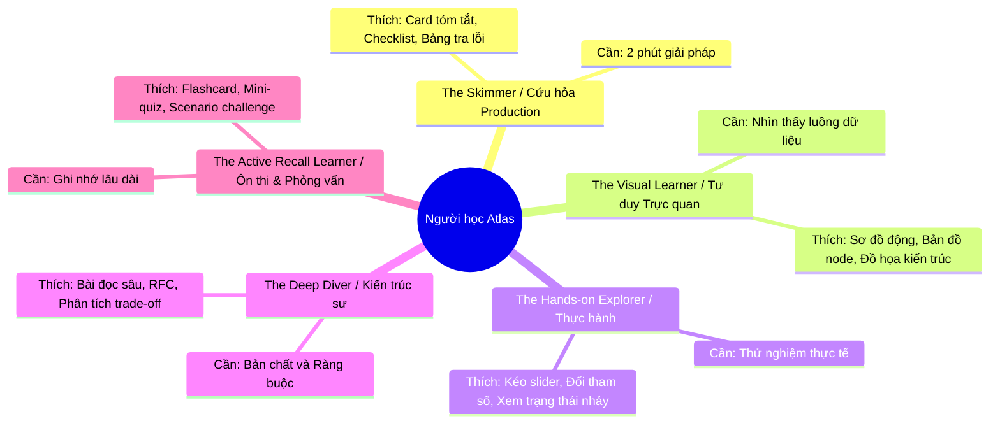
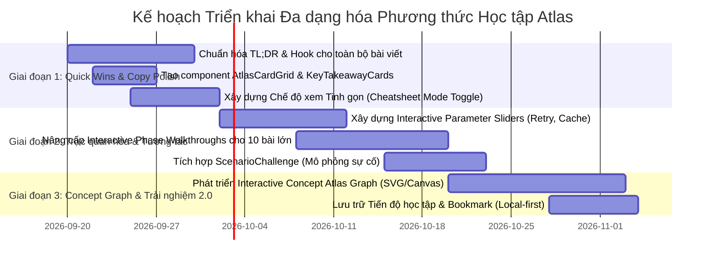

# Báo Cáo Đánh Giá Khả Năng Tiếp Cận, Độ Tương Tác & Đề Xuất Đa Dạng Hóa Phương Thức Học Tập (Software Development Atlas)

> **Tài liệu chiến lược & Quy chuẩn thực thi**  
> **Áp dụng cho:** Toàn bộ hệ thống bài học (EN / VI) và Nền tảng học tập `software-development-atlas`  
> **Mục tiêu:** Nâng cao khả năng tiếp cận nhận thức (Cognitive Accessibility), tối ưu hóa trải nghiệm học tập đa phong cách (Multi-modal Learning), và gia tăng tỷ lệ hoàn thành/ghi nhớ kiến thức (Retention & Engagement).

---

## MỤC LỤC

1. [Đánh giá Hiện trạng (Audit Khả năng tiếp cận & Độ tương tác)](#1-đánh-giá-hiện-trạng-audit-khả-năng-tiếp-cận--độ-tương-tác)
   - 1.1. Khả năng tiếp cận Kỹ thuật (Technical Accessibility - a11y)
   - 1.2. Khả năng tiếp cận Nhận thức (Cognitive Accessibility & Readability)
   - 1.3. Độ tương tác và Điểm nghẽn Trải nghiệm Học tập (Engagement & Retention Bottlenecks)
2. [Chiến lược Nâng cấp Câu chữ & Nội dung (Copywriting & Clarity Audit)](#2-chiến-lược-nâng-cấp-câu-chữ--nội-dung-copywriting--clarity-audit)
   - 2.1. Nhận diện các điểm nghẽn hành văn hiện tại
   - 2.2. Khung quy chuẩn biên soạn "Atlas Clarity 2.0"
   - 2.3. Bảng đối chiếu Before vs After thực tế trên 4 nhóm chủ đề trọng điểm
3. [Đề xuất Tính năng Mới: Đa Dạng Hóa Cách Học (Multi-Modal Learning Engine)](#3-đề-xuất-tính-năng-mới-đa-dạng-hóa-cách-học-multi-modal-learning-engine)
   - 3.1. Phân tích 5 Chân dung Người học (Learner Personas)
   - 3.2. Tính năng 1: Thanh chuyển đổi Chế độ Học (Learning View Switcher)
   - 3.3. Tính năng 2: Bản đồ Tri thức Tương tác (Interactive Concept Atlas Graph)
   - 3.4. Tính năng 3: Bộ thẻ Tri thức Tinh gọn (Bite-Sized Glanceable Cards)
   - 3.5. Tính năng 4: Thanh trượt Tham số & Mô phỏng Trực quan (Parameter Sliders & Visualizers)
   - 3.6. Tính năng 5: Thử thách Giải cứu Sự cố Thực tế (Production Scenario Simulator)
   - 3.7. Tính năng 6: Tiến độ Học tập Cá nhân hóa Không tốn phí (Zero-Cost Local Progress)
4. [Lộ trình Triển khai (Implementation Roadmap)](#4-lộ-trình-triển-khai-implementation-roadmap)

---

## 1. ĐÁNH GIÁ HIỆN TRẠNG (AUDIT KHẢ NĂNG TIẾP CẬN & ĐỘ TƯƠNG TÁC)

### 1.1. Khả năng tiếp cận Kỹ thuật (Technical Accessibility - a11y)
- **Điểm mạnh:**
  - Nền tảng xây dựng trên **Fumadocs**, **Radix UI primitives**, và **Tailwind CSS** cung cấp cấu trúc DOM ngữ nghĩa (Semantic HTML: `<main>`, `<article>`, `<nav>`, `<aside>`, `<h1>`-`<h3>`) rất chuẩn chỉ.
  - Hỗ trợ phím tắt điều hướng tốt, trạng thái `:focus-visible` rõ ràng.
  - Tích hợp kiểm thử tự động với `@axe-core/playwright` và Playwright E2E đảm bảo không có vi phạm nghiêm trọng về độ tương phản màu (contrast ratio) ở cả Light Mode và Dark Mode.
  - Các thành phần đồ họa đều có thuộc tính `aria-label`, thẻ `<details>` có `<summary>` chuẩn ngữ nghĩa.
- **Điểm cần cải thiện:**
  - Một số sơ đồ Mermaid phức tạp khi hiển thị trên màn hình điện thoại (< 640px) có chữ bị co nhỏ, người dùng phải zoom trình duyệt thủ công, gây vỡ bố cục đọc.
  - Các biểu đồ và bảng ma trận (Decision Matrix) chưa có cơ chế điều hướng phím tắt riêng biệt cho bảng nhiều cột trên thiết bị di động.

### 1.2. Khả năng tiếp cận Nhận thức (Cognitive Accessibility & Readability)
- **Điểm mạnh:**
  - Kiến thức cực kỳ sâu sắc, chuẩn xác về mặt kỹ thuật, có tính phản biện cao. Tuân thủ nghiêm ngặt nguyên lý kỹ thuật, trích dẫn chuẩn ECMAScript, RFC, kiến trúc phân tán thực tế.
  - Có các thẻ `<TermBox>` để giải nghĩa các thuật ngữ then chốt ngay tại vị trí xuất hiện đầu tiên.
  - Có phần "Sự cố thực tế cần tránh" (Production Micro-scenarios) với cấu trúc *Hậu quả / Nguyên nhân cốt lõi / Cách khắc phục chuẩn* rất thực chiến.
- **Điểm hạn chế (Cognitive Overload):**
  - **Mật độ chữ quá dày (Wall of Text):** Hầu hết các bài viết kéo dài từ 2,500 đến 4,000 từ với phong cách hành văn đậm chất học thuật/nghiên cứu. Người học thiếu những "khoảng nghỉ thị giác" (visual breathing spaces).
  - **Thiếu "Bậc thang tiếp nhận" (Cognitive On-ramp):** Mở đầu bài viết thường đi thẳng vào các mệnh đề định nghĩa trừu tượng thay vì một câu chuyện ẩn dụ thực tế (Real-world Analogy) hoặc một câu hỏi kích thích tư duy (Hook).
  - **Hành văn tiếng Việt ở một số bài bị ảnh hưởng bởi cú pháp tiếng Anh:** Có những câu cấu trúc bị động, ghép nhiều mệnh đề phụ hoặc dịch từ-sang-từ (word-by-word translation) khiến người đọc phải đọc lại 2-3 lần mới hiểu trọn vẹn ý nghĩa.

### 1.3. Độ tương tác và Điểm nghẽn Trải nghiệm Học tập (Engagement & Retention)
- **Hiện trạng:**
  - Kho nội dung hiện có 156 bài (78 cặp EN/VI), nhưng **90% bài viết chỉ có một phương thức học duy nhất: Đọc tuần tự từ trên xuống dưới (Linear Passive Reading)**.
  - Mặc dù dự án đã xây dựng một số phòng thí nghiệm tương tác (Lab) rất ấn tượng như `EventLoopLab`, `PromiseResolutionLab`, `AsyncWaterfallLab`, `HttpRequestPathExplorer`, nhưng số lượng bài có Lab tương tác chỉ chiếm khoảng ~5% tổng số bài.
- **Tác động đến người học:**
  - **Tỷ lệ bỏ dở (Drop-off) cao đối với người bận rộn:** Kỹ sư đi làm thường chỉ có 5-10 phút để tra cứu giải pháp hoặc nắm bắt ý tưởng. Họ dễ nản lòng khi thấy một bài viết dài ngút ngàn.
  - **Học thụ động (Passive Learning):** Đọc chữ mà không có hành động kiểm chứng khiến hiệu suất ghi nhớ (Retention rate) sau 24h giảm xuống dưới 20% (theo mô hình Ebbinghaus Forgetting Curve).
  - **Thiếu phản hồi tức thì (Formative Feedback):** Người học không biết mình đã thực sự hiểu đúng bản chất hay chưa trước khi rời trang.

---

## 2. CHIẾN LƯỢC NÂNG CẤP CÂU CHỮ & NỘI DUNG (COPYWRITING & CLARITY AUDIT)

### 2.1. Nhận diện các điểm nghẽn hành văn hiện tại
1. **Câu mở đầu thiếu sức hút (Weak Hooks):**
   - *Hiện tại:* Bắt đầu bằng những định nghĩa khô khan: *"Một Promise đại diện cho một kết quả trong tương lai..."*, *"Timeout không chứng minh operation ở remote đã thất bại..."*.
   - *Hạn chế:* Không tạo được sự liên kết cảm xúc hoặc nhấn mạnh "nỗi đau" (pain point) của lập trình viên khi gặp bug production.
2. **Dịch thuật ngữ bị "sượng" hoặc lạm dụng cấu trúc câu tiếng Anh:**
   - Cụm từ như *"một retry policy an toàn cần nhiều hơn 'thử lại'"* (Safe retry policy needs more than try again) hay *"chỉ retry failure mà attempt mới có khả năng cải thiện"* nghe không tự nhiên trong văn phong kỹ thuật Việt Nam.
3. **Thiếu các quy tắc ghi nhớ nhanh (Rule of Thumb Callouts):**
   - Các kết luận then chốt bị chìm trong các đoạn văn dài, người học lướt qua rất dễ bỏ sót.

---

### 2.2. Khung quy chuẩn biên soạn "Atlas Clarity 2.0"

Để tối ưu hóa độ truyền đạt, toàn bộ nội dung bài học nên được chuẩn hóa theo công thức **3-30-300 Rule**:
- **3 Giây đầu tiên:** Bắt mắt với 1 câu Hook thực chiến và 1 thẻ tóm tắt đồ họa trực quan (Visual Anchor).
- **30 Giây tiếp theo:** Nắm trọn 3 quy tắc vàng trong mục **Tóm tắt siêu tốc (Executive Summary)** với quy tắc bôi đậm chọn lọc (Selective Bolding).
- **300 Giây (hoặc đọc sâu):** Đi vào phân tích sâu, mã nguồn chi tiết, sự cố production và bài tập phản biện.

#### Quy tắc viết TL;DR chuẩn 2.0:
```markdown
## Tóm tắt nhanh: Tư duy đúng trong 30 giây

> 💡 **Quy tắc bỏ túi (Rule of Thumb):** [Một câu châm ngôn kỹ thuật ngắn gọn, đắt giá].

1. **[Mô hình trực quan]**: [Giải thích bản chất bằng 1 câu văn chủ động, dùng ẩn dụ đời thực nếu cần].
2. **[Sai lầm chết người]**: [Chỉ ra giả định sai lầm phổ biến nhất mà các dev thường mắc phải].
3. **[Hành động chuẩn mực]**: [Quy tắc thực thi cốt lõi để ngăn ngừa sự cố].
```

---

### 2.3. Bảng đối chiếu Before vs After thực tế trên 4 nhóm chủ đề trọng điểm

#### Chủ đề 1: Distributed Systems (`timeouts-retries-and-backoff.vi.mdx`)

| Yếu tố | Nội dung hiện tại (Before) | Đề xuất tối ưu (After - Sắc sảo, thực chiến) |
| :--- | :--- | :--- |
| **Mở đầu TL;DR** | *Timeout không chứng minh operation ở remote đã thất bại. Nó chỉ cho biết phía gọi đã ngừng chờ. Downstream có thể đã fail, vẫn đang chạy, hoặc đã commit side effect nhưng response bị mất.* | *Tưởng tượng bạn quẹt thẻ tại quầy, máy POS báo "Hết giờ chờ" (Timeout). Liệu bạn có dám bấm quẹt thẻ lần thứ hai ngay lập tức? **Timeout không đồng nghĩa với thất bại; nó chỉ có nghĩa là bạn đã hết kiên nhẫn.** Ở đầu bên kia, tiền có thể đã bị trừ.* |
| **Quy tắc Retry** | *Vì vậy một retry policy an toàn cần nhiều hơn “thử lại”: mang theo deadline hoặc budget end-to-end, không cấp lại full timeout độc lập ở mỗi hop; chỉ retry failure mà attempt mới có khả năng cải thiện...* | *Một chính sách Retry an toàn không đơn giản là "gọi lại":<br>1. **Deadline kế thừa:** Càng qua nhiều trạm trung gian, thời gian chờ càng phải ngắn lại (không cấp mới timeout từ đầu).<br>2. **Chỉ thử lại lỗi tạm thời:** Lỗi sai mật khẩu (401) hoặc sai dữ liệu (400) vĩnh viễn không bao giờ thành công dù bạn retry một triệu lần.<br>3. **Bảo vệ bằng Idempotency:** Chỉ retry khi chắc chắn rằng thao tác lặp lại không làm khách hàng bị trừ tiền 2 lần.* |
| **Văn phong giải thích** | *Biết timeout của bạn thực sự bao phủ gì... Setting tên `timeout` không luôn bao phủ toàn remote interaction.* | *Đừng để cái tên `timeout` đánh lừa bạn: Thư viện HTTP của bạn đang đếm giờ cho chặng kết nối TCP, quá trình bắt tay TLS, thời gian gửi Header, hay toàn bộ quá trình đọc Body?* |

---

#### Chủ đề 2: Async Programming (`promises.vi.mdx`)

| Yếu tố | Nội dung hiện tại (Before) | Đề xuất tối ưu (After - Gãy gọn, trực quan) |
| :--- | :--- | :--- |
| **Mở đầu TL;DR** | *Một Promise mô hình hóa một kết quả trong tương lai, không phải một tác vụ đang chạy. Promise là một giá trị đại diện (placeholder) cho kết quả của một phép tính không đồng bộ.* | *Promise không phải là việc đang chạy dưới nền — **Promise là chiếc vé hẹn lấy kết quả**. Cầm chiếc vé trong tay không có nghĩa là bánh mì trong lò đã nướng xong, và hủy vé hẹn cũng không làm lò nướng dừng hoạt động.* |
| **Phân biệt Resolved vs Fulfilled** | *`resolved` không đồng nghĩa với `fulfilled`. Một Promise đã "resolved" có thể vẫn đang ở trạng thái `pending` nếu nó đang "nhận nuôi" (adopt) số phận của một Promise con chưa hoàn tất.* | *`Resolved` chỉ có nghĩa là: **Số phận của Promise đã được an bài**. Nếu nó nhận nuôi một Promise khác đang chạy 10 giây, thì dù đã resolved, nó vẫn sẽ tiếp tục ở trạng thái `pending` đúng 10 giây đó.* |
| **Cảnh báo Lỗi nuốt (Swallowed Error)** | *Hàm `.catch()` mặc định là một trạm khôi phục (recovery). Nếu bạn không chủ động `throw` lỗi trong `.catch()`, Promise downstream tiếp theo sẽ chuyển thành fulfilled với giá trị `undefined`...* | *🚨 **Cạm bẫy chết người:** `.catch()` được thiết kế để "chữa cháy", không chỉ để ghi log! Nếu bạn bắt lỗi bằng `.catch()` rồi để trống, JavaScript sẽ coi như sự cố đã được khắc phục hoàn toàn và tiếp tục chuyển sang `.then()` phía sau với giá trị `undefined` — đây là nguyên nhân khiến hệ thống xuất kho đơn hàng dù thẻ thanh toán bị từ chối.* |

---

#### Chủ đề 3: Data Systems (`database-replication.vi.mdx`)

| Yếu tố | Nội dung hiện tại (Before) | Đề xuất tối ưu (After - Dễ hiểu, chuẩn xác) |
| :--- | :--- | :--- |
| **Khái niệm Replica Lag** | *Replication bất đồng bộ không cam kết node phụ có cùng trạng thái tại cùng thời điểm. Đọc sau khi ghi có thể thấy trạng thái cũ nếu query trúng replica đang bị lag.* | *Vừa đổi ảnh đại diện, bấm F5 lại thấy ảnh cũ? Đó chính là **Replica Lag**. Khi ghi dữ liệu vào Node Chính (Primary) thành công, phải mất vài trăm mili-giây dữ liệu mới đồng bộ sang Node Phụ (Replica). Nếu bạn đọc ngay từ Replica, bạn đang nhìn vào quá khứ.* |
| **Giải pháp Read-after-write** | *Áp dụng read-after-write routing bằng cách chuyển request của chính user vừa ghi về primary trong một khoảng thời gian.* | *Chiến lược cứu cánh: **Người vừa sửa thì đọc từ Primary, người khác thì đọc từ Replica**. Chỉ cần ghim luồng đọc của chính người dùng vừa thực hiện thao tác ghi vào Node Chính trong vòng 2-5 giây, bạn vừa tránh được bug giao diện vừa tận dụng được sức mạnh chia tải của Replica.* |

---

#### Chủ đề 4: Software Architecture (`microservices.vi.mdx` & `monolith-vs-modular-monolith-vs-microservices.vi.mdx`)

| Yếu tố | Nội dung hiện tại (Before) | Đề xuất tối ưu (After - Sâu sắc, tư duy thực tế) |
| :--- | :--- | :--- |
| **Định nghĩa Microservices** | *Một microservice là ranh giới dịch vụ có thể triển khai độc lập, sở hữu một năng lực nghiệp vụ gắn kết, hợp đồng công khai, hành vi production và dữ liệu domain của nó. Chỉ tách folder hay container là chưa đủ.* | *Đừng gọi hệ thống của bạn là Microservices chỉ vì bạn chia nhỏ code thành 10 container Docker! **Thước đo duy nhất của Microservice là: Bạn có thể deploy Service A lên production vào lúc 2 giờ chiều thứ Ba mà không cần báo trước hay phối hợp với đội làm Service B không?** Nếu không, bạn chỉ đang vận hành một "Monolith phân tán" với chi phí đắt đỏ gấp 5 lần.* |
| **Bàn về Database chung** | *Database dùng chung trở thành hidden coupling khi nhiều service tự do update cùng table.* | *Hai service cắm chung vào một database cũng giống như hai gia đình chung chìa khóa phòng khách. Chỉ cần một team đổi tên cột hoặc khóa dòng dữ liệu, toàn bộ các service khác sẽ ngã nhào mà không có bất kỳ thông báo lỗi biên dịch nào.* |

---

## 3. ĐỀ XUẤT TÍNH NĂNG MỚI: ĐA DẠNG HÓA CÁCH HỌC (MULTI-MODAL LEARNING ENGINE)

Dựa trên các nghiên cứu về Phương pháp luận Giáo dục Kỹ thuật hiện đại và tiêu chuẩn từ các nền tảng công nghệ hàng đầu thế giới (Stripe Docs, Cloudflare Learning, ByteByteGo, Brilliant, Execute Program, Roadmap.sh), Software Development Atlas có thể bổ sung các tính năng đột phá sau:

### 3.1. Phân tích 5 Chân dung Người học (Learner Personas)



---

### 3.2. Tính năng 1: Thanh chuyển đổi Chế độ Học (Learning View Switcher)

Ngay phía trên tiêu đề bài viết (dưới breadcrumb), bổ sung một thanh điều khiển chế độ đọc với 4 tab:

```text
[ 📖 Đọc Sâu (Mặc định) ]   [ ⚡ Tóm Tắt Nhanh (Cheatsheet) ]   [ 🖼️ Trực Quan (Visual Flow) ]   [ 🃏 Thẻ Ôn Tập (Quiz/Flashcards) ]
```

- **Chế độ 1: 📖 Đọc Sâu (Full Deep Dive):**
  - Giữ nguyên toàn bộ bài viết chi tiết, giải thích học thuật, đào sâu spec hiện tại.
- **Chế độ 2: ⚡ Tóm Tắt Nhanh (Glanceable Cheatsheet):**
  - Tự động ẩn toàn bộ các đoạn văn giải thích dài dòng.
  - Chỉ giữ lại:
    - 1 Khối TL;DR Rule of Thumb.
    - Bảng ma trận so sánh (Decision/Comparison Table).
    - Code Snippet mẫu chuẩn (Good vs Bad Pattern).
    - Checklist rà soát lỗi production.
  - *Thời gian đọc giảm từ 15 phút xuống còn 90 giây!*
- **Chế độ 3: 🖼️ Trực Quan (Visual Flow & Story Mode):**
  - Chuyển giao diện thành dạng **Interactive Story Canvas** hoặc **Slide trình chiếu kỹ thuật**:
  - Người học bấm `[ < Trước ]` và `[ Sau > ]` để đi qua từng bước của sơ đồ kiến trúc (Phase Walkthroughs) kèm 2 dòng chú thích cốt lõi ở dưới.
- **Chế độ 4: 🃏 Thẻ Ôn Tập & Phản Biện (Active Recall):**
  - Chuyển bài học thành 3-5 thẻ câu hỏi tình huống phỏng vấn / production.
  - Cho người học chọn đáp án hoặc bấm "Lật thẻ" (Flip Card) để xem đáp án phân tích.

---

### 3.3. Tính năng 2: Bản đồ Tri thức Tương tác (Interactive Concept Atlas Graph)

Nâng cấp trang `/docs/start-here/software-engineering-map` và header điều hướng:
- **Ý tưởng:** Biến file `content/atlas-map.json` thành một **Knowledge Graph 2D Canvas** tương tác (tương tự đồ thị liên kết trong Obsidian hoặc Stately.ai, nhưng hoàn toàn static/client-side).
- **Trải nghiệm:**
  - Mỗi Concept là một Node tròn với màu sắc đại diện cho Domain (Backend, Data Systems, Frontend, Architecture...).
  - Mũi tên kết nối biểu thị quan hệ: `prerequisites` (tiền đề) và `related` (liên quan).
  - Khi hover vào 1 node: Hiện popup tóm tắt 3 dòng + độ khó + trạng thái (Đã đọc / Chưa đọc).
  - Cho phép lọc theo lộ trình: Bấm chọn "Lộ trình Backend", đồ thị tự động làm nổi bật các node trong đường dẫn và làm mờ các node ngoài luồng.

---

### 3.4. Tính năng 3: Bộ thẻ Tri thức Tinh gọn (Bite-Sized Glanceable Cards)

Tạo một component MDX mới: `<AtlasCardGrid>` và `<ConceptCard>`:
- **Đặc tính:**
  - Thiết kế chuẩn tỷ lệ thẻ bài kỹ thuật số, viền phát sáng nhẹ theo Tone:
    - `tone="accent"`: Kiến thức cốt lõi.
    - `tone="danger"`: Anti-pattern hoặc Bug chết người.
    - `tone="success"`: Mẫu thiết kế chuẩn mực (Best Practice).
  - Tích hợp nút **"Sao chép dạng ảnh / Markdown"** để kỹ sư có thể share nhanh vào Slack của công ty hoặc ôn tập trên mobile.

```tsx
<AtlasCardGrid columns={2}>
  <ConceptCard 
    tone="danger"
    title="Lỗi nuốt ngoại lệ (.catch() câm lặng)"
    badge="Cực kỳ nguy hiểm"
  >
    Chỉ log lỗi trong `.catch()` mà không `throw` sẽ biến Promise thành Fulfilled, khiến các bước xử lý thanh toán/giao hàng phía sau vẫn chạy bình thường.
  </ConceptCard>

  <ConceptCard 
    tone="success"
    title="Rethrow hoặc Trả về Giá trị Phục hồi"
    badge="Chuẩn Production"
  >
    Luôn chủ động `throw err` nếu chỉ muốn log, hoặc trả về một giá trị fallback an toàn (ví dụ: giỏ hàng rỗng, cài đặt mặc định).
  </ConceptCard>
</AtlasCardGrid>
```

---

### 3.5. Tính năng 4: Thanh trượt Tham số & Mô phỏng Trực quan (Parameter Sliders & Visualizers)

Học thông qua việc "thay đổi đầu vào để quan sát hậu quả" (Cause-and-Effect Discovery):
- **Ví dụ 1: Mô phỏng Bão Thử Lại (Retry Storm Simulator):**
  - Kéo thanh trượt `Hệ số Server Down` từ 0% lên 50%.
  - Kéo thanh trượt `Số lần Retry` từ 1 lên 5.
  - Bật/Tắt công tắc `Jitter (Độ trễ ngẫu nhiên)`.
  - Kết quả: Biểu đồ cột SVG hiển thị trực tiếp số lượng request dồn dập đè bẹp server (Spike), giúp người học hiểu ngay lập tức tại sao cần Exponential Backoff kèm Full Jitter mà không cần đọc 5 trang lý thuyết.
- **Ví dụ 2: Mô phỏng Bộ nhớ Đệm (Cache Stampede Simulator):**
  - Kéo thời gian hết hạn TTL về 0 -> Xem hàng ngàn request cùng lúc xuyên thủng cache đâm thẳng vào Database (Cache Breakdown).

---

### 3.6. Tính năng 5: Thử thách Giải cứu Sự cố Thực tế (Production Scenario Simulator)

Thay thế các khối `<details>` bị động bằng một Widget tương tác: `<ScenarioChallenge>`:
- Đưa ra một đồ thị sự cố thật (ví dụ: Biểu đồ CPU Database tăng vọt 100% sau khi deploy).
- Đưa ra 3 phương án hành động của một On-call Engineer:
  - *Phương án A:* Khởi động lại toàn bộ các cụm Web Pods.
  - *Phương án B:* Kích hoạt Circuit Breaker cho tính năng gợi ý sản phẩm và hạ bậc tính năng (graceful degradation).
  - *Phương án C:* Tăng số lượng kết nối Database Connection Pool lên gấp đôi.
- Khi người học bấm chọn, giao diện hiển thị ngay kết quả:
  - Nếu chọn A: Báo động đỏ — *"Thảm họa! Toàn bộ Pod khởi động lại cùng lúc tạo ra cơn bão kết nối (Thundering Herd) khiến DB sập hoàn toàn."*
  - Nếu chọn B: Báo xanh thành công kèm phân tích lý do kỹ thuật chi tiết.

---

### 3.7. Tính năng 6: Tiến độ Học tập Cá nhân hóa Không tốn phí (Zero-Cost Local Progress)

Tuân thủ nghiêm ngặt **Quy tắc Hard Constraint số 1 (Zero-cost core: không cần backend server hay database trả phí)**:
- Sử dụng `localStorage` trên trình duyệt của người học:
  - Tự động lưu tiến độ: Đánh dấu tick xanh `[x] Đã hoàn thành` khi người học cuộn đến cuối bài hoặc hoàn thành bài quiz.
  - Hiển thị thanh tiến độ `%` trên từng Learning Path (ví dụ: *Backend Systems: Hoàn thành 4/12 bài*).
  - Chức năng "Đánh dấu bài học cần xem lại" (Bookmark / Revision Queue).

---

## 4. LỘ TRÌNH TRIỂN KHAI (IMPLEMENTATION ROADMAP)



### Các bước hành động cụ thể có thể bắt đầu ngay:
1. **Bước 1 (Content):** Áp dụng bộ quy chuẩn câu chữ ở Mục 2 để tinh chỉnh lại các bài học cốt lõi (bắt đầu từ cụm *Distributed Systems*, *Data Systems*, và *Async Programming*).
2. **Bước 2 (UI Component):** Tạo component `<LearningModeSwitcher />` trong `components/docs/` hỗ trợ lọc hiển thị MDX theo chế độ Đọc sâu vs Cheatsheet.
3. **Bước 3 (Visual Primitives):** Tạo `<AtlasCardGrid />` và mở rộng các Interactive Phase Walkthroughs để tăng mật độ visual anchor có ý nghĩa.
