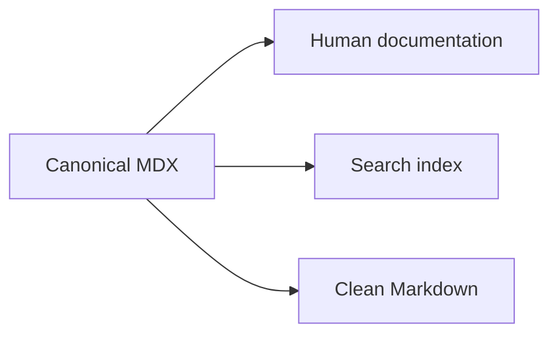

# Phase 0.1 Documentation Shell Implementation Plan

> **For agentic workers:** REQUIRED SUB-SKILL: Use superpowers:subagent-driven-development (recommended) or superpowers:executing-plans to implement this plan task-by-task. Steps use checkbox (`- [ ]`) syntax for tracking.

**Goal:** Build the smallest production-quality Software Development Atlas site that can render validated MDX lessons with modern documentation navigation, static/local search, Mermaid diagrams, raw Markdown output, GitHub editing, accessibility checks, and zero paid runtime infrastructure.

**Architecture:** Use a root-level Next.js 16 App Router application with React 19, TypeScript, Tailwind CSS 4, and Fumadocs Core/UI/MDX. Canonical lesson content stays under `content/docs` and is compiled/validated at build time; ordinary lesson rendering never queries a database. The shell is server-first, while search and Mermaid rendering are isolated client-side features and no project-owned AI/model API is used.

**Tech Stack:** Node.js 22, pnpm, Next.js 16, React 19, TypeScript, Tailwind CSS 4, Fumadocs Core/UI/MDX, Zod, Mermaid, Vitest, Playwright, axe-core, GitHub Actions.

**Spec:**
- `docs/superpowers/specs/2026-08-19-atlas-foundation-design.md`
- `docs/superpowers/specs/2026-08-19-content-scale-addendum.md`

## Global Constraints

- Use Next.js major version 16 and the App Router.
- Use React major version 19.
- Use Tailwind CSS major version 4.
- Use Fumadocs Core/UI/MDX as the documentation architecture layer.
- Use `pnpm`; commit `pnpm-lock.yaml`.
- Use Node.js 22 for local development and CI.
- Keep application folders at repository root (`app`, `components`, `lib`, `content`); do not introduce a `src` directory.
- Git-tracked MDX under `content/docs` is canonical lesson content.
- No runtime database, hosted vector database, paid search service, paid CMS, project-owned model API, or other billable API may be required by this phase.
- Search must be generated from canonical content and run from statically generated/local indexes.
- Generated `.source` content is disposable build output and must be gitignored.
- Use Server Components by default. Client Components are allowed only for browser-only interactions such as search and Mermaid rendering.
- Do not add Sandpack or WebContainers in Phase 0.1; they belong to later lesson-driven work.
- Do not add authentication, user state, analytics requiring a paid service, or a database.
- Every normal lesson must render without JavaScript-dependent teaching content; essential explanations remain textual MDX.
- The root route `/` redirects to `/docs` for Phase 0.1. A custom marketing/landing page is outside this plan.
- GitHub edit links target `thucne/software-development-atlas` on `main`.
- Canonical lesson schema must include the foundation fields: `title`, `description`, `category`, `level`, `status`, `lastVerified`, `reviewAfterDays`, `topics`, `prerequisites`, `related`, and `technologies`.
- Freshness enum values are exactly `evergreen | evolving | frontier`; level enum values are exactly `beginner | intermediate | advanced`.
- Phase 0.1 includes raw Markdown for individual documentation pages, but defers aggregate `llms.txt` and generated agent-skill bundles to later roadmap phases.

---

## File Structure Locked by This Plan

```text
.github/
  workflows/
    ci.yml
app/
  api/search/route.ts
  docs/[[...slug]]/page.tsx
  docs/layout.tsx
  llms.mdx/docs/[[...slug]]/route.ts
  globals.css
  layout.tsx
  page.tsx
components/
  mdx/
    mermaid.tsx
  mdx.tsx
  search-dialog.tsx
content/
  docs/
    index.mdx
    meta.json
    start-here/
      meta.json
      how-to-use-the-atlas.mdx
      freshness.mdx
lib/
  content/schema.ts
  get-llm-text.ts
  layout.shared.tsx
  source.ts
public/
tests/
  content-schema.test.ts
  e2e/docs-shell.spec.ts
.nvmrc
eslint.config.mjs
next.config.mjs
package.json
playwright.config.ts
postcss.config.mjs
source.config.ts
tsconfig.json
vitest.config.ts
```

Responsibilities:

- `lib/content/schema.ts`: one source of truth for typed Atlas lesson frontmatter.
- `source.config.ts`: Fumadocs MDX collection and post-processing configuration.
- `lib/source.ts`: Fumadocs loader used by routes, navigation, and search.
- `components/mdx.tsx`: global MDX component registry.
- `components/mdx/mermaid.tsx`: isolated browser Mermaid renderer.
- `components/search-dialog.tsx`: Fumadocs search UI backed by a static local index.
- `app/docs/*`: documentation layout and lesson rendering.
- `app/llms.mdx/docs/*`: statically cached Markdown representation of each docs page.
- `tests/content-schema.test.ts`: schema behavior tests independent of Next.js rendering.
- `tests/e2e/docs-shell.spec.ts`: browser checks for navigation, search, page actions, Markdown route, theme-independent accessibility basics, and Mermaid rendering.

---

### Task 1: Scaffold the Next.js 16 application without disturbing foundation documents

**Files:**
- Create: `.nvmrc`
- Create: `package.json`
- Create: `pnpm-lock.yaml` via `pnpm install`
- Create: `tsconfig.json`
- Create: `next-env.d.ts` via Next.js on first typecheck/dev run if not generated during install
- Create: `eslint.config.mjs`
- Create: `postcss.config.mjs`
- Create: `next.config.mjs`
- Create: `app/globals.css`
- Create: `app/layout.tsx`
- Create: `app/page.tsx`
- Modify: `.gitignore` if it exists; otherwise create it

**Interfaces:**
- Consumes: existing repository-level foundation docs and `AGENTS.md`; none are moved or overwritten.
- Produces: a bootable Next.js App Router shell, package scripts used by every later task, and stable `@/*` TypeScript imports.

- [ ] **Step 1: Create the Node version marker**

Create `.nvmrc`:

```text
22
```

- [ ] **Step 2: Create `package.json` with the application and quality scripts**

```json
{
  "name": "software-development-atlas",
  "version": "0.1.0",
  "private": true,
  "engines": {
    "node": ">=22 <23"
  },
  "scripts": {
    "dev": "next dev",
    "build": "next build",
    "start": "next start",
    "lint": "eslint .",
    "typecheck": "tsc --noEmit",
    "test": "vitest run",
    "test:watch": "vitest",
    "test:e2e": "playwright test",
    "postinstall": "fumadocs-mdx"
  }
}
```

- [ ] **Step 3: Install runtime dependencies**

Run:

```bash
pnpm add next@^16 react@^19 react-dom@^19 fumadocs-core fumadocs-ui fumadocs-mdx zod mermaid next-themes
```

Expected: `package.json` gains dependency versions and `pnpm-lock.yaml` is created.

- [ ] **Step 4: Install development dependencies**

Run:

```bash
pnpm add -D typescript @types/node @types/react @types/react-dom @types/mdx eslint eslint-config-next tailwindcss@^4 @tailwindcss/postcss vitest @playwright/test @axe-core/playwright
```

Expected: all development dependencies are lockfile-pinned.

- [ ] **Step 5: Configure TypeScript**

Create `tsconfig.json`:

```json
{
  "compilerOptions": {
    "target": "ES2017",
    "lib": ["dom", "dom.iterable", "esnext"],
    "allowJs": false,
    "skipLibCheck": true,
    "strict": true,
    "noEmit": true,
    "esModuleInterop": true,
    "module": "esnext",
    "moduleResolution": "bundler",
    "resolveJsonModule": true,
    "isolatedModules": true,
    "jsx": "preserve",
    "incremental": true,
    "plugins": [{ "name": "next" }],
    "paths": {
      "@/*": ["./*"]
    }
  },
  "include": ["next-env.d.ts", "**/*.ts", "**/*.tsx", ".next/types/**/*.ts", ".source/**/*.ts"],
  "exclude": ["node_modules"]
}
```

- [ ] **Step 6: Configure ESLint**

Create `eslint.config.mjs`:

```js
import { defineConfig, globalIgnores } from 'eslint/config';
import nextVitals from 'eslint-config-next/core-web-vitals';
import nextTs from 'eslint-config-next/typescript';

export default defineConfig([
  ...nextVitals,
  ...nextTs,
  globalIgnores(['.next/**', '.source/**', 'node_modules/**']),
]);
```

- [ ] **Step 7: Configure Tailwind CSS 4/PostCSS**

Create `postcss.config.mjs`:

```js
export default {
  plugins: {
    '@tailwindcss/postcss': {},
  },
};
```

Create `app/globals.css`:

```css
@import 'tailwindcss';
@import 'fumadocs-ui/css/neutral.css';
@import 'fumadocs-ui/css/preset.css';

:root {
  font-family: Inter, ui-sans-serif, system-ui, -apple-system, BlinkMacSystemFont, "Segoe UI", sans-serif;
}
```

- [ ] **Step 8: Configure Next.js and Fumadocs MDX loader**

Create `next.config.mjs`:

```js
import { createMDX } from 'fumadocs-mdx/next';

/** @type {import('next').NextConfig} */
const nextConfig = {
  reactStrictMode: true,
  async rewrites() {
    return [
      {
        source: '/docs/:path*.md',
        destination: '/llms.mdx/docs/:path*',
      },
    ];
  },
};

const withMDX = createMDX();

export default withMDX(nextConfig);
```

- [ ] **Step 9: Add the minimal root layout and redirect**

Create `app/layout.tsx` initially as:

```tsx
import './globals.css';
import type { Metadata } from 'next';
import type { ReactNode } from 'react';

export const metadata: Metadata = {
  title: {
    default: 'Software Development Atlas',
    template: '%s | Software Development Atlas',
  },
  description: 'A living, open-source knowledge system for software engineering.',
};

export default function RootLayout({ children }: { children: ReactNode }) {
  return (
    <html lang="en" suppressHydrationWarning>
      <body className="flex min-h-screen flex-col">{children}</body>
    </html>
  );
}
```

Create `app/page.tsx`:

```tsx
import { redirect } from 'next/navigation';

export default function HomePage() {
  redirect('/docs');
}
```

- [ ] **Step 10: Update `.gitignore` with generated application outputs**

Ensure these lines are present:

```text
node_modules/
.next/
.source/
out/
playwright-report/
test-results/
*.tsbuildinfo
.env*
!.env.example
```

- [ ] **Step 11: Verify the bare scaffold**

Run:

```bash
pnpm lint
pnpm typecheck
```

Expected: both commands exit 0. `next-env.d.ts` may be generated automatically by Next.js tooling and must be committed if generated.

- [ ] **Step 12: Commit**

```bash
git add .nvmrc package.json pnpm-lock.yaml tsconfig.json next-env.d.ts eslint.config.mjs postcss.config.mjs next.config.mjs app/globals.css app/layout.tsx app/page.tsx .gitignore
git commit -m "chore: scaffold Next.js documentation app"
```

---

### Task 2: Define and test the canonical lesson schema and Fumadocs source

**Files:**
- Create: `lib/content/schema.ts`
- Create: `tests/content-schema.test.ts`
- Create: `vitest.config.ts`
- Create: `source.config.ts`
- Create: `lib/source.ts`

**Interfaces:**
- Consumes: Fumadocs/Zod dependencies and the foundation frontmatter contract.
- Produces: `lessonFrontmatterSchema`, generated Fumadocs collections, and exported `source` used by docs routes/search.

- [ ] **Step 1: Write failing schema tests**

Create `tests/content-schema.test.ts`:

```ts
import { describe, expect, it } from 'vitest';
import { lessonFrontmatterSchema } from '@/lib/content/schema';

const validLesson = {
  title: 'How to Use the Atlas',
  description: 'Learn how lessons, freshness, and related concepts fit together.',
  category: 'start-here',
  level: 'beginner',
  status: 'evergreen',
  lastVerified: '2026-08-19',
  reviewAfterDays: 365,
  topics: ['atlas'],
  prerequisites: [],
  related: ['freshness'],
  technologies: [],
};

describe('lessonFrontmatterSchema', () => {
  it('accepts complete Atlas lesson metadata', () => {
    expect(lessonFrontmatterSchema.parse(validLesson)).toMatchObject(validLesson);
  });

  it('rejects an unknown freshness status', () => {
    expect(() =>
      lessonFrontmatterSchema.parse({ ...validLesson, status: 'current' }),
    ).toThrow();
  });

  it('rejects non-ISO date-shaped lastVerified values', () => {
    expect(() =>
      lessonFrontmatterSchema.parse({ ...validLesson, lastVerified: '19/08/2026' }),
    ).toThrow();
  });

  it('rejects non-positive review periods', () => {
    expect(() =>
      lessonFrontmatterSchema.parse({ ...validLesson, reviewAfterDays: 0 }),
    ).toThrow();
  });
});
```

- [ ] **Step 2: Configure Vitest path resolution**

Create `vitest.config.ts`:

```ts
import { defineConfig } from 'vitest/config';
import path from 'node:path';

export default defineConfig({
  test: {
    environment: 'node',
  },
  resolve: {
    alias: {
      '@': path.resolve(__dirname, '.'),
    },
  },
});
```

- [ ] **Step 3: Run the test to verify it fails**

Run:

```bash
pnpm test -- tests/content-schema.test.ts
```

Expected: FAIL because `@/lib/content/schema` does not exist.

- [ ] **Step 4: Implement the schema**

Create `lib/content/schema.ts`:

```ts
import { pageSchema } from 'fumadocs-core/source/schema';
import { z } from 'zod';

const isoDate = z.string().regex(/^\d{4}-\d{2}-\d{2}$/, 'Expected YYYY-MM-DD');

export const lessonFrontmatterSchema = pageSchema.extend({
  description: z.string().min(1),
  category: z.string().min(1),
  level: z.enum(['beginner', 'intermediate', 'advanced']),
  status: z.enum(['evergreen', 'evolving', 'frontier']),
  lastVerified: isoDate,
  reviewAfterDays: z.number().int().positive(),
  topics: z.array(z.string().min(1)),
  prerequisites: z.array(z.string().min(1)),
  related: z.array(z.string().min(1)),
  technologies: z.array(z.string().min(1)),
});

export type LessonFrontmatter = z.infer<typeof lessonFrontmatterSchema>;
```

- [ ] **Step 5: Run the schema tests again**

Run:

```bash
pnpm test -- tests/content-schema.test.ts
```

Expected: 4 tests pass.

- [ ] **Step 6: Configure Fumadocs collections and processed Markdown**

Create `source.config.ts`:

```ts
import { defineConfig, defineDocs } from 'fumadocs-mdx/config';
import { remarkMdxMermaid } from 'fumadocs-core/mdx-plugins';
import { lessonFrontmatterSchema } from './lib/content/schema';

export const { docs, meta } = defineDocs({
  dir: 'content/docs',
  docs: {
    schema: lessonFrontmatterSchema,
    postprocess: {
      includeProcessedMarkdown: true,
    },
  },
});

export default defineConfig({
  mdxOptions: {
    remarkPlugins: (plugins) => [remarkMdxMermaid, ...plugins],
  },
});
```

- [ ] **Step 7: Create the Fumadocs loader**

Create `lib/source.ts`:

```ts
import { docs, meta } from '@/.source';
import { loader } from 'fumadocs-core/source';
import { createMDXSource } from 'fumadocs-mdx';

export const source = loader({
  baseUrl: '/docs',
  source: createMDXSource(docs, meta),
});
```

- [ ] **Step 8: Generate Fumadocs entries and typecheck**

Run:

```bash
pnpm exec fumadocs-mdx
pnpm typecheck
pnpm test
```

Expected: `.source/` is generated but remains ignored; typecheck and 4 schema tests pass.

- [ ] **Step 9: Commit**

```bash
git add lib/content/schema.ts tests/content-schema.test.ts vitest.config.ts source.config.ts lib/source.ts
git commit -m "feat: define validated lesson content source"
```

---

### Task 3: Build the responsive Fumadocs shell and seed meaningful Start Here content

**Files:**
- Modify: `app/layout.tsx`
- Create: `lib/layout.shared.tsx`
- Create: `components/mdx.tsx`
- Create: `app/docs/layout.tsx`
- Create: `app/docs/[[...slug]]/page.tsx`
- Create: `content/docs/meta.json`
- Create: `content/docs/index.mdx`
- Create: `content/docs/start-here/meta.json`
- Create: `content/docs/start-here/how-to-use-the-atlas.mdx`
- Create: `content/docs/start-here/freshness.mdx`

**Interfaces:**
- Consumes: `source`, generated MDX body/TOC/frontmatter, RootProvider, global Atlas metadata.
- Produces: `/docs`, sidebar/page tree, breadcrumbs, table of contents, previous/next navigation, theme support, code rendering, stable anchors, and GitHub page actions.

- [ ] **Step 1: Register default MDX components**

Create `components/mdx.tsx`:

```tsx
import defaultMdxComponents from 'fumadocs-ui/mdx';
import type { MDXComponents } from 'mdx/types';

export function getMDXComponents(components?: MDXComponents) {
  return {
    ...defaultMdxComponents,
    ...components,
  } satisfies MDXComponents;
}

export const useMDXComponents = getMDXComponents;

declare global {
  type MDXProvidedComponents = ReturnType<typeof getMDXComponents>;
}
```

- [ ] **Step 2: Wrap the app in Fumadocs `RootProvider`**

Replace the body of `app/layout.tsx` with:

```tsx
import './globals.css';
import { RootProvider } from 'fumadocs-ui/provider/next';
import type { Metadata } from 'next';
import type { ReactNode } from 'react';

export const metadata: Metadata = {
  title: {
    default: 'Software Development Atlas',
    template: '%s | Software Development Atlas',
  },
  description: 'A living, open-source knowledge system for software engineering.',
};

export default function RootLayout({ children }: { children: ReactNode }) {
  return (
    <html lang="en" suppressHydrationWarning>
      <body className="flex min-h-screen flex-col">
        <RootProvider>{children}</RootProvider>
      </body>
    </html>
  );
}
```

- [ ] **Step 3: Define shared navigation options**

Create `lib/layout.shared.tsx`:

```tsx
import type { BaseLayoutProps } from 'fumadocs-ui/layouts/shared';

export function baseOptions(): BaseLayoutProps {
  return {
    nav: {
      title: 'Software Development Atlas',
    },
    githubUrl: 'https://github.com/thucne/software-development-atlas',
  };
}
```

- [ ] **Step 4: Create the docs layout**

Create `app/docs/layout.tsx`:

```tsx
import { source } from '@/lib/source';
import { baseOptions } from '@/lib/layout.shared';
import { DocsLayout } from 'fumadocs-ui/layouts/docs';
import type { ReactNode } from 'react';

export default function DocsRootLayout({ children }: { children: ReactNode }) {
  return (
    <DocsLayout tree={source.getPageTree()} {...baseOptions()}>
      {children}
    </DocsLayout>
  );
}
```

- [ ] **Step 5: Create the docs page renderer with Edit on GitHub**

Create `app/docs/[[...slug]]/page.tsx`:

```tsx
import { source } from '@/lib/source';
import {
  DocsBody,
  DocsDescription,
  DocsPage,
  DocsTitle,
  ViewOptionsPopover,
} from 'fumadocs-ui/layouts/docs/page';
import defaultMdxComponents from 'fumadocs-ui/mdx';
import type { Metadata } from 'next';
import { notFound } from 'next/navigation';

export default async function Page(props: {
  params: Promise<{ slug?: string[] }>;
}) {
  const { slug } = await props.params;
  const page = source.getPage(slug);
  if (!page) notFound();

  const MDX = page.data.body;
  const githubUrl = `https://github.com/thucne/software-development-atlas/edit/main/content/docs/${page.path}`;

  return (
    <DocsPage toc={page.data.toc}>
      <DocsTitle>{page.data.title}</DocsTitle>
      <DocsDescription>{page.data.description}</DocsDescription>
      <ViewOptionsPopover githubUrl={githubUrl} />
      <DocsBody>
        <MDX components={{ ...defaultMdxComponents }} />
      </DocsBody>
    </DocsPage>
  );
}

export function generateStaticParams() {
  return source.generateParams();
}

export async function generateMetadata(props: {
  params: Promise<{ slug?: string[] }>;
}): Promise<Metadata> {
  const { slug } = await props.params;
  const page = source.getPage(slug);
  if (!page) notFound();

  return {
    title: page.data.title,
    description: page.data.description,
  };
}
```

- [ ] **Step 6: Seed deterministic page ordering**

Create `content/docs/meta.json`:

```json
{
  "title": "Atlas",
  "pages": ["index", "start-here"]
}
```

Create `content/docs/start-here/meta.json`:

```json
{
  "title": "Start Here",
  "pages": ["how-to-use-the-atlas", "freshness"]
}
```

- [ ] **Step 7: Add the Atlas overview page**

Create `content/docs/index.mdx` with this exact frontmatter and initial body:

```mdx
---
title: Software Development Atlas
description: Learn software engineering from durable fundamentals through modern AI-native development.
category: start-here
level: beginner
status: evergreen
lastVerified: 2026-08-19
reviewAfterDays: 365
topics:
  - atlas
prerequisites: []
related:
  - how-to-use-the-atlas
  - freshness
technologies: []
---

Software Development Atlas is a living, open-source knowledge system for software engineering.

## What makes the Atlas different

The Atlas is designed for both deep learning and fast reference. Lessons emphasize mental models, practical trade-offs, production implications, and primary sources rather than isolated snippets.

## Two audiences, one source of truth

The same Git-tracked lessons should remain useful to humans reading the site and to coding agents consuming clean Markdown representations.

## Where to begin

Start with [How to use the Atlas](/docs/start-here/how-to-use-the-atlas), then read [Content freshness](/docs/start-here/freshness) to understand how evolving guidance is reviewed.
```

- [ ] **Step 8: Add the usage guide**

Create `content/docs/start-here/how-to-use-the-atlas.mdx`:

```mdx
---
title: How to Use the Atlas
description: Learn how to navigate lessons, prerequisites, related concepts, and references.
category: start-here
level: beginner
status: evergreen
lastVerified: 2026-08-19
reviewAfterDays: 365
topics:
  - atlas
  - learning
prerequisites: []
related:
  - freshness
technologies: []
---

## Learn or look something up

Use the sidebar when you want to explore a domain and search when you already know the concept, symptom, API, or technique you need.

## Follow prerequisite links deliberately

Lessons may name prerequisite concepts. You do not need to read every prerequisite first, but follow one when the current explanation assumes a mental model you do not yet have.

## Prefer the production section when referencing

When you already understand a topic, skim the TL;DR, examples, trade-offs, production considerations, and sources rather than rereading every explanation.

## Contribute corrections

Every lesson is stored in GitHub. Use the page action to propose edits when an example, claim, source, or explanation can be improved.
```

- [ ] **Step 9: Add the freshness guide**

Create `content/docs/start-here/freshness.mdx`:

```mdx
---
title: Content Freshness
description: Understand evergreen, evolving, and frontier guidance and what last verified means.
category: start-here
level: beginner
status: evergreen
lastVerified: 2026-08-19
reviewAfterDays: 365
topics:
  - atlas
  - freshness
prerequisites: []
related:
  - how-to-use-the-atlas
technologies: []
---

## Evergreen

Evergreen lessons cover slow-changing fundamentals. Their default review target is 365 days.

## Evolving

Evolving lessons cover frameworks, libraries, databases, infrastructure, and engineering practices that change materially over time. Their default review target is 180 days.

## Frontier

Frontier lessons cover fast-moving AI, coding-agent, model, and protocol workflows. Their default review target is 90 days.

## Last verified is not last edited

`lastVerified` means a contributor intentionally reviewed the lesson for present-day correctness. A typo-only edit does not reset that date.
```

- [ ] **Step 10: Verify navigation, rendering, code highlighting, and metadata**

Run:

```bash
pnpm exec fumadocs-mdx
pnpm typecheck
pnpm build
```

Expected: build exits 0; generated routes include `/`, `/docs`, `/docs/start-here/how-to-use-the-atlas`, and `/docs/start-here/freshness`.

- [ ] **Step 11: Commit**

```bash
git add app/layout.tsx lib/layout.shared.tsx components/mdx.tsx app/docs content/docs
git commit -m "feat: add Fumadocs documentation shell"
```

---

### Task 4: Add zero-cost static search

**Files:**
- Create: `app/api/search/route.ts`
- Create: `components/search-dialog.tsx`
- Modify: `app/layout.tsx`

**Interfaces:**
- Consumes: `source` structured data generated from MDX.
- Produces: statically cached search index endpoint and browser-side search UI; no external search service or database.

- [ ] **Step 1: Add a statically generated search route**

Create `app/api/search/route.ts`:

```ts
import { source } from '@/lib/source';
import { createFromSource } from 'fumadocs-core/search/server';

export const revalidate = false;
export const { staticGET: GET } = createFromSource(source);
```

- [ ] **Step 2: Create the static search dialog**

Create `components/search-dialog.tsx`:

```tsx
'use client';

import { useDocsSearch } from 'fumadocs-core/search/client';
import { staticClient } from 'fumadocs-core/search/client/orama-static';
import {
  SearchDialog,
  SearchDialogClose,
  SearchDialogContent,
  SearchDialogHeader,
  SearchDialogIcon,
  SearchDialogInput,
  SearchDialogList,
  SearchDialogOverlay,
  type SharedProps,
} from 'fumadocs-ui/components/dialog/search';

export default function AtlasSearchDialog(props: SharedProps) {
  const { search, setSearch, query } = useDocsSearch({
    client: staticClient(),
  });

  return (
    <SearchDialog
      search={search}
      onSearchChange={setSearch}
      isLoading={query.isLoading}
      {...props}
    >
      <SearchDialogOverlay />
      <SearchDialogContent>
        <SearchDialogHeader>
          <SearchDialogIcon />
          <SearchDialogInput />
          <SearchDialogClose />
        </SearchDialogHeader>
        <SearchDialogList items={query.data !== 'empty' ? query.data : null} />
      </SearchDialogContent>
    </SearchDialog>
  );
}
```

- [ ] **Step 3: Wire the custom search dialog into `RootProvider`**

Change `app/layout.tsx` so the provider line is:

```tsx
<RootProvider search={{ SearchDialog: AtlasSearchDialog }}>{children}</RootProvider>
```

and add:

```tsx
import AtlasSearchDialog from '@/components/search-dialog';
```

- [ ] **Step 4: Verify search artifacts are buildable without external services**

Run:

```bash
pnpm typecheck
pnpm build
```

Expected: both commands exit 0 and no environment variables/API keys are requested.

- [ ] **Step 5: Commit**

```bash
git add app/api/search/route.ts components/search-dialog.tsx app/layout.tsx
git commit -m "feat: add static documentation search"
```

---

### Task 5: Add Mermaid diagrams and clean Markdown page output

**Files:**
- Create: `components/mdx/mermaid.tsx`
- Modify: `components/mdx.tsx`
- Create: `lib/get-llm-text.ts`
- Create: `app/llms.mdx/docs/[[...slug]]/route.ts`
- Modify: `content/docs/start-here/how-to-use-the-atlas.mdx`

**Interfaces:**
- Consumes: `remarkMdxMermaid` conversion from Task 2 and Fumadocs processed Markdown export.
- Produces: `<Mermaid chart="..." />` rendering and a statically cached `*.md` representation for every docs page.

- [ ] **Step 1: Implement a lazy browser Mermaid renderer**

Create `components/mdx/mermaid.tsx`:

```tsx
'use client';

import { useEffect, useId, useState } from 'react';
import { useTheme } from 'next-themes';

export function Mermaid({ chart }: { chart: string }) {
  const id = useId().replaceAll(':', '');
  const { resolvedTheme } = useTheme();
  const [svg, setSvg] = useState<string>('');
  const [failed, setFailed] = useState(false);

  useEffect(() => {
    let cancelled = false;

    void import('mermaid').then(async ({ default: mermaid }) => {
      mermaid.initialize({
        startOnLoad: false,
        securityLevel: 'strict',
        fontFamily: 'inherit',
        theme: resolvedTheme === 'dark' ? 'dark' : 'default',
      });

      try {
        const result = await mermaid.render(`mermaid-${id}`, chart.replaceAll('\\n', '\n'));
        if (!cancelled) setSvg(result.svg);
      } catch {
        if (!cancelled) setFailed(true);
      }
    });

    return () => {
      cancelled = true;
    };
  }, [chart, id, resolvedTheme]);

  if (failed) {
    return <pre aria-label="Mermaid diagram source">{chart}</pre>;
  }

  if (!svg) {
    return <div role="status" aria-label="Rendering diagram" className="min-h-24" />;
  }

  return (
    <figure aria-label="Mermaid diagram" className="my-6 overflow-x-auto">
      <div dangerouslySetInnerHTML={{ __html: svg }} />
    </figure>
  );
}
```

- [ ] **Step 2: Register Mermaid in the MDX component map**

Change `components/mdx.tsx` to import and expose it:

```tsx
import { Mermaid } from '@/components/mdx/mermaid';
import defaultMdxComponents from 'fumadocs-ui/mdx';
import type { MDXComponents } from 'mdx/types';

export function getMDXComponents(components?: MDXComponents) {
  return {
    ...defaultMdxComponents,
    Mermaid,
    ...components,
  } satisfies MDXComponents;
}

export const useMDXComponents = getMDXComponents;

declare global {
  type MDXProvidedComponents = ReturnType<typeof getMDXComponents>;
}
```

- [ ] **Step 3: Add a real Mermaid code block to the usage guide**

Append to `content/docs/start-here/how-to-use-the-atlas.mdx`:

````mdx
## Knowledge flow


````

- [ ] **Step 4: Implement processed Markdown extraction**

Create `lib/get-llm-text.ts`:

```ts
import { source } from '@/lib/source';

export async function getLLMText(page: (typeof source)['$inferPage']) {
  const processed = await page.data.getText('processed');

  return `# ${page.data.title}\n\n${processed}`;
}
```

- [ ] **Step 5: Add the statically cached Markdown route**

Create `app/llms.mdx/docs/[[...slug]]/route.ts`:

```ts
import { getLLMText } from '@/lib/get-llm-text';
import { source } from '@/lib/source';
import { notFound } from 'next/navigation';

export const revalidate = false;

export async function GET(
  _request: Request,
  context: { params: Promise<{ slug?: string[] }> },
) {
  const { slug } = await context.params;
  const page = source.getPage(slug);
  if (!page) notFound();

  return new Response(await getLLMText(page), {
    headers: {
      'Content-Type': 'text/markdown; charset=utf-8',
    },
  });
}

export function generateStaticParams() {
  return source.generateParams();
}
```

- [ ] **Step 6: Verify Mermaid compilation and Markdown routing**

Run:

```bash
pnpm exec fumadocs-mdx
pnpm typecheck
pnpm build
```

Expected: build exits 0; the usage guide compiles from a `mermaid` fence; `/docs/start-here/how-to-use-the-atlas.md` is served by the rewrite to the Markdown route.

- [ ] **Step 7: Commit**

```bash
git add components/mdx/mermaid.tsx components/mdx.tsx lib/get-llm-text.ts app/llms.mdx content/docs/start-here/how-to-use-the-atlas.mdx
git commit -m "feat: add diagrams and Markdown page exports"
```

---

### Task 6: Add browser and accessibility verification

**Files:**
- Create: `playwright.config.ts`
- Create: `tests/e2e/docs-shell.spec.ts`

**Interfaces:**
- Consumes: production docs shell from Tasks 1–5.
- Produces: repeatable browser-level proof that core navigation, Markdown output, search, edit action presence, Mermaid, and baseline accessibility work.

- [ ] **Step 1: Configure Playwright**

Create `playwright.config.ts`:

```ts
import { defineConfig, devices } from '@playwright/test';

export default defineConfig({
  testDir: './tests/e2e',
  fullyParallel: true,
  retries: process.env.CI ? 2 : 0,
  reporter: process.env.CI ? 'github' : 'list',
  use: {
    baseURL: 'http://127.0.0.1:3000',
    trace: 'on-first-retry',
  },
  projects: [
    {
      name: 'chromium',
      use: { ...devices['Desktop Chrome'] },
    },
  ],
  webServer: {
    command: 'pnpm dev',
    url: 'http://127.0.0.1:3000/docs',
    reuseExistingServer: !process.env.CI,
  },
});
```

- [ ] **Step 2: Write browser tests**

Create `tests/e2e/docs-shell.spec.ts`:

```ts
import AxeBuilder from '@axe-core/playwright';
import { expect, test } from '@playwright/test';

test('renders the docs shell and Start Here navigation', async ({ page }) => {
  await page.goto('/docs');
  await expect(page.getByRole('heading', { name: 'Software Development Atlas' })).toBeVisible();
  await expect(page.getByRole('link', { name: 'How to Use the Atlas' })).toBeVisible();
  await expect(page.getByRole('link', { name: 'Content Freshness' })).toBeVisible();
});

test('renders a Mermaid diagram on the usage guide', async ({ page }) => {
  await page.goto('/docs/start-here/how-to-use-the-atlas');
  await expect(page.getByRole('figure', { name: 'Mermaid diagram' })).toBeVisible();
});

test('serves clean Markdown for a docs page', async ({ request }) => {
  const response = await request.get('/docs/start-here/freshness.md');
  expect(response.ok()).toBeTruthy();
  expect(response.headers()['content-type']).toContain('text/markdown');
  expect(await response.text()).toContain('# Content Freshness');
});

test('exposes the GitHub page action', async ({ page }) => {
  await page.goto('/docs/start-here/freshness');
  const githubAction = page.locator('a[href*="github.com/thucne/software-development-atlas"]');
  await expect(githubAction.first()).toBeVisible();
});

test('has no automatically detectable serious accessibility violations', async ({ page }) => {
  await page.goto('/docs/start-here/how-to-use-the-atlas');
  const results = await new AxeBuilder({ page }).analyze();
  const serious = results.violations.filter((violation) =>
    ['serious', 'critical'].includes(violation.impact ?? ''),
  );
  expect(serious).toEqual([]);
});
```

- [ ] **Step 3: Install the Chromium test browser locally/CI**

Run:

```bash
pnpm exec playwright install chromium
```

- [ ] **Step 4: Run the browser suite**

Run:

```bash
pnpm test:e2e
```

Expected: 5 Playwright tests pass.

- [ ] **Step 5: Run the complete local verification set**

Run:

```bash
pnpm lint
pnpm typecheck
pnpm test
pnpm build
pnpm test:e2e
```

Expected: every command exits 0.

- [ ] **Step 6: Commit**

```bash
git add playwright.config.ts tests/e2e/docs-shell.spec.ts
git commit -m "test: cover docs shell and accessibility"
```

---

### Task 7: Add free CI enforcement

**Files:**
- Create: `.github/workflows/ci.yml`

**Interfaces:**
- Consumes: all package scripts and Playwright suite.
- Produces: pull-request checks for lint, TypeScript, schema/unit tests, production build, and Chromium accessibility/browser smoke tests.

- [ ] **Step 1: Create the CI workflow**

Create `.github/workflows/ci.yml`:

```yaml
name: CI

on:
  pull_request:
  push:
    branches:
      - main

permissions:
  contents: read

jobs:
  validate:
    runs-on: ubuntu-latest
    steps:
      - name: Checkout
        uses: actions/checkout@v4

      - name: Setup pnpm
        uses: pnpm/action-setup@v4
        with:
          version: 10
          run_install: false

      - name: Setup Node
        uses: actions/setup-node@v4
        with:
          node-version: 22
          cache: pnpm

      - name: Install dependencies
        run: pnpm install --frozen-lockfile

      - name: Lint
        run: pnpm lint

      - name: Typecheck
        run: pnpm typecheck

      - name: Unit tests
        run: pnpm test

      - name: Build
        run: pnpm build

      - name: Install Chromium
        run: pnpm exec playwright install --with-deps chromium

      - name: Browser and accessibility tests
        run: pnpm test:e2e
```

- [ ] **Step 2: Validate the workflow syntax locally by inspection and rerun project commands**

Run:

```bash
pnpm lint
pnpm typecheck
pnpm test
pnpm build
```

Expected: all commands exit 0 before pushing the workflow.

- [ ] **Step 3: Commit**

```bash
git add .github/workflows/ci.yml
git commit -m "ci: validate documentation shell"
```

---

### Task 8: Document development, deployment, and scale boundaries

**Files:**
- Modify: `README.md`
- Create: `docs/deployment.md`

**Interfaces:**
- Consumes: final Phase 0.1 commands and zero-cost/content-scale decisions.
- Produces: contributor setup instructions and an explicit statement that Vercel hosting does not imply a database or paid API dependency.

- [ ] **Step 1: Add a Development section to README**

Append these sections to `README.md`, adapting only surrounding heading placement while preserving the text:

```md
## Development

Requirements:

- Node.js 22
- pnpm

```bash
pnpm install
pnpm dev
```

Open `http://localhost:3000`; the root route redirects to `/docs`.

### Quality checks

```bash
pnpm lint
pnpm typecheck
pnpm test
pnpm build
pnpm test:e2e
```

### Content

Canonical lessons live in `content/docs` as Markdown/MDX. Frontmatter is validated during content generation/build. Do not add a runtime database for ordinary lesson content.

### Cost boundary

The core site must work without maintainer-funded model APIs, paid search, a hosted vector database, paid CMS/database infrastructure, or per-user server compute.
```

- [ ] **Step 2: Create deployment guidance**

Create `docs/deployment.md`:

```md
# Deployment

Software Development Atlas is designed to deploy as a normal Next.js/Fumadocs application without a database or required environment variables.

## Initial target

Vercel is the initial hosting target because it supports Next.js directly. Phase 0.1 requires no project-owned model API key, database connection, object-storage credential, or paid search credential.

## Canonical data

Lesson content remains Git-tracked Markdown/MDX. A hosting migration must not require moving canonical lessons into a database.

## Search

Search indexes are generated from the documentation source and consumed locally by the browser. Search infrastructure may be revisited only after measured corpus size or user experience demonstrates a real limitation.

## Assets

Keep normal documentation images and lightweight assets in the repository initially. Object storage is introduced only when asset volume becomes a measured repository/deployment problem.

## Portability

Hosting, search indexing, large-asset storage, and future mutable user data are independent concerns. Replacing one of them must not require rewriting the lesson authoring model.
```

- [ ] **Step 3: Run final verification**

Run:

```bash
pnpm lint
pnpm typecheck
pnpm test
pnpm build
pnpm test:e2e
```

Expected: all commands exit 0.

- [ ] **Step 4: Inspect the final diff for accidental scope expansion**

Run:

```bash
git status --short
git diff --stat main...HEAD
git diff --check main...HEAD
```

Expected:

- no database packages;
- no AI SDK/model provider packages;
- no object-storage SDK;
- no authentication packages;
- no Sandpack/WebContainers;
- no whitespace errors from `git diff --check`.

- [ ] **Step 5: Commit**

```bash
git add README.md docs/deployment.md
git commit -m "docs: add development and deployment guidance"
```

---

## Final Acceptance Gate

Before marking the Phase 0.1 pull request ready for review, verify all of the following from a clean install:

```bash
rm -rf node_modules .next .source
pnpm install --frozen-lockfile
pnpm lint
pnpm typecheck
pnpm test
pnpm build
pnpm exec playwright install chromium
pnpm test:e2e
```

Required evidence:

1. `pnpm install --frozen-lockfile` completes and regenerates `.source` through `postinstall`.
2. Lint exits 0.
3. TypeScript exits 0.
4. All schema/unit tests pass.
5. Production build exits 0.
6. All Playwright tests pass, including the axe serious/critical accessibility assertion.
7. `/docs` renders the Atlas overview.
8. Sidebar navigation contains both Start Here pages.
9. A docs page shows table of contents when headings exist.
10. Previous/next navigation is present through Fumadocs page-tree ordering.
11. Search works without an external service or API key.
12. `/docs/start-here/freshness.md` returns `text/markdown`.
13. The Mermaid sample renders in Chromium and falls back to source text if rendering fails.
14. The GitHub page action targets `thucne/software-development-atlas`.
15. The final dependency set contains no runtime database, AI model provider, vector database, paid search client, object-storage SDK, authentication service, Sandpack, or WebContainers.

## Official Implementation References

- Next.js App Router installation: `https://nextjs.org/docs/app/getting-started/installation`
- Fumadocs Next.js manual setup: `https://www.fumadocs.dev/docs/manual-installation/next`
- Fumadocs MDX collections/schema: `https://www.fumadocs.dev/docs/mdx/collections`
- Fumadocs Docs Layout: `https://www.fumadocs.dev/docs/ui/layouts/docs`
- Fumadocs Docs Page and page actions: `https://www.fumadocs.dev/docs/ui/layouts/page`
- Fumadocs static search: `https://www.fumadocs.dev/docs/headless/search/orama`
- Fumadocs Mermaid integration: `https://www.fumadocs.dev/docs/markdown/mermaid`
- Fumadocs AI/LLM Markdown output: `https://www.fumadocs.dev/docs/integrations/llms`
